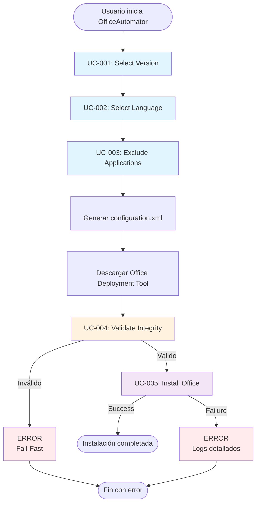
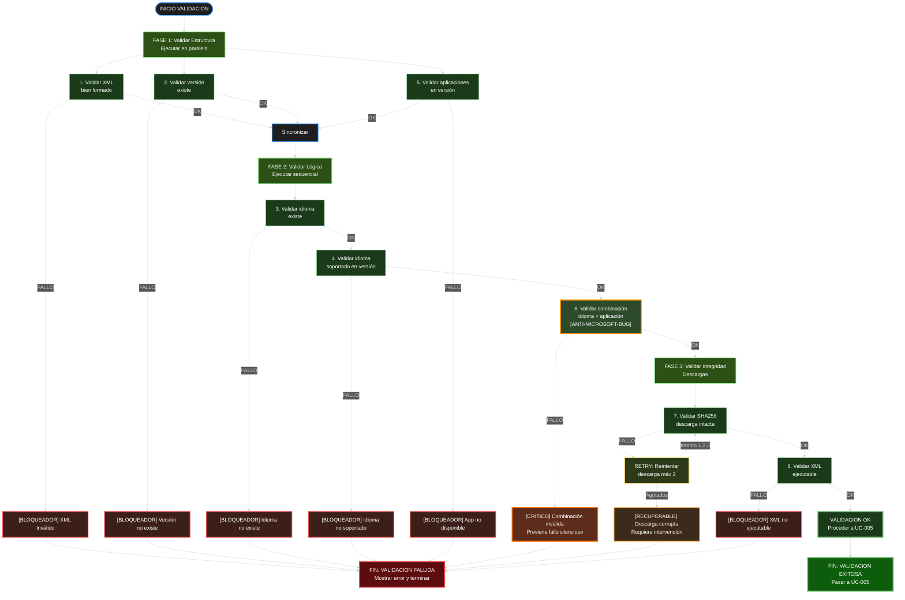

```yml
type: Guía de Desarrollo
category: Arquitectura y Estándares
version: 1.0.0
purpose: Define estándares de código y estructura para OfficeAutomator
applies_to: Functions/Public, Functions/Private, Tests
updated_at: 2026-04-21 02:30:00
```

# REGLAS DE DESARROLLO - OfficeAutomator

## Guía Completa para Código Limpio, Profesional y Mantenible

---

## TABLA DE CONTENIDOS

1. [Filosofía General](#filosofía-general)
2. [Estructura del Proyecto](#estructura-del-proyecto)
3. [Convenciones de Nombres PowerShell](#convenciones-de-nombres-powershell)
4. [Arquitectura por UC](#arquitectura-por-uc)
5. [Clean Code Principles](#clean-code-principles)
6. [Documentación](#documentación)
7. [Testing y Validación](#testing-y-validación)
8. [Flujos y Diagramas](#flujos-y-diagramas)
9. [Reglas para Output](#reglas-para-output)
10. [Git y Commits](#git-y-commits)
11. [Anti-Patrones a Evitar](#anti-patrones-a-evitar)
12. [Checklist de Calidad](#checklist-de-calidad)

---

## FILOSOFÍA GENERAL

### Core Principle

**Automate Office installation reliably, transparently, and idempotently**

```
Three pillars:

1. RELIABILITY
   - Exhaustive validation
   - Robust error handling
   - Failure recovery
   - Detailed logging

2. TRANSPARENCY
   - User always knows what is happening
   - Clear, actionable errors
   - Visible progress tracking
   - Parseable logging

3. IDEMPOTENCY
   - Execute 2x = execute 1x
   - Detect previous state
   - No reinstall if already exists
   - Recoverable from interruptions
```

### Principios Fundamentales

1. **Fail-Fast:** Validar ANTES de actuar
   - UC-004 valida ANTES de UC-005
   - Error temprano = menos daño

2. **Single Responsibility:** Cada función hace UNA cosa bien
   - Una función = un UC
   - Una función = un paso bien definido

3. **Testeable y modular:** Código que se pueda validar
   - Sin dependencies globales
   - Sin efectos secundarios ocultos
   - Inyección de dependencias

4. **Documentación en código:**
   - Si necesitas comentar "qué hace", el código no es claro
   - Nombres revelan intención
   - Flujos documentados con Mermaid

---

## ESTRUCTURA DEL PROYECTO

### Árbol de Directorios

```
OfficeAutomator/
├── Functions/
│   ├── Public/
│   │   ├── Invoke-OfficeAutomator.ps1              ← Orquestador (UC-001 a UC-005)
│   │   ├── UC-001/
│   │   │   └── Select-OfficeVersion.ps1            ← Seleccionar versión
│   │   ├── UC-002/
│   │   │   └── Select-OfficeLanguage.ps1           ← Seleccionar idioma
│   │   ├── UC-003/
│   │   │   └── Exclude-OfficeApplications.ps1      ← Excluir apps
│   │   ├── UC-004/
│   │   │   ├── Validate-OfficeConfiguration.ps1    ← Validar XML
│   │   │   └── Test-LanguageCompatibility.ps1      ← Validar idioma vs app
│   │   └── UC-005/
│   │       └── Install-Office.ps1                  ← Ejecutar instalación
│   │
│   ├── Private/
│   │   ├── Internal/
│   │   │   ├── Get-SupportedVersions.ps1           ← Helper: versiones
│   │   │   ├── Get-SupportedLanguages.ps1          ← Helper: idiomas
│   │   │   ├── Get-CompatibilityMatrix.ps1         ← Helper: matriz
│   │   │   └── Convert-ToConfigurationXml.ps1      ← Helper: generar XML
│   │   │
│   │   └── Validation/
│   │       ├── Test-XmlSchema.ps1                  ← Validar XSD
│   │       ├── Test-VersionValidity.ps1            ← Validar versión
│   │       ├── Test-LanguageValidity.ps1           ← Validar idioma
│   │       └── Test-Sha256Integrity.ps1            ← Validar hash
│   │
│   └── Logging/
│       └── Write-OfficeLog.ps1                     ← Logging centralizado
│
├── Tests/
│   ├── UC-001.Tests.ps1
│   ├── UC-002.Tests.ps1
│   ├── UC-003.Tests.ps1
│   ├── UC-004.Tests.ps1
│   ├── UC-005.Tests.ps1
│   └── Integration.Tests.ps1
│
├── Data/
│   ├── SupportedVersions.json                      ← 2024, 2021, 2019
│   ├── SupportedLanguages.json                     ← es-ES, en-US, ...
│   └── LanguageCompatibility.json                  ← Matriz versión×idioma×app
│
├── Docs/
│   ├── USER_GUIDE.md
│   ├── API_REFERENCE.md
│   └── ARCHITECTURE.md
│
├── OfficeAutomator.psd1                            ← Module manifest
├── OfficeAutomator.psm1                            ← Module loader
└── README.md
```

---

## CONVENCIONES DE NOMBRES POWERSHELL

### Funciones Públicas (Public/)

**Formato:** `{Verb}-{Noun}` (PascalCase)

Verbos permitidos en OfficeAutomator:

| Verbo | Uso | Ejemplo |
|-------|-----|---------|
| `Select-` | Usuario elige opción | `Select-OfficeVersion` |
| `Get-` | Obtener datos/configuración | `Get-SupportedVersions` |
| `Test-` | Validar/probar | `Test-LanguageCompatibility` |
| `Validate-` | Validar estructura/formato | `Validate-OfficeConfiguration` |
| `Install-` | Ejecutar instalación | `Install-Office` |
| `Invoke-` | Orquestar flujo completo | `Invoke-OfficeAutomator` |
| `New-` | Crear objeto | `New-OfficeConfiguration` |
| `Set-` | Modificar configuración | `Set-OfficePreference` |
| `Remove-` | Limpiar/desinstalar | `Remove-OfficeCache` |

### Funciones Privadas (Private/)

**Formato:** `{Verb}-{Noun}` (PascalCase) + prefijo `_Private` o ubicar en Private/

```powershell
# ✓ BIEN - En directorio Private/
function Get-CompatibilityMatrix { }
function Convert-ToConfigurationXml { }
function Test-Sha256Integrity { }

# ✓ BIEN - Con prefijo (si es necesario exportar)
function Test-LanguageApplicationCompatibility { }
```

### Variables

**Local (dentro de función):**
```powershell
function Select-OfficeVersion {
    $supportedVersions = @("2024", "2021", "2019")
    $selectedVersion = Read-Host "Choose version"
    return $selectedVersion
}
```

**Module scope:**
```powershell
$script:CompatibilityCache = @{}
$script:LogPath = "$PSScriptRoot/../Logs"
```

**Constants:**
```powershell
$MAX_RETRY_COUNT = 3
$DEFAULT_TIMEOUT_SECONDS = 300
$ODT_DOWNLOAD_URL = "https://download.microsoft.com/..."
```

---

## ARQUITECTURA POR UC

### Diagrama General - Flujo de UCs



### UC-001: Select Version

**Ubicación:** `Functions/Public/UC-001/Select-OfficeVersion.ps1`

**Responsabilidades:**
- Obtener lista de versiones soportadas
- Mostrar opciones al usuario
- Validar selección
- Retornar versión seleccionada

**Función signature:**
```powershell
function Select-OfficeVersion {
    <#
    .SYNOPSIS
        Permite al usuario seleccionar versión de Office LTSC
    
    .DESCRIPTION
        Muestra versiones disponibles (2024, 2021, 2019) y
        retorna la versión seleccionada después de validarla.
    
    .OUTPUTS
        [string] Versión seleccionada: "2024", "2021" o "2019"
    
    .EXAMPLE
        $version = Select-OfficeVersion
        # Output: "2024"
    #>
    
    param()
    
    # Implementación aquí
}
```

**Criterios de aceptación:**
- ✓ Mostrar 3 versiones disponibles
- ✓ Validar input del usuario
- ✓ Retornar versión válida
- ✓ Permitir reintentos si input inválido

---

### UC-002: Select Language

**Ubicación:** `Functions/Public/UC-002/Select-OfficeLanguage.ps1`

**Responsabilidades:**
- Obtener idiomas soportados (filtrados por versión)
- Mostrar opciones
- Validar selección
- Retornar idioma(s) seleccionado(s)

**Función signature:**
```powershell
function Select-OfficeLanguage {
    <#
    .SYNOPSIS
        Permite al usuario seleccionar idioma(s) de Office
    
    .PARAMETER Version
        Versión de Office (2024, 2021, 2019) para filtrar idiomas
    
    .OUTPUTS
        [string[]] Array de idiomas: "es-ES", "en-US", etc
    
    .EXAMPLE
        $languages = Select-OfficeLanguage -Version "2024"
        # Output: @("es-ES", "en-US")
    #>
    
    param([string]$Version)
    
    # Implementación aquí
}
```

**Criterios de aceptación:**
- ✓ Filtrar idiomas por versión
- ✓ Permitir múltiples idiomas
- ✓ Validar cada idioma contra versión
- ✓ Retornar array de idiomas

---

### UC-003: Exclude Applications

**Ubicación:** `Functions/Public/UC-003/Exclude-OfficeApplications.ps1`

**Responsabilidades:**
- Mostrar aplicaciones disponibles
- Usuario selecciona cuáles excluir
- Validar que aplicaciones existan en versión
- Retornar lista de exclusiones

**Función signature:**
```powershell
function Exclude-OfficeApplications {
    <#
    .SYNOPSIS
        Permite al usuario seleccionar qué aplicaciones excluir
    
    .PARAMETER Version
        Versión de Office para mostrar apps disponibles
    
    .OUTPUTS
        [string[]] Aplicaciones a excluir
    
    .EXAMPLE
        $exclusions = Exclude-OfficeApplications -Version "2024"
        # Output: @("Teams", "OneDrive")
    #>
    
    param([string]$Version)
    
    # Implementación aquí
}
```

**Criterios de aceptación:**
- ✓ Mostrar aplicaciones disponibles por versión
- ✓ Permitir selección múltiple (0 o más)
- ✓ Validar que app exista en versión
- ✓ Retornar array de exclusiones

---

### UC-004: Validate Integrity

**Ubicación:** `Functions/Public/UC-004/Validate-OfficeConfiguration.ps1`

**Responsabilidades:**
- Validar XML bien formado (XSD)
- Validar versión existe
- Validar idioma soportado en versión
- Validar aplicaciones disponibles en versión
- Validar combinación idioma + app es válida (CRÍTICO: mitigar bug Microsoft)
- Validar integridad de descarga (SHA256)

**Función signature:**
```powershell
function Validate-OfficeConfiguration {
    <#
    .SYNOPSIS
        Valida configuración de Office ANTES de instalar
    
    .PARAMETER Configuration
        [PSCustomObject] con Version, Languages, Exclusions
    
    .PARAMETER ConfigurationXmlPath
        [string] Path al archivo configuration.xml
    
    .OUTPUTS
        [bool] $true si válido, $false si inválido
    
    .EXAMPLE
        $config = @{Version="2024"; Languages=@("es-ES"); Exclusions=@()}
        if (Validate-OfficeConfiguration -Configuration $config) {
            Write-Host "Configuración válida"
        }
    #>
    
    param(
        [PSCustomObject]$Configuration,
        [string]$ConfigurationXmlPath
    )
    
    # Implementación aquí
    # Puntos de validación:
    # 1. XML bien formado
    # 2. Versión válida
    # 3. Idioma existe
    # 4. Idioma soportado en versión
    # 5. Apps disponibles en versión
    # 6. Combinación idioma + app válida (anti-bug Microsoft)
    # 7. SHA256 integridad
    # 8. XML ejecutable
}
```

**Criterios de aceptación:**
- ✓ 8 puntos de validación (ver arriba)
- ✓ Error temprano (fail-fast)
- ✓ Mensajes de error claros
- ✓ Logging de cada validación
- ✓ Retry para SHA256 (máx 3)

---

### UC-005: Install Office

**Ubicación:** `Functions/Public/UC-005/Install-Office.ps1`

**Responsabilidades:**
- Ejecutar setup.exe con configuration.xml
- Monitorear progreso
- Capturar output/errores
- Retornar código de éxito/error
- Logging detallado

**Función signature:**
```powershell
function Install-Office {
    <#
    .SYNOPSIS
        Ejecuta instalación de Office con configuración validada
    
    .PARAMETER ConfigurationXmlPath
        [string] Path a configuration.xml
    
    .PARAMETER OfficeDeploymentToolPath
        [string] Path a setup.exe
    
    .OUTPUTS
        [PSCustomObject] @{
            Success = $true/$false
            ExitCode = [int]
            Duration = [timespan]
            Logs = [string[]]
        }
    
    .EXAMPLE
        $result = Install-Office -ConfigurationXmlPath "config.xml"
        if ($result.Success) {
            Write-Host "Office instalado exitosamente"
        }
    #>
    
    param(
        [string]$ConfigurationXmlPath,
        [string]$OfficeDeploymentToolPath
    )
    
    # Implementación aquí
}
```

**Criterios de aceptación:**
- ✓ Ejecuta setup.exe /configure
- ✓ Monitorea progreso
- ✓ Captura stdout/stderr
- ✓ Maneja errores gracefully
- ✓ Retorna objeto con resultado
- ✓ Idempotente (ejecutar 2x = ejecutar 1x)

---

## CLEAN CODE PRINCIPLES

### 1. Single Responsibility Principle (SRP)

**Una función = Una responsabilidad bien definida**

```powershell
# ❌ MAL - Hace múltiples cosas
function Process-OfficeInstallation {
    # Obtiene versión
    # Obtiene idioma
    # Valida
    # Instala
    # Limpia
    # Genera reporte
}

# ✓ BIEN - Cada función hace UNA cosa
function Select-OfficeVersion { }
function Select-OfficeLanguage { }
function Validate-OfficeConfiguration { }
function Install-Office { }
function Remove-OfficeCache { }
function Write-InstallationReport { }
```

### 2. Reveal Intent (Revela Intención)

```powershell
# ❌ MAL - Nombres ambiguos
$v = "2024"
$l = @("es")
$e = @("Teams")

# ✓ BIEN - Nombres descriptivos
$selectedVersion = "2024"
$selectedLanguages = @("es-ES")
$excludedApplications = @("Teams", "OneDrive")
```

### 3. Fail-Fast Principle

```powershell
# ✓ BIEN - Validar ANTES
function Install-Office {
    param([string]$ConfigPath)
    
    # Validar PRIMERO
    if (-not (Test-Path $ConfigPath)) {
        throw "Configuration file not found: $ConfigPath"
    }
    
    if (-not (Validate-OfficeConfiguration -Path $ConfigPath)) {
        throw "Configuration validation failed"
    }
    
    # LUEGO proceder
    & setup.exe /configure $ConfigPath
}
```

### 4. Idempotency Guarantee

```powershell
# ✓ BIEN - Ejecutar 2x = ejecutar 1x
function Install-Office {
    param([string]$ConfigPath)
    
    # Detectar estado previo
    if (Office-IsInstalled) {
        Write-Log "Office already installed. Skipping."
        return @{Success = $true; Message = "Already installed"}
    }
    
    # Solo si no existe
    & setup.exe /configure $ConfigPath
}
```

### 5. DRY Principle (Don't Repeat Yourself)

```powershell
# ❌ MAL - Repetición
$langs2024 = Get-SupportedLanguages -Version "2024"
if ($selectedLanguage -notin $langs2024) { throw }

$langs2021 = Get-SupportedLanguages -Version "2021"
if ($selectedLanguage -notin $langs2021) { throw }

# ✓ BIEN - Función reutilizable
function Test-LanguageForVersion {
    param([string]$Language, [string]$Version)
    
    $supported = Get-SupportedLanguages -Version $Version
    return $Language -in $supported
}

if (-not (Test-LanguageForVersion -Language $lang -Version $version)) {
    throw "Language not supported for version"
}
```

---

## DOCUMENTACIÓN

### Comentarios en Código

**Regla:** Si necesitas comentar "qué hace", el código no es claro. Los comentarios deben explicar "por qué".

```powershell
# ❌ MAL
function Test-LanguageCompatibility {
    # Obtener idiomas soportados
    $supported = Get-SupportedLanguages
    
    # Iterar cada idioma
    foreach ($lang in $supported) {
        # Si idioma está en la lista
        if ($lang -in $selectedLanguages) {
            # Agregar a validados
            $validated += $lang
        }
    }
}

# ✓ BIEN
function Test-LanguageCompatibility {
    $supported = Get-SupportedLanguages
    
    foreach ($lang in $supported) {
        if ($lang -in $selectedLanguages) {
            # We only include languages that Microsoft officially supports
            # for this version. Prevents "Silent Installation Failure"
            # caused by OCT bug (see UC-004 analysis-microsoft-oct.md)
            $validated += $lang
        }
    }
}
```

### Comentarios de Función (Help)

```powershell
function Select-OfficeVersion {
    <#
    .SYNOPSIS
        Allows user to select Office LTSC version
    
    .DESCRIPTION
        Displays supported versions (2024, 2021, 2019) and
        returns the user-selected version after validation.
        
        This is UC-001 of the OfficeAutomator workflow.
    
    .OUTPUTS
        [string]
        Valid version: "2024", "2021", or "2019"
    
    .EXAMPLE
        $version = Select-OfficeVersion
        # Prompts user with menu
        # Returns: "2024"
    
    .NOTES
        Part of UC-001 (Select Version)
        Related: docs/requirements/uc-001-select-version/
    #>
    
    param()
    # Implementation
}
```

---

## TESTING Y VALIDACIÓN

### Estructura de Tests (Pester)

```powershell
# Tests/UC-001.Tests.ps1

Describe "UC-001: Select Office Version" {
    
    Context "When user selects valid version" {
        It "should return '2024'" {
            # Mock user input
            $input = "1`n"  # User presses 1 for first option
            
            # Execute
            $result = Select-OfficeVersion
            
            # Assert
            $result | Should -Be "2024"
        }
    }
    
    Context "When user selects invalid version" {
        It "should prompt again" {
            # Mock invalid input then valid
            $input = "99`n1`n"
            
            # Should not throw, should retry
            { Select-OfficeVersion } | Should -Not -Throw
        }
    }
    
    Context "When reading from pipeline" {
        It "should accept piped input" {
            "2021" | Select-OfficeVersion | Should -Be "2021"
        }
    }
}
```

### Validación de Configuración

```powershell
Describe "UC-004: Validate Configuration" {
    
    Context "When configuration is valid" {
        It "should return true" {
            $config = @{
                Version = "2024"
                Languages = @("es-ES")
                Exclusions = @("Teams")
            }
            
            Validate-OfficeConfiguration -Configuration $config | Should -Be $true
        }
    }
    
    Context "When language incompatible with app" {
        It "should return false (anti-Microsoft-bug)" {
            $config = @{
                Version = "2024"
                Languages = @("en-GB")  # Not supported
                Exclusions = @()
                Applications = @("Project")  # Project doesn't support en-GB
            }
            
            Validate-OfficeConfiguration -Configuration $config | Should -Be $false
        }
    }
}
```

---

## FLUJOS Y DIAGRAMAS

Todos los flujos deben documentarse con Mermaid o UML.

### Flujo de UC-004 (Validate) - Tema Dark, Sin Emojis



---

## REGLAS PARA OUTPUT

### Logging

```powershell
# ✓ BIEN - Mensajes claros, sin emojis
Write-Log -Level "INFO" -Message "Starting Office installation"
Write-Log -Level "INFO" -Message "Validating configuration: version=2024, languages=es-ES"
Write-Log -Level "SUCCESS" -Message "Validation passed"
Write-Log -Level "WARNING" -Message "Office already installed, skipping"
Write-Log -Level "ERROR" -Message "Invalid language for version: en-GB not supported in 2024"

# Logs en archivo quedan limpios:
# 2026-04-21 14:30:00 [INFO]    Starting Office installation
# 2026-04-21 14:30:05 [INFO]    Validating configuration
# 2026-04-21 14:30:10 [SUCCESS] Validation passed
# 2026-04-21 14:30:15 [WARNING] Office already installed
# 2026-04-21 14:30:20 [ERROR]   Invalid language for version
```

### Progress Output

```powershell
# ✓ BIEN - Simple y claro
Write-Host "Processing: [          ] 0%"   -NoNewline
Write-Host "`rProcessing: [====      ] 40%" -NoNewline
Write-Host "`rProcessing: [==========] 100%"

# ❌ MAL - Emojis, símbolos decorativos
Write-Host "Processing... ⏳"
Write-Host "Done! ✅"
```

### Error Messages

```powershell
# ✓ BIEN - Error descriptivo y accionable
throw @"
VALIDATION FAILED: Language incompatibility detected

Details:
  - Version:      2024
  - Language:     en-GB
  - Application:  Project
  - Reason:       Project does not support English (UK) in Office 2024
  - Solution:     Select a supported language: en-US, es-ES

For more information, see: docs/requirements/uc-004-validate-integrity/error-scenarios.md
"@

# ❌ MAL - Error genérico
throw "Validation failed"
```

---

## GIT Y COMMITS

### Conventional Commits Format

```
type(scope): description

[optional body]

[optional footer]
```

**Tipos válidos para OfficeAutomator:**

```
feat(uc-001):    Implement Select-OfficeVersion
fix(uc-004):     Fix language compatibility validation
docs(uc-001):    Document Select-OfficeVersion flow
test(uc-005):    Add installation success tests
refactor(core):  Extract validation logic
chore(deps):     Update ODT from 16.0 to 16.1
```

**Ejemplos:**

```bash
git commit -m "feat(uc-001): implement version selection with user prompt"
git commit -m "fix(uc-004): add anti-Microsoft-bug validation for language-app combos"
git commit -m "test(uc-005): add idempotency tests for installation"
git commit -m "docs(uc-004): document 8-point validation checklist"
```

---

## ANTI-PATRONES A EVITAR

### 1. Magic Values

```powershell
# ❌ MAL
if ($retryCount -gt 3) { break }

# ✓ BIEN
$MAX_RETRY_COUNT = 3
if ($retryCount -gt $MAX_RETRY_COUNT) { break }
```

### 2. Silent Failures

```powershell
# ❌ MAL
try {
    Validate-OfficeConfiguration
}
catch {
    # Silencio total
}

# ✓ BIEN
try {
    Validate-OfficeConfiguration
}
catch {
    Write-Log -Level "ERROR" -Message "Validation failed: $_"
    throw
}
```

### 3. Global State

```powershell
# ❌ MAL
$global:CurrentVersion = "2024"
$global:CurrentLanguage = "es-ES"

# ✓ BIEN
function Get-OfficeConfiguration {
    @{
        Version = "2024"
        Language = "es-ES"
    }
}
```

### 4. Copy-Paste Code

```powershell
# ❌ MAL
function Process-Version2024 { ... 200 lines ... }
function Process-Version2021 { ... 200 lines almost identical ... }

# ✓ BIEN
function Process-OfficeVersion {
    param([string]$Version)
    # Código reutilizable
}
```

---

## CHECKLIST DE CALIDAD

### Antes de Commit

- [ ] Código sigue convenciones PowerShell
- [ ] Función hace UNA sola cosa bien
- [ ] Nombres son descriptivos (Reveal Intent)
- [ ] Documentación con <# #> presente
- [ ] Logging en puntos clave
- [ ] Manejo de errores robusto
- [ ] No hay hardcoded values (constantes definidas)
- [ ] No hay global variables
- [ ] Tests escritos y pasando
- [ ] Commit message es descriptivo (conventional)

### Antes de Pull Request

- [ ] Branch está actualizado con main
- [ ] Todos los tests pasan
- [ ] No hay código muerto o comentado
- [ ] Documentación de UC actualizada
- [ ] Diagrama Mermaid si hay flujo nuevo
- [ ] CHANGELOG.md actualizado
- [ ] Reviewers asignados

### Code Review

- [ ] Código es legible y mantenible
- [ ] Sigue principios SOLID
- [ ] No introduce deuda técnica
- [ ] Manejo de errores es robusto
- [ ] Logging es apropiado
- [ ] No breaks idempotence guarantee

---

## RECURSOS ADICIONALES

### Libros Recomendados

1. **Clean Code** - Robert C. Martin
2. **The Pragmatic Programmer** - Hunt & Thomas
3. **PowerShell Best Practices** - Don Jones

### Herramientas

**PowerShell Quality:**
- PSScriptAnalyzer - Linter/Static analysis
- Pester - Testing framework
- platyPS - Documentation generator

**Version Control:**
- Git - Version control
- GitHub/GitLab - Repository hosting

---

## PRINCIPIOS FINALES PARA OFFICEAUTOMATOR

**Code is read much more often than it is written. Make it easy to read.**

### Five Core Principles

1. **CLARITY:** Code that explains itself
2. **RELIABILITY:** Exhaustive validation, fail-fast
3. **IDEMPOTENCY:** Execute 2x = execute 1x
4. **TESTABILITY:** Each function can be validated independently
5. **MAINTAINABILITY:** Changes without breaking the rest

### Critical Standard

If you need to explain what your code does, the code probably is not clear enough.

---

**Versión:** 1.0.0
**Última actualización:** 2026-04-21
**Aplicable a:** OfficeAutomator v1.0.0+

**Recuerda:** Estas reglas son lineamientos, no leyes absolutas. Úsalas con criterio y siempre prioriza claridad y mantenibilidad.
