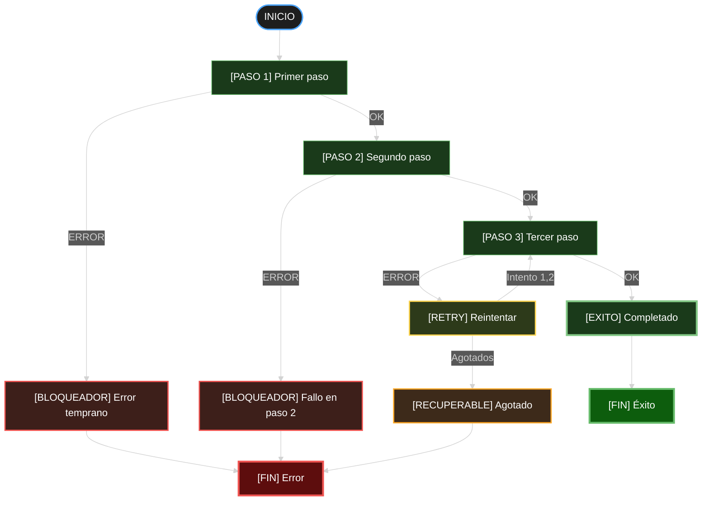
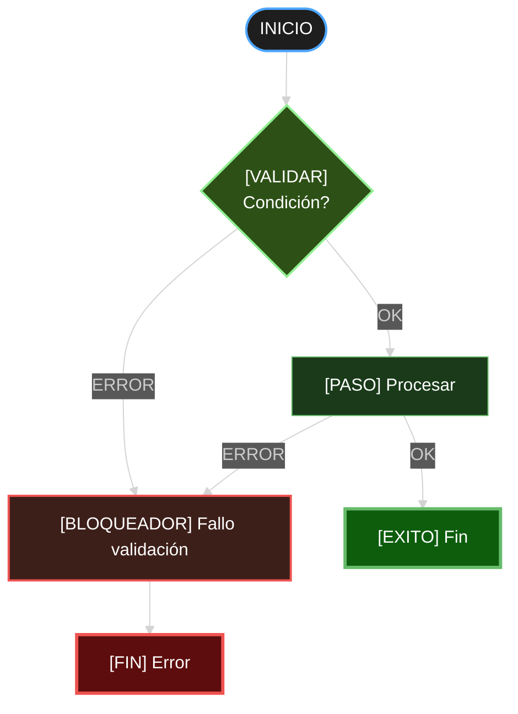
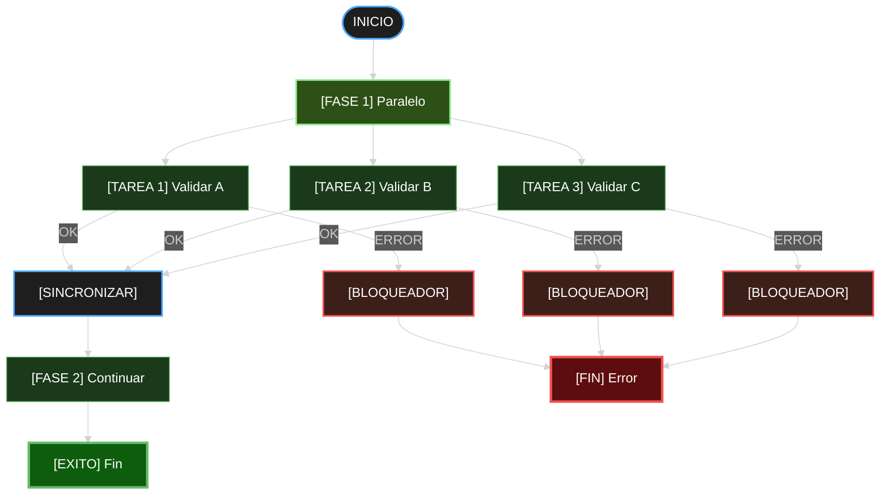
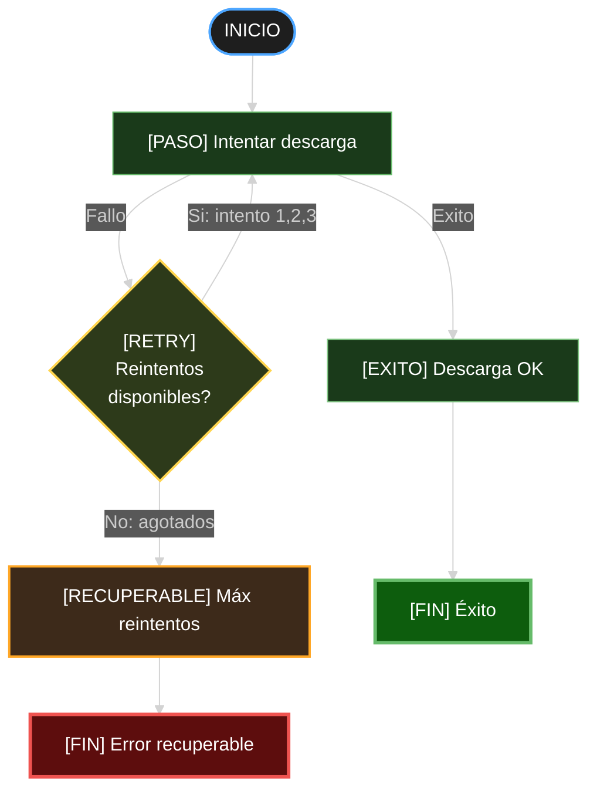
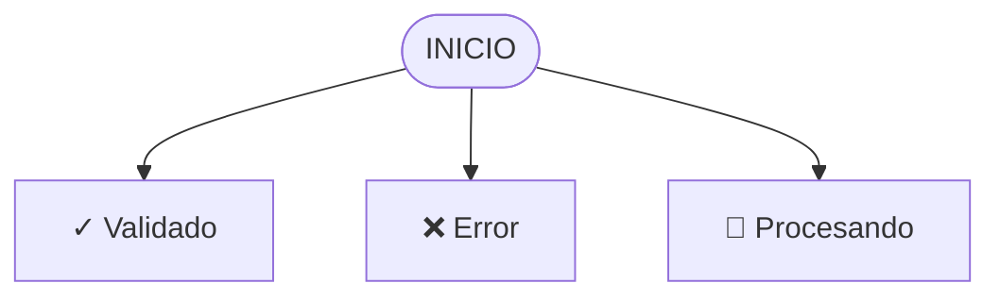
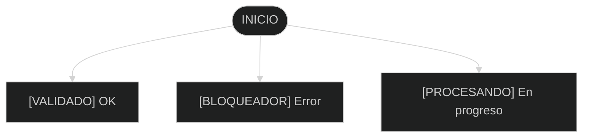
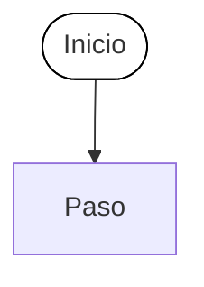
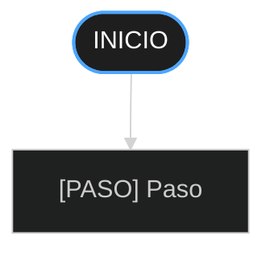
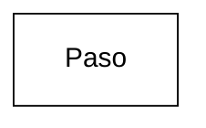

```yml
type: Convención de Diagramas
category: Visualización y Documentación
version: 1.0.0
purpose: Define estándares para Mermaid/UML en OfficeAutomator
applies_to: Todos los markdown con diagramas
updated_at: 2026-04-21 02:50:00
```

# STANDARD: MERMAID DIAGRAMS - Dark Theme, No Emojis

## Core Requirement

**MANDATORY:**
1. NO emojis (❌, ✓, 🔄, ⏳, 📊, etc)
2. NO decorative icons
3. ALWAYS use `%%{init: { 'theme': 'dark' } }%%`
4. Use `[LABEL]` for categorization
5. Colors must be readable on dark background

---

## Paleta de Colores para Tema Dark

### Colores Base

| Uso | Color | Hex | Stroke |
|-----|-------|-----|--------|
| Fondo principal | Gris oscuro | `#1e1e1e` | `#4da6ff` (azul) |
| Fase/Sección | Verde oscuro | `#2d5016` | `#90ee90` (verde claro) |
| Paso OK | Verde muy oscuro | `#1a3a1a` | `#66bb6a` (verde) |
| Paso especial | Verde marrón | `#2d4a2b` | `#ff9800` (naranja) |
| Error bloqueador | Rojo muy oscuro | `#3d1f1a` | `#ef5350` (rojo) |
| Error especial | Marrón naranja | `#5d2c1a` | `#ff6f00` (naranja oscuro) |
| Error recuperable | Marrón oscuro | `#3d2a1a` | `#ffa726` (naranja claro) |
| Retry/Loop | Verde gris | `#2d3a1a` | `#ffd54f` (amarillo) |
| Éxito | Verde muy oscuro | `#1a3a1a` | `#81c784` (verde claro) |
| Fin exitoso | Verde intenso | `#0d5d0d` | `#66bb6a` |
| Fin fallido | Rojo intenso | `#5d0d0d` | `#ef5350` |

---

## Estructura de Etiquetas (Sin Emojis)

### Categorías de Pasos

```
[PASO N]         - Paso secuencial normal
[VALIDAR]        - Validación específica
[CRITICO]        - Paso crítico (debe pasar)
[BLOQUEADOR]     - Error que detiene todo
[RECUPERABLE]    - Error que puede reintentar
[INFO]           - Información/estado
[SINCRONIZAR]    - Punto de sincronización
[RETRY]          - Reintento automático
[FASE 1]         - Fase/sección del flujo
```

### Ejemplos Correctos

```
[PASO 1] Validar versión
[VALIDAR] XML bien formado
[CRITICO] Antes de instalar
[BLOQUEADOR] Validación fallida
[RECUPERABLE] Descarga corrupta
[SINCRONIZAR] Fase 1 completada
[RETRY] Reintentar (máx 3)
```

### Ejemplos INCORRECTOS

```
❌ PASO 1 - No usar emoji
⚠ ADVERTENCIA - No usar emoji
✓ VALIDADO - No usar emoji
🔄 REINTENTANDO - No usar emoji
📁 ARCHIVO - No usar emoji
```

---

## Template Base para Diagramas Mermaid



---

## Tipos de Diagramas Comunes

### 1. Flujo de Decisión (Decision Flow)



### 2. Flujo Paralelo (Parallel Execution)



### 3. Retry Loop (Reintentos)



---

## Errores Comunes y Correcciones

### Error 1: Usar Emojis

❌ **INCORRECTO:**


✓ **CORRECTO:**


---

### Error 2: Sin Tema Dark

❌ **INCORRECTO:**


✓ **CORRECTO:**


---

### Error 3: Colores Ilegibles

❌ **INCORRECTO:**


✓ **CORRECTO:**


---

## Checklist para Diagramas

Antes de agregar cualquier diagrama Mermaid:

- [ ] `%%{init: { 'theme': 'dark' } }%%` presente
- [ ] NO hay emojis (❌, ✓, 🔄, etc)
- [ ] TODO usa `[ETIQUETA]` para categorizar
- [ ] Colores son legibles en fondo oscuro
- [ ] Texto en inglés MAYUSCULA O Title Case
- [ ] Nodos de error en rojo `#ef5350`
- [ ] Nodos de éxito en verde `#66bb6a`
- [ ] Nodos de inicio/fin en azul/magenta `#4da6ff`
- [ ] Bordes (stroke) tienen contraste suficiente
- [ ] Flujo es claro y fácil de seguir

---

## Referencia Rápida: Comandos Mermaid

### Sintaxis Básica

```
graph TD          # Top-Down (vertical)
graph LR          # Left-Right (horizontal)
graph TB          # Top-Bottom (vertical)
graph BT          # Bottom-Top
```

### Tipos de Nodos

```
A([CIRCLE])       # Círculo
A[RECTANGLE]      # Rectángulo
A{DIAMOND}        # Diamante (decisión)
A(ROUNDED)        # Redondeado
A[[SUBROUTINE]]   # Subrrutina
```

### Estilos

```
style A fill:#1a3a1a,stroke:#66bb6a,stroke-width:2px,color:#fff
```

Componentes:
- `fill` = color de fondo
- `stroke` = color del borde
- `stroke-width` = grosor del borde
- `color` = color del texto

---

## Ejemplos Completos Descargables

Ver documentos en proyecto:
- `uc-004-flow-corrected.md` - Flujo UC-004 completo (corregido)
- `REGLAS_DESARROLLO_OFFICEAUTOMATOR.md` - Incluye flujos de ejemplo

---

**Versión:** 1.0.0
**Última actualización:** 2026-04-21
**Aplicable a:** Todos los diagramas Mermaid en OfficeAutomator

