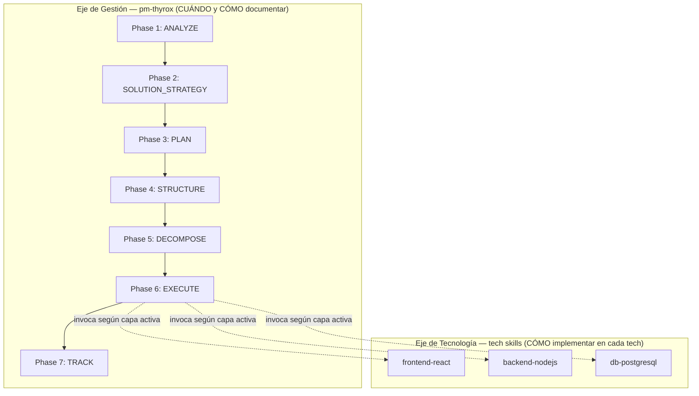
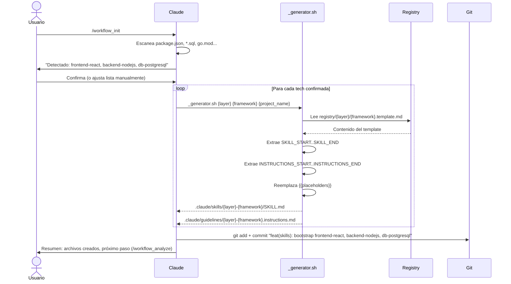
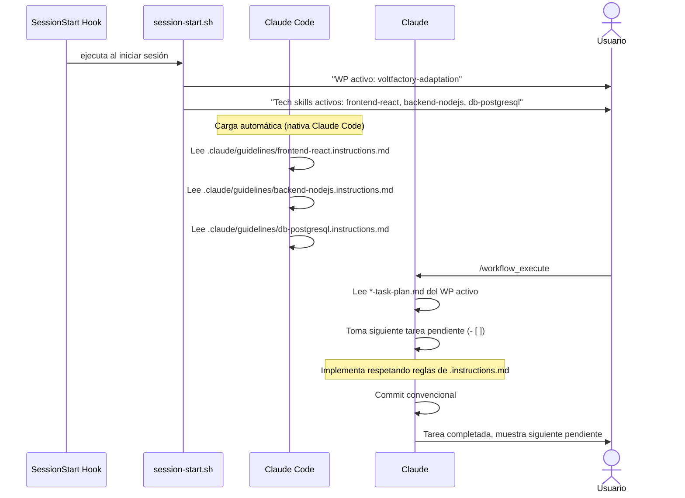
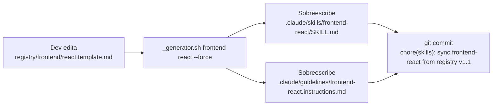

```yml
Fecha diseño: 2026-04-03-00-49-34
WP: voltfactory-adaptation
Feature: Meta-Framework Generativo
Versión diseño: 1.0
Componentes: 5 nuevos, 1 modificado
Dependencias externas: 0
Estado: En progreso
```

# Design — Meta-Framework Generativo

Basado en: voltfactory-adaptation-solution-strategy.md (D-001 a D-007)

---

## 1. Visión General

PM-THYROX se extiende con una capa de skills de tecnología que se auto-generan desde
un registry centralizado. La arquitectura tiene dos ejes ortogonales:



pm-thyrox dice CUÁNDO y CÓMO documentar. Los tech skills dicen CÓMO implementar en
una tecnología específica. Nunca se mezclan: pm-thyrox no conoce React, frontend-react
no conoce fases SDLC.

---

## 2. Decisiones Arquitectónicas

**DA-001: Formato de template con marcadores HTML comment**

- Contexto: `_generator.sh` necesita saber dónde termina el SKILL y dónde empieza
  INSTRUCTIONS dentro de un único archivo `.template.md`
- Decisión: usar `<!-- SKILL_START -->`, `<!-- SKILL_END -->`, `<!-- INSTRUCTIONS_START -->`,
  `<!-- INSTRUCTIONS_END -->` como marcadores
- Alternativas rechazadas:
  - Dos archivos por template (`react.skill.md` + `react.instructions.md`): duplica la
    cantidad de archivos en el registry, más difícil de mantener en sincronía
  - Separador `---`: ambiguo, colisiona con frontmatter YAML
- Consecuencias positivas: un solo archivo por tecnología, fácil de editar y revisar
- Consecuencias negativas: el generator necesita lógica de extracción entre marcadores

**DA-002: _generator.sh es bash puro, sin dependencias externas**

- Contexto: el script se ejecuta en cualquier entorno donde Claude Code esté disponible
- Decisión: bash + `sed` + `awk` para extracción de secciones y reemplazo de placeholders
- Alternativas rechazadas:
  - Python script: más legible pero requiere Python instalado
  - Node.js template engine (Handlebars): potente pero introduce dependencias npm
- Consecuencias: portabilidad máxima, legible para cualquier dev con bash básico

**DA-003: Workflow commands son prompts markdown, no scripts**

- Contexto: Claude Code slash commands son archivos `.md` en `.claude/commands/`
- Decisión: cada workflow command es un prompt pre-escrito que le dice a Claude qué
  fase ejecutar y qué contexto cargar — Claude hace el trabajo, no un script
- Alternativas rechazadas:
  - Scripts bash que invoquen claude CLI: más frágil, acoplado a la CLI
  - Solo SKILL.md sin commands: el usuario debe saber qué fase ejecutar manualmente
- Consecuencias: commands son mantenibles como markdown, se pueden actualizar sin
  conocimientos de bash

---

## 3. Componentes

### 3.1 Nuevos Componentes

| Componente | Ubicación | Propósito |
|---|---|---|
| Registry | `.claude/registry/` | Fuente de verdad para templates de tech skills |
| `_generator.sh` | `.claude/registry/_generator.sh` | Instancia templates en skills concretos |
| Template react | [react.template](.claude/registry/frontend/react.template.md) | Template para proyectos React |
| Template nodejs | [nodejs.template](.claude/registry/backend/nodejs.template.md) | Template para backends Node.js |
| Template postgresql | [postgresql.template](.claude/registry/db/postgresql.template.md) | Template para DBs PostgreSQL |
| `/workflow_init` | [workflow_init](.claude/commands/workflow_init.md) | Bootstrap command |
| Workflow commands (7) | `.claude/commands/workflow_*.md` | Phase entry points |

### 3.2 Componentes Modificados

| Componente | Ubicación | Cambios |
|---|---|---|
| `session-start.sh` | `.claude/skills/pm-thyrox/scripts/session-start.sh` | Agrega detección y display de tech skills activos |

### 3.3 Componentes Generados (output del bootstrap)

Estos no se commitean en thyrox — se generan POR PROYECTO al ejecutar `/workflow_init`:

| Componente generado | Ubicación en proyecto destino |
|---|---|
| Tech SKILL.md | `.claude/skills/{layer}-{framework}/SKILL.md` |
| Tech instructions | `.claude/guidelines/{layer}-{framework}.instructions.md` |

---

## 4. Estructura de Archivos

```
.claude/
├── registry/                              ← NUEVO
│   ├── README.md                          ← Cómo agregar templates
│   ├── _generator.sh                      ← Instanciador
│   ├── frontend/
│   │   └── react.template.md             ← Template React
│   ├── backend/
│   │   └── nodejs.template.md            ← Template Node.js
│   └── db/
│       └── postgresql.template.md        ← Template PostgreSQL
│
├── commands/                              ← NUEVO
│   ├── workflow_init.md                   ← Bootstrap
│   ├── workflow_analyze.md               ← Phase 1
│   ├── workflow_strategy.md              ← Phase 2
│   ├── workflow_plan.md                  ← Phase 3
│   ├── workflow_structure.md             ← Phase 4
│   ├── workflow_decompose.md             ← Phase 5
│   ├── workflow_execute.md               ← Phase 6
│   └── workflow_track.md                 ← Phase 7
│
├── skills/
│   ├── pm-thyrox/                        ← EXISTENTE (sin cambios a su lógica)
│   │   └── scripts/
│   │       └── session-start.sh         ← MODIFICADO (+tech skills display)
│   └── {layer}-{framework}/             ← GENERADO por _generator.sh
│       └── SKILL.md
│
├── guidelines/
│   └── {layer}-{framework}.instructions.md   ← GENERADO por _generator.sh
│
└── context/
    └── decisions/
        └── adr-012.md                   ← NUEVO
```

---

## 5. Interfaces y Contratos

### 5.1 Contrato de template (formato obligatorio)

```
Archivo: registry/{layer}/{framework}.template.md

Estructura requerida:
┌─────────────────────────────────────┐
│ <!-- SKILL_START -->                 │
│ # {{LAYER_TITLE}} {{FRAMEWORK_TITLE}} — SKILL
│ ...contenido SKILL...               │
│ <!-- SKILL_END -->                   │
│                                     │
│ <!-- INSTRUCTIONS_START -->          │
│ # {{LAYER_TITLE}} {{FRAMEWORK_TITLE}} — Guidelines
│ ...reglas siempre-on...             │
│ <!-- INSTRUCTIONS_END -->            │
└─────────────────────────────────────┘

Placeholders requeridos:
  {{PROJECT_NAME}}   → nombre del proyecto destino
  {{LAYER}}          → capa (frontend, backend, db, infra)
  {{FRAMEWORK}}      → framework (react, nodejs, postgresql)
  {{LAYER_TITLE}}    → capa con mayúscula (Frontend, Backend, DB)
  {{FRAMEWORK_TITLE}} → framework con mayúscula (React, Node.js, PostgreSQL)
```

### 5.2 Contrato de `_generator.sh`

```
Input:
  $1: layer      (string, requerido) — ej: frontend
  $2: framework  (string, requerido) — ej: react
  $3: project_name (string, opcional, default: nombre del directorio actual)

Output (stdout, exit 0):
  "Generated: {layer}-{framework} (2 files)"
  "  → .claude/skills/{layer}-{framework}/SKILL.md"
  "  → .claude/guidelines/{layer}-{framework}.instructions.md"

Error (stderr, exit 1):
  "ERROR: Template not found: registry/{layer}/{framework}.template.md"
  "ERROR: Missing required marker <!-- SKILL_START --> in template"

Flags:
  --force   Sobreescribir archivos existentes
  --dry-run Mostrar qué se generaría sin crear archivos
```

### 5.3 Contrato de workflow commands

```
Cada archivo .claude/commands/workflow_*.md contiene un prompt con esta estructura:

---
description: "Descripción breve para auto-suggest de Claude Code"
---

## Contexto de sesión
[instrucciones para Claude sobre qué leer: WP activo, tech skills, fase]

## Fase a ejecutar
[invocación al SKILL pm-thyrox en la fase correspondiente]

## Exit criteria
[qué debe estar listo para que esta fase esté completa]
```

---

## 6. Flujos de Datos

### 6.1 Flujo Bootstrap (primera vez, con /workflow_init)



### 6.2 Flujo de sesión normal (bootstrap ya realizado)



### 6.3 Flujo de actualización de template



---

## 7. Dependencias

### 7.1 Dependencias Internas

- `_generator.sh` requiere que `registry/{layer}/{framework}.template.md` exista
- `workflow_init.md` llama a `_generator.sh` — ambos deben existir juntos
- `session-start.sh` modificado lee `.claude/skills/` — asume que `_generator.sh` creó
  los directorios con el formato `{layer}-{framework}`

### 7.2 Sin Dependencias Externas

- `_generator.sh` usa solo bash, sed, awk — disponibles en cualquier sistema Unix/Mac
- Los workflow commands son prompts markdown, no tienen dependencias de runtime

---

## 8. Impacto

### 8.1 Cambios Breaking

Ninguno. Los cambios son puramente aditivos:
- `session-start.sh` agrega líneas al output — el output existente no cambia
- Los directorios `.claude/commands/` y `.claude/registry/` son nuevos — no afectan
  ningún flujo existente
- PM-THYROX SKILL.md y su lógica de 7 fases no se modifican

### 8.2 Backward Compatibility

- Proyectos sin tech skills siguen funcionando exactamente igual
- Si `.claude/guidelines/` no tiene archivos, Claude Code simplemente no carga nada
- `session-start.sh` muestra "Tech skills: ninguno" en lugar de fallar

---

## 9. Plan de Rollback

Si la implementación falla o los tech skills generan conflictos:

1. `git rm -r .claude/skills/{layer}-{framework}/`
2. `git rm .claude/guidelines/{layer}-{framework}.instructions.md`
3. `git commit "revert(skills): remove {layer}-{framework}"`

El registry y `_generator.sh` se pueden mantener sin que afecten nada — solo se
activan cuando se llama `/workflow_init` o `_generator.sh` manualmente.

---

## 10. Testing

### Casos de Prueba

**TC-001: Generator crea archivos correctos**
- Input: `_generator.sh frontend react "test-project"` con template válido
- Esperado: dos archivos creados, placeholders reemplazados, exit 0

**TC-002: Generator falla con template inexistente**
- Input: `_generator.sh mobile flutter`
- Esperado: stderr con mensaje de error, exit 1, sin archivos creados

**TC-003: Generator con --dry-run**
- Input: `_generator.sh backend nodejs --dry-run`
- Esperado: muestra archivos que crearía, sin crear nada, exit 0

**TC-004: session-start.sh con tech skills activos**
- Setup: crear `.claude/skills/frontend-react/`
- Esperado: output incluye "Tech skills activos: frontend-react"

**TC-005: session-start.sh sin tech skills**
- Setup: `.claude/skills/` solo tiene `pm-thyrox/`
- Esperado: output incluye "Tech skills: ninguno"

---

## 11. Referencias

- [voltfactory-adaptation-solution-strategy](voltfactory-adaptation-solution-strategy.md) — Decisiones D-001 a D-007
- [voltfactory-adaptation-requirements-spec](voltfactory-adaptation-requirements-spec.md) — SPECs detallados
- `context/decisions/adr-012.md` (a crear) — Refinamiento ADR-004
- Volt Factory analysis H-013, H-014, H-020 — patrones de agentes y skills

---

## Historial de Cambios

| Fecha | Versión | Cambios | Autor |
|---|---|---|---|
| 2026-04-03-00-49-34 | 1.0 | Creación inicial | claude |
