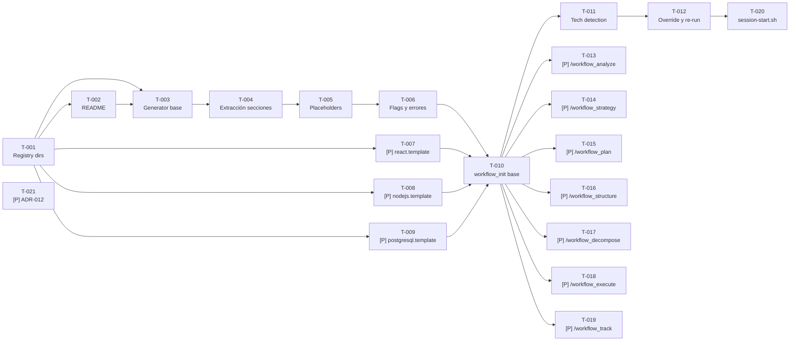

```yml
Fecha creación tareas: 2026-04-03-00-49-34
Proyecto: THYROX
Feature: Meta-Framework Generativo
Versión breakdown: 1.0
Total tareas: 21
Dependencias críticas: 4
Fecha inicio prevista: 2026-04-04-00-00-00
Responsable implementación: claude
```

# Task Plan — Meta-Framework Generativo

Basado en: voltfactory-adaptation-requirements-spec.md + voltfactory-adaptation-design.md

## Resumen

```
Total tareas:  21
SPECs cubiertas: SPEC-001 a SPEC-007 (100%)
Fases de ejecución: 6
[P] = Paralelizable (sin bloqueo con otras del mismo grupo)
```

---

## Orden de ejecución (DAG de dependencias)



---

## Fase A — Fundación del Registry (SPEC-001)

- [x] [T-001] Crear `.claude/registry/` con subdirectorios `frontend/`, `backend/`, `db/` (SPEC-001)
- [x] [T-002] Crear [README](.claude/registry/README.md) — convenciones, capas válidas, placeholders obligatorios, formato de secciones SKILL/INSTRUCTIONS (SPEC-001)

**Checkpoint A:** `.claude/registry/` existe con 3 subdirs y README legible.

---

## Fase B — `_generator.sh` (SPEC-002)

- [x] [T-003] Crear `.claude/registry/_generator.sh` — estructura base: parsing de `$1` (layer), `$2` (framework), `$3` (project_name opcional), bloque de ayuda sin argumentos (SPEC-002)
- [x] [T-004] Implementar extracción de secciones: `awk` entre `<!-- SKILL_START -->` / `<!-- SKILL_END -->` y entre `<!-- INSTRUCTIONS_START -->` / `<!-- INSTRUCTIONS_END -->`, escritura a archivos destino (SPEC-002)
- [x] [T-005] Implementar reemplazo de placeholders: `{{PROJECT_NAME}}`, `{{LAYER}}`, `{{FRAMEWORK}}`, `{{LAYER_TITLE}}`, `{{FRAMEWORK_TITLE}}` con `sed` (SPEC-002)
- [x] [T-006] Implementar flags `--force` (sobreescribir), `--dry-run` (mostrar sin crear), manejo de errores: exit 1 + stderr cuando template no existe o marcadores faltantes (SPEC-002)

**Checkpoint B:** `_generator.sh frontend react "test"` produce dos archivos correctos con placeholders reemplazados. `_generator.sh mobile flutter` falla con exit 1.

---

## Fase C — Templates Iniciales (SPEC-003) [Paralelas post-T-001/T-002]

- [x] [T-007] [P] Crear `registry/frontend/react.template.md` — sección SKILL con guía para fases 1 (qué investigar en proyectos React), 4 (qué especificar), 6 (convenciones), 7 (qué revisar); sección INSTRUCTIONS con 5+ reglas específicas (naming PascalCase, feature-based structure, state management, testing, no inline styles) cada una con ejemplo bueno/malo (SPEC-003)
- [x] [T-008] [P] Crear `registry/backend/nodejs.template.md` — sección SKILL + sección INSTRUCTIONS con reglas sobre: estructura de módulos, manejo de errores async/await, validación de input, configuración por entorno, testing con jest (SPEC-003)
- [x] [T-009] [P] Crear `registry/db/postgresql.template.md` — sección SKILL + sección INSTRUCTIONS con reglas sobre: naming snake_case, uso de índices, migraciones versionadas, evitar N+1, transacciones explícitas (SPEC-003)

**Checkpoint C:** Los 3 templates pasan `_generator.sh` sin errores. Archivos generados tienen contenido coherente con la tecnología.

---

## Fase D — Bootstrap Command (SPEC-004)

- [x] [T-010] Crear [workflow_init](.claude/commands/workflow_init.md) — prompt base que describe el flujo completo: escanear, mostrar detección, confirmar, ejecutar generator, hacer commit (SPEC-004)
- [x] [T-011] Implementar tabla de detección en el prompt de `workflow_init.md`: `package.json` con `"react"` → frontend-react, con `"express"`/`"fastify"` → backend-nodejs, archivos `*.sql` o `docker-compose.yml` con postgres → db-postgresql (SPEC-004)
- [x] [T-012] Implementar en `workflow_init.md`: modo manual override cuando no se detecta config, manejo de "skills ya existen" ofreciendo `--force` (SPEC-004)

**Checkpoint D:** `/workflow_init` tiene flujo completo documentado. Claude puede seguir el prompt para detectar, confirmar, y generar skills en un proyecto de prueba.

---

## Fase E — Workflow Commands (SPEC-005) [Paralelas post-T-010]

- [x] [T-013] [P] Crear [workflow_analyze](.claude/commands/workflow_analyze.md) — identifica WP activo, lista tech skills, invoca pm-thyrox Phase 1, indica exit criteria (SPEC-005)
- [x] [T-014] [P] Crear [workflow_strategy](.claude/commands/workflow_strategy.md) — lee analysis/ del WP activo, invoca Phase 2, indica documentos a producir (SPEC-005)
- [x] [T-015] [P] Crear [workflow_plan](.claude/commands/workflow_plan.md) — verifica WP, invoca Phase 3, recuerda crear `{nombre}-plan.md` y esperar aprobación (SPEC-005)
- [x] [T-016] [P] Crear [workflow_structure](.claude/commands/workflow_structure.md) — lee solution-strategy y plan del WP, invoca Phase 4, indica que es complejo si >10 tareas (SPEC-005)
- [x] [T-017] [P] Crear [workflow_decompose](.claude/commands/workflow_decompose.md) — lee requirements-spec del WP, invoca Phase 5, recuerda formato `[T-NNN] Descripción (SPEC-N)` (SPEC-005)
- [x] [T-018] [P] Crear [workflow_execute](.claude/commands/workflow_execute.md) — lee task-plan del WP activo, toma siguiente `- [ ]`, ejecuta con commits convencionales, actualiza checkbox (SPEC-005)
- [x] [T-019] [P] Crear [workflow_track](.claude/commands/workflow_track.md) — invoca Phase 7, lista artefactos requeridos (lessons-learned, CHANGELOG), ejecuta validate-phase-readiness.sh (SPEC-005)

**Checkpoint E:** Los 7 commands existen y tienen estructura consistente: contexto de sesión → fase a ejecutar → exit criteria.

---

## Fase F — Session + ADR (SPEC-006 + SPEC-007) [Paralelas]

- [x] [T-020] Actualizar `.claude/skills/pm-thyrox/scripts/session-start.sh` — detectar subdirectorios `{layer}-{framework}` en `.claude/skills/`, mostrar "Tech skills activos: X, Y" o "Tech skills: ninguno — ejecuta /workflow_init" (SPEC-006)
- [x] [T-021] [P] Crear `context/decisions/adr-012.md` — documenta refinamiento de ADR-004: "un management skill + N tech skills generados" no viola el espíritu de "no fragmentar la metodología", explica la distinción gestión vs tecnología (SPEC-007)

**Checkpoint F:** `session-start.sh` detecta correctamente `frontend-react` si el directorio existe, muestra mensaje correcto si no hay ninguno. ADR-012 referencia ADR-004 explícitamente.

---

## Cobertura de SPECs

| SPEC | Tareas | Estado |
|---|---|---|
| SPEC-001: Registry structure | T-001, T-002 | Completado |
| SPEC-002: _generator.sh | T-003, T-004, T-005, T-006 | Completado |
| SPEC-003: 3 templates | T-007, T-008, T-009 | Completado |
| SPEC-004: /workflow_init | T-010, T-011, T-012 | Completado |
| SPEC-005: 7 workflow commands | T-013 a T-019 | Completado |
| SPEC-006: session-start.sh | T-020 | Completado |
| SPEC-007: ADR-012 | T-021 | Completado |

---

## Aprobación

- [ ] Tasks revisadas
- [ ] Orden de ejecución verificado
- [ ] Aprobado para iniciar Phase 6
