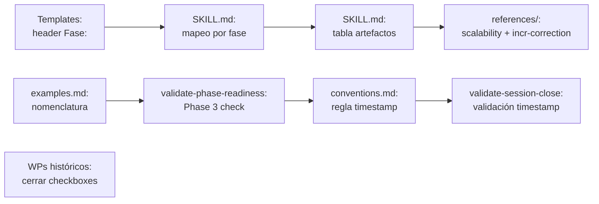

```yml
Fecha estrategia: 2026-04-04-04-16-29
Proyecto: THYROX
Versión arquitectura: 1.0
Arquitecto: claude
Estado: Propuesta
```

# Solution Strategy — Technical Debt Resolution

## Propósito

Definir el approach para resolver toda la deuda técnica activa identificada en Phase 1:
mapeo de 6 templates huérfanos, cierre formal de 8 WPs históricos, corrección de
referencias desactualizadas, y consolidación de convenciones de timestamp.

---

## Key Ideas

### Idea 1: Mapeo en tres capas del flujo

El problema de los templates huérfanos no es un problema de templates — es un problema
de ausencia de referencias en el flujo. La solución opera en tres capas simultáneamente:

1. **SKILL.md**: Agregar cada template al paso de la fase donde aplica, con cuándo usarlo
2. **references/**: Agregar referencias cruzadas en los documents de referencia relevantes
   (scalability.md para templates de escala, incremental-correction.md para issue audits)
3. **Template header**: Actualizar el campo de metadata `Fase:` en cada template para
   que autodocumente a qué fase pertenece

Con las tres capas cubiertas, cualquier modelo que lea el flujo encontrará el template
en contexto, no como un archivo suelto en `assets/`.

---

### Idea 2: Cierre de WPs históricos como operación de trazabilidad, no de implementación

Los 8 WPs con tareas pendientes `[ ]` ya están implementados. El trabajo real es:
marcar los checkboxes como `[x]` y, para los WPs más relevantes (multi-interaction-evals,
skill-flow-analysis), verificar que no haya gaps reales antes de cerrar.

Esto no es re-implementar nada — es mantener la trazabilidad del historial honesta.

---

### Idea 3: Prevención forward para timestamps, no corrección retroactiva

93 artefactos históricos tienen timestamps incompletos. Corregirlos retroactivamente
agrega ruido sin valor: los WPs ya están cerrados. La inversión correcta es en
mecanismos de prevención que funcionen para todos los WPs futuros:

- Regla explícita en `conventions.md`
- Validación automática en `validate-session-close.sh` para el WP activo

---

## Fundamental Decisions

### Decisión 1: Templates opcionales vs requeridos en cada fase

**Alternativas consideradas:**
- A: Todos los templates recién mapeados son opcionales — el flujo actual no los requiere
- B: Algunos templates se promueven a requeridos en sus fases (ej. `analysis-phase.md` requerido en Phase 1 para proyectos grandes)
- C: Se crean condiciones explícitas: "si [condición], usar [template]"

**Decisión: C — Condiciones explícitas con umbral.**
Cada template mapeado lleva una condición de activación clara (ej. "si Phase 1 encuentra
>50 issues", "si Phase 5 tiene >30 tareas"). Esto preserva el flujo limpio para proyectos
normales y activa los templates adicionales solo cuando la escala lo justifica.

**Implicaciones:**
- SKILL.md no crece en complejidad para el caso normal
- Los templates de escala son fácilmente descubribles cuando se necesitan
- No hay ambigüedad sobre cuándo usarlos

---

### Decisión 2: Dónde agregar templates transversales en SKILL.md

**Alternativas consideradas:**
- A: Agregar una sección nueva "Templates transversales" al final de SKILL.md
- B: Agregar referencias en cada fase donde aplican (distribuido)
- C: Crear una tabla consolidada de todos los templates con su fase

**Decisión: B + tabla consolidada (C).**
Las referencias van en los pasos de cada fase (descubribilidad contextual). La tabla de
artefactos existente en SKILL.md se amplía para incluir todos los templates, con columna
de condición de uso. Así un modelo puede ver el mapa completo o encontrar el template
en contexto, según desde dónde lea.

**Implicaciones:**
- La tabla de artefactos pasa de ~10 filas a ~17 filas (un template por fila)
- Cada fase en SKILL.md tiene referencias explícitas solo a sus templates relevantes
- El flujo normal para proyectos pequeños/medianos no cambia

---

### Decisión 3: Actualización del header de metadata en templates

**Alternativas consideradas:**
- A: No tocar los templates — solo actualizar SKILL.md y references/
- B: Agregar campo `Fase:` en el header YAML de cada template huérfano
- C: Agregar campo `Fase:` + `Condición:` para documentar cuándo usarlo

**Decisión: B — Agregar campo `Fase:` en header.**
El header de un template es su autodocumentación. Si alguien abre `analysis-phase.md.template`
directamente desde `assets/`, debe saber inmediatamente a qué fase pertenece sin tener
que leer SKILL.md. Agregar `Condición:` (C) sería demasiado verbose para el header.

---

### Decisión 4: Cierre de WPs — ¿lessons-learned para cada uno?

**Alternativas consideradas:**
- A: Solo marcar checkboxes como `[x]`, sin lessons-learned
- B: Crear lessons-learned para cada WP histórico
- C: Cierre mínimo: marcar `[x]` solo en WPs con task-plan completo; para WPs sin
    lessons-learned que lo requieran, crear un documento consolidado de cierre

**Decisión: A — Solo marcar checkboxes.**
Los WPs históricos ya tienen su contexto documentado en sus artefactos de análisis y
estrategia. Crear lessons-learned retroactivos para 8 WPs sería inventar información
que no existe. El objetivo es trazabilidad honesta, no documentación artificial.

---

## Traceabilidad al Análisis

| Item análisis | Decisión de resolución |
|---|---|
| 6 templates huérfanos | Mapear en 3 capas: SKILL.md fase, references/, header Fase: |
| D-001: examples.md nomenclatura | Reescribir con nomenclatura de 7 fases actuales |
| D-002: scalability.md project.json | Actualizar de obligatorio a opcional Phase 7 |
| D-002: exit_conditions.md | Corregir a exit-conditions.md.template |
| D-003: T-009 reactivado | Implementar mapeo de document.md en SKILL.md |
| D-004: 8 WPs sin cerrar | Marcar checkboxes [x] sin lessons-learned retroactivos |
| TD-001: timestamps | Regla en conventions.md + validación en validate-session-close.sh |
| TD-002: Phase 3 validación | Verificar validate-phase-readiness.sh Phase 3 check |

---

## Orden de Implementación



Grupos paralelizables:
- **Grupo 1** (independiente): Actualizar headers de los 6 templates
- **Grupo 2** (tras Grupo 1): SKILL.md mapeo + tabla
- **Grupo 3** (independiente): examples.md + scalability.md
- **Grupo 4** (independiente): WPs históricos — marcar [x]
- **Grupo 5** (tras Grupo 2): conventions.md + validate-session-close.sh
- **Grupo 6** (independiente): validate-phase-readiness.sh Phase 3 check

---

## Checklist de validación

- [x] Key ideas documentadas
- [x] Decisiones con alternativas consideradas
- [x] Orden de implementación definido con dependencias
- [x] Trazabilidad al análisis (Phase 1 → Phase 2)
- [ ] Aprobado para continuar a Phase 3: PLAN
