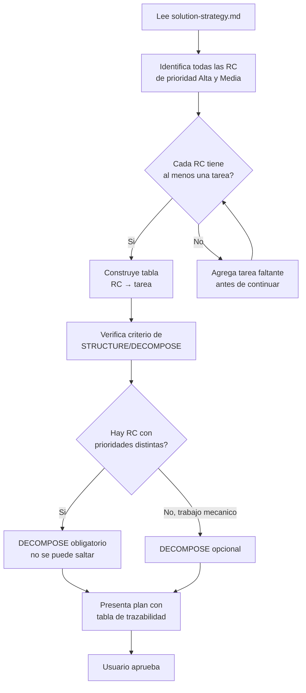

```yml
Fecha: 2026-04-04
Proyecto: THYROX — PM-THYROX Framework
Versión análisis: 1.0
Estado: Borrador
```

# Análisis: Correcciones de Proceso en SKILL.md Phase 3

## Propósito

Este documento analiza los errores de proceso cometidos durante la ejecución del WP
`skill-adr-boundary` y determina qué cambios concretos necesita SKILL.md para prevenir
que se repitan en WPs futuros.

Los errores no son de contenido — el resultado final (3 capas implementadas) es correcto.
Los errores son de proceso: cómo se ejecutaron las phases, qué se saltó, y qué se omitió
al traducir la strategy al plan.

---

## Visión General

### Qué ocurrió

Durante la ejecución del WP `skill-adr-boundary`, tres errores de proceso se materializaron:

- **E-001:** RC-003 estaba documentada en la solution strategy como resuelta por CLAUDE.md,
  pero no se tradujo a ninguna tarea concreta en el plan. Se detectó post-cierre.
- **E-002:** Phases 4 (STRUCTURE) y 5 (DECOMPOSE) se saltaron con la justificación
  "WP pequeño", sin verificar si la complejidad de trazabilidad lo justificaba.
- **E-003:** El plan se presentó al usuario para aprobación sin una tabla de trazabilidad
  RC → tarea, haciendo invisible el gap de RC-003.

### Por qué importa

Los tres errores comparten la misma raíz: **adelantarse a las phases**.
El modelo "sabía" qué archivos tocar antes de ejecutar las phases que deberían
producir esa respuesta. Las phases se convirtieron en documentación de decisiones
ya tomadas, no en el proceso que genera las decisiones.

Si SKILL.md Phase 3 tuviera gates explícitos de cobertura, E-001 y E-003 habrían
sido detectados antes de la aprobación del usuario.

### Para quién

- **Modelos que ejecutan el SKILL** (Sonnet, Haiku): necesitan gates claros que
  los detengan si la trazabilidad está incompleta
- **Desarrolladores que usan el framework** en sus proyectos: reciben WPs donde
  las correcciones acordadas en strategy llegan completas a la ejecución

---

## Los 8 aspectos de análisis

### 1. Objetivo / Por qué

Corregir SKILL.md para que Phase 3 (PLAN) tenga:
- Un gate de cobertura: verificar que cada RC Alta/Media tiene tarea asignada
- Un criterio explícito de cuándo NO saltar Phase 4 y 5
- Una tabla de trazabilidad RC → tarea como artefacto requerido del plan

### 2. Stakeholders

| Stakeholder | Necesidad |
|-------------|-----------|
| Claude Sonnet | Gates claros que detecten gaps antes de presentar al usuario |
| Claude Haiku | Reglas atómicas, no narrativas — "si hay RC → incluir tabla" |
| Desarrollador usuario del framework | Que lo acordado en strategy llegue implementado |
| Mantenedor del framework | Correcciones aditivas, sin romper WPs existentes |

### 3. Uso operacional

Phase 3 se ejecuta después de que Phase 2 define las RC (causas raíz) con prioridades.
El modelo lee la solution-strategy, extrae las decisiones, y construye el plan.

El flujo correcto que SKILL.md debe guiar:



### 4. Atributos de calidad

- **Completitud:** cada RC debe tener cobertura en el plan
- **Trazabilidad:** cada tarea debe referenciar la RC que resuelve
- **Claridad para Haiku:** las reglas deben ser SI/NO, no narrativas

### 5. Restricciones

- Cambios aditivos en SKILL.md — no mover ni eliminar secciones existentes
- No romper WPs en ejecución que tengan plan.md sin tabla de trazabilidad
- Lenguaje compatible con Haiku (reglas atómicas, sin inferencia)
- La tabla de trazabilidad no es obligatoria si el WP no viene de un análisis con RC

### 6. Contexto

Phase 3 (PLAN) vive entre:
- **Phase 2 (SOLUTION_STRATEGY):** produce RC con prioridades y decisiones de "qué resuelve cada capa"
- **Phase 4 (STRUCTURE):** recibe el plan y lo convierte en especificaciones
- **Phase 5 (DECOMPOSE):** recibe la spec y la convierte en tareas atómicas

El gap ocurrió en el puente Phase 2 → Phase 3: la información de "qué RC resuelve qué"
se documentó en Phase 2 pero no se verificó que cruzara completa a Phase 3.

### 7. Fuera de alcance

- Cambios a Phase 1, Phase 2, Phase 6, Phase 7
- Cambios al criterio de escalabilidad (tabla micro/pequeño/mediano/grande)
- Modificar ADRs existentes
- Resolver T-DT-006 (solution-strategy.md.template sin mermaid)

### 8. Criterios de éxito

```
grep -n "RC.*tarea\|trazabilidad\|cobertura" .claude/skills/pm-thyrox/SKILL.md
→ debe encontrar al menos 2 menciones en la sección Phase 3

grep -n "SI.*DECOMPOSE\|NO.*DECOMPOSE\|mecanico" .claude/skills/pm-thyrox/SKILL.md
→ debe encontrar el criterio explícito de cuándo saltar o no STRUCTURE/DECOMPOSE

grep -n "tabla.*RC\|RC.*tabla" .claude/skills/pm-thyrox/SKILL.md
→ debe encontrar la instrucción de incluir tabla de trazabilidad
```

---

## Hallazgos

| ID | Hallazgo | Prioridad |
|----|---------|-----------|
| H-001 | SKILL.md Phase 3 no tiene gate de cobertura RC → tarea | Alta |
| H-002 | El criterio de skip de STRUCTURE/DECOMPOSE usa "clasificación por tamaño" sin considerar complejidad de trazabilidad | Alta |
| H-003 | El plan.md template no incluye tabla de trazabilidad RC → tarea | Media |
| H-004 | El exit criteria de Phase 3 no menciona verificación de cobertura | Alta |
| H-005 | `process-error-analysis.md` fue creado en raíz del WP, debería estar en `analysis/` | Baja |

---

## Restricción crítica: qué NO es el problema

Los errores ocurrieron **con el SKILL ya activo** — la sesión había invocado el Skill
tool antes de ejecutar las phases. El problema no es de invocación.

La capa de invocación ya está cubierta a nivel meta:
- `CLAUDE.md` — "Activar SKILL ANTES de responder cualquier tarea"
- `session-start.sh` — hook que inyecta el recordatorio en cada sesión

Agregar "invocar el SKILL" como corrección sería documentar el meta-skill dentro del
propio SKILL — duplicación de niveles y no resuelve nada.

**El problema es de contenido:** Phase 3 del SKILL no tiene gates que detengan al modelo
cuando la trazabilidad RC → tarea está incompleta. El modelo siguió el SKILL y aun así
se adelantó — porque el SKILL no tenía instrucción que lo impidiera.

La solución vive en el contenido de Phase 3, no en la capa de invocación.

---

## Sin ítems [NEEDS CLARIFICATION]

Todos los hallazgos son verificables directamente en SKILL.md.
Los criterios de éxito son grepeables.
