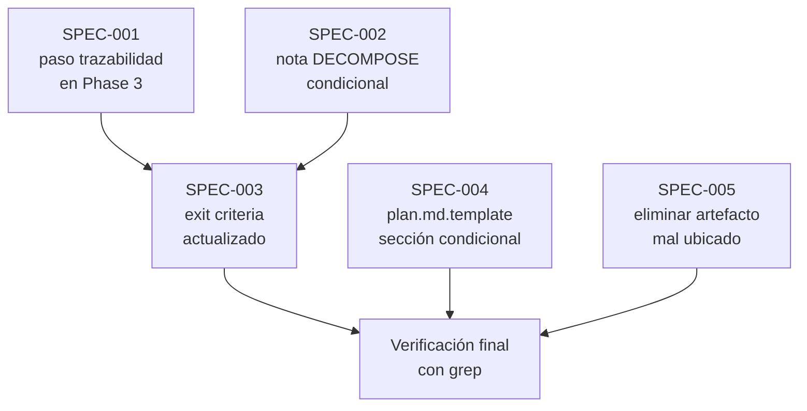

```yml
Tipo: Especificación Técnica
Versión: 1.0
Fecha actualización: 2026-04-04
Estado: En revisión
```

# Especificación de Requisitos — Correcciones de Proceso Phase 3

## Resumen Ejecutivo

Se agregan tres gates y una sección de template a SKILL.md Phase 3 y plan.md.template
para garantizar que la trazabilidad entre causas raíz (RC) y tareas del plan sea
verificable antes de que el usuario apruebe el scope.

**Objetivo:** Que el modelo no pueda presentar un plan aprobable cuando hay RC sin
tarea asociada, ni saltar DECOMPOSE cuando la complejidad de trazabilidad lo requiere.

---

## Mapeo H → SPEC

| Hallazgo (Phase 1) | SPEC ID | Descripción técnica |
|--------------------|---------|---------------------|
| H-001 — Phase 3 sin gate de cobertura | SPEC-001 | Nuevo paso en procedimiento Phase 3 |
| H-002 — Criterio DECOMPOSE ignora RC | SPEC-002 | Nota condicional en Phase 3 |
| H-004 — Exit criteria sin verificación | SPEC-003 | Exit criteria Phase 3 actualizado |
| H-003 — plan.md.template sin trazabilidad | SPEC-004 | Sección condicional en template |
| H-005 — process-error-analysis.md en raíz | SPEC-005 | Limpieza de artefacto mal ubicado |

---

## SPEC-001: Gate de trazabilidad RC→tarea en procedimiento Phase 3

**ID:** SPEC-001
**Hallazgo origen:** H-001
**Prioridad:** Alta
**Estado:** Pendiente

### Descripción

Agregar un paso explícito en el procedimiento de Phase 3 que instruya al modelo
a construir una tabla de trazabilidad RC→tarea cuando el plan deriva de un
análisis con RC formales. El paso debe ser condicional (SI/NO) para no impactar
WPs sin RC.

### Criterios de Aceptación

```
Given: el modelo está ejecutando Phase 3 en un WP con analysis/ que tiene RC formales
When: llega al paso de construcción del plan
Then: construye tabla RC→tarea ANTES de presentar el plan al usuario
  Y: cada RC Alta o Media tiene al menos una fila en la tabla
  Y: el plan no se presenta al usuario si la tabla está incompleta

Given: el modelo está ejecutando Phase 3 en un WP SIN RC formales (trabajo mecánico)
When: llega al paso de construcción del plan
Then: omite la tabla de trazabilidad sin error
  Y: el plan se presenta normalmente
```

### Consideraciones técnicas

- El paso debe usar formato SI/NO compatible con Haiku
- La condición es: "SI el plan deriva de analysis/ con RC → REQUERIDO: tabla"
- No usar narrativa — usar lista con SI/NO explícito

### Archivos a modificar

- [SKILL](.claude/skills/pm-thyrox/SKILL.md) — sección Phase 3, procedimiento

### Verificación

```bash
grep -n "SI.*RC\|trazabilidad.*RC\|RC.*tarea" .claude/skills/pm-thyrox/SKILL.md
# debe retornar al menos 1 resultado dentro de la sección Phase 3
```

---

## SPEC-002: Nota DECOMPOSE condicional por presencia de RC

**ID:** SPEC-002
**Hallazgo origen:** H-002
**Prioridad:** Alta
**Estado:** Pendiente

### Descripción

Agregar en Phase 3 una nota explícita que establezca que DECOMPOSE no puede
saltarse cuando el WP tiene RC con prioridades distintas, independientemente
de la clasificación de tamaño (micro/pequeño/mediano/grande).

### Criterios de Aceptación

```
Given: el modelo clasifica un WP como "pequeño" (30min-2h)
When: el WP proviene de un análisis con RC de prioridades distintas (Alta, Media, Baja)
Then: el modelo NO salta Phase 5 DECOMPOSE
  Y: la nota en Phase 3 es la instrucción que lo detiene

Given: el modelo clasifica un WP como "pequeño"
When: el WP es trabajo mecánico sin RC formales
Then: el modelo puede saltar DECOMPOSE según la tabla de escalabilidad
  Y: la nota no interfiere
```

### Consideraciones técnicas

- La nota no modifica la tabla de escalabilidad existente — la refina
- Ubicación: al final del procedimiento de Phase 3, antes del exit criteria
- Formato: nota con condición explícita SI/NO

### Archivos a modificar

- [SKILL](.claude/skills/pm-thyrox/SKILL.md) — sección Phase 3

### Verificación

```bash
grep -n "DECOMPOSE.*RC\|RC.*DECOMPOSE\|prioridades.*distintas" .claude/skills/pm-thyrox/SKILL.md
# debe retornar al menos 1 resultado en Phase 3
```

---

## SPEC-003: Exit criteria Phase 3 con gate de cobertura

**ID:** SPEC-003
**Hallazgo origen:** H-004
**Prioridad:** Alta
**Estado:** Pendiente

### Descripción

Actualizar el exit criteria de Phase 3 para incluir verificación de cobertura
cuando hay RC formales. El gate de salida debe requerir que la tabla de
trazabilidad exista y esté completa antes de declarar Phase 3 como completada.

### Criterios de Aceptación

```
Given: el modelo intenta declarar Phase 3 completa
When: el WP tiene RC formales Y el plan no tiene tabla de trazabilidad
Then: el exit criteria bloquea el avance a la siguiente phase

Given: el modelo intenta declarar Phase 3 completa
When: el WP tiene RC formales Y la tabla existe Y cada RC Alta/Media tiene tarea
Then: el exit criteria permite avanzar

Given: el modelo intenta declarar Phase 3 completa
When: el WP no tiene RC formales
Then: el exit criteria original aplica sin cambios
```

### Consideraciones técnicas

- La condición de cobertura es adicional al exit criteria existente, no reemplaza
- Formato: "Salir cuando: ... Y SI hay RC: tabla de trazabilidad completa"

### Archivos a modificar

- [SKILL](.claude/skills/pm-thyrox/SKILL.md) — exit criteria de Phase 3

### Verificación

```bash
grep -A 5 "Salir cuando" .claude/skills/pm-thyrox/SKILL.md | grep -i "RC\|trazabilidad\|cobertura"
# debe retornar al menos 1 resultado
```

---

## SPEC-004: Sección condicional de trazabilidad en plan.md.template

**ID:** SPEC-004
**Hallazgo origen:** H-003
**Prioridad:** Media
**Estado:** Pendiente

### Descripción

Agregar una sección opcional al plan.md.template que muestre la tabla de
trazabilidad RC→tarea. La sección debe estar marcada como condicional con
una nota que indique cuándo incluirla.

### Criterios de Aceptación

```
Given: plan.md.template tiene la nueva sección
When: un modelo usa el template para un WP con RC formales
Then: el plan resultante incluye la tabla de trazabilidad
  Y: la tabla tiene columnas: Tarea | Archivo | Resuelve

Given: plan.md.template tiene la nueva sección
When: un modelo usa el template para un WP SIN RC formales
Then: el modelo omite la sección según la nota condicional
  Y: el plan no tiene una sección vacía innecesaria
```

### Archivos a modificar

- `.claude/skills/pm-thyrox/assets/plan.md.template`

### Verificación

```bash
grep -n "trazabilidad\|RC.*tarea\|Resuelve" .claude/skills/pm-thyrox/assets/plan.md.template
# debe retornar al menos 1 resultado
```

---

## SPEC-005: Eliminar process-error-analysis.md de raíz del WP

**ID:** SPEC-005
**Hallazgo origen:** H-005
**Prioridad:** Baja
**Estado:** Pendiente

### Descripción

El archivo `process-error-analysis.md` fue creado en la raíz del WP antes de
seguir el proceso formal. La versión correcta ya existe en `analysis/`. El
archivo en la raíz es redundante y viola la convención de estructura del WP.

### Criterios de Aceptación

```
Given: process-error-analysis.md existe en raíz del WP
When: se ejecuta la limpieza
Then: el archivo es eliminado de la raíz
  Y: analysis/skill-adr-boundary-process-errors-analysis.md permanece intacto
```

### Archivos a modificar

- `.claude/context/work/2026-04-04-07-17-37-skill-adr-boundary/process-error-analysis.md` — eliminar

### Verificación

```bash
ls .claude/context/work/2026-04-04-07-17-37-skill-adr-boundary/process-error-analysis.md
# debe retornar "No such file or directory"
ls .claude/context/work/2026-04-04-07-17-37-skill-adr-boundary/analysis/
# debe incluir skill-adr-boundary-process-errors-analysis.md
```

---

## Arquitectura técnica



## Dependencias

```
SPEC-001 y SPEC-002 → SPEC-003 (el exit criteria referencia ambas condiciones)
SPEC-004 → independiente
SPEC-005 → independiente
```

## Riesgos

| Riesgo | Impacto | Probabilidad | Mitigación |
|--------|---------|-------------|-----------|
| SPEC-001 usa narrativa en vez de SI/NO — Haiku lo ignora | Alto | Media | Revisar lenguaje antes de commitear |
| SPEC-003 exit criteria queda ambiguo para WPs sin RC | Medio | Baja | Probar mentalmente con WP mecánico |
