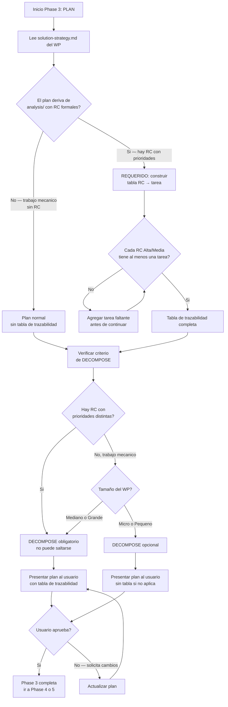
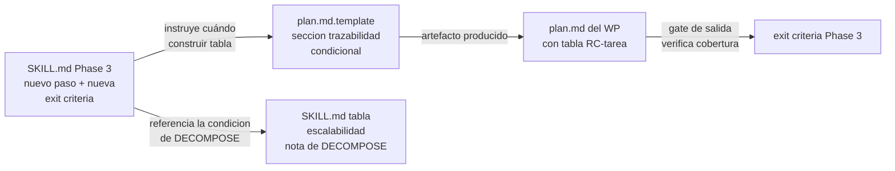
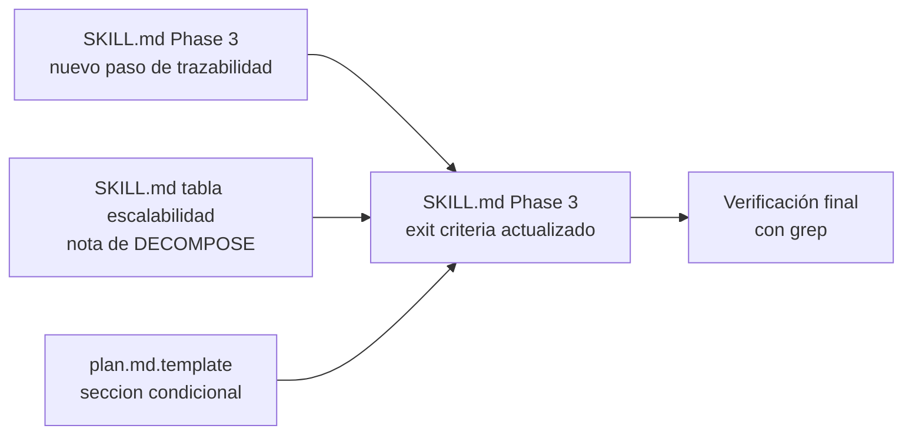

```yml
Fecha estrategia: 2026-04-04
Proyecto: THYROX — PM-THYROX Framework
Versión arquitectura: 1.0
Estado: Borrador
```

# Solution Strategy: Correcciones de Proceso en SKILL.md Phase 3

## Key Ideas

### Idea 1: Gates como condiciones SI/NO, no como sugerencias narrativas

Las instrucciones de Phase 3 actuales son descriptivas ("crear plan, obtener aprobacion").
No tienen condiciones que detengan al modelo cuando algo está incompleto.

Un gate efectivo para Haiku tiene la forma:
```
SI [condicion verificable] → REQUERIDO: [accion concreta]
NO continuar si [condicion de bloqueo]
```

No: "verificar que las RC esten cubiertas"
Si: "SI el plan deriva de analysis/ con RC → REQUERIDO: tabla RC→tarea antes de presentar"

### Idea 2: El criterio de skip de DECOMPOSE necesita un segundo eje

La tabla actual de escalabilidad solo tiene un eje: tamaño por duración.
El problema es que "pequeño" captura tanto trabajo mecánico (sin RC) como trabajo
de trazabilidad (con múltiples RC). Son casos distintos con requisitos distintos.

El segundo eje es: "¿tiene RC con prioridades distintas que trazar?"
- Si NO → DECOMPOSE es opcional según tamaño
- Si SI → DECOMPOSE es obligatorio independientemente del tamaño

### Idea 3: La trazabilidad debe vivir en el artefacto, no solo en la mente del modelo

Si la tabla RC→tarea no está en el plan.md, no puede ser revisada por el usuario
antes de aprobar. La solución requiere que el artefacto plan.md incluya la tabla
cuando el WP proviene de un análisis con RC.

---

## Research

### Unknown 1: Dónde agregar el gate de cobertura en Phase 3

**Alternativas investigadas:**

```
Alternativa A — Nuevo paso en el procedimiento de Phase 3
Pros: visible en el flujo de trabajo, el modelo lo ejecuta secuencialmente
Cons: SKILL.md crece; el modelo podría omitirlo como paso opcional

Alternativa B — Solo en exit criteria de Phase 3
Pros: el exit criteria es el gate de salida, no se puede ignorar
Cons: el modelo puede no construir la tabla si no se le dice cuándo

Alternativa C — Paso en procedimiento + exit criteria (ambos)
Pros: doble refuerzo; el paso dice cuándo construir, el exit criteria lo valida
Cons: cierta redundancia
```

Decisión: Alternativa C — el paso le dice al modelo "construir aquí", el exit criteria
le dice "no salir sin esto". Son dos momentos distintos en el proceso.

---

### Unknown 2: Cómo expresar el segundo eje de DECOMPOSE sin romper la tabla existente

**Alternativas investigadas:**

```
Alternativa A — Modificar la tabla de escalabilidad (agregar columna)
Pros: todo en un lugar
Cons: la tabla ya es parte del SKILL activado; modificarla es un cambio estructural
      que puede confundir a modelos que conocen el formato actual

Alternativa B — Agregar condición en Phase 3 como nota standalone
Pros: aditivo, no modifica la tabla existente
Cons: puede quedar desconectada de la tabla si el modelo no lee Phase 3 completa

Alternativa C — Agregar condición en Phase 3 con referencia explícita a la tabla
Pros: aditivo y conectado; el modelo ve la tabla Y la condición que la refina
Cons: requiere redacción cuidadosa para no contradecir la tabla
```

Decisión: Alternativa C — nota en Phase 3 que dice "SI hay RC con prioridades distintas,
DECOMPOSE no se puede saltar independientemente de la clasificación de la tabla".

---

### Unknown 3: Plan.md template — agregar o no la tabla de trazabilidad

**Alternativas investigadas:**

```
Alternativa A — Agregar tabla en plan.md.template como sección condicional
Pros: el artefacto refleja la convención; cualquier modelo que use el template la incluye
Cons: WPs sin RC tendrían una sección vacía o innecesaria

Alternativa B — Solo instrucción en Phase 3, sin tocar el template
Pros: mínima superficie de cambio
Cons: el modelo puede olvidar incluirla si no está en el template

Alternativa C — Tabla en template marcada como condicional con comentario
Pros: el template guía sin imponer; el modelo ve la sección y la omite si no aplica
Cons: una sección más en el template
```

Decisión: Alternativa C — sección en plan.md.template con nota "(incluir solo si el plan
deriva de analysis/ con RC formales)".

---

## Flujos de decision

### Flujo 1 — Phase 3 con las correcciones aplicadas



### Flujo 2 — Como interactuan los 3 artefactos corregidos



---

## Decisiones fundamentales

### Decision 1: Gate de cobertura — paso en procedimiento + exit criteria

Alternativas: solo paso, solo exit criteria, ambos.
Elegida: ambos (Alternativa C).
Justificacion: el paso guía el momento de construcción; el exit criteria valida antes de salir.
Implicaciones: dos cambios en la sección Phase 3 del SKILL, coherentes entre sí.

### Decision 2: Condición de DECOMPOSE — nota en Phase 3 que refina la tabla

Alternativas: modificar tabla, nota standalone, nota con referencia.
Elegida: nota con referencia explícita a la tabla (Alternativa C).
Justificacion: aditivo, conectado, no rompe el formato actual de la tabla.
Implicaciones: un cambio en Phase 3, no en la tabla de escalabilidad.

### Decision 3: Template plan.md — sección condicional con nota

Alternativas: no tocar template, instrucción solo en SKILL, sección condicional.
Elegida: sección condicional en template (Alternativa C).
Justificacion: el artefacto refleja la convención; el modelo ve la sección al usar el template.
Implicaciones: plan.md.template crece con una sección, marcada como condicional.

---

## Pre-design check

| Principio | Se respeta? | Nota |
|-----------|-------------|------|
| Cambios aditivos | Si | Nuevos pasos, no eliminación de existentes |
| Haiku-compatible | Si | Condiciones SI/NO, no narrativas |
| No duplicar meta-skill | Si | No se menciona "invocar el SKILL" en ninguna corrección |
| No romper WPs sin RC | Si | La tabla es condicional: "SI hay RC formales" |
| RC-007 reglas atomicas | Si | Formato IF/THEN en cada gate |

---

## Post-design check

- Las 3 decisiones son independientes: pueden implementarse en cualquier orden
- Ninguna decisión contradice las instrucciones existentes de Phase 3
- El Flujo 1 muestra que un WP sin RC no se ve afectado por los cambios
- El Flujo 2 muestra que los 3 artefactos se refuerzan mutuamente

---

## Orden de implementación



Grupos:
- Grupo 1 paralelo: paso de trazabilidad en Phase 3 + nota DECOMPOSE + template
- Grupo 2 secuencial tras Grupo 1: exit criteria Phase 3 actualizado
- Grupo 3 tras Grupo 2: verificación con criterios de éxito de Phase 1

---

## Checklist de validación

- [x] Key ideas documentadas con impacto
- [x] 3 unknowns investigados con alternativas y pros/cons
- [x] Decisiones con justificación y alternativas consideradas
- [x] Flujos mermaid no-lineales (loops, ramas, casos sin RC)
- [x] Pre-design check pasado
- [x] Post-design check pasado
- [x] Orden de implementación con dependencias
- [x] Trazabilidad a hallazgos Phase 1 (H-001, H-002, H-003, H-004)
- [ ] Aprobado para continuar a Phase 3: PLAN
