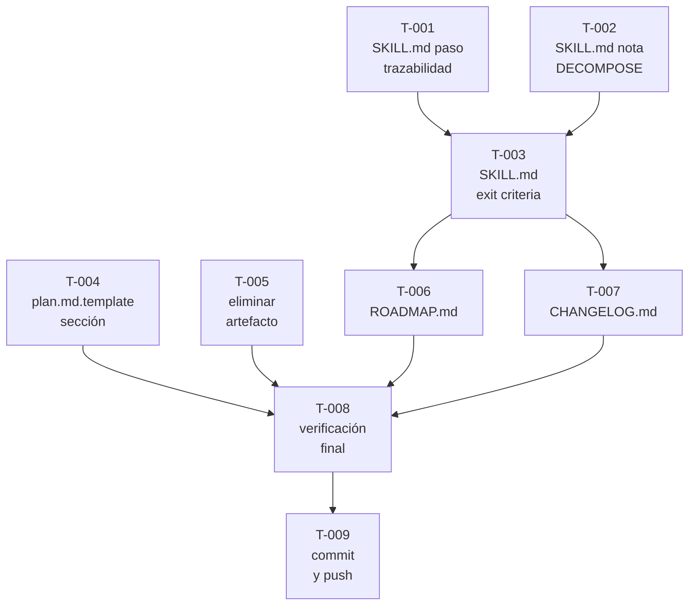

```yml
Fecha creación tareas: 2026-04-04
Proyecto: THYROX — PM-THYROX Framework
Feature: process-corrections
Versión breakdown: 1.0
Total tareas: 9
Dependencias críticas: 2
```

# Tasks: Correcciones de Proceso Phase 3

## Resumen

Total de tareas: 9
Basado en: skill-adr-boundary-process-corrections-requirements-spec.md

---

## Trazabilidad SPEC → Tarea

| Tarea | SPEC | Archivo afectado |
|-------|------|-----------------|
| T-001 | SPEC-001 | SKILL.md — paso trazabilidad Phase 3 |
| T-002 | SPEC-002 | SKILL.md — nota DECOMPOSE condicional |
| T-003 | SPEC-003 | SKILL.md — exit criteria Phase 3 |
| T-004 | SPEC-004 | plan.md.template — sección condicional |
| T-005 | SPEC-005 | Eliminar process-error-analysis.md de raíz WP |
| T-006 | — | ROADMAP.md — actualizar FASE 9 |
| T-007 | — | CHANGELOG.md — actualizar v0.7.0 |
| T-008 | — | Verificación final (grep criterios de éxito) |
| T-009 | — | Commit y push |

---

## FASE 1: Implementación core (paralela)

- [ ] [T-001] [P] SKILL.md — agregar paso de trazabilidad RC→tarea en Phase 3 (SPEC-001)
- [ ] [T-002] [P] SKILL.md — agregar nota DECOMPOSE condicional en Phase 3 (SPEC-002)
- [ ] [T-004] [P] plan.md.template — agregar sección condicional de trazabilidad (SPEC-004)
- [ ] [T-005] [P] Eliminar process-error-analysis.md de raíz del WP (SPEC-005)

> T-001, T-002, T-004 y T-005 son independientes entre sí — ejecutar en paralelo.

**CHECKPOINT-1:** tras completar T-001 y T-002
```bash
grep -n "SI.*RC\|trazabilidad.*RC\|RC.*tarea" .claude/skills/pm-thyrox/SKILL.md
# debe retornar resultados en la sección Phase 3
grep -n "DECOMPOSE.*RC\|RC.*DECOMPOSE" .claude/skills/pm-thyrox/SKILL.md
# debe retornar al menos 1 resultado en Phase 3
```

---

## FASE 2: Exit criteria (depende de FASE 1)

- [ ] [T-003] SKILL.md — actualizar exit criteria Phase 3 con gate de cobertura (SPEC-003)

> T-003 depende de T-001 y T-002 — debe ejecutarse después de CHECKPOINT-1.

**CHECKPOINT-2:** tras completar T-003
```bash
grep -A 5 "Salir cuando:" .claude/skills/pm-thyrox/SKILL.md | grep -i "RC\|trazabilidad\|cobertura"
# debe retornar al menos 1 resultado
```

---

## FASE 3: Documentación y cierre (depende de FASE 2)

- [ ] [T-006] [P] ROADMAP.md — actualizar FASE 9 con items de este scope
- [ ] [T-007] [P] CHANGELOG.md — actualizar v0.7.0 con correcciones

> T-006 y T-007 son independientes entre sí — ejecutar en paralelo.

---

## FASE 4: Verificación y commit

- [ ] [T-008] Verificación final — ejecutar todos los criterios de éxito de los 5 SPECs
- [ ] [T-009] Commit convencional y push

**CHECKPOINT-3 (verificación final):**
```bash
# SPEC-001
grep -n "SI.*RC\|trazabilidad" .claude/skills/pm-thyrox/SKILL.md
# SPEC-002
grep -n "DECOMPOSE.*RC\|RC.*DECOMPOSE" .claude/skills/pm-thyrox/SKILL.md
# SPEC-003
grep -A 5 "Salir cuando:" .claude/skills/pm-thyrox/SKILL.md | grep -i "RC\|trazabilidad"
# SPEC-004
grep -n "trazabilidad\|RC.*tarea\|Resuelve" .claude/skills/pm-thyrox/assets/plan.md.template
# SPEC-005
ls .claude/context/work/2026-04-04-07-17-37-skill-adr-boundary/process-error-analysis.md 2>&1
# debe retornar "No such file or directory"
```

---

## Orden de ejecución (DAG)



## Rollback

Si T-001 o T-002 fallan: `git checkout -- .claude/skills/pm-thyrox/SKILL.md`
Si T-003 falla: revertir solo el bloque exit criteria
Si T-004 falla: `git checkout -- .claude/skills/pm-thyrox/assets/plan.md.template`
