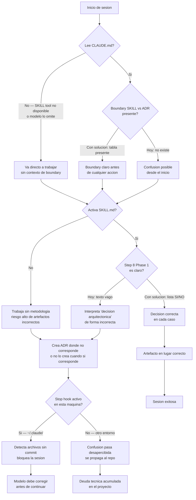
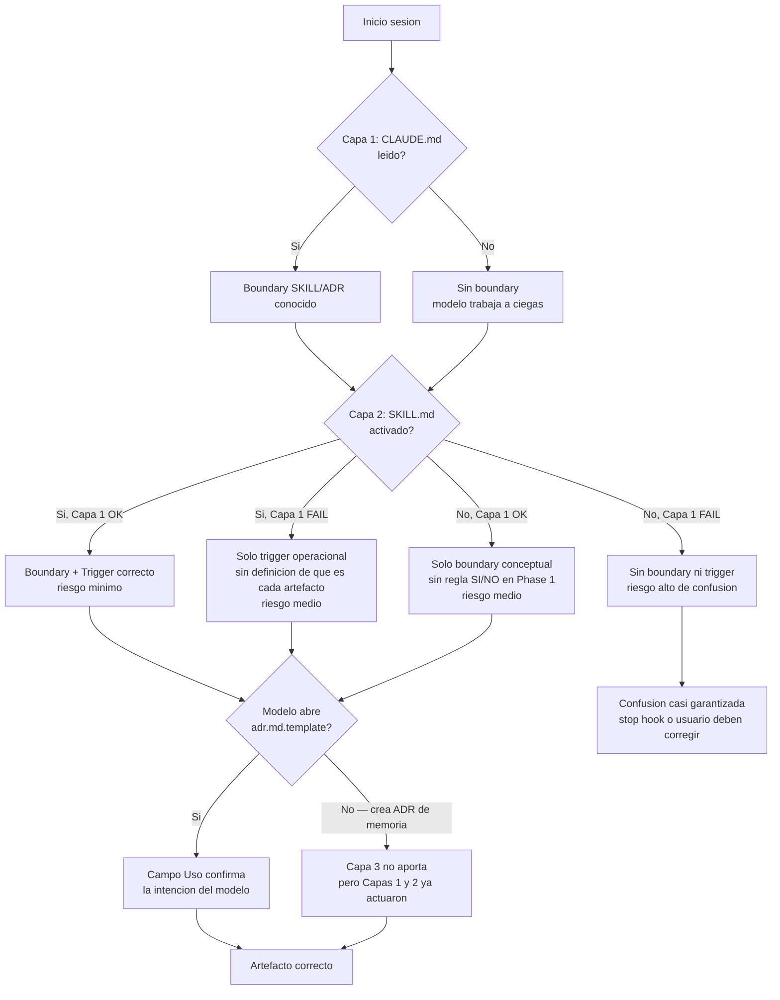
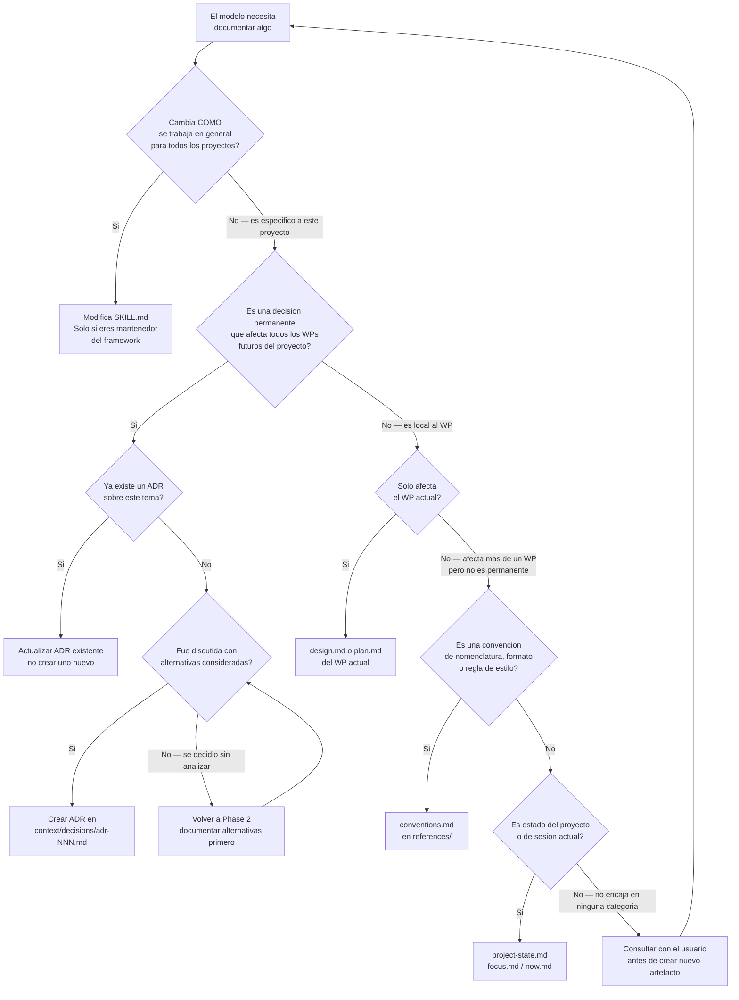

```yml
Tipo: Solution Strategy
Fase: 2 - SOLUTION_STRATEGY
WP: 2026-04-04-07-17-37-skill-adr-boundary
Fecha: 2026-04-04
```

# Solution Strategy — skill-adr-boundary

## Key Ideas (desde Phase 1)

1. **Boundary no existe:** No hay ningún texto en ningún archivo que diga explícitamente qué es SKILL vs qué es ADR.
2. **Haiku no infiere, necesita reglas atomicas:** La solución debe ser SI/NO, no narrativa.
3. **CLAUDE.md se lee primero:** Es el punto de entrada Level 2 — es el mejor lugar para el boundary primario.
4. **El stop hook es local:** No puede ser parte de la solución portátil.

---

## Flujos de decision

### Flujo 1 — Sesion con otro modelo: como procesa el repo y donde falla



### Flujo 2 — Interaccion entre las 3 capas: no siempre se activan todas



### Flujo 3 — Arbol de decision del modelo al documentar algo

Este flujo es no-lineal: hay ramas que regresan, ambiguedades que requieren consulta, y casos donde el modelo no puede decidir solo.



---

## Alternativas evaluadas

### Opcion A — Solo `adr-guide.md` (nueva referencia)

Crear `references/adr-guide.md` con reglas SI/NO y que SKILL.md lo referencie.

**Pros:**
- Separacion de concerns: SKILL.md no crece
- La guia puede tener ejemplos detallados

**Contras:**
- Haiku sigue un link solo si SKILL.md dice REQUERIDO — y actualmente no lo hace
- Requiere que el modelo lea un archivo extra bajo demanda
- No resuelve RC-001 (boundary statement) en el punto de entrada

**Veredicto:** Util como complemento, insuficiente como solucion primaria.

---

### Opcion B — Solo fix en SKILL.md (inline)

Reemplazar Step 8 de Phase 1 con reglas SI/NO. Agregar seccion "SKILL vs ADR" al inicio.

**Pros:**
- Todo en un archivo
- SKILL.md ya es el motor; Haiku lo lee

**Contras:**
- SKILL.md crece (ya es largo)
- La boundary statement llega tarde — SKILL.md se activa despues de CLAUDE.md
- No tiene efecto si el modelo no activa el SKILL correctamente

**Veredicto:** Necesario pero no suficiente como unica capa.

---

### Opcion C — Solo CLAUDE.md

Agregar seccion `## Boundary: SKILL vs ADR` a CLAUDE.md con 4-6 lineas de reglas atomicas.

**Pros:**
- CLAUDE.md se lee SIEMPRE, PRIMERO, por cualquier modelo
- Minima superficie de cambio
- Haiku no puede saltarse este punto de entrada

**Contras:**
- CLAUDE.md no puede tener todo el detalle de ejemplos
- No resuelve la ambiguedad del trigger en SKILL.md Phase 1

**Veredicto:** Mejor capa primaria, pero necesita apoyo en SKILL.md.

---

### Opcion D — Tres capas: CLAUDE.md + SKILL.md + adr.md.template — ELEGIDA

**Capa 1 — CLAUDE.md** (boundary primario, siempre leido):
- Nueva seccion `## SKILL vs ADR — Regla de uso` con tabla de 4 filas

**Capa 2 — SKILL.md Phase 1** (trigger operacional):
- Reemplazar Step 8 vago con lista SI/NO de 7 items concretos

**Capa 3 — adr.md.template** (artefacto auto-descriptivo):
- Agregar campo `Uso:` en frontmatter que diga "Solo para decisiones permanentes de arquitectura"

**Pros:**
- Tres puntos de contacto independientes — si Haiku falla en uno, los otros compensan
- RC-007 cumplido: cada capa usa formato atomico, no narrativa
- Cambios son aditivos — no rompe nada existente
- CLAUDE.md resuelve RC-001 y RC-003; SKILL.md resuelve RC-002; template resuelve RC-006

**Contras:**
- 3 archivos modificados en lugar de 1
- El campo `Uso:` en el template solo ayuda si el modelo lee el template antes de crear el ADR

**Veredicto:** Mejor cobertura con menor riesgo. Elegida.

---

## Decision arquitectonica

No crear `adr-guide.md`. La guia completa va inline en las capas existentes.
Un archivo extra que Haiku debe seguir mediante link introduce una dependencia fragil.
Toda regla que Haiku necesita debe estar en archivos que ya lee de forma garantizada.

---

## Diseno de cada capa (detalle)

### Capa 1 — CLAUDE.md: nueva seccion

Ubicacion: despues de `## Locked Decisions`, antes de `## Estructura`.

```markdown
## SKILL vs ADR — Regla de uso

|                  | SKILL.md                                    | ADR en context/decisions/                          |
|------------------|---------------------------------------------|----------------------------------------------------|
| Que es           | Instrucciones de metodologia (como trabajar) | Registro de decisiones tomadas (por que se eligio X) |
| Quien lo escribe | Mantenedor del framework                    | Claude durante Phase 1-2, cuando hay decision permanente |
| Cuando modificar | Solo si cambia la metodologia de gestion    | Al tomar una nueva decision arquitectonica del proyecto |
| Duracion         | Vive con el framework                       | Inmutable una vez aprobado                         |

REGLA: Si la duda es "documento esto en SKILL.md o en un ADR?":
- Cambia COMO se trabaja -> SKILL.md
- Registra POR QUE se eligio algo en el proyecto -> ADR
```

### Capa 2 — SKILL.md Phase 1 Step 8: trigger atomico

Reemplazar:
> "Si hay decision arquitectonica (cambio de stack tecnologico, adopcion de patron nuevo
> como microservicios o event-driven, o reemplazo de componente principal), crear ADR"

Por lista SI/NO:

```markdown
8. ADR: Crear en `context/decisions/adr-NNN.md` usando [adr.md.template](assets/adr.md.template) SOLO SI:
   - SI: cambio de stack tecnologico (lenguaje, DB, framework principal)
   - SI: adopcion de nuevo patron arquitectonico (microservicios, event-driven, CQRS)
   - SI: reemplazo de componente principal del sistema
   - SI: decision que afecta todos los work packages futuros
   - NO: convencion de naming, formato de archivo, template nuevo
   - NO: decision que solo afecta el WP actual
   - NO: cambios a la metodologia de gestion (eso va en SKILL.md)
```

### Capa 3 — adr.md.template: frontmatter auto-descriptivo

Agregar campo `Uso:` en el bloque YAML del template:

```yaml
Uso: Solo para decisiones arquitectonicas permanentes del PROYECTO (stack, patrones, componentes).
     NO usar para decisiones de metodologia — esas van en SKILL.md.
```

---

## Pre-design check

| Principio              | Se respeta?                                    |
|------------------------|------------------------------------------------|
| ADR-001 Markdown only  | Si — Todo en Markdown                          |
| ADR-008 Git as persist | Si — Cambios en archivos versionados           |
| ADR-010 ANALYZE first  | Si — Phase 1 completada antes                  |
| RC-007 Reglas atomicas | Si — Formato lista SI/NO, no narrativa         |
| Cambios aditivos       | Si — Secciones nuevas, no reemplazos de estructura |

---

## Post-design check

- La Capa 1 (CLAUDE.md) funciona sin que Haiku active el SKILL
- La Capa 2 (SKILL.md) funciona incluso si Haiku no lee CLAUDE.md
- La Capa 3 (template) es educativa, no critica
- Los tres cambios son independientes — pueden fallar individualmente sin romper los otros
- Los flujos 1-3 son verificables en texto plano sin herramientas externas

---

## Criterio de exito de esta fase

Arquitectura aprobada con 3 capas definidas, 3 flujos documentados, y pre/post-design check pasado.
