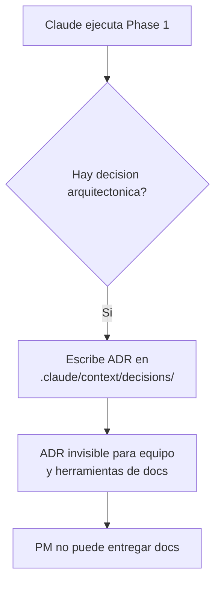
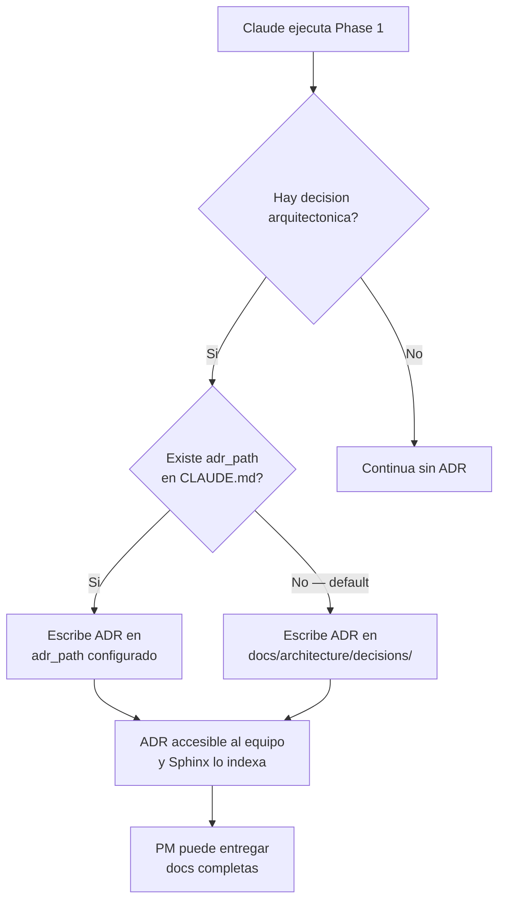

```yml
Fecha: 2026-04-04
Proyecto: THYROX — PM-THYROX Framework
Versión análisis: 1.0
Estado: Borrador
```

# Análisis: Separación de contexto Claude vs documentación de proyecto (docs/)

## Propósito

Analizar la estructura actual donde todo vive en `.claude/` y determinar qué debe
separarse hacia `docs/` para que los proyectos que usan PM-THYROX produzcan
documentación real — accesible para el equipo, reproducible en cualquier proyecto,
y compatible con herramientas como Sphinx o MkDocs.

---

## Visión General

### El problema de fondo

Hoy el framework mezcla dos tipos de artefactos en el mismo espacio (`.claude/`):

```
.claude/context/
├── work/           ← efímero — sesiones de Claude, WPs en progreso
├── decisions/      ← permanente — ADRs del proyecto
├── focus.md        ← estado de sesión
└── now.md          ← estado de sesión
```

`work/`, `focus.md` y `now.md` son contexto de Claude — tienen sentido solo para
el modelo. `decisions/` son ADRs del proyecto — tienen valor para todo el equipo,
para nuevos desarrolladores, para el PM que entrega el proyecto, y para herramientas
de documentación.

Al mezclarlos bajo `.claude/` (directorio oculto, Claude-específico), los ADRs
quedan invisibles para:
- Desarrolladores que no usan Claude Code
- Herramientas de documentación (Sphinx, MkDocs, Docusaurus)
- CI/CD que genera docs
- Un PM que entrega el proyecto a un cliente

### Lo que un PM senior entregaría

```
docs/
├── architecture/
│   ├── decisions/
│   │   ├── adr-001-markdown-documentation.md
│   │   └── adr-002-...md
│   └── diagrams/
├── guides/
│   ├── getting-started.md
│   └── contributing.md
└── index.rst          ← Sphinx entry point
```

Esto es lo que vive en el repo, es versionado, es navegable por cualquier persona,
y puede publicarse automáticamente.

---

## Los 8 aspectos

### 1. Objetivo / Por qué

Separar los artefactos de Claude (efímeros, contexto de sesión) de los artefactos
del proyecto (permanentes, documentación entregable) para que:

- Los ADRs sean accesibles a todo el equipo sin depender de Claude
- El framework sea reproducible en cualquier proyecto con su propia convención de docs
- La carpeta `docs/` sea la fuente canónica de documentación del proyecto
- Las herramientas de docs (Sphinx) puedan indexar y renderizar los ADRs

### 2. Stakeholders

| Stakeholder | Necesidad |
|-------------|-----------|
| Desarrollador sin Claude Code | Leer ADRs y docs en `docs/`, no en `.claude/` |
| PM que entrega el proyecto | Documentación en estructura estándar, exportable |
| Sphinx / MkDocs | Indexar archivos en `docs/`, no en directorios ocultos |
| Claude (Sonnet/Haiku) | Saber dónde escribir ADRs según la convención del proyecto |
| Mantenedor del framework | CLAUDE.md portátil sin referencias a ADR IDs de THYROX |
| Nuevo proyecto usando el SKILL | Arrancar con `docs/` vacío, listo para su propia documentación |

### 3. Uso operacional

**Flujo actual (problemático):**



**Flujo objetivo (Opción D):**



**Uso del campo configurable:**
```yaml
# En CLAUDE.md del proyecto
adr_path: docs/architecture/decisions/     # default
# o
adr_path: docs/decisions/                # proyecto con convención propia
# o
adr_path: .claude/context/decisions/     # proyecto que prefiere mantener interno
```

### 4. Atributos de calidad

| Atributo | Requisito |
|----------|-----------|
| Portabilidad | El SKILL funciona en cualquier proyecto sin cambiar SKILL.md |
| Compatibilidad | `docs/` es indexable por Sphinx, MkDocs, Docusaurus sin config especial |
| Retrocompatibilidad | Proyectos existentes pueden mantener `.claude/context/decisions/` si lo declaran |
| Claridad para Haiku | La regla de dónde escribir ADRs es SI/NO, no narrativa |
| Entregabilidad | `docs/` es lo que un PM puede dar a un cliente sin filtrar |

### 5. Restricciones

- No romper THYROX como proyecto (sus ADRs en `.claude/context/decisions/` siguen siendo válidos si se declara como `adr_path`)
- CLAUDE.md debe ser portátil: sin referencias a ADR IDs específicos de THYROX
- El campo `adr_path` debe tener un default que funcione para el 90% de los casos
- No obligar a proyectos existentes a migrar inmediatamente
- El SKILL (`.claude/skills/pm-thyrox/`) no debe cambiar por el proyecto que lo aloja

### 6. Contexto / Sistemas vecinos

```
.claude/                    ← Claude-only (efímero + framework)
├── CLAUDE.md               ← Level 2 con adr_path configurable
├── context/
│   ├── work/               ← WPs — SIEMPRE .claude/, nunca docs/
│   ├── focus.md            ← sesión — SIEMPRE .claude/
│   └── now.md              ← sesión — SIEMPRE .claude/
└── skills/pm-thyrox/       ← el SKILL distribuible

docs/                        ← proyecto (permanente, entregable)
├── architecture/
│   └── decisions/          ← ADRs del proyecto
├── guides/
└── index.rst
```

**Separación por audiencia:**

| Carpeta | Audiencia | Durabilidad |
|---------|-----------|-------------|
| `.claude/context/work/` | Solo Claude | Efímera — termina con el WP |
| [focus](.claude/context/focus.md) | Solo Claude | Sesión actual |
| `docs/` | Todo el equipo | Permanente — vive con el proyecto |

### 7. Fuera de alcance

| Excluido | Razón |
|---|---|
| Migrar ADRs de THYROX de `.claude/context/decisions/` a `docs/` | THYROX puede declarar su propia `adr_path`; no es urgente |
| Configurar Sphinx en THYROX | Tarea separada; el WP solo establece la convención |
| Mover work packages a `docs/` | Los WPs son efímeros — SIEMPRE en `.claude/context/work/` |
| Cambiar la ubicación de `context/focus.md` o `now.md` | Son estado de sesión — pertenecen a `.claude/` |
| Soporte para múltiples `adr_path` en un mismo proyecto | Complejidad innecesaria |

### 8. Criterios de éxito

```bash
# SKILL.md menciona adr_path o docs/ en la instrucción de ADRs
grep -n "adr_path\|docs/" .claude/skills/pm-thyrox/SKILL.md
# → al menos 1 resultado en Phase 1 Step 8

# CLAUDE.md tiene campo adr_path
grep -n "adr_path" .claude/CLAUDE.md
# → al menos 1 resultado

# CLAUDE.md Locked Decisions NO tiene referencias a ADR IDs externos
grep -n "ADR-0[0-9][0-9]" .claude/CLAUDE.md
# → 0 resultados (las reglas son auto-contenidas)

# Estructura docs/ creada con README para Sphinx
ls docs/architecture/decisions/
# → directorio existe con al menos README.md
```

---

## Hallazgos

| ID | Hallazgo | Prioridad |
|----|---------|-----------|
| H-001 | `.claude/context/decisions/` es Claude-only — ADRs invisibles para equipo y herramientas | Alta |
| H-002 | CLAUDE.md "Locked Decisions" referencia ADR IDs de THYROX — no portable a otros proyectos | Alta |
| H-003 | SKILL.md Phase 1 Step 8 hardcodea `context/decisions/` — no respeta convención del proyecto | Alta |
| H-004 | No existe separación documentada entre artefactos efímeros (Claude) y permanentes (proyecto) | Media |
| H-005 | Framework ADRs (ADR-010, ADR-011) mezclados con project ADRs en el mismo directorio | Media |
| H-006 | No hay estructura `docs/` en THYROX como ejemplo de lo que el framework debería producir | Baja |
| H-007 | La convención de `docs/` con Sphinx requiere un tech skill dedicado — no es responsabilidad de pm-thyrox | Alta |

### H-007 — Sphinx es un tech skill, no parte de pm-thyrox

pm-thyrox gestiona CÓMO trabajar (fases SDLC, artefactos, gates).
Sphinx gestiona CÓMO documentar para un sistema generador de docs (conf.py, RST/MD,
estructura `docs/`, build, templates).

Siguiendo ADR-012 (un management skill + N tech skills):
- `pm-thyrox` → metodología de gestión, referencia a Sphinx skill para docs
- `sphinx` (nuevo tech skill) → convenciones Sphinx, estructura `docs/`, plantillas RST/MD,
  dónde viven los ADRs para que Sphinx los indexe, cómo generar HTML

Esto significa que el scope de este WP NO incluye implementar la integración con Sphinx.
El WP establece:
1. La separación `.claude/` (efímero, Claude) vs `docs/` (permanente, equipo)
2. La convención `adr_path` configurable en CLAUDE.md
3. El stub del nuevo tech skill `sphinx` (estructura, no contenido completo)

El contenido completo del skill `sphinx` es un WP separado.

---

## Sin ítems [NEEDS CLARIFICATION]

Todos los hallazgos son verificables. La separación `.claude/` vs `docs/` es clara.
El campo `adr_path` como mecanismo de configuración está definido en la exploración previa.
