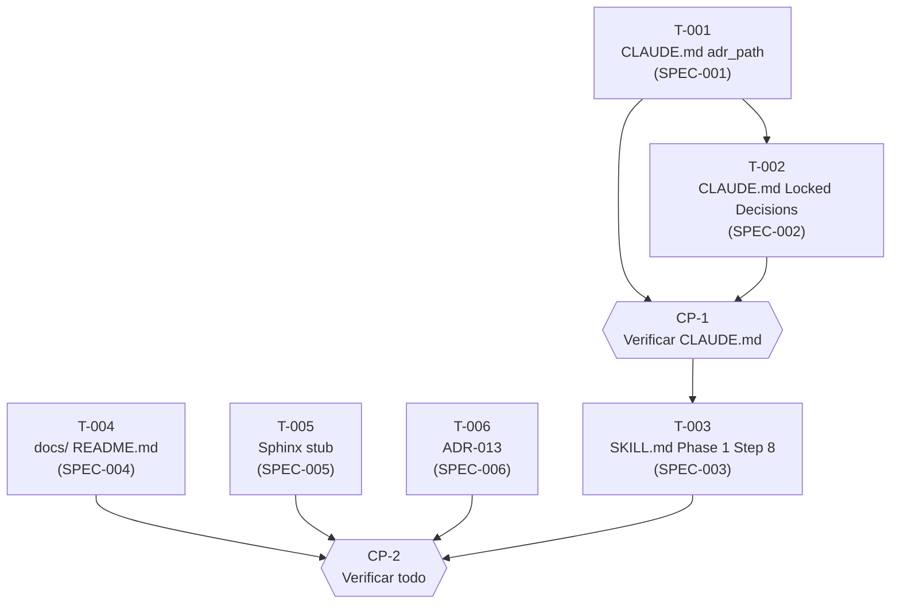

```yml
Fecha: 2026-04-04
WP: doc-structure
Fase: 5 - DECOMPOSE
Estado: Listo para ejecución
```

# Task Plan — doc-structure

## DAG de dependencias



## Fases de ejecución

### Fase A — CLAUDE.md (secuencial — mismo archivo)

- [x] [T-001] Añadir sección `## Configuración del Proyecto` con campo `adr_path` en [CLAUDE](.claude/CLAUDE.md) (SPEC-001)
- [x] [T-002] Eliminar referencias a IDs de ADRs `(ADR-NNN)` en sección "Locked Decisions" de [CLAUDE](.claude/CLAUDE.md) (SPEC-002)

**CP-1:** `grep "ADR-0[0-9][0-9]" .claude/CLAUDE.md` → 0 resultados; `grep "adr_path" .claude/CLAUDE.md` → ≥1 resultado

### Fase B — Archivos independientes (paralelos)

- [x] [T-003] [P] Añadir regla "Dónde crear el ADR" al inicio de Phase 1 Step 8 en `SKILL.md` (SPEC-003)
- [x] [T-004] [P] Crear [README](docs/architecture/decisions/README.md) con descripción del propósito (SPEC-004)
- [x] [T-005] [P] Crear [SKILL](.claude/skills/sphinx/SKILL.md) como stub con secciones `[PENDIENTE]` (SPEC-005)
- [x] [T-006] [P] Crear [adr-013](.claude/context/decisions/adr-013.md) — docs/ como documentación canónica (SPEC-006)

**CP-2 — Verificación final:**
```bash
grep "adr_path" .claude/CLAUDE.md                      # → ≥1 resultado
grep "ADR-0[0-9][0-9]" .claude/CLAUDE.md               # → 0 resultados
grep -n "adr_path\|docs/" .claude/skills/pm-thyrox/SKILL.md | grep -i "step 8\|Phase 1" # → resultado
ls docs/architecture/decisions/README.md                # → existe
ls .claude/skills/sphinx/SKILL.md                      # → existe
ls .claude/context/decisions/adr-013.md                # → existe
```

## Cobertura SPECs

| SPEC | Tarea | Cubierto |
|------|-------|---------|
| SPEC-001 | T-001 | ✓ |
| SPEC-002 | T-002 | ✓ |
| SPEC-003 | T-003 | ✓ |
| SPEC-004 | T-004 | ✓ |
| SPEC-005 | T-005 | ✓ |
| SPEC-006 | T-006 | ✓ |
