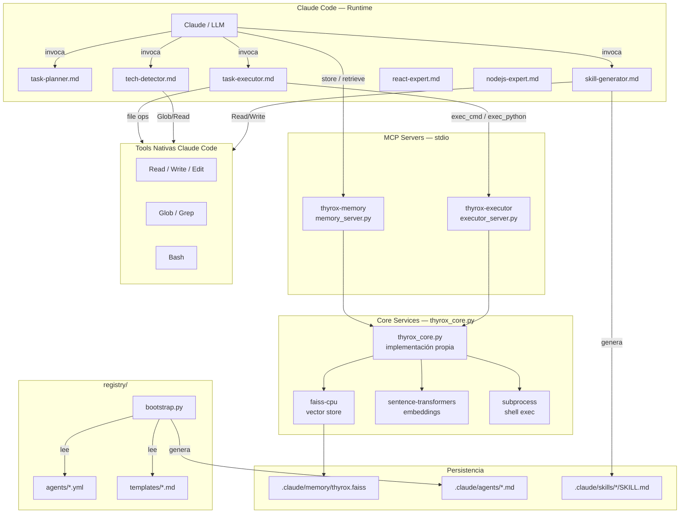
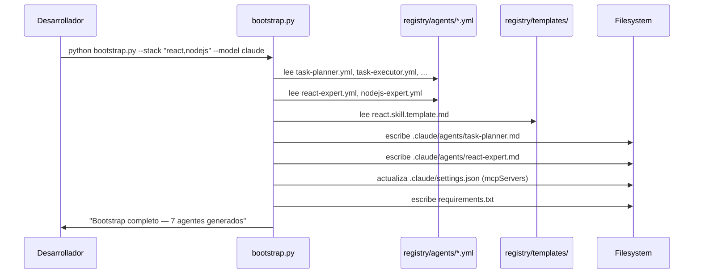
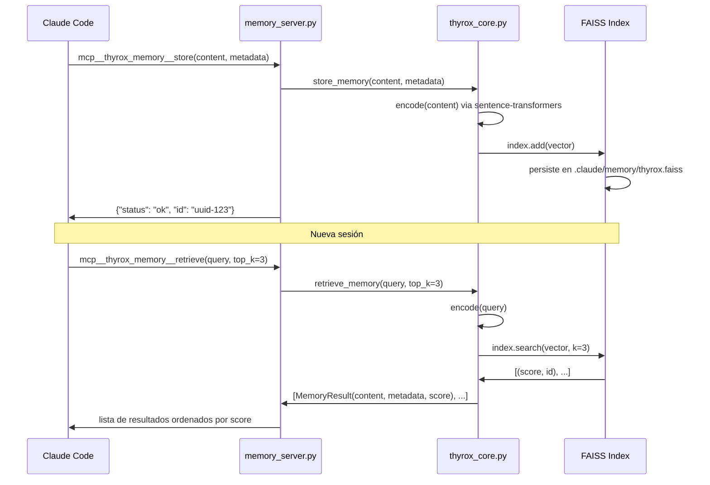
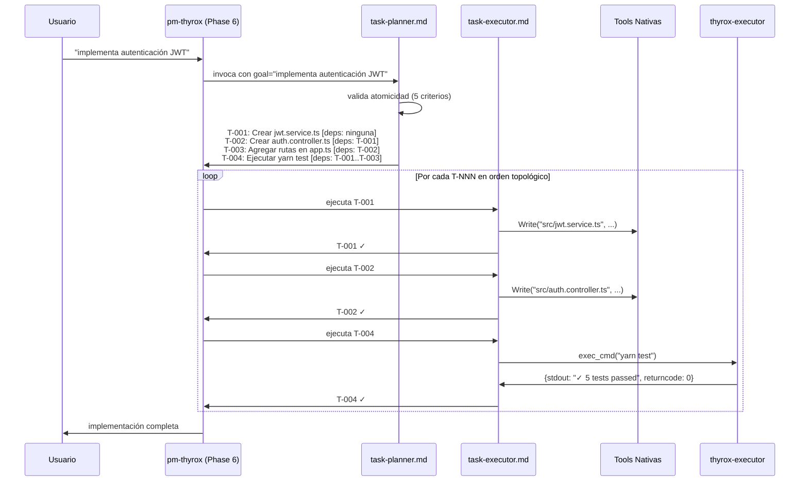
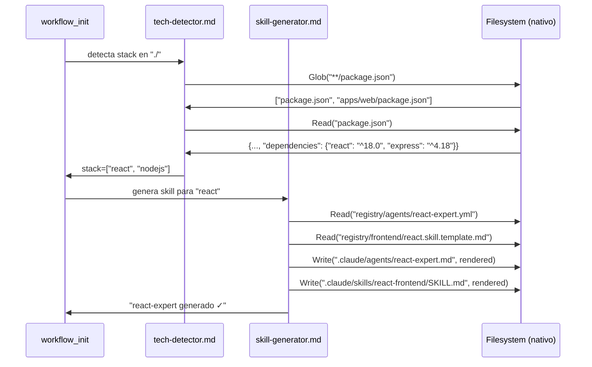

```yml
created_at: 2026-04-05 23:00:00  # hora estimada — corregido FASE 35 (2026-04-14), WP histórico sin hora original
wp: thyrox-capabilities-integration
version: 1.0
components: 12
status: Pendiente aprobación
Fuentes: solution-strategy v3.1 (D-1..D-10), requirements-spec v1.0
```

# Design — THYROX Capabilities Integration

## 1. Visión General

THYROX implementa sus propias capacidades de memoria y ejecución inspiradas en patrones
de EvoAgentX — sin dependencia de la librería. Dos MCP servers en stdio transport exponen
las capacidades via `thyrox_core.py` (código nativo). Los agentes son native Claude Code
agents con acceso a todas las tools del ecosistema. Bootstrap.py instala el sistema completo
desde un YAML registry model-agnostic.

---

## 2. Arquitectura de Componentes



---

## 3. Flujos Principales

### 3.1 Bootstrap — instalación one-shot



### 3.2 Flujo MCP Memory — store y retrieve



### 3.3 Flujo task-planner → task-executor (atomicidad + DAG implícito)



### 3.4 Flujo tech-detector → skill-generator (pure-native)



---

## 4. Estructura de Archivos

```
thyrox/
├── registry/
│   ├── mcp/
│   │   ├── thyrox_core.py           [NUEVO] implementación propia — FAISS + subprocess
│   │   ├── memory_server.py         [NUEVO] MCP server — store + retrieve
│   │   └── executor_server.py       [NUEVO] MCP server — exec_cmd + exec_python
│   ├── agents/
│   │   ├── task-planner.yml         [NUEVO] YAML source
│   │   ├── task-executor.yml        [NUEVO]
│   │   ├── tech-detector.yml        [NUEVO]
│   │   ├── skill-generator.yml      [NUEVO]
│   │   ├── react-expert.yml         [NUEVO]
│   │   ├── nodejs-expert.yml        [NUEVO]
│   │   └── postgresql-expert.yml    [NUEVO]
│   ├── frontend/
│   │   └── react.skill.template.md  [NUEVO]
│   ├── backend/
│   │   └── nodejs.skill.template.md [NUEVO]
│   ├── database/
│   │   └── postgresql.skill.template.md [NUEVO]
│   └── bootstrap.py                 [NUEVO] entry point one-shot
│
└── .claude/
    ├── settings.json                [MODIFICADO] + mcpServers
    ├── agents/
    │   ├── task-planner.md          [GENERADO por bootstrap.py]
    │   ├── task-executor.md         [GENERADO]
    │   ├── tech-detector.md         [GENERADO]
    │   ├── skill-generator.md       [GENERADO]
    │   ├── react-expert.md          [GENERADO]
    │   ├── nodejs-expert.md         [GENERADO]
    │   └── postgresql-expert.md     [GENERADO]
    ├── skills/
    │   ├── react-frontend/
    │   │   └── SKILL.md             [GENERADO por skill-generator]
    │   ├── nodejs-backend/
    │   │   └── SKILL.md             [GENERADO]
    │   └── postgresql/
    │       └── SKILL.md             [GENERADO]
    └── memory/
        └── thyrox.faiss             [GENERADO en runtime por memory_server]
```

---

## 5. Interfaces y Contratos

### 5.1 thyrox_core.py — interfaces del módulo core

```python
@dataclass
class ExecResult:
    stdout: str
    stderr: str
    returncode: int

@dataclass
class MemoryResult:
    content: str
    metadata: dict[str, Any]
    score: float

def init_memory(index_path: str, model_name: str = "all-MiniLM-L6-v2") -> None
    """Inicializa o carga índice FAISS. Idempotente."""

def exec_cmd(cmd: str, cwd: str = ".", timeout: int = 60) -> ExecResult
    """Ejecuta comando shell via subprocess. Bloquea patrones destructivos."""

def exec_python(code: str, timeout: int = 30) -> ExecResult
    """Ejecuta código Python en subproceso aislado."""

def store_memory(content: str, metadata: dict[str, Any]) -> str
    """Vectoriza content, almacena en FAISS. Retorna UUID del documento."""

def retrieve_memory(query: str, top_k: int = 5) -> list[MemoryResult]
    """Búsqueda vectorial. Retorna top_k resultados ordenados por score."""
```

### 5.2 MCP tool schemas — contratos con Claude

```
thyrox-memory:
  store(content: str, metadata?: dict) → {status: "ok", id: str}
  retrieve(query: str, top_k?: int = 5) → [{content, metadata, score}]

thyrox-executor:
  exec_cmd(cmd: str, cwd?: str = ".", timeout?: int = 60)
         → {stdout: str, stderr: str, returncode: int}
  exec_python(code: str, timeout?: int = 30)
            → {stdout: str, stderr: str, returncode: int}
```

### 5.3 Registry YAML — schema mínimo

```yaml
# registry/agents/{nombre}.yml
name: string                    # identificador único
description: string             # descripción del agente para Claude
model: string                   # claude-sonnet-4-5
tools:                          # tools permitidas
  - Read
  - Write
  - Edit
  - Glob
  - Grep
system_prompt: |                # prompt del sistema multiline
  ...instrucciones del agente...
```

---

## 6. Decisiones Arquitectónicas (DA)

### DA-001: Código propio, no EvoAgentX como dependencia (D-3 revisado)

- **Decisión:** `thyrox_core.py` implementa memoria y ejecución desde cero con FAISS + subprocess
- **Razón:** Independencia de una librería externa en v0.1.0. Los patrones de EvoAgentX
  (TaskPlanner, LongTermMemory, CMDToolkit) son la inspiración, no la implementación.
- **Consecuencia:** Zero dependencia `evoagentx` en requirements. El código es mantenible
  por el equipo sin depender del ciclo de release de un tercero.

### DA-002: Two MCP servers, not one (D-2)

- **Decisión:** Dos servers especializados (memory + executor) en lugar de uno monolítico
- **Razón:** Isolación de fallos — memory puede fallar sin afectar executor y viceversa.
  Dependencias independientes: faiss-cpu/sentence-transformers vs subprocess.
- **Consecuencia:** Dos entradas en settings.json; dos procesos Python en runtime.

### DA-002: Pure-native agents for tech-detector y skill-generator (R-9)

- **Decisión:** tech-detector y skill-generator no usan MCP tools — solo Read/Glob/Grep/Write
- **Razón:** File operations son nativas en Claude Code. Sin overhead de MCP para lo que
  Claude ya puede hacer directamente.
- **Consecuencia:** Estos agentes funcionan aunque los MCP servers no estén activos.

### DA-003: task-planner nunca ejecuta (SPEC-005)

- **Decisión:** task-planner tiene prohibición explícita de usar exec_cmd o Write
- **Razón:** Separación estricta entre planning y execution. Un agente que planifica
  y ejecuta mezcla concerns → errores difíciles de diagnosticar.
- **Consecuencia:** task-planner solo puede usar Read (para contexto). task-executor ejecuta.

### DA-004: bootstrap.py genera .md a partir de YAML (D-7, D-8)

- **Decisión:** Los `.claude/agents/*.md` son artefactos generados, no mantenidos a mano
- **Razón:** Model-agnostic + consistencia. La fuente de verdad es `registry/agents/*.yml`.
  Cambiar el comportamiento de un agente = editar el YAML, no el .md.
- **Consecuencia:** Los `.md` deben tratarse como generated files (no editar directamente).

---

## 7. Dependencias

### Internas (entre componentes)

- `memory_server.py` → `thyrox_core.py`
- `executor_server.py` → `thyrox_core.py`
- `bootstrap.py` → `registry/agents/*.yml` + `registry/*/templates`
- `.claude/agents/*.md` → generados por `bootstrap.py`
- `skill-generator.md` → lee `registry/agents/*.yml` + skill templates

### Externas (pip)

```
mcp >= 0.9.0                        # MCP Python SDK (Anthropic)
faiss-cpu >= 1.7.4                  # vector store local (implementación propia)
sentence-transformers >= 2.2.0      # embeddings locales all-MiniLM-L6-v2
pydantic >= 2.0                     # schemas y validación
```

**Sin torch** (faiss-cpu no requiere GPU), **sin API keys**, **sin servidores externos**.

---

## 8. Seguridad

### Exec_cmd — command injection mitigation

```python
# En thyrox_core.py
BLOCKED_PATTERNS = [
    r"rm\s+-rf\s+/",
    r">\s*/dev/sda",
    r"dd\s+if=.*of=/dev/",
    r"mkfs\.",
    r":\(\)\s*\{.*\}",  # fork bomb
]

def exec_cmd(cmd: str, cwd: str = ".") -> ExecResult:
    for pattern in BLOCKED_PATTERNS:
        if re.search(pattern, cmd):
            return ExecResult(stdout="", stderr=f"Blocked: destructive pattern", returncode=1)
    # proceder con subprocess
```

### MCP transport — stdio local

El transport stdio no expone puertos. Los MCP servers solo reciben llamadas de
Claude Code en el mismo proceso. Sin superficies de ataque externas.

---

## 9. Testing

### TC-001: Adapter layer — exec_cmd básico

```
Precondición: Python 3.11+, faiss-cpu y sentence-transformers instalados
Input: exec_cmd("echo hello", cwd="/tmp")
Esperado: ExecResult(stdout="hello\n", stderr="", returncode=0)
```

### TC-002: Memory — store + retrieve round-trip

```
Precondición: FAISS index inicializado en /tmp/test.faiss
Input: store_memory("React hooks son mejores que class components", {"type": "lesson"})
       retrieve_memory("React hooks", top_k=1)
Esperado: [MemoryResult(content="React hooks...", score > 0.7)]
```

### TC-003: tech-detector — React project

```
Precondición: directorio con package.json {"dependencies": {"react": "^18"}}
Input: tech-detector analiza "./"
Esperado: stack = ["react", "nodejs"]
Método: solo Glob + Read (verificar que NO hay exec_cmd)
```

### TC-004: task-planner — decomposición atómica

```
Input: goal = "implementa autenticación JWT con PostgreSQL"
Esperado: lista T-NNN donde:
  - cada T tiene exactamente 1 verbo
  - cada T tiene exactamente 1 artefacto
  - dependencias declaradas explícitamente
  - mínimo 3 tareas (no es atómica la solicitud original)
```

### TC-005: bootstrap.py — idempotencia

```
Precondición: .claude/agents/task-planner.md existe
Input: python bootstrap.py --stack "react" --model claude (sin --force)
Esperado: "task-planner.md ya existe — skip"
          sin modificar task-planner.md (mtime no cambia)
```

### TC-006: Validación end-to-end (SPEC-012)

```
Ver SPEC-012 — flujo completo de 8 pasos
```

---

## 10. Rollback

Si la implementación falla después de deploy:

1. `git revert` del commit que agrega `registry/mcp/` y `settings.json`
2. Verificar que `settings.json` no tiene sección `mcpServers`
3. El sistema vuelve al estado pre-integración sin pérdida de datos
4. `.claude/memory/thyrox.faiss` puede conservarse (datos de memoria son aditivos)

**Post-rollback:** THYROX funciona sin capacidades de ejecución ni memoria. Los agentes
nativos generados en `.claude/agents/` pueden conservarse — no tienen efectos secundarios sin los MCP servers.

---

## 11. Referencias

- Solution Strategy v3.1: `thyrox-capabilities-integration-solution-strategy.md`
- Plan aprobado: `thyrox-capabilities-integration-plan.md`
- Requirements Spec: `thyrox-capabilities-integration-requirements-spec.md`
- D-1..D-10: Decisiones fundamentales en solution-strategy
- Patrones inspirados en: EvoAgentX (TaskPlanner, LongTermMemory, CMDToolkit) — sin dependencia

---

## Estado de aprobación

- [ ] Design aprobado por usuario — PENDIENTE
