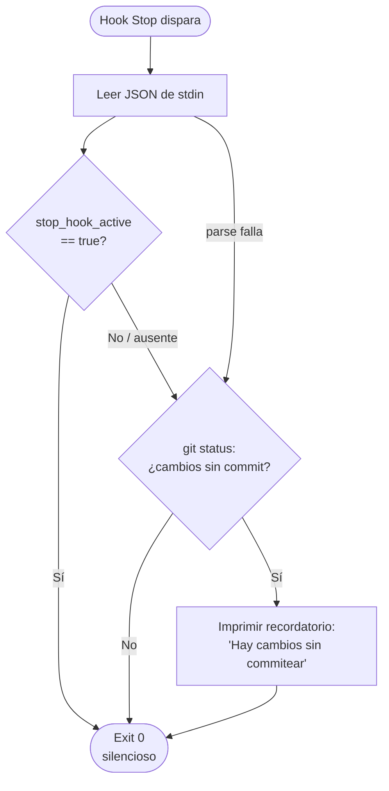
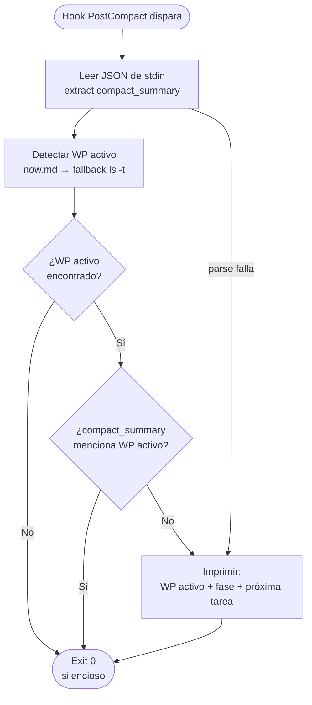
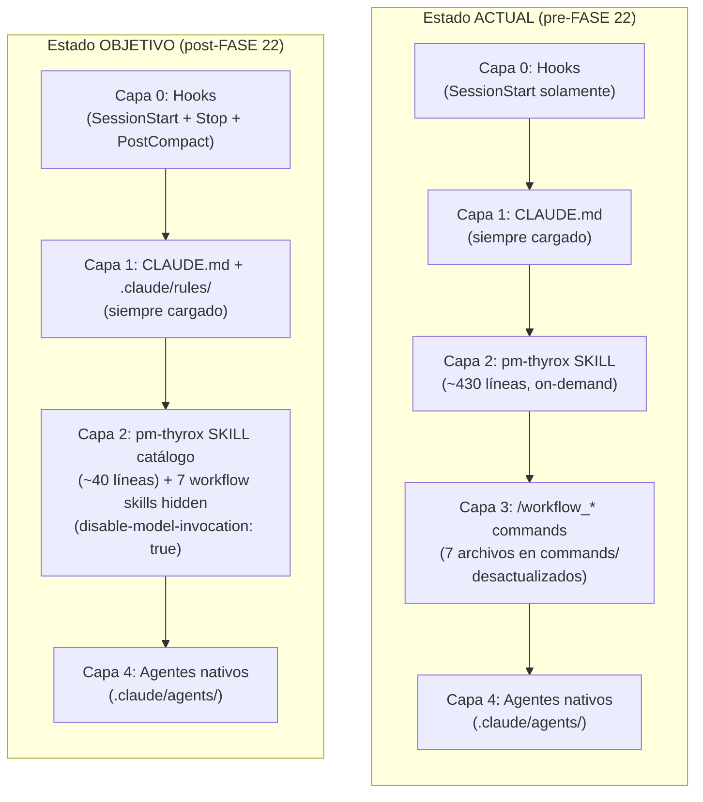
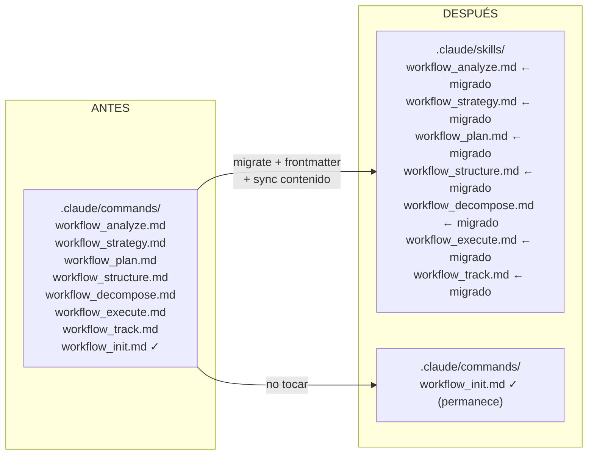

```yml
type: Design
work_package: 2026-04-08-17-04-20-framework-evolution
created_at: 2026-04-08 20:00:00
phase: Phase 4 — STRUCTURE
status: Draft
```

# Design — FASE 22: Framework Evolution

## 1. Visión General

FASE 22 realiza tres tipos de cambios arquitectónicos sobre la infraestructura de pm-thyrox:

1. **Hooks nuevos (Capa 0):** Dos scripts nuevos + actualización de settings.json
2. **Correcciones documentales (Capa 1):** ADR-015 Addendum + skill-vs-agent.md + ADR-016
3. **Migración de Capa 3 → Capa 2:** 7 workflow commands → skills hidden

---

## 2. Decisiones Arquitectónicas

### DA-001: stop-hook-git-check.sh lee JSON de stdin

**Contexto:** El hook Stop recibe input JSON por stdin. Hay dos opciones para parsear: `jq` (limpio pero depende de instalación) o `python3 -c` (disponible universalmente en el entorno).

**Decisión:** `python3 -c "import json,sys; d=json.load(sys.stdin)..."` como parser primario. Fallback a `grep` si python3 no está disponible.

**Consecuencias positivas:** Sin dependencia externa. **Negativas:** Ligeramente más verbose.

---

### DA-002: session-resume.sh reutiliza lógica de detección de WP, no hace source de session-start.sh

**Contexto:** Ambos scripts necesitan detectar el WP activo y leer `now.md`. Opciones: (A) duplicar la lógica, (B) extraer función compartida, (C) hacer source de session-start.sh.

**Decisión:** Duplicar la lógica mínima (15-20 líneas). `session-start.sh` produce output no deseado si se hace source. Extraer una función compartida es útil pero agrega complejidad.

**Consecuencias:** Leve duplicación. Aceptable dado el bajo volumen de código.

---

### DA-003: workflow_init.md permanece en commands/

**Contexto:** TD-008 menciona "7 commands". `workflow_init.md` es el 8vo archivo en commands/. Su función es inicializar tech skills, no ejecutar una fase del SDLC.

**Decisión:** `workflow_init.md` queda en `.claude/commands/`. Solo los 7 archivos de fase migran a skills.

**Consecuencias:** commands/ no queda vacío post-migración. Arquitectura mixta temporal hasta que workflow_init tenga caso de uso para migrar.

---

### DA-004: Frontmatter de skills migrados

**Contexto:** Los skills migrados necesitan frontmatter YAML. El hook de frontmatter debe actualizar `now.md::phase` con `once: true`.

**Decisión:** Estructura de frontmatter:

```yaml
---
description: /workflow_analyze — Phase 1: ANALYZE. Inicia o retoma análisis del work package activo.
disable-model-invocation: true
hooks:
  - event: UserPromptSubmit
    once: true
    type: command
    command: "echo 'phase: Phase 1' >> .claude/context/now.md"
---
```

**Nota:** El evento exacto para actualizar `now.md` al invocar un skill debe verificarse en el spike (SPEC-C01). El evento `UserPromptSubmit` dispara cuando el usuario invoca el skill — es el más apropiado para registrar la fase activa.

---

## 3. Componentes Afectados

### 3.1 Componentes Nuevos

| Componente | Ubicación | Propósito |
|------------|-----------|-----------|
| `stop-hook-git-check.sh` | `.claude/skills/pm-thyrox/scripts/` | Hook Stop — verifica uncommitted changes |
| `session-resume.sh` | `.claude/skills/pm-thyrox/scripts/` | Hook PostCompact — re-inyecta contexto condicional |
| `adr-016.md` | `.claude/context/decisions/` | Decisión commands → skills hidden |
| `context.md.template` | `.claude/skills/pm-thyrox/assets/` | Template END USER CONTEXT |
| `workflow_analyze.md` (en skills/) | `.claude/skills/` | Skill migrado de Phase 1 |
| `workflow_strategy.md` (en skills/) | `.claude/skills/` | Skill migrado de Phase 2 |
| `workflow_plan.md` (en skills/) | `.claude/skills/` | Skill migrado de Phase 3 |
| `workflow_structure.md` (en skills/) | `.claude/skills/` | Skill migrado de Phase 4 |
| `workflow_decompose.md` (en skills/) | `.claude/skills/` | Skill migrado de Phase 5 |
| `workflow_execute.md` (en skills/) | `.claude/skills/` | Skill migrado de Phase 6 |
| `workflow_track.md` (en skills/) | `.claude/skills/` | Skill migrado de Phase 7 |

### 3.2 Componentes Modificados

| Componente | Ubicación | Cambios |
|------------|-----------|---------|
| `settings.json` | `.claude/` | +Stop hook, +PostCompact hook |
| `session-start.sh` | `.claude/skills/pm-thyrox/scripts/` | `COMMANDS_SYNCED=false → true` (línea 13) |
| `adr-015.md` | `.claude/context/decisions/` | +Addendum 2026-04-08 (5 correcciones) |
| `skill-vs-agent.md` | `.claude/skills/pm-thyrox/references/` | +3 actualizaciones (triggering, hooks, agent teams) |
| `SKILL.md` | `.claude/skills/pm-thyrox/` | +Step 0 Phase 1, +checklist Phase 5, reducción post-C03 |

### 3.3 Componentes Deprecados

| Componente | Ubicación | Razón | Plan |
|------------|-----------|-------|------|
| `workflow_analyze.md` (en commands/) | `.claude/commands/` | Migrado a skills/ | Eliminar post-spike exitoso |
| `workflow_strategy.md` (en commands/) | `.claude/commands/` | Migrado a skills/ | Eliminar |
| `workflow_plan.md` (en commands/) | `.claude/commands/` | Migrado a skills/ | Eliminar |
| `workflow_structure.md` (en commands/) | `.claude/commands/` | Migrado a skills/ | Eliminar |
| `workflow_decompose.md` (en commands/) | `.claude/commands/` | Migrado a skills/ | Eliminar |
| `workflow_execute.md` (en commands/) | `.claude/commands/` | Migrado a skills/ | Eliminar |
| `workflow_track.md` (en commands/) | `.claude/commands/` | Migrado a skills/ | Eliminar |

---

## 4. Estructura de Archivos

```
.claude/
├── settings.json               MODIFICADO (+Stop, +PostCompact)
├── commands/
│   └── workflow_init.md        SIN CAMBIOS (no es un skill de fase)
│   └── workflow_analyze.md     ELIMINADO (migrado)
│   └── workflow_strategy.md    ELIMINADO (migrado)
│   └── workflow_plan.md        ELIMINADO (migrado)
│   └── workflow_structure.md   ELIMINADO (migrado)
│   └── workflow_decompose.md   ELIMINADO (migrado)
│   └── workflow_execute.md     ELIMINADO (migrado)
│   └── workflow_track.md       ELIMINADO (migrado)
├── context/
│   └── decisions/
│       ├── adr-015.md          MODIFICADO (+Addendum)
│       └── adr-016.md          NUEVO
└── skills/
    ├── pm-thyrox/
    │   ├── SKILL.md            MODIFICADO (+Step0, +checklist, reducción)
    │   ├── assets/
    │   │   └── context.md.template  NUEVO
    │   ├── references/
    │   │   └── skill-vs-agent.md    MODIFICADO (+3 actualizaciones)
    │   └── scripts/
    │       ├── session-start.sh     MODIFICADO (COMMANDS_SYNCED=true)
    │       ├── session-resume.sh    NUEVO
    │       └── stop-hook-git-check.sh NUEVO
    ├── workflow_analyze.md     NUEVO (migrado de commands/)
    ├── workflow_strategy.md    NUEVO (migrado de commands/)
    ├── workflow_plan.md        NUEVO (migrado de commands/)
    ├── workflow_structure.md   NUEVO (migrado de commands/)
    ├── workflow_decompose.md   NUEVO (migrado de commands/)
    ├── workflow_execute.md     NUEVO (migrado de commands/)
    └── workflow_track.md       NUEVO (migrado de commands/)
```

---

## 5. Flujos de Datos

### 5.1 Flujo: stop-hook-git-check.sh



### 5.2 Flujo: session-resume.sh (PostCompact)



### 5.3 Arquitectura 5 capas: Estado actual vs objetivo



### 5.4 Migración workflow commands → skills



---

## 6. Interfaces y Contratos

### 6.1 Contrato: stop-hook-git-check.sh

```
Input:  JSON via stdin
        { "hook_event_name": "Stop",
          "stop_hook_active": bool,
          "last_assistant_message": string }
Output: stdout (recordatorio si aplica) | nada
Código: exit 0 siempre (nunca bloquear)
Garantía: Si stop_hook_active=true → exit silencioso (previene loop)
```

### 6.2 Contrato: session-resume.sh

```
Input:  JSON via stdin
        { "hook_event_name": "PostCompact",
          "compact_summary": string }
Output: stdout (contexto re-inyectado si necesario) | nada
Código: exit 0 siempre
Garantía: Si compact_summary menciona WP activo → exit silencioso (no duplica)
```

### 6.3 Contrato: skill migrado (workflow_*.md)

```
Invocación: /<nombre> por el usuario (user-invocable)
Context cost: 0 (disable-model-invocation: true)
Side effect: hook actualiza now.md::phase con once:true
Contenido: lógica completa de la fase (sincronizada con SKILL.md)
```

---

## 7. Impacto

### 7.1 Breaking Changes

| Cambio | Afecta a | Acción requerida |
|--------|----------|-----------------|
| `workflow_*.md` eliminados de commands/ | Usuarios con `/workflow_*` en memoria muscular | Ninguna — UX idéntica desde skills/ |
| pm-thyrox SKILL reducido | Sesiones que invocan pm-thyrox como fuente de lógica de fase | Usar `/workflow_*` (Ruta B, ya no [outdated]) |

### 7.2 Backward Compatibility

- [x] Invocación `/<name>` para el usuario es idéntica (verificado en spike SPEC-C01)
- [x] `session-start.sh` mantiene estructura — solo cambia flag
- [x] ADR-015 Status permanece "Accepted" — addendum no rompe nada

---

## 8. Plan de Rollback

### Si spike SPEC-C01 falla

1. No migrar los 7 archivos
2. Mantener commands/ sin cambios
3. Adaptar SPEC-C03: sincronizar contenido in-place en commands/
4. No crear ADR-016 (la decisión no se tomó)
5. SPEC-C02, SPEC-C05, SPEC-C06 cancelados

### Si hooks no funcionan en producción

1. Eliminar entradas de Stop/PostCompact de settings.json
2. Sistema vuelve al estado previo automáticamente

---

## 9. Validación

| Aspecto | Cómo se valida |
|---------|---------------|
| stop-hook no causa loop | Invocar Claude → Claude responde → verificar que el hook no dispara segunda respuesta |
| PostCompact re-inyecta solo cuando necesario | Simular compactación → verificar output condicional |
| `/<name>` funciona desde skills | Spike SPEC-C01 |
| COMMANDS_SYNCED flag funciona | Session start muestra Ruta B sin [outdated] |
| pm-thyrox SKILL reducido es suficiente | Sesión de prueba con SKILL catálogo — verificar que /workflow_* proveen la lógica |
