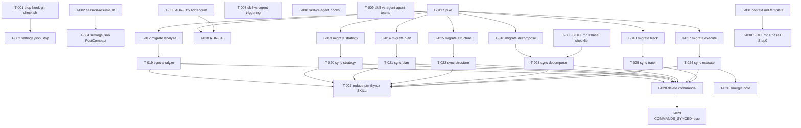

```yml
type: Task Plan
work_package: 2026-04-08-17-04-20-framework-evolution
created_at: 2026-04-08 21:00:00
phase: Phase 5 — DECOMPOSE
total_tasks: 31
status: Aprobado — 2026-04-08
```

# Task Plan — FASE 22: Framework Evolution

## DAG de Dependencias



---

## Fases de Ejecución

### Sesión 1 — Bloque E + B (5 tareas, micro)

- [x] [T-001] Crear `.claude/skills/pm-thyrox/scripts/stop-hook-git-check.sh` con verificación `stop_hook_active` (SPEC-E01)
- [x] [T-002] Crear `.claude/skills/pm-thyrox/scripts/session-resume.sh` con lógica PostCompact condicional (SPEC-E02)
- [x] [T-003] Actualizar `.claude/settings.json` — añadir entrada `Stop` hook (SPEC-E03)
- [x] [T-004] Actualizar `.claude/settings.json` — añadir entrada `PostCompact` hook (SPEC-E03)
- [x] [T-005] Actualizar `.claude/skills/pm-thyrox/SKILL.md` — añadir checklist atomicidad en sección Phase 5 DECOMPOSE (SPEC-B01)

**Checkpoint S1:** `stop-hook-git-check.sh` existe + `session-resume.sh` existe + `settings.json` tiene 3 hooks + SKILL.md Phase 5 tiene checklist. Verificar con `ls scripts/` y `cat settings.json`.

---

### Sesión 2 — Bloque A (4 tareas, docs)

- [x] [T-006] Actualizar `.claude/context/decisions/adr-015.md` — añadir sección "Addendum 2026-04-08" con 5 correcciones (SPEC-A01)
- [x] [T-007] Actualizar `.claude/skills/pm-thyrox/references/skill-vs-agent.md` — actualizar tabla de triggering con 3 modos (SPEC-A02)
- [x] [T-008] Actualizar `.claude/skills/pm-thyrox/references/skill-vs-agent.md` — actualizar sección de hooks con 4 tipos (SPEC-A02)
- [x] [T-009] Actualizar `.claude/skills/pm-thyrox/references/skill-vs-agent.md` — añadir Agent teams como 4ta categoría (SPEC-A02)

**Checkpoint S2:** ADR-015 tiene Addendum + skill-vs-agent.md tiene 3 actualizaciones. Verificar con `grep "Addendum" adr-015.md`. ADR-016 se crea en Sesión 3 (post-spike).

---

### Sesión 3 — Bloque C: Spike + ADR-016 + Migración (9 tareas)

- [x] [T-011] Spike: crear `.claude/skills/workflow_spike_test.md` con `disable-model-invocation: true`, verificar invocación `/<name>` y que el hook en frontmatter dispara correctamente (DA-004: confirmar evento `UserPromptSubmit` u alternativo), eliminar el archivo de prueba, documentar resultado en `execution-log` del WP (SPEC-C01)

> **Gate T-011:** Si el spike falla, detener Bloque C y notificar al usuario. Activar fallback (mantener commands/, solo sincronizar contenido in-place). T-010 y T-012..T-029 se cancelan. Revisar design.md §8 para el procedimiento completo.

- [x] [T-010] Crear `.claude/context/decisions/adr-016.md` — decisión commands→skills hidden (contexto H-NEW-2+H-SCHED-1, opciones, decisión, implicación tabla 5 capas, criterio de revisión) (SPEC-A03)

- [x] [T-012] [P] Crear `.claude/skills/workflow_analyze.md` — frontmatter + `disable-model-invocation: true` + hook `once:true` (evento verificado en T-011) + contenido actual de commands/ (SPEC-C02)
- [x] [T-013] [P] Crear `.claude/skills/workflow_strategy.md` — frontmatter + `disable-model-invocation: true` + hook `once:true` (evento verificado en T-011) + contenido actual de commands/ (SPEC-C02)
- [x] [T-014] [P] Crear `.claude/skills/workflow_plan.md` — frontmatter + `disable-model-invocation: true` + hook `once:true` (evento verificado en T-011) + contenido actual de commands/ (SPEC-C02)
- [x] [T-015] [P] Crear `.claude/skills/workflow_structure.md` — frontmatter + `disable-model-invocation: true` + hook `once:true` (evento verificado en T-011) + contenido actual de commands/ (SPEC-C02)
- [x] [T-016] [P] Crear `.claude/skills/workflow_decompose.md` — frontmatter + `disable-model-invocation: true` + hook `once:true` (evento verificado en T-011) + contenido actual de commands/ (SPEC-C02)
- [x] [T-017] [P] Crear `.claude/skills/workflow_execute.md` — frontmatter + `disable-model-invocation: true` + hook `once:true` (evento verificado en T-011) + contenido actual de commands/ (SPEC-C02)
- [x] [T-018] [P] Crear `.claude/skills/workflow_track.md` — frontmatter + `disable-model-invocation: true` + hook `once:true` (evento verificado en T-011) + contenido actual de commands/ (SPEC-C02)

**Checkpoint S3:** ADR-016 existe (`ls decisions/adr-016.md`). `ls .claude/skills/workflow_*.md` muestra 7 archivos. Cada uno tiene `disable-model-invocation: true` en su frontmatter. Evento de hook confirmado (DA-004).

---

### Sesión 4 — Bloque C: Sync contenido parte 1 (4 tareas, batch)

- [x] [T-019] [P] Actualizar `.claude/skills/workflow_analyze.md` — reemplazar cuerpo con lógica Phase 1 actual (contexto sesión, 8 aspectos, exit criteria, stopping point manifest) + actualizar `updated_at` en frontmatter (SPEC-C03)
- [x] [T-020] [P] Actualizar `.claude/skills/workflow_strategy.md` — reemplazar cuerpo con lógica Phase 2 actual (key ideas, research, decisiones, pre/post check) + actualizar `updated_at` en frontmatter (SPEC-C03)
- [x] [T-021] [P] Actualizar `.claude/skills/workflow_plan.md` — reemplazar cuerpo con lógica Phase 3 actual (scope, in-scope, out-of-scope, estimación, validación archivos existentes) + actualizar `updated_at` en frontmatter (SPEC-C03)
- [x] [T-022] [P] Actualizar `.claude/skills/workflow_structure.md` — reemplazar cuerpo con lógica Phase 4 actual (complejidad, spec/design, checklist) + actualizar `updated_at` en frontmatter (SPEC-C03)

**Checkpoint S4:** Los 4 skills tienen contenido actualizado. Verificar que cada uno tiene sección "Exit criteria" y referencia al siguiente workflow.

---

### Sesión 5 — Bloque C: Sync contenido parte 2 (3 tareas, batch)

- [x] [T-023] [P] Actualizar `.claude/skills/workflow_decompose.md` — reemplazar cuerpo con lógica Phase 5 actual (DAG, tareas atómicas, checklist atomicidad de T-005, aprobación usuario) + actualizar `updated_at` en frontmatter (SPEC-C03)
- [x] [T-024] [P] Actualizar `.claude/skills/workflow_execute.md` — reemplazar cuerpo con lógica Phase 6 actual (gates async, state-management now.md, stopping points, async gates) + actualizar `updated_at` en frontmatter (SPEC-C03)
- [x] [T-025] [P] Actualizar `.claude/skills/workflow_track.md` — reemplazar cuerpo con lógica Phase 7 actual (lecciones aprendidas, CHANGELOG, ROADMAP, cierre de FASE, now.md → complete) + actualizar `updated_at` en frontmatter (SPEC-C03)

**Checkpoint S5:** Los 7 skills tienen contenido completo y actualizado. Cada uno tiene `updated_at` en frontmatter.

---

### Sesión 6 — Bloque C: Finalización (4 tareas)

- [x] [T-026] Actualizar `.claude/skills/workflow_execute.md` — añadir nota de sinergia `/loop 10m /workflow_execute` al final del archivo (SPEC-C07)
- [~] [T-027] DIFERIDO — Actualizar `.claude/skills/pm-thyrox/SKILL.md` — reducir a catálogo ~40 líneas (SPEC-C04) — bloqueado por TD-019 (estructura flat vs subdirectorio), TD-021 (Phase N → /workflow_* mapeo), TD-022 (limitaciones), TD-023 (references). Mover a FASE 23.
- [x] [T-028] Eliminar los 7 archivos de `.claude/commands/`: `workflow_analyze.md`, `workflow_strategy.md`, `workflow_plan.md`, `workflow_structure.md`, `workflow_decompose.md`, `workflow_execute.md`, `workflow_track.md` (SPEC-C05)
- [x] [T-029] Actualizar `.claude/skills/pm-thyrox/scripts/session-start.sh` línea 13 — cambiar `COMMANDS_SYNCED=false` → `COMMANDS_SYNCED=true` (SPEC-C06)

**Checkpoint S6:** `ls .claude/commands/` muestra solo `workflow_init.md`. `session-start.sh` línea 13 = `COMMANDS_SYNCED=true`. pm-thyrox SKILL.md ≤80 líneas.

---

### Sesión 7 — Bloque D (2 tareas)

- [x] [T-031] Crear `.claude/skills/pm-thyrox/assets/context.md.template` — template para documentar END USER CONTEXT al inicio de cada WP (secciones: END USER, cadena de requisitos, restricciones relevantes) (SPEC-D02)
- [x] [T-030] Actualizar `.claude/skills/pm-thyrox/SKILL.md` — añadir Step 0 END USER CONTEXT al inicio de la sección Phase 1 ANALYZE, incluyendo referencia a `context.md.template` (SPEC-D01)

**Checkpoint S7:** `assets/context.md.template` existe. SKILL.md Phase 1 tiene Step 0 antes de los 8 aspectos con referencia al template.

---

## Cobertura SPEC → Task

| SPEC | Tareas | Cobertura |
|------|--------|-----------|
| SPEC-E01 | T-001 | ✓ |
| SPEC-E02 | T-002 | ✓ |
| SPEC-E03 | T-003, T-004 | ✓ |
| SPEC-B01 | T-005 | ✓ |
| SPEC-A01 | T-006 | ✓ |
| SPEC-A02 | T-007, T-008, T-009 | ✓ |
| SPEC-A03 | T-010 | ✓ |
| SPEC-C01 | T-011 | ✓ |
| SPEC-C02 | T-012..T-018 | ✓ |
| SPEC-C03 | T-019..T-025 | ✓ |
| SPEC-C04 | T-027 | ✓ |
| SPEC-C05 | T-028 | ✓ |
| SPEC-C06 | T-029 | ✓ |
| SPEC-C07 | T-026 | ✓ |
| SPEC-D01 | T-030 | ✓ |
| SPEC-D02 | T-031 | ✓ |

**Cobertura: 16/16 SPECs cubiertos — 31 tareas atómicas**

---

## Checklist de Atomicidad (SPEC-B01 aplicado)

- [x] Cada tarea toca exactamente 1 ubicación (1 archivo O 1 sección de 1 archivo)
- [x] Ninguna descripción de tarea contiene "y" conectando dos operaciones distintas
- [x] Cada tarea puede commitearse y marcarse [x] de forma independiente

*Nota: T-011 (spike) crea + verifica (invocación + hook event) + documenta + elimina — es una única operación de validación que produce un resultado binario (pass/fail). Es atómica en su propósito.*

*Nota T-019..T-025: actualizar `updated_at` en frontmatter es parte de la misma operación de actualización del archivo — no es una operación separada. 1 archivo, 1 commit.*

---

## Estado de Aprobación

- [x] Task-plan aprobado por usuario — 2026-04-08
