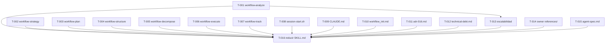

```yml
type: Task Plan
work_package: 2026-04-08-23-55-52-workflow-restructure
created_at: 2026-04-09 01:15:00
updated_at: 2026-04-09 01:15:00
phase: Phase 5 — DECOMPOSE
total_tasks: 16
completed: 16
```

# Task Plan: workflow-restructure (FASE 23)

## DAG de dependencias



**Regla crítica:** T-016 (S-01) NO puede iniciar hasta que T-001..T-015 estén `[x]`.
T-014 y T-015 son independientes — pueden ejecutarse en cualquier momento.
T-013 requiere T-001 completado.

---

## Fases de ejecución

### Fase A — Bloque M (paralelo, 7 tareas)
Crear 7 subdirectorios. Todas paralelas entre sí.

### Fase B — Bloque R (paralelo, 5 tareas) + TD-02/TD-03 (independientes)
Actualizar referencias externas. Puede ejecutarse en paralelo con Fase A o después.

### Fase C — T-013 (post T-001)
Secuencial: T-013 requiere T-001 completado. T-014 y T-015 son independientes (Fase B).

### Fase D — S-01 (post todo lo anterior)
Reducción SKILL.md. Única tarea, ejecutar último.

---

## Tareas

### BLOQUE M — Migración

- [x] [T-001] Crear `.claude/skills/workflow-analyze/SKILL.md` (frontmatter oficial + H1 y refs internas actualizadas) y eliminar `.claude/skills/workflow_analyze.md` (SPEC-M-01) [P]
- [x] [T-002] Crear `.claude/skills/workflow-strategy/SKILL.md` (frontmatter oficial + H1 y refs internas actualizadas) y eliminar `.claude/skills/workflow_strategy.md` (SPEC-M-02) [P]
- [x] [T-003] Crear `.claude/skills/workflow-plan/SKILL.md` (frontmatter oficial + H1 y refs internas actualizadas) y eliminar `.claude/skills/workflow_plan.md` (SPEC-M-03) [P]
- [x] [T-004] Crear `.claude/skills/workflow-structure/SKILL.md` (frontmatter oficial + H1 y refs internas actualizadas) y eliminar `.claude/skills/workflow_structure.md` (SPEC-M-04) [P]
- [x] [T-005] Crear `.claude/skills/workflow-decompose/SKILL.md` (frontmatter oficial + H1 y refs internas actualizadas) y eliminar `.claude/skills/workflow_decompose.md` (SPEC-M-05) [P]
- [x] [T-006] Crear `.claude/skills/workflow-execute/SKILL.md` (frontmatter oficial + H1, refs internas y sección /loop actualizadas) y eliminar `.claude/skills/workflow_execute.md` (SPEC-M-06) [P]
- [x] [T-007] Crear `.claude/skills/workflow-track/SKILL.md` (frontmatter oficial + H1 actualizado) y eliminar `.claude/skills/workflow_track.md` (SPEC-M-07) [P]

### BLOQUE R — Referencias

- [x] [T-008] Actualizar `session-start.sh`: función `_phase_to_command()` (8 refs) + línea 82 + comentarios líneas 10-11 (SPEC-R-01) [P]
- [x] [T-009] Actualizar `CLAUDE.md`: addendum Locked Decision #5 con naming FASE 23 (SPEC-R-02) [P]
- [x] [T-010] Actualizar `commands/workflow_init.md`: línea 108 `/workflow_analyze` → `/workflow-analyze` (SPEC-R-03) [P]
- [x] [T-011] Actualizar `adr-016.md`: añadir sección `## Addendum — FASE 23` al final (SPEC-R-04) [P]
- [x] [T-012] Actualizar `technical-debt.md`: refs target en TD-019..023 (SPEC-R-05) [P]

### BLOQUE TD — Deuda técnica

- [x] [T-013] Añadir sección `## Escalabilidad` a `workflow-analyze/SKILL.md` (SPEC-TD-01) — requiere T-001
- [x] [T-014] Añadir `owner:` al frontmatter de 24 archivos en `references/` (SPEC-TD-02) [P]
- [x] [T-015] Actualizar `agent-spec.md`: `model` Opcional, `tools` Opcional, nota corrección (SPEC-TD-03) [P]

### BLOQUE S — Reducción SKILL.md

- [x] [T-016] Reducir `pm-thyrox/SKILL.md` de ~471 a ≤150 líneas: eliminar Limitaciones + Las 7 Fases, reemplazar con Catálogo de fases (SPEC-S-01) — requiere T-001..T-015

---

## Cobertura SPEC → Task

| SPEC | Task | Descripción |
|------|------|-------------|
| SPEC-M-01 | T-001 | workflow-analyze migration |
| SPEC-M-02 | T-002 | workflow-strategy migration |
| SPEC-M-03 | T-003 | workflow-plan migration |
| SPEC-M-04 | T-004 | workflow-structure migration |
| SPEC-M-05 | T-005 | workflow-decompose migration |
| SPEC-M-06 | T-006 | workflow-execute migration |
| SPEC-M-07 | T-007 | workflow-track migration |
| SPEC-R-01 | T-008 | session-start.sh |
| SPEC-R-02 | T-009 | CLAUDE.md |
| SPEC-R-03 | T-010 | workflow_init.md |
| SPEC-R-04 | T-011 | adr-016.md |
| SPEC-R-05 | T-012 | technical-debt.md |
| SPEC-TD-01 | T-013 | escalabilidad en workflow-analyze |
| SPEC-TD-02 | T-014 | owner en references/ |
| SPEC-TD-03 | T-015 | agent-spec.md |
| SPEC-S-01 | T-016 | reducir SKILL.md |

## Checklist de atomicidad

- [x] Cada tarea toca exactamente 1 archivo (o 1 subdirectorio nuevo)
- [x] Ninguna descripción contiene "y" conectando dos operaciones distintas
- [x] Cada tarea puede commitearse y marcarse [x] de forma independiente

*Nota T-014: 24 archivos en un único directorio — todos con la misma operación (añadir `owner:`).
Se tratan como un commit atómico al ser la misma operación repetida sobre el mismo directorio.*
