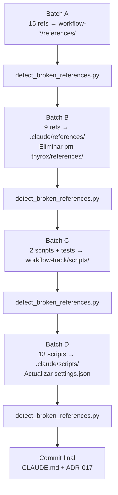

```yml
created_at: 2026-04-09 06:50:00
project: THYROX
feature: skill-references-restructure
design_version: 1.0
designer: Claude
components: 5
status: Completo
```

# Design — FASE 24: skill-references-restructure

## Propósito

Documentar CÓMO implementar arquitectónicamente la redistribución de 24 referencias y 20 scripts.
Decisiones de diseño, estructura de directorios final, contratos de links entre archivos.

> Basado en: skill-references-restructure-solution-strategy.md (Phase 2) + requirements-spec.md (Phase 4)

---

## 1. Visión General

La migración sigue el patrón **Atomic Batch Commit**: cada grupo de archivos se mueve con `git mv`
y sus links externos se actualizan en el MISMO commit. El repositorio siempre está en estado
consistente — nunca hay un commit intermedio con links rotos.



---

## 2. Decisiones Arquitectónicas

### DA-001: git mv para preservar historial

**Contexto:** Mover archivos entre directorios puede perder el historial de cambios.
**Decisión:** Usar `git mv` (no `cp` + `rm`). Permite `git log --follow` en la nueva ubicación.
**Alternativas descartadas:**
- `cp` + `rm`: pierde historial — rechazado
- Borrar y recrear: pierde historial — rechazado
**Consecuencias:** `git log --follow .claude/references/conventions.md` muestra toda la historia desde `pm-thyrox/references/conventions.md`.

---

### DA-002: Atomicidad por batch (git mv + link updates en mismo commit)

**Contexto:** Si se mueve un archivo y se actualiza el link en commits separados, hay un estado intermedio con links rotos.
**Decisión:** Cada commit incluye: `git mv` + todos los `Edit` de links que apuntan al archivo movido.
**Consecuencias:** Los commits son más grandes pero el repo siempre es válido. `git revert` de cualquier commit deja el repo consistente.

---

### DA-003: Orden de batches — referencias primero, scripts después

**Contexto:** Los scripts de Batch D incluyen hooks activos en settings.json. Si se mueven primero, los hooks fallan durante la migración.
**Decisión:** Batch A → B → C → D. Scripts en el último batch minimizan el tiempo de riesgo.
**Consecuencias:** `detect_broken_references.py` sigue disponible en su ubicación original durante todo Batch A-C. Se mueve en Batch D (el último).

---

### DA-004: Tres niveles de artefactos

**Contexto:** Los 24 archivos de pm-thyrox/references/ tienen 3 tipos distintos de ownership.
**Decisión:**

| Nivel | Directorio | Criterio |
|-------|-----------|---------|
| Fase específica | `workflow-*/references/` | Solo útil durante una fase del SDLC |
| Global proyecto | `.claude/references/` | Útil en cualquier proyecto Claude Code |
| Infraestructura | `.claude/scripts/` | Scripts de hooks y utilidades de Claude Code |

**Consecuencias:** pm-thyrox deja de ser un "monolito de referencias" — cada skill es autocontenido.

---

## 3. Componentes Afectados

### 3.1 Nuevos Componentes

| Componente | Ubicación | Propósito |
|-----------|-----------|----------|
| `.claude/references/` | `.claude/references/` | Referencias globales de plataforma Claude Code |
| `.claude/scripts/` | `.claude/scripts/` | Scripts de infraestructura del proyecto |
| workflow-analyze/references/ | `.claude/skills/workflow-analyze/references/` | Referencias propias de Phase 1 |
| workflow-execute/references/ | `.claude/skills/workflow-execute/references/` | Referencias propias de Phase 6 |
| workflow-strategy/references/ | `.claude/skills/workflow-strategy/references/` | Referencias propias de Phase 2 |
| workflow-structure/references/ | `.claude/skills/workflow-structure/references/` | Referencias propias de Phase 4 |
| workflow-track/references/ | `.claude/skills/workflow-track/references/` | Referencias propias de Phase 7 |
| workflow-track/scripts/ | `.claude/skills/workflow-track/scripts/` | Scripts propios de Phase 7 |
| ADR-017 | `.claude/context/decisions/` | Decisión arquitectónica — 3 niveles |

### 3.2 Componentes Modificados

| Componente | Ubicación | Cambios |
|-----------|-----------|--------|
| settings.json | `.claude/settings.json` | 3 paths de hooks → `.claude/scripts/` |
| pm-thyrox/SKILL.md | `.claude/skills/pm-thyrox/SKILL.md` | Links a refs globales → `../../references/` |
| workflow-track/SKILL.md | `.claude/skills/workflow-track/SKILL.md` | 4 paths de scripts → workflow-track/scripts/ y .claude/scripts/ |
| agent-spec.md | `.claude/references/agent-spec.md` | Path lint-agents.py → `.claude/scripts/` |
| reference-validation.md | `workflow-track/references/reference-validation.md` | 5 paths → `.claude/scripts/` |
| state-management.md | `.claude/references/state-management.md` | 4 paths → `.claude/scripts/` + workflow-track/scripts/ |
| run-all-tests.sh | `pm-thyrox/scripts/tests/run-all-tests.sh` | Path test-phase-readiness.sh → workflow-track/scripts/tests/ |
| CLAUDE.md | `.claude/CLAUDE.md` | `## Estructura` con 9 dirs reales |

### 3.3 Componentes Eliminados

| Componente | Ubicación | Razón |
|-----------|-----------|------|
| pm-thyrox/references/ | `.claude/skills/pm-thyrox/references/` | Todos los 24 archivos redistribuidos — verificado vacío |

---

## 4. Contratos de Links

### Patrón 1: Skill → sus propias references

```markdown
<!-- Dentro de workflow-analyze/SKILL.md -->
[scalability](references/scalability.md)
[introduction](references/introduction.md)
```

### Patrón 2: pm-thyrox/SKILL.md → referencias de otro skill

```markdown
<!-- Dentro de pm-thyrox/SKILL.md -->
[scalability](../workflow-analyze/references/scalability.md)
[commit-convention](../workflow-execute/references/commit-convention.md)
```

### Patrón 3: Cualquier skill → .claude/references/ (globales)

```markdown
<!-- Dentro de .claude/skills/*/SKILL.md -->
[conventions](../../references/conventions.md)
[skill-vs-agent](../../references/skill-vs-agent.md)
```

### Patrón 4: Docs en .claude/references/ → scripts en .claude/scripts/

```markdown
<!-- Dentro de .claude/references/state-management.md -->
bash .claude/scripts/update-state.sh
bash .claude/skills/workflow-track/scripts/validate-session-close.sh
```

### Patrón 5: settings.json → scripts de hooks

```json
{
  "hooks": {
    "SessionStart": [{"hooks": [{"type": "command",
      "command": "bash .claude/scripts/session-start.sh"}]}],
    "Stop": [{"hooks": [{"type": "command",
      "command": "bash .claude/scripts/stop-hook-git-check.sh"}]}],
    "PostCompact": [{"hooks": [{"type": "command",
      "command": "bash .claude/scripts/session-resume.sh"}]}]
  }
}
```

---

## 5. Dependencias

### 5.1 Dependencias entre batches

- Batch B depende de Batch A completado (pm-thyrox/SKILL.md actualizado una vez, no dos)
- Batch C depende de Batch B completado (state-management.md en su nueva ubicación)
- Batch D depende de Batch C completado (validate-session-close.sh ya movido — no aparece en D)
- Commit final depende de Batch D completado (estructura estabilizada)

### 5.2 Dependencia crítica: detect_broken_references.py

Este script valida los links después de cada batch. Está actualmente en `pm-thyrox/scripts/`.
Se mueve en Batch D (el último). Durante Batches A-C-D está disponible en su ubicación original.

**Importante:** Llamar siempre con el path original hasta Batch D:
```bash
python3 .claude/skills/pm-thyrox/scripts/detect_broken_references.py
```
Después de Batch D:
```bash
python3 .claude/scripts/detect_broken_references.py
```

---

## 6. Plan de Rollback

Si un batch falla **antes** del commit: `git checkout .` restaura el estado anterior.
Si un batch ya se commiteó: `git revert HEAD` — deshace el commit atómico completo.

**Garantía:** Como cada commit incluye git mv + link updates juntos, el revert siempre deja el repositorio en estado consistente.

---

## 7. Testing

### Validación automática post-batch

Después de cada commit de batch:
```bash
python3 .claude/skills/pm-thyrox/scripts/detect_broken_references.py  # Batches A-C
python3 .claude/scripts/detect_broken_references.py                    # Batch D en adelante
```

### Validación manual post-Batch D

1. Verificar hooks activos: Iniciar nueva sesión → SessionStart hook ejecuta
2. Verificar git hook: `git commit --allow-empty -m "test"` → commit-msg-hook.sh valida
3. Verificar tests: `bash .claude/skills/pm-thyrox/scripts/tests/run-all-tests.sh`

### Criterios de validación final

- [x] `detect_broken_references.py` pasa sin errores
- [x] `settings.json` tiene 3 paths apuntando a `.claude/scripts/`
- [x] `pm-thyrox/references/` no existe
- [x] Cada `workflow-*/references/` existe con sus archivos
- [x] `.claude/references/` existe con 9 archivos
- [x] `.claude/scripts/` existe con 13 scripts
- [x] `CLAUDE.md ## Estructura` muestra 9 directorios
- [x] ADR-017 existe en `.claude/context/decisions/`

---

## 15. Aprobación

- [ ] Spec + Design aprobados por usuario — PENDIENTE gate Phase 4
