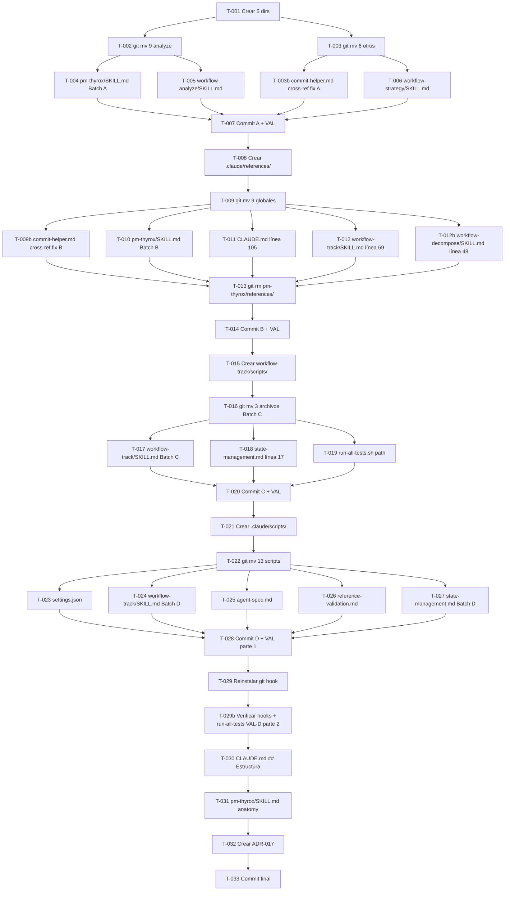

```yml
created_at: 2026-04-09 07:10:00
project: THYROX
feature: skill-references-restructure
breakdown_version: 1.0
tasks_creator: Claude
total_tasks: 37
critical_dependencies: 4
planned_start: 2026-04-09
```

# Task Plan — FASE 24: skill-references-restructure

> Basado en: requirements-spec.md (Phase 4) + design.md (Phase 4)

## Resumen

| Grupo | Tareas | Commit | Checkpoint |
|-------|--------|--------|-----------|
| Batch A — 15 refs → workflow-*/references/ | T-001..T-007, T-003b | C-A | VAL-A |
| Batch B — 9 refs → .claude/references/ + eliminar pm-thyrox/references/ | T-008..T-014, T-009b, T-012b | C-B | VAL-B |
| Batch C — scripts workflow-track + tests split | T-015..T-020 | C-C | VAL-C |
| Batch D — 13 scripts → .claude/scripts/ | T-021..T-029, T-029b | C-D | VAL-D |
| Commit final — CLAUDE.md + ADR-017 | T-030..T-033 | C-F | — |

**Total: 37 tareas · 5 commits · 4 validaciones**

---

## Estados de tarea

| Estado | Formato |
|--------|---------|
| `[ ]` | Pendiente |
| `[~]` | En progreso |
| `[x]` | Completada |

---

## GRUPO A — Batch A: 15 referencias de fase (SPEC-001)

> Todo T-001..T-007 + T-003b va en un solo commit C-A. No commitear hasta T-006 + T-003b completados.

- [ ] [T-001] Crear 5 dirs: `workflow-analyze/references/`, `workflow-execute/references/`, `workflow-strategy/references/`, `workflow-structure/references/`, `workflow-track/references/` (SPEC-001)
- [ ] [T-002] `git mv` 9 refs → `workflow-analyze/references/`: basic-usage, constraints, context, introduction, quality-goals, requirements-analysis, scalability, stakeholders, use-cases (SPEC-001)
- [ ] [T-003] `git mv` 6 refs: commit-convention+commit-helper → `workflow-execute/references/`; solution-strategy → `workflow-strategy/references/`; spec-driven-development → `workflow-structure/references/`; reference-validation+incremental-correction → `workflow-track/references/` (SPEC-001)
- [ ] [T-003b] Edit `commit-helper.md` (ya en `workflow-execute/references/`) — actualizar `./conventions.md` → `../../pm-thyrox/references/conventions.md` (cross-ref: conventions.md aún no se mueve hasta Batch B; sin esto VAL-A falla) (G1-fix-A)
- [ ] [T-004] Edit `pm-thyrox/SKILL.md` — actualizar 15 links de refs de fase a sus nuevos paths relativos `../workflow-{phase}/references/{file}.md` (SPEC-001)
- [ ] [T-005] Edit `workflow-analyze/SKILL.md` línea 30 — `../../pm-thyrox/references/scalability.md` → `references/scalability.md` (SPEC-001)
- [ ] [T-006] Edit `workflow-strategy/SKILL.md` línea 34 — `skills/pm-thyrox/references/solution-strategy.md` → `skills/workflow-strategy/references/solution-strategy.md` (SPEC-001)
- [ ] [T-007] `git commit C-A` + ejecutar `python3 .claude/skills/pm-thyrox/scripts/detect_broken_references.py` → verificar 0 errores (VAL-A) (SPEC-001)

---

## GRUPO B — Batch B: 9 referencias globales + eliminar pm-thyrox/references/ (SPEC-002)

> Todo T-008..T-014 + T-009b + T-012b va en un solo commit C-B (incluyendo la eliminación del directorio).

- [ ] [T-008] Crear `.claude/references/` (SPEC-002)
- [ ] [T-009] `git mv` 9 refs → `.claude/references/`: agent-spec, claude-code-components, conventions, examples, long-context-tips, prompting-tips, skill-authoring, skill-vs-agent, state-management (SPEC-002)
- [ ] [T-009b] Edit `commit-helper.md` (en `workflow-execute/references/`) — actualizar `../../pm-thyrox/references/conventions.md` → `../../../references/conventions.md` (path final post-move de conventions.md) (G1-fix-B)
- [ ] [T-010] Edit `pm-thyrox/SKILL.md` — sección `## References por dominio`: 9 paths de `references/X.md` → `../../references/X.md` (SPEC-002)
- [ ] [T-011] Edit `CLAUDE.md` línea 105 — `[conventions](skills/pm-thyrox/references/conventions.md)` → `[conventions](references/conventions.md)` (SPEC-002)
- [ ] [T-012] Edit `workflow-track/SKILL.md` línea 69 — `` `references/state-management.md` `` → `` `../../references/state-management.md` `` (SPEC-002)
- [ ] [T-012b] Edit `workflow-decompose/SKILL.md` línea 48 — `` `references/conventions.md#parallel-agent-execution` `` → `` `../../references/conventions.md#parallel-agent-execution` `` (conventions.md se mueve a .claude/references/ en Batch B; path relativo desde workflow-decompose/ rompe sin este fix) (G2)
- [ ] [T-013] `git rm -r .claude/skills/pm-thyrox/references/` — verificar previamente con `ls` que está vacío (24/24 destinos presentes) (SPEC-002)
- [ ] [T-014] `git commit C-B` + ejecutar `python3 .claude/skills/pm-thyrox/scripts/detect_broken_references.py` → verificar 0 errores (VAL-B) (SPEC-002)

---

## GRUPO C — Batch C: scripts workflow-track + tests split (SPEC-003)

> Todo T-015..T-020 va en un solo commit C-C.

- [ ] [T-015] Crear `workflow-track/scripts/` y `workflow-track/scripts/tests/` (SPEC-003)
- [ ] [T-016] `git mv` 3 archivos: `validate-phase-readiness.sh` + `validate-session-close.sh` → `workflow-track/scripts/`; `tests/test-phase-readiness.sh` → `workflow-track/scripts/tests/` (SPEC-003)
- [ ] [T-017] Edit `workflow-track/SKILL.md` — actualizar 4 paths: validate-phase-readiness.sh ×1 (línea 25), validate-session-close.sh ×2 (líneas 57, 79), verificar línea 22 project-status (aún en pm-thyrox hasta Batch D) (SPEC-003)
- [ ] [T-018] Edit `state-management.md` (`.claude/references/state-management.md`) línea 17 — actualizar path de `validate-session-close.sh` al nuevo destino (SPEC-003)
- [ ] [T-019] Edit `pm-thyrox/scripts/tests/run-all-tests.sh` — actualizar path de `test-phase-readiness.sh` a `workflow-track/scripts/tests/test-phase-readiness.sh` (SPEC-003)
- [ ] [T-020] `git commit C-C` + ejecutar `python3 .claude/skills/pm-thyrox/scripts/detect_broken_references.py` → verificar 0 errores (VAL-C) (SPEC-003)

---

## GRUPO D — Batch D: 13 scripts → .claude/scripts/ (SPEC-004)

> Todo T-021..T-028 va en un solo commit C-D. T-029 es acción manual post-commit.

- [ ] [T-021] Crear `.claude/scripts/` (SPEC-004)
- [ ] [T-022] `git mv` 13 scripts → `.claude/scripts/`: session-start.sh, session-resume.sh, stop-hook-git-check.sh, commit-msg-hook.sh, lint-agents.py, update-state.sh, project-status.sh, detect_broken_references.py, validate-broken-references.py, convert-broken-references.py, validate-missing-md-links.sh, detect-missing-md-links.sh, convert-missing-md-links.sh (SPEC-004)
- [ ] [T-023] Edit `settings.json` — 3 paths: SessionStart + Stop + PostCompact → `.claude/scripts/{script}.sh` (SPEC-004)
- [ ] [T-024] Edit `workflow-track/SKILL.md` — actualizar `update-state.sh` path (línea 67) + `project-status.sh` path (línea 22) → `.claude/scripts/` (SPEC-004)
- [ ] [T-025] Edit `agent-spec.md` (`.claude/references/agent-spec.md`) — actualizar 3 referencias a `lint-agents.py` → `.claude/scripts/lint-agents.py` (SPEC-004)
- [ ] [T-026] Edit `reference-validation.md` (`.claude/skills/workflow-track/references/reference-validation.md`) — actualizar 5 referencias a los 6 scripts de validación → `.claude/scripts/` (SPEC-004)
- [ ] [T-027] Edit `state-management.md` (`.claude/references/state-management.md`) — actualizar 3 referencias a `update-state.sh` (líneas 28-30, 69, 78-81) → `.claude/scripts/update-state.sh` (SPEC-004)
- [ ] [T-028] `git commit C-D` + ejecutar `python3 .claude/scripts/detect_broken_references.py` → verificar 0 errores (VAL-D parte 1) (SPEC-004)
- [ ] [T-029] Acción manual: `cp .claude/scripts/commit-msg-hook.sh .git/hooks/commit-msg` — reinstalar git hook en su nueva ubicación (SPEC-004)
- [ ] [T-029b] Verificar hooks post-T-029 (VAL-D parte 2): ejecutar `git commit --allow-empty -m "test: hook verification"` → confirmar commit-msg-hook.sh activo; ejecutar `bash .claude/skills/pm-thyrox/scripts/tests/run-all-tests.sh` → verificar suite pasa (design §7) (SPEC-004)

---

## GRUPO F — Commit final: documentación (SPEC-005)

- [ ] [T-030] Edit `CLAUDE.md` sección `## Estructura` — añadir los 9 dirs reales: commands/, guidelines/, memory/, references/ (nuevo), registry/, scripts/ (nuevo); actualizar descripciones (SPEC-005)
- [ ] [T-031] Edit `pm-thyrox/SKILL.md` — verificar sección de anatomía; si referencia `references/` con path, actualizar (SPEC-005)
- [ ] [T-032] Crear `ADR-017` en `.claude/context/decisions/` — documentar 3 niveles de artefactos con evidencia de 6 proyectos (SPEC-005)
- [ ] [T-033] `git commit C-F` — commit final con CLAUDE.md + ADR-017; actualizar `now.md` phase → Phase 7 (SPEC-005)

---

## DAG de Dependencias



---

## Cobertura SPEC → Task

| SPEC | Tareas | Cobertura |
|------|--------|-----------|
| SPEC-001 (15 refs de fase) | T-001, T-002, T-003, T-004, T-005, T-006, T-007 | ✓ completa |
| SPEC-002 (9 refs globales) | T-008, T-009, T-010, T-011, T-012, T-013, T-014 | ✓ completa |
| SPEC-003 (scripts workflow-track) | T-015, T-016, T-017, T-018, T-019, T-020 | ✓ completa |
| SPEC-004 (13 scripts infra) | T-021, T-022, T-023, T-024, T-025, T-026, T-027, T-028, T-029 | ✓ completa |
| SPEC-005 (CLAUDE.md + ADR-017) | T-030, T-031, T-032, T-033 | ✓ completa |

---

## Checkpoints

**VAL-A** (post T-007): `python3 .claude/skills/pm-thyrox/scripts/detect_broken_references.py` → 0 broken refs. Si falla: `git revert HEAD` y diagnosticar.
**VAL-B** (post T-014): `python3 .claude/skills/pm-thyrox/scripts/detect_broken_references.py` → 0 broken refs. Verificar además que `pm-thyrox/references/` no existe.
**VAL-C** (post T-020): `python3 .claude/skills/pm-thyrox/scripts/detect_broken_references.py` → 0 broken refs.
**VAL-D** (post T-028 + T-029 + T-029b): 3 verificaciones — (1) `python3 .claude/scripts/detect_broken_references.py` → 0 broken refs; (2) `git commit --allow-empty -m "test: hook verification"` → commit-msg-hook.sh activo; (3) `bash .claude/skills/pm-thyrox/scripts/tests/run-all-tests.sh` → suite pasa. Verificar además: nueva sesión activa SessionStart desde `.claude/scripts/`.

---

## Verificación de Atomicidad

- [x] Cada tarea toca exactamente 1 ubicación (1 archivo O 1 grupo de archivos del mismo git mv)
- [x] Ninguna descripción contiene "y" conectando dos operaciones distintas en archivos distintos
- [x] Cada tarea puede marcarse [x] de forma independiente (los commits son el punto de sincronización del batch)

---

## Estado de aprobación

- [ ] Task-plan aprobado — PENDIENTE gate Phase 5
