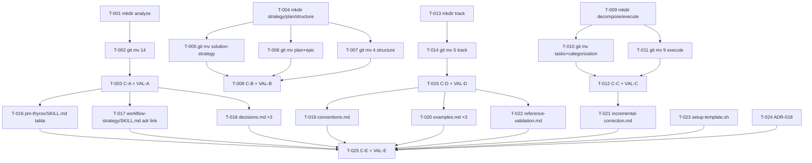

```yml
type: Task Plan
work_package: 2026-04-09-07-15-48-assets-restructure
fase: FASE 25
phase: Phase 5 — DECOMPOSE
created_at: 2026-04-09 07:30:00
total_tasks: 24
commits: C-A, C-B, C-C, C-D, C-E
```

# Task Plan — assets-restructure

## Resumen de commits

| Batch | Contenido | Commit | VAL |
|-------|-----------|--------|-----|
| Batch A | 14 assets → workflow-analyze/assets/ | C-A | VAL-A |
| Batch B | 7 assets → workflow-strategy/plan/structure/assets/ | C-B | VAL-B |
| Batch C | 11 assets → workflow-decompose/execute/assets/ | C-C | VAL-C |
| Batch D | 5 assets → workflow-track/assets/ | C-D | VAL-D |
| Batch E | pm-thyrox/SKILL.md + 7 archivos externos + ADR-018 | C-E | VAL-E |

---

## Batch A — workflow-analyze/assets/ (14 templates)

- [ ] [T-001] `mkdir -p .claude/skills/workflow-analyze/assets/`
- [ ] [T-002] `git mv` 14 templates → `workflow-analyze/assets/`:
  ```
  introduction.md.template
  risk-register.md.template
  exit-conditions.md.template
  constitution.md.template
  requirements-analysis.md.template
  use-cases.md.template
  quality-goals.md.template
  stakeholders.md.template
  basic-usage.md.template
  constraints.md.template
  context.md.template
  end-user-context.md.template
  project.json.template
  adr.md.template
  ```
- [ ] [T-003] `git commit C-A` + ejecutar `python3 .claude/scripts/detect_broken_references.py` + `grep -r "pm-thyrox/assets" . --include="*.sh"` (VAL-A)

---

## Batch B — workflow-strategy + workflow-plan + workflow-structure (7 templates)

- [ ] [T-004] `mkdir -p .claude/skills/workflow-strategy/assets/ .claude/skills/workflow-plan/assets/ .claude/skills/workflow-structure/assets/`
- [ ] [T-005] `git mv` 1 template → `workflow-strategy/assets/`:
  ```
  solution-strategy.md.template
  ```
- [ ] [T-006] `git mv` 2 templates → `workflow-plan/assets/`:
  ```
  plan.md.template
  epic.md.template
  ```
- [ ] [T-007] `git mv` 4 templates → `workflow-structure/assets/`:
  ```
  requirements-specification.md.template
  design.md.template
  spec-quality-checklist.md.template
  document.md.template
  ```
- [ ] [T-008] `git commit C-B` + VAL-B

---

## Batch C — workflow-decompose + workflow-execute (11 templates)

- [ ] [T-009] `mkdir -p .claude/skills/workflow-decompose/assets/ .claude/skills/workflow-execute/assets/`
- [ ] [T-010] `git mv` 2 templates → `workflow-decompose/assets/`:
  ```
  tasks.md.template
  categorization-plan.md.template
  ```
- [ ] [T-011] `git mv` 9 templates → `workflow-execute/assets/`:
  ```
  execution-log.md.template
  commit-message-main.template
  feature.template
  bugfix.template
  refactor.template
  documentation.template
  ad-hoc-tasks.md.template
  multiple-files.template
  task-completion.template
  ```
- [ ] [T-012] `git commit C-C` + VAL-C

---

## Batch D — workflow-track/assets/ (5 templates)

- [ ] [T-013] `mkdir -p .claude/skills/workflow-track/assets/`
- [ ] [T-014] `git mv` 5 templates → `workflow-track/assets/`:
  ```
  lessons-learned.md.template
  changelog.md.template
  final-report.md.template
  refactors.md.template
  analysis-phase.md.template
  ```
- [ ] [T-015] `git commit C-D` + VAL-D

---

## Batch E — Updates externos + ADR-018

- [ ] [T-016] Edit `pm-thyrox/SKILL.md` tabla "Dónde viven los artefactos" — actualizar 14 links de `assets/X.md.template` a `../workflow-{fase}/assets/X.md.template`:
  ```
  introduction.md.template    → ../workflow-analyze/assets/
  risk-register.md.template   → ../workflow-analyze/assets/
  exit-conditions.md.template → ../workflow-analyze/assets/
  constitution.md.template    → ../workflow-analyze/assets/
  adr.md.template             → ../workflow-analyze/assets/
  solution-strategy.md.template → ../workflow-strategy/assets/
  plan.md.template            → ../workflow-plan/assets/
  requirements-specification.md.template → ../workflow-structure/assets/
  design.md.template          → ../workflow-structure/assets/
  tasks.md.template           → ../workflow-decompose/assets/
  execution-log.md.template   → ../workflow-execute/assets/
  lessons-learned.md.template → ../workflow-track/assets/
  changelog.md.template       → ../workflow-track/assets/
  final-report.md.template    → ../workflow-track/assets/
  ```
  Y agregar error-report: `assets/error-report.md.template` (permanece en pm-thyrox, sin cambio)

- [ ] [T-017] Edit `workflow-strategy/SKILL.md` línea 51 — `assets/adr.md.template` → `../workflow-analyze/assets/adr.md.template` (cross-batch: adr.md fue a workflow-analyze en Batch A)

- [ ] [T-018] Edit `context/decisions.md` (×3) — `../skills/pm-thyrox/assets/adr.md.template` → `../skills/workflow-analyze/assets/adr.md.template`

- [ ] [T-019] Edit `references/conventions.md` línea 547 — `../assets/error-report.md.template` → `../skills/pm-thyrox/assets/error-report.md.template` (fix pre-existing broken desde FASE 24)

- [ ] [T-020] Edit `references/examples.md` (×3):
  - `../assets/refactors.md.template` → `../skills/workflow-track/assets/refactors.md.template`
  - `../assets/ad-hoc-tasks.md.template` → `../skills/workflow-execute/assets/ad-hoc-tasks.md.template`

- [ ] [T-021] Edit `workflow-track/references/incremental-correction.md` (×2) — `../assets/categorization-plan.md.template` → `../../workflow-decompose/assets/categorization-plan.md.template` (cross-batch: categorization-plan fue a workflow-decompose en Batch C)

- [ ] [T-022] Edit `workflow-track/references/reference-validation.md` — actualizar mención de texto `.claude/skills/pm-thyrox/assets/` a descripción correcta del estado post-distribución

- [ ] [T-023] Edit `setup-template.sh` (×2) — actualizar CORE_FILES:
  - `".claude/skills/pm-thyrox/assets/document.md.template"` → `".claude/skills/workflow-structure/assets/document.md.template"`
  - `".claude/skills/pm-thyrox/assets/epic.md.template"` → `".claude/skills/workflow-plan/assets/epic.md.template"`

- [ ] [T-024] Crear `ADR-018` — documentar distribución de assets a 3 niveles (similar a ADR-017 para references/scripts)

- [ ] [T-025] `git commit C-E` + VAL-E final:
  ```bash
  python3 .claude/scripts/detect_broken_references.py
  grep -r "pm-thyrox/assets" . --include="*.sh" --include="*.md" --include="*.json"
  # Expected: solo error-report.md.template
  ```

---

## DAG de Dependencias



---

## Trazabilidad

| Spec | Tasks | Estado |
|------|-------|--------|
| 37 assets a workflow-*/assets/ | T-001..T-015 | pendiente |
| pm-thyrox/SKILL.md tabla actualizada | T-016 | pendiente |
| adr.md.template cross-batch fix | T-017 | pendiente |
| decisions.md actualizado | T-018 | pendiente |
| Pre-existing broken refs conventions.md | T-019 | pendiente |
| Pre-existing broken refs examples.md | T-020 | pendiente |
| categorization-plan cross-batch fix | T-021 | pendiente |
| reference-validation.md texto | T-022 | pendiente |
| setup-template.sh actualizado | T-023 | pendiente |
| ADR-018 creado | T-024 | pendiente |
