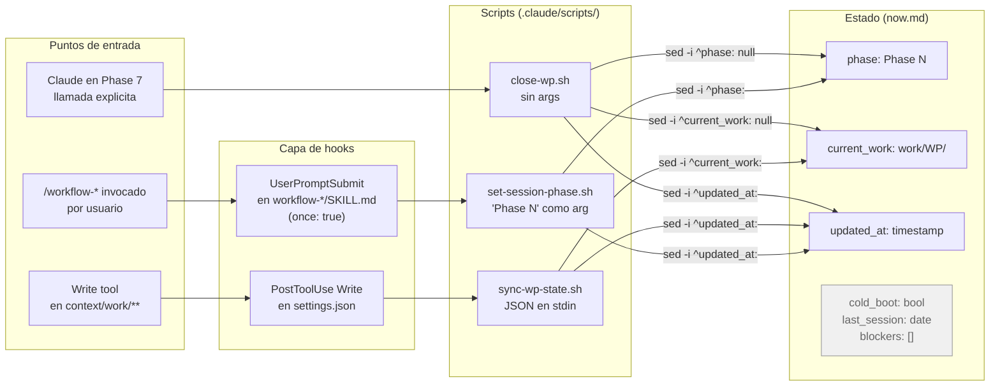
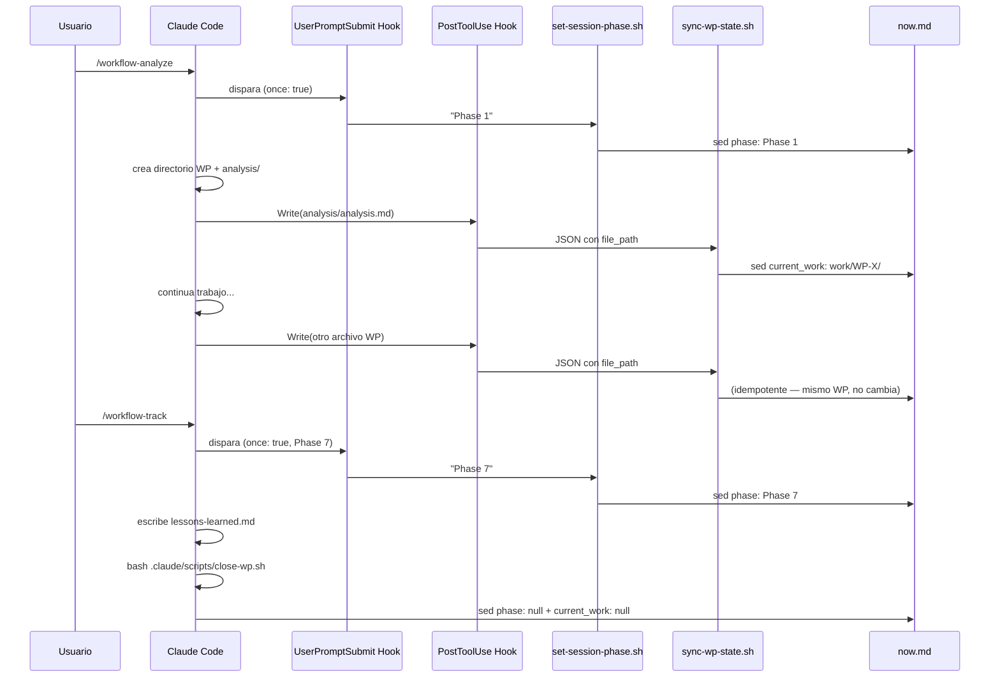

```yml
type: Design
work_package: 2026-04-09-17-28-34-auto-operations
fase: FASE 28
created_at: 2026-04-09 21:45:00
```

# Design — auto-operations

Complementa las decisiones de Phase 2 (solution-strategy) con la arquitectura de
integracion concreta: como los 3 scripts se conectan con los 2 puntos de entrada
(hooks) y el estado compartido (now.md).

---

## Vision arquitectonica

El patron aplicado es **Observe → React → Sync** (variante del Agentic Loop para
state management):

```
[Evento del sistema] → [Hook reactivo] → [Script de sync] → [Estado now.md]
```

Los 3 scripts cubren los 3 momentos del ciclo de vida de un WP:

| Momento | Trigger | Script | Campo en now.md |
|---------|---------|--------|-----------------|
| Inicio de phase | Usuario invoca /workflow-* | set-session-phase.sh | `phase` |
| Escritura de archivo WP | Claude usa Write tool | sync-wp-state.sh | `current_work` |
| Cierre de WP | Claude llama explicitamente | close-wp.sh | `phase` + `current_work` |

---

## Mapa de componentes



**Nota:** Los campos `cold_boot`, `last_session`, `blockers` (en gris) no son
responsabilidad de ningun script de este WP. Son gestionados por `session-start.sh`
y `session-resume.sh` existentes, y no se modifican en este WP.

---

## Diagrama de secuencia — flujo de sesion tipico



---

## Estructura de archivos afectados

```
.claude/
├── scripts/                      ← Scripts NUEVOS (SPEC-001, 002, 003)
│   ├── set-session-phase.sh      ← nuevo
│   ├── sync-wp-state.sh          ← nuevo
│   └── close-wp.sh               ← nuevo
├── settings.json                 ← MODIFICADO (SPEC-004)
│   └── hooks.PostToolUse         ← agregar entrada Write
└── skills/
    ├── workflow-analyze/SKILL.md  ← MODIFICADO (SPEC-005)
    ├── workflow-strategy/SKILL.md ← MODIFICADO (SPEC-005)
    ├── workflow-plan/SKILL.md     ← MODIFICADO (SPEC-005)
    ├── workflow-structure/SKILL.md← MODIFICADO (SPEC-005)
    ├── workflow-decompose/SKILL.md← MODIFICADO (SPEC-005)
    ├── workflow-execute/SKILL.md  ← MODIFICADO (SPEC-005)
    └── workflow-track/SKILL.md    ← MODIFICADO (SPEC-005 + SPEC-006)
```

---

## Decisiones de diseno

Ver Phase 2 solution-strategy.md para el razonamiento completo de D-01..D-06.
Resumen de las decisiones que afectan la implementacion:

| Decision | Implicacion de implementacion |
|----------|------------------------------|
| D-01: script central con argumento | set-session-phase.sh recibe "Phase N" como $1 |
| D-02: PostToolUse reactivo | sync-wp-state.sh lee stdin, no argumentos |
| D-03: no inferir phase desde archivo | sync-wp-state.sh solo toca current_work |
| D-04: close-wp.sh como Opcion B | llamado explicitamente, no como hook |
| D-05: focus.md fuera de scope | ningun script toca focus.md |
| D-06: sin campo `if` en primera version | filtro interno en sync-wp-state.sh |

---

## Integracion con settings.json existente

settings.json actual (estructura relevante):

```json
{
  "hooks": {
    "SessionStart": [...],
    "Stop": [...],
    "PostCompact": [...]
  }
}
```

Cambio a agregar (SPEC-004): nueva clave `"PostToolUse"` dentro de `"hooks"`:

```json
{
  "hooks": {
    "SessionStart": [...],   ← sin cambios
    "Stop": [...],           ← sin cambios
    "PostCompact": [...],    ← sin cambios
    "PostToolUse": [         ← NUEVO
      {
        "matcher": "Write",
        "hooks": [
          {
            "type": "command",
            "command": "bash .claude/scripts/sync-wp-state.sh"
          }
        ]
      }
    ]
  }
}
```

---

## Integracion con workflow-track/SKILL.md existente

Seccion actual "REQUERIDO al cerrar WP":

```markdown
| `context/now.md` | `current_work: null` · `phase: null` · `updated_at: timestamp` |
```

Esta instruccion LLM se COMPLEMENTA con close-wp.sh. La instruccion se reemplaza por:

```markdown
| `context/now.md` | Ejecutar: `bash .claude/scripts/close-wp.sh` (setea phase/current_work: null) |
```

La instruccion LLM original se elimina porque close-wp.sh la hace determinista.
Ubicacion: dentro de la tabla de "REQUERIDO al cerrar WP", ANTES de focus.md y project-state.md.

---

## Consideraciones de robustez

| Escenario | Comportamiento | Aceptable? |
|-----------|---------------|------------|
| set-session-phase.sh falla | UserPromptSubmit hook falla | Si — phase queda stale, corregible manualmente |
| sync-wp-state.sh falla | PostToolUse hook falla silenciosamente | Si — current_work queda stale, se corrige en siguiente Write |
| close-wp.sh falla | Claude reporta error | Si — estado queda con WP activo, corregible |
| jq ausente | python3 fallback en sync-wp-state.sh | Si — comportamiento identico |
| python3 ausente | exit 0 silencioso en sync-wp-state.sh | Si — es side effect, no gate |
