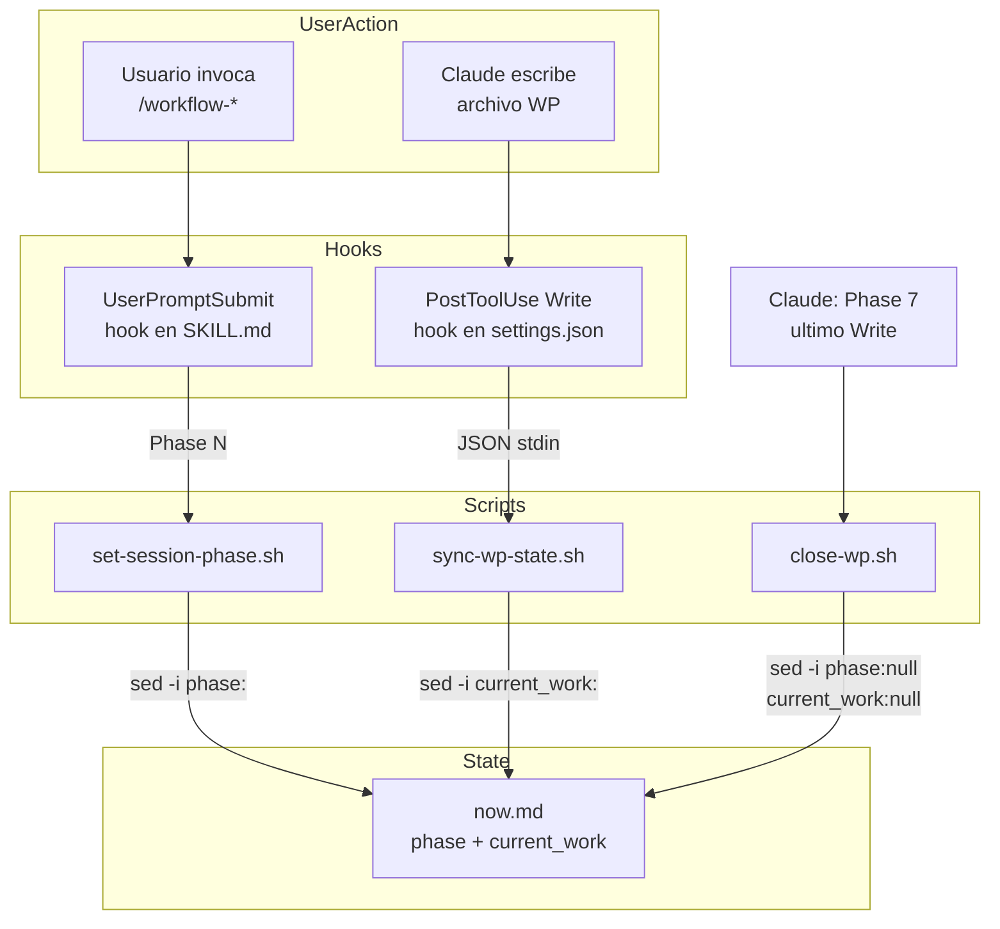

```yml
type: Requirements Spec
work_package: 2026-04-09-17-28-34-auto-operations
fase: FASE 28
created_at: 2026-04-09 21:30:00
```

# Requirements Spec — auto-operations

Corregir la sincronizacion de estado de sesion (`now.md`) para que sea determinista
via hooks reactivos en lugar de instrucciones LLM con `echo >>`.

---

## Mapeo Phase 1/2 → Specs

| Bug / Decision | SPEC | Descripcion |
|----------------|------|-------------|
| Bug 1 — echo append | SPEC-001 | set-session-phase.sh reemplaza campo in-place |
| Bug 2 — current_work sin hook | SPEC-002 | sync-wp-state.sh actualiza current_work por PostToolUse |
| Bug 4 — cierre WP LLM-dep | SPEC-003 | close-wp.sh limpia now.md en Phase 7 |
| D-06 — settings.json hook | SPEC-004 | PostToolUse Write hook en settings.json |
| Bug 1 x7 — 7 SKILL.md | SPEC-005 | Fix en 7 workflow-*/SKILL.md (echo → set-session-phase.sh) |
| D-04 — instruccion cierre | SPEC-006 | Instruccion close-wp.sh en workflow-track/SKILL.md |

---

## SPEC-001: set-session-phase.sh

**ID:** SPEC-001
**Origen:** Bug 1 — echo append crea campo duplicado fuera del frontmatter YAML
**Prioridad:** Critical
**Estado:** Pendiente

### Descripcion

Script bash que reemplaza el campo `phase:` en `now.md` usando `sed -i` con ancla `^`,
garantizando actualizacion in-place sin duplicados. Tambien actualiza `updated_at`.

### Criterios de Aceptacion

```
Given: now.md con frontmatter valido (phase: null)
When:  bash .claude/scripts/set-session-phase.sh "Phase 3"
Then:  now.md::phase == "Phase 3" (reemplazado, no duplicado)
And:   now.md::updated_at == timestamp actual
And:   el resto del archivo queda intacto

Given: now.md con phase: Phase 2 (ya existia un valor)
When:  bash .claude/scripts/set-session-phase.sh "Phase 3"
Then:  now.md::phase == "Phase 3" (el valor anterior fue reemplazado)
And:   no hay segunda linea "phase:" en el archivo

Given: now.md no existe o es ilegible
When:  bash .claude/scripts/set-session-phase.sh "Phase 1"
Then:  script falla con exit 1 y mensaje al stderr
And:   no se crean archivos nuevos

Given: script llamado sin argumentos
When:  bash .claude/scripts/set-session-phase.sh
Then:  exit 1 con mensaje "Usage: set-session-phase.sh <phase-name>"
```

### Implementacion

**Archivo:** `.claude/scripts/set-session-phase.sh`

```bash
#!/bin/bash
set -e

if [ -z "$1" ]; then
  echo "Usage: set-session-phase.sh <phase-name>" >&2
  exit 1
fi

PHASE="$1"
NOW_FILE=".claude/context/now.md"
DATE=$(date '+%Y-%m-%d %H:%M:%S')

if [ ! -f "$NOW_FILE" ]; then
  echo "Error: $NOW_FILE not found" >&2
  exit 1
fi

sed -i \
  -e "s|^phase: .*|phase: $PHASE|" \
  -e "s|^updated_at: .*|updated_at: $DATE|" \
  "$NOW_FILE"
```

**Dependencias:** `sed`, `date` (disponibles en cualquier entorno Unix)
**Complejidad:** Baja

---

## SPEC-002: sync-wp-state.sh

**ID:** SPEC-002
**Origen:** Bug 2 — current_work no se actualiza via hook reactivo
**Prioridad:** Critical
**Estado:** Pendiente

### Descripcion

Script bash llamado por el PostToolUse hook en settings.json. Recibe el JSON del
evento por stdin, extrae el `file_path`, y si es un archivo dentro de `context/work/`,
actualiza `now.md::current_work` con el WP correspondiente. Idempotente: si
`current_work` ya apunta al WP correcto, no hace nada.

### Criterios de Aceptacion

```
Given: PostToolUse JSON con file_path en /.claude/context/work/WP-X/archivo.md
When:  hook ejecuta sync-wp-state.sh (JSON en stdin)
Then:  now.md::current_work == "work/WP-X/"
And:   now.md::updated_at == timestamp actual
And:   now.md::phase no se modifica

Given: now.md::current_work ya es "work/WP-X/" (mismo WP)
When:  hook ejecuta sync-wp-state.sh con archivo del mismo WP
Then:  now.md no se modifica (idempotente, exit 0)

Given: PostToolUse JSON con file_path fuera de context/work/
When:  hook ejecuta sync-wp-state.sh
Then:  exit 0 sin modificar ningun archivo

Given: jq no disponible en el entorno
When:  hook ejecuta sync-wp-state.sh
Then:  se usa python3 como fallback para parsear JSON
And:   comportamiento funcional identico al caso con jq

Given: python3 tampoco disponible
When:  hook ejecuta sync-wp-state.sh
Then:  exit 0 (fail silencioso aceptable — es un side effect, no un gate)
And:   mensaje de advertencia al stderr
```

### Implementacion

**Archivo:** `.claude/scripts/sync-wp-state.sh`

```bash
#!/bin/bash
INPUT=$(cat)
NOW_FILE=".claude/context/now.md"

# Extraer file_path — jq con fallback a python3
FILE_PATH=$(echo "$INPUT" | jq -r '.tool_input.file_path // empty' 2>/dev/null)
if [ -z "$FILE_PATH" ]; then
  FILE_PATH=$(echo "$INPUT" | python3 -c \
    "import sys,json; d=json.load(sys.stdin); \
     print(d.get('tool_input',{}).get('file_path',''))" 2>/dev/null || true)
fi

# Si no se pudo extraer o no es un archivo WP, salir
if [[ "$FILE_PATH" != *"/.claude/context/work/"* ]]; then
  exit 0
fi

# Extraer WP path relativo (work/YYYY-MM-DD-HH-MM-SS-nombre/)
WP_PATH=$(echo "$FILE_PATH" | grep -oP 'work/[^/]+/')

if [ -z "$WP_PATH" ]; then
  exit 0
fi

# Leer current_work actual
if [ ! -f "$NOW_FILE" ]; then
  exit 0
fi

CURRENT=$(grep "^current_work:" "$NOW_FILE" | sed 's/current_work: //' | tr -d '[:space:]')

# Solo actualizar si cambio el WP
if [ "$CURRENT" = "$WP_PATH" ]; then
  exit 0
fi

DATE=$(date '+%Y-%m-%d %H:%M:%S')
sed -i \
  -e "s|^current_work: .*|current_work: $WP_PATH|" \
  -e "s|^updated_at: .*|updated_at: $DATE|" \
  "$NOW_FILE"
```

**Dependencias:** `jq` (con fallback a `python3`), `sed`, `grep`
**Complejidad:** Media (parseo de JSON, extraccion de path)

---

## SPEC-003: close-wp.sh

**ID:** SPEC-003
**Origen:** Bug 4 — cierre del WP en Phase 7 es LLM-dependiente
**Prioridad:** High
**Estado:** Pendiente

### Descripcion

Script bash que limpia `now.md` al cerrar un WP. Setea `current_work: null` y
`phase: null`. Llamado explicitamente por instruccion en workflow-track/SKILL.md
AL FINAL de Phase 7, despues del ultimo Write al WP.

### Criterios de Aceptacion

```
Given: now.md con current_work: work/WP-X/ y phase: Phase 7
When:  bash .claude/scripts/close-wp.sh
Then:  now.md::current_work == "null"
And:   now.md::phase == "null"
And:   now.md::updated_at == timestamp actual

Given: now.md con current_work: null (ya estaba limpio)
When:  bash .claude/scripts/close-wp.sh
Then:  now.md::current_work permanece "null" (idempotente)
And:   now.md::updated_at se actualiza

Given: script llamado ANTES del ultimo Write al WP (secuencia incorrecta)
When:  PostToolUse hook detecta nuevo Write al WP
Then:  sync-wp-state.sh setea current_work al WP de nuevo
Note:  instruccion en workflow-track DEBE decir: close-wp.sh va DESPUES del ultimo Write
```

### Implementacion

**Archivo:** `.claude/scripts/close-wp.sh`

```bash
#!/bin/bash
NOW_FILE=".claude/context/now.md"
DATE=$(date '+%Y-%m-%d %H:%M:%S')

if [ ! -f "$NOW_FILE" ]; then
  echo "Error: $NOW_FILE not found" >&2
  exit 1
fi

sed -i \
  -e "s|^current_work: .*|current_work: null|" \
  -e "s|^phase: .*|phase: null|" \
  -e "s|^updated_at: .*|updated_at: $DATE|" \
  "$NOW_FILE"
```

**Campos no modificados por este script:** `cold_boot`, `last_session`, `blockers`
(gestionados por session-start.sh / session-resume.sh — fuera del scope de este WP).

**Dependencias:** `sed`, `date`
**Complejidad:** Baja

---

## SPEC-004: PostToolUse Write hook en settings.json

**ID:** SPEC-004
**Origen:** D-06 — hook reactivo en settings.json para sincronizar current_work
**Prioridad:** Critical
**Estado:** Pendiente

### Descripcion

Agregar una entrada PostToolUse en `.claude/settings.json` que dispare
`sync-wp-state.sh` cuando Claude usa la herramienta Write. El campo `if` filtra
solo Writes en context/work/ para minimizar ejecuciones innecesarias.

### Criterios de Aceptacion

```
Given: settings.json con la entrada PostToolUse
When:  Claude escribe cualquier archivo en .claude/context/work/**
Then:  sync-wp-state.sh se ejecuta automaticamente con el JSON del evento en stdin
And:   la ejecucion es transparente al usuario (no genera prompt)
And:   un fallo del script NO bloquea la sesion (PostToolUse es no-bloqueante)

Given: Claude escribe un archivo fuera de .claude/context/work/
When:  PostToolUse Write dispara
Then:  el hook se ejecuta pero sync-wp-state.sh sale con exit 0 sin cambios
Note:  si el campo 'if' funciona correctamente, el script ni se lanza
```

### Implementacion

**Archivo:** `.claude/settings.json` — settings.json ya tiene hooks SessionStart, Stop y
PostCompact. El cambio agrega la clave `"PostToolUse"` dentro de `"hooks"` existente:

```json
"PostToolUse": [
  {
    "matcher": "Write",
    "hooks": [
      {
        "type": "command",
        "command": "bash .claude/scripts/sync-wp-state.sh"
      }
    ]
  }
]
```

Nota: el campo `if` se omite en la primera implementacion porque su comportamiento
con paths profundos no esta verificado empiricamente (Gap G-03/R-05). El filtro
interno del script actua como fallback sin impacto funcional.

**Dependencias:** settings.json existente, sync-wp-state.sh (SPEC-002)
**Complejidad:** Baja (configuracion JSON)

---

## SPEC-005: Fix Bug 1 en 7 workflow-*/SKILL.md

**ID:** SPEC-005
**Origen:** Bug 1 — echo append en lugar de sed in-place, en los 7 SKILL.md
**Prioridad:** Critical
**Estado:** Pendiente

### Descripcion

Reemplazar el comando del UserPromptSubmit hook en cada uno de los 7 workflow-*/SKILL.md.
El comando actual (`echo 'phase: PhaseN' >> now.md`) se reemplaza por
`bash .claude/scripts/set-session-phase.sh "Phase N"`.

### Criterios de Aceptacion

```
Given: workflow-analyze/SKILL.md con hook command = echo 'phase: Phase 1' >> ...
When:  se aplica el fix
Then:  hook command = bash .claude/scripts/set-session-phase.sh "Phase 1"
And:   updated_at del frontmatter se actualiza al timestamp del edit (CLAUDE.md regla)
And:   ningun otro campo del frontmatter cambia (excepto updated_at)

Given: (mismo patron para los otros 6 skills: strategy, plan, structure, decompose, execute, track)
When:  cada skill es invocado por el usuario
Then:  now.md::phase se actualiza correctamente sin duplicados
```

Nota: CLAUDE.md Locked Decision — `updated_at` se actualiza automaticamente en TODA
edicion de archivo que tenga ese campo en el frontmatter. Esto aplica a T-006..T-012.

### Tabla de cambios

| Archivo | Valor actual | Valor nuevo |
|---------|-------------|-------------|
| `workflow-analyze/SKILL.md` | `echo 'phase: Phase 1' >> ...` | `bash .claude/scripts/set-session-phase.sh "Phase 1"` |
| `workflow-strategy/SKILL.md` | `echo 'phase: Phase 2' >> ...` | `bash .claude/scripts/set-session-phase.sh "Phase 2"` |
| `workflow-plan/SKILL.md` | `echo 'phase: Phase 3' >> ...` | `bash .claude/scripts/set-session-phase.sh "Phase 3"` |
| `workflow-structure/SKILL.md` | `echo 'phase: Phase 4' >> ...` | `bash .claude/scripts/set-session-phase.sh "Phase 4"` |
| `workflow-decompose/SKILL.md` | `echo 'phase: Phase 5' >> ...` | `bash .claude/scripts/set-session-phase.sh "Phase 5"` |
| `workflow-execute/SKILL.md` | `echo 'phase: Phase 6' >> ...` | `bash .claude/scripts/set-session-phase.sh "Phase 6"` |
| `workflow-track/SKILL.md` | `echo 'phase: Phase 7' >> ...` | `bash .claude/scripts/set-session-phase.sh "Phase 7"` |

**Complejidad:** Baja (sed puntual en cada archivo)

---

## SPEC-006: Instruccion close-wp.sh en workflow-track/SKILL.md

**ID:** SPEC-006
**Origen:** D-04 (Opcion B) — cierre intencional, no automatico
**Prioridad:** High
**Estado:** Pendiente

### Descripcion

Agregar instruccion explicita en `workflow-track/SKILL.md` para que Claude llame
`bash .claude/scripts/close-wp.sh` DESPUES de escribir todos los artefactos de
cierre del WP (lessons-learned, final-report si aplica).

### Criterios de Aceptacion

```
Given: workflow-track/SKILL.md con tabla "REQUERIDO al cerrar WP"
       (fila actual: now.md | current_work: null · phase: null · updated_at: timestamp)
When:  se aplica el cambio de SPEC-006
Then:  la fila de now.md en la tabla se reemplaza por:
       now.md | Ejecutar: bash .claude/scripts/close-wp.sh
And:   la instruccion aparece ANTES de la fila de focus.md en la tabla
And:   la instruccion LLM original (escribir campos manualmente) es eliminada

Given: Claude sigue las instrucciones de workflow-track en Phase 7
When:  llega al paso "REQUERIDO al cerrar WP"
Then:  Claude ejecuta bash .claude/scripts/close-wp.sh DESPUES del ultimo Write al WP
And:   now.md::current_work = null
And:   now.md::phase = null
```

**Archivos afectados:** `.claude/skills/workflow-track/SKILL.md`
**Ubicacion exacta:** tabla en seccion "REQUERIDO al cerrar WP", fila `context/now.md`
**Tipo de cambio:** REEMPLAZO de instruccion LLM por llamada a script
**Complejidad:** Baja

---

## Arquitectura de componentes



---

## Dependencias entre SPECs

```
SPEC-001 (set-session-phase.sh) debe existir antes de SPEC-005 (fix SKILL.md)
SPEC-002 (sync-wp-state.sh)    debe existir antes de SPEC-004 (settings.json hook)
SPEC-003 (close-wp.sh)         debe existir antes de SPEC-006 (instruccion en SKILL.md)

Orden de creacion:
  1. SPEC-001, SPEC-002, SPEC-003 (scripts nuevos — sin GATE)
  2. SPEC-004, SPEC-005, SPEC-006 (edicion de config — requieren GATE OPERACION)
```

---

## Riesgos residuales

| SPEC | Riesgo | Severidad | Mitigacion |
|------|--------|-----------|------------|
| SPEC-002 | jq no disponible | Media | Fallback a python3 en el script |
| SPEC-004 | `if` con path profundo no filtra | Baja | Filtro interno en SPEC-002 como fallback |
| SPEC-003 | close-wp.sh llamado antes del ultimo Write | Baja | Instruccion explicita en SPEC-006 |
