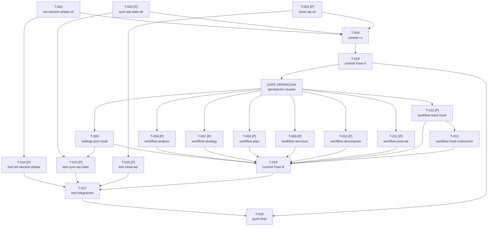

```yml
created_at: 2026-04-09-21-50-00
project: thyrox
feature: auto-operations
breakdown_version: 1.1
total_tasks: 20
critical_dependencies: 4
```

# Task Plan — auto-operations

Implementar sincronizacion determinista de `now.md` via hooks reactivos.
Basado en: `auto-operations-requirements-spec.md` + `auto-operations-design.md`

**v1.1:** Deep review DP5 — corregidos 6 gaps:
- T-006..T-012 ahora incluyen actualizar `updated_at` (CLAUDE.md Locked Decision)
- T-014/015/016 tienen comandos de test concretos
- T-017 ampliado para cubrir PostToolUse sync (el bug principal)
- DAG corregido: T-014/015/016 → T-017 → T-018
- Commits intermedios agregados (T-018=commit Fase A, T-019=commit Fase B, T-020=push)

---

## Estados de tarea

| Estado | Formato |
|--------|---------|
| `[ ]` | Pendiente |
| `[~]` | En progreso |
| `[x]` | Completada |

---

## Fase A — Scripts nuevos (sin GATE)

Los 3 scripts son archivos nuevos. No editan configuracion existente.

- [x] [T-001] Crear `.claude/scripts/set-session-phase.sh` con el contenido de SPEC-001 (SPEC-001)
- [x] [T-002] [P] Crear `.claude/scripts/sync-wp-state.sh` con el contenido de SPEC-002 (SPEC-002)
- [x] [T-003] [P] Crear `.claude/scripts/close-wp.sh` con el contenido de SPEC-003 (SPEC-003)
- [x] [T-004] Hacer ejecutables los 3 scripts: `chmod +x .claude/scripts/set-session-phase.sh .claude/scripts/sync-wp-state.sh .claude/scripts/close-wp.sh`
- [x] [T-018] Commit Fase A: `feat(fase-28): agregar scripts set-session-phase, sync-wp-state, close-wp`

> T-001, T-002, T-003 son parallelizables entre si.
> T-004 depende de T-001 + T-002 + T-003.
> T-018 depende de T-004.

**CHECKPOINT-A:** Verificar que los 3 scripts existen y son ejecutables.
```bash
ls -la .claude/scripts/set-session-phase.sh .claude/scripts/sync-wp-state.sh .claude/scripts/close-wp.sh
```

---

## GATE OPERACION

⏸ STOP — antes de Fase B, solicitar aprobacion explicita del usuario.
Las ediciones de Fase B modifican configuracion del framework (SKILL.md x7 + settings.json).
Estas ediciones tienen impacto inmediato en el comportamiento de Claude Code.

---

## Fase B — Edicion de configuracion (requieren GATE)

Nota: cada Edit en un archivo `.md` con `updated_at` en frontmatter DEBE actualizar ese campo
en el mismo Edit — regla de CLAUDE.md. Los T-006..T-012 lo incluyen explicitamente.

- [x] [T-005] Agregar clave `"PostToolUse"` dentro de `"hooks"` en `.claude/settings.json` (SPEC-004)
- [x] [T-006] [P] Edit `workflow-analyze/SKILL.md`: reemplazar `echo 'phase: Phase 1' >> ...` por `bash .claude/scripts/set-session-phase.sh "Phase 1"` + actualizar `updated_at` (SPEC-005)
- [x] [T-007] [P] Edit `workflow-strategy/SKILL.md`: reemplazar `echo 'phase: Phase 2' >> ...` por `bash .claude/scripts/set-session-phase.sh "Phase 2"` + actualizar `updated_at` (SPEC-005)
- [x] [T-008] [P] Edit `workflow-plan/SKILL.md`: reemplazar `echo 'phase: Phase 3' >> ...` por `bash .claude/scripts/set-session-phase.sh "Phase 3"` + actualizar `updated_at` (SPEC-005)
- [x] [T-009] [P] Edit `workflow-structure/SKILL.md`: reemplazar `echo 'phase: Phase 4' >> ...` por `bash .claude/scripts/set-session-phase.sh "Phase 4"` + actualizar `updated_at` (SPEC-005)
- [x] [T-010] [P] Edit `workflow-decompose/SKILL.md`: reemplazar `echo 'phase: Phase 5' >> ...` por `bash .claude/scripts/set-session-phase.sh "Phase 5"` + actualizar `updated_at` (SPEC-005)
- [x] [T-011] [P] Edit `workflow-execute/SKILL.md`: reemplazar `echo 'phase: Phase 6' >> ...` por `bash .claude/scripts/set-session-phase.sh "Phase 6"` + actualizar `updated_at` (SPEC-005)
- [x] [T-012] [P] Edit `workflow-track/SKILL.md` frontmatter: reemplazar `echo 'phase: Phase 7' >> ...` por `bash .claude/scripts/set-session-phase.sh "Phase 7"` + actualizar `updated_at` (SPEC-005)
- [x] [T-013] Edit `workflow-track/SKILL.md` cuerpo: en tabla "REQUERIDO al cerrar WP", reemplazar fila `context/now.md | current_work: null...` por `context/now.md | Ejecutar: bash .claude/scripts/close-wp.sh` (SPEC-006)
- [x] [T-019] Commit Fase B: `fix(fase-28): corregir hook echo→set-session-phase en 7 SKILL.md + PostToolUse hook`

> T-006..T-012 son parallelizables entre si.
> T-013 toca workflow-track/SKILL.md (seccion cuerpo) — ejecutar DESPUES de T-012 (seccion frontmatter).
> T-019 depende de T-005..T-013.

**CHECKPOINT-B:** Verificar que los 7 SKILL.md ya no tienen `echo >>` y settings.json tiene el hook.
```bash
grep -r "echo 'phase:" .claude/skills/workflow-*/SKILL.md
grep "sync-wp-state" .claude/settings.json
```
Resultado esperado: 0 lineas en el primer grep, 1 linea en el segundo.

---

## Fase C — Validacion

- [x] [T-014] [P] Test `set-session-phase.sh` — verificar reemplazo in-place sin duplicar (SPEC-001):
  ```bash
  # Backup
  cp .claude/context/now.md /tmp/now-backup.md
  # Ejecutar
  bash .claude/scripts/set-session-phase.sh "Phase 99"
  # Verificar: exactamente 1 linea con phase:, con el valor correcto
  grep "^phase:" .claude/context/now.md | wc -l   # debe ser 1
  grep "^phase: Phase 99" .claude/context/now.md  # debe encontrar la linea
  # Restore
  cp /tmp/now-backup.md .claude/context/now.md
  ```

- [x] [T-015] [P] Test `sync-wp-state.sh` — simular PostToolUse JSON y verificar current_work (SPEC-002):
  ```bash
  # Backup
  cp .claude/context/now.md /tmp/now-backup.md
  # Simular PostToolUse Write en un WP
  echo '{"tool_name":"Write","tool_input":{"file_path":"/home/user/thyrox/.claude/context/work/2026-04-09-17-28-34-auto-operations/test-file.md"}}' \
    | bash .claude/scripts/sync-wp-state.sh
  # Verificar: current_work apunta al WP correcto
  grep "^current_work:" .claude/context/now.md  # debe ser work/2026-04-09-17-28-34-auto-operations/
  # Simular archivo fuera de WP (debe ser no-op)
  echo '{"tool_name":"Write","tool_input":{"file_path":"/home/user/thyrox/README.md"}}' \
    | bash .claude/scripts/sync-wp-state.sh
  grep "^current_work:" .claude/context/now.md  # no debe cambiar
  # Restore
  cp /tmp/now-backup.md .claude/context/now.md
  ```

- [x] [T-016] [P] Test `close-wp.sh` — verificar que setea null en ambos campos (SPEC-003):
  ```bash
  # Backup
  cp .claude/context/now.md /tmp/now-backup.md
  # Ejecutar
  bash .claude/scripts/close-wp.sh
  # Verificar
  grep "^phase:" .claude/context/now.md       # debe ser "phase: null"
  grep "^current_work:" .claude/context/now.md # debe ser "current_work: null"
  # Restore
  cp /tmp/now-backup.md .claude/context/now.md
  ```

- [x] [T-017] Test de integracion completo — cubre Bug 1 (UserPromptSubmit) y Bug 2 (PostToolUse):
  ```
  Paso 1 (Bug 1 — set-session-phase via hook):
    - Leer now.md actual, notar el valor de phase
    - Invocar /workflow-analyze en la misma sesion para disparar el hook
    - Leer now.md: phase debe ser "Phase 1", sin lineas duplicadas
    - grep "^phase:" .claude/context/now.md | wc -l  → debe ser exactamente 1

  Paso 2 (Bug 2 — sync-wp-state via PostToolUse):
    - Escribir un archivo de prueba en context/work/ usando Write tool
    - El PostToolUse hook debe disparar sync-wp-state.sh automaticamente
    - Leer now.md: current_work debe apuntar al WP del archivo escrito
    - El paso 2 verifica que SPEC-004 (settings.json hook) funciona en produccion

  Paso 3 (Bug 4 — close-wp):
    - Ejecutar bash .claude/scripts/close-wp.sh
    - Leer now.md: phase y current_work deben ser null
  ```

> T-014, T-015, T-016 son parallelizables entre si.
> T-017 depende de T-014 + T-015 + T-016 + Fase B completa.

**CHECKPOINT-C:** Todos los tests pasan. now.md en estado correcto.

---

## Fase D — Cierre

- [x] [T-020] Push: `git push -u origin <branch>` (depende de T-018 + T-019 + T-017)

---

## DAG de dependencias (corregido v1.1)



---

## Trazabilidad SPEC → Task

| SPEC | Tasks |
|------|-------|
| SPEC-001 | T-001, T-004, T-014 |
| SPEC-002 | T-002, T-004, T-015 |
| SPEC-003 | T-003, T-004, T-016 |
| SPEC-004 | T-005, T-015, T-017 |
| SPEC-005 | T-006, T-007, T-008, T-009, T-010, T-011, T-012 |
| SPEC-006 | T-013 |

---

## Verificacion de atomicidad

- [x] Cada tarea toca exactamente 1 archivo o 1 seccion de 1 archivo
- [x] Ninguna descripcion contiene "y" conectando dos operaciones distintas
  - Nota T-004: chmod en 3 archivos es una sola operacion bash indivisible — aceptado
  - Nota T-006..T-012: "Fix hook + actualizar updated_at" son 2 campos del mismo frontmatter
    en un solo Edit — aceptado por ser campos relacionados del mismo bloque
- [x] Cada tarea puede commitearse de forma independiente
