```yml
type: Deep Review
work_package: 2026-04-09-22-47-58-technical-debt-resolution
fase: FASE 29
created_at: 2026-04-09 23:20:00
scope: Análisis de archivos que superan el límite de lectura del Read tool (10,000 tokens)
```

# Deep Review — Archivos Sobredimensionados

## Problema Central

El Read tool de Claude Code tiene un límite de **10,000 tokens por llamada** (~32,500 bytes).
Cuando un archivo supera ese límite, Claude solo puede leerlo en fragmentos usando `offset`/`limit`,
perdiendo coherencia del documento y degradando la calidad del análisis.

Tres archivos del proyecto **ya superan este límite**. Uno de ellos ya superó el doble.

---

## 1. Mapa de Estado Actual

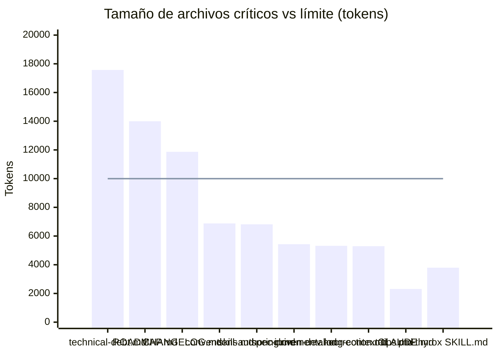

> Línea roja = límite de 10,000 tokens. Barras sobre la línea = archivo ilegible en una sola llamada.

---

## 2. Clasificación por Severidad

```mermaid
quadrantChart
    title Archivos por Urgencia × Impacto (si se vuelve ilegible)
    x-axis "Bajo Impacto" --> "Alto Impacto"
    y-axis "Crecimiento Lento / Estático" --> "Crecimiento Rápido / Acumulativo"
    quadrant-1 Prioridad Alta (fix inmediato)
    quadrant-2 Monitorear (puede crecer)
    quadrant-3 Sin urgencia
    quadrant-4 Riesgo latente
    technical-debt.md: [0.95, 0.95]
    ROADMAP.md: [0.85, 0.85]
    CHANGELOG.md: [0.75, 0.75]
    conventions.md: [0.80, 0.25]
    skill-authoring.md: [0.55, 0.20]
    spec-driven-dev.md: [0.45, 0.10]
    incremental-correction.md: [0.40, 0.10]
    long-context-tips.md: [0.35, 0.10]
    adr-015.md: [0.30, 0.05]
```

---

## 3. Inventario Completo

| Archivo | Bytes | Tokens | % Límite | Tipo | Estado |
|---------|-------|--------|----------|------|--------|
| `.claude/context/technical-debt.md` | 57,113 | 17,573 | **176%** | Acumulativo | ❌ CRITICAL |
| `ROADMAP.md` | 45,490 | 13,997 | **140%** | Acumulativo | ❌ CRITICAL |
| `CHANGELOG.md` | 38,566 | 11,866 | **119%** | Acumulativo | ❌ CRITICAL |
| `.claude/references/conventions.md` | 22,349 | 6,877 | 69% | Referencia estática | ⚠️ WARNING |
| `.claude/references/skill-authoring.md` | 22,156 | 6,817 | 68% | Referencia estática | ⚠️ WARNING |
| `workflow-structure/references/spec-driven-development.md` | 17,648 | 5,430 | 54% | Referencia estática | 🟡 MONITOR |
| `workflow-track/references/incremental-correction.md` | 17,288 | 5,319 | 53% | Referencia estática | 🟡 MONITOR |
| `.claude/references/long-context-tips.md` | 17,210 | 5,295 | 53% | Referencia estática | 🟡 MONITOR |
| `.claude/references/prompting-tips.md` | 16,348 | 5,030 | 50% | Referencia estática | 🟡 MONITOR |
| `.claude/context/decisions/adr-015.md` | 15,759 | 4,849 | 48% | ADR (inmutable) | 🟡 MONITOR |
| `.claude/references/examples.md` | 15,070 | 4,637 | 46% | Referencia estática | 🟡 MONITOR |
| `.claude/references/claude-code-components.md` | 15,046 | 4,630 | 46% | Referencia estática | 🟡 MONITOR |
| `.claude/CLAUDE.md` | 7,508 | 2,310 | 23% | Config estática | ✅ OK |
| `.claude/skills/pm-thyrox/SKILL.md` | 12,336 | 3,796 | 38% | SKILL activo | ✅ OK |

**Threshold:** 10,000 tokens ≈ 32,500 bytes

---

## 4. Análisis de Causa Raíz por Tipo

### Tipo A — Archivos Acumulativos (crecen con cada FASE)

Estos archivos tienen un **patrón de crecimiento lineal e inevitable**: cada FASE agrega contenido nuevo sin retirar el anterior. Son el núcleo del problema.

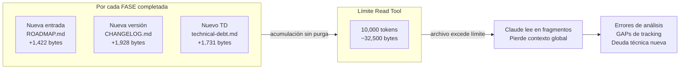

#### 4A.1 — ROADMAP.md

**Por qué crece:**
- Cada FASE agrega una sección `## FASE N` con todos sus sub-items de tracking
- Las FASEs completadas quedan permanentemente en el archivo (convenio `[x]`)
- Promedio histórico: **1,422 bytes por FASE**

**Cuándo superó el límite:**
- En aproximadamente la **FASE 23** (estimación: ~32,500 bytes / 1,422 bytes por FASE ≈ FASE 23)
- Actualmente en FASE 29 → **45,490 bytes (140% del límite)**

**Proyección:**

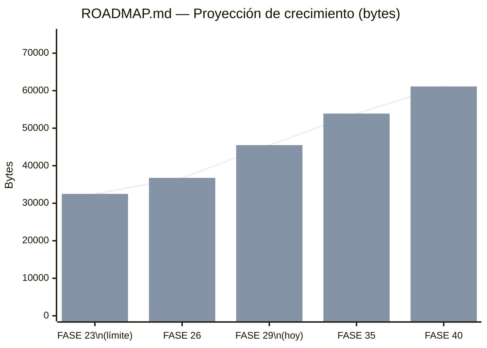

**Fix propuesto — Split histórico:**

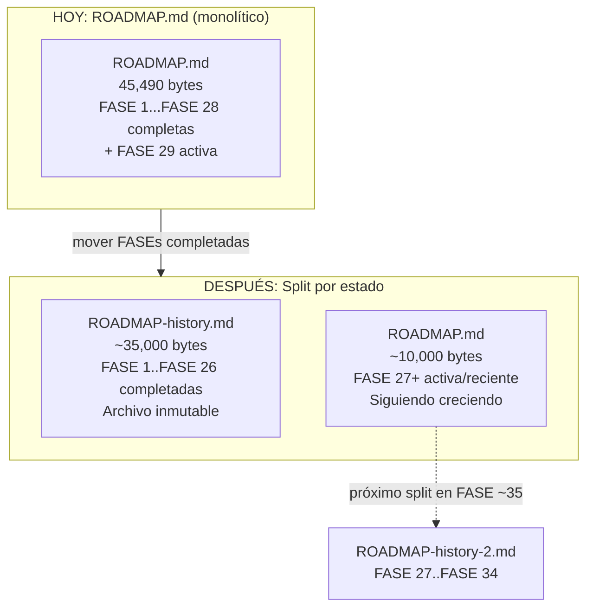

**Regla de mantenimiento:** Cuando `ROADMAP.md` supere 25,000 bytes → mover FASEs completadas más antiguas a `ROADMAP-history.md`.

---

#### 4A.2 — CHANGELOG.md

**Por qué crece:**
- Cada versión agrega una sección `## [X.Y.Z]` con todas las entradas de cambio
- Las versiones antiguas nunca se eliminan (convenio Keep a Changelog)
- Promedio histórico: **1,928 bytes por versión**
- 20 versiones documentadas → 38,566 bytes

**Cuándo superó el límite:**
- En aproximadamente la **versión 17** (32,500 / 1,928 ≈ versión 17 de 20)
- Estado actual: **38,566 bytes (119% del límite)** — ya superado pero por poco

**Fix propuesto — Split por versión major:**

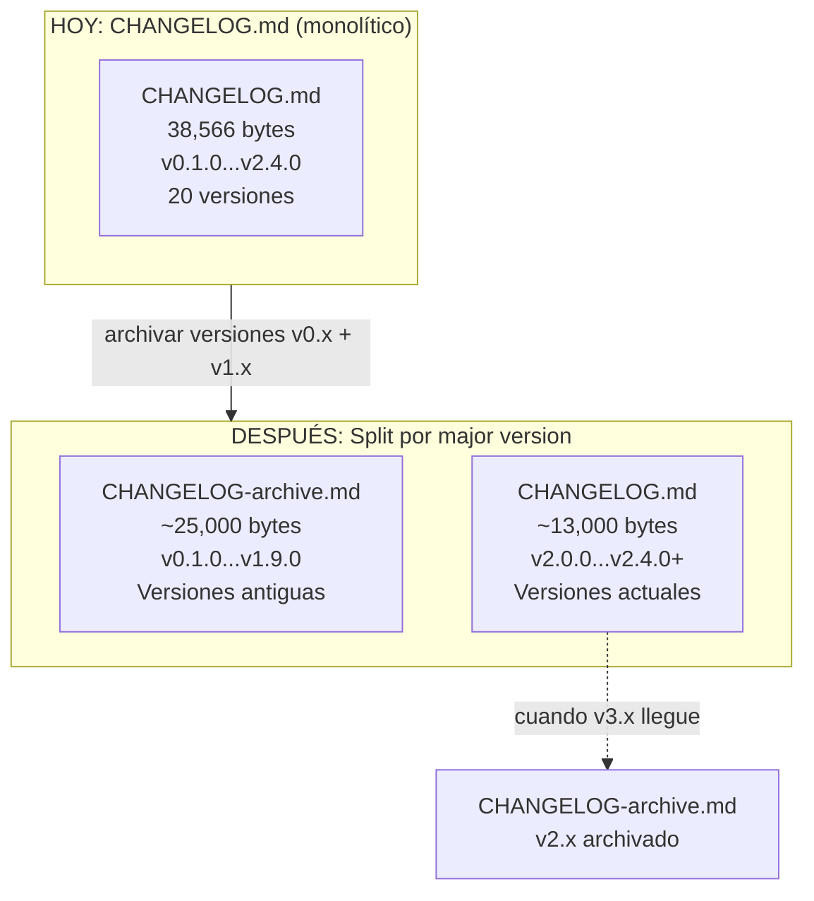

**Regla de mantenimiento:** Cuando inicie una nueva major version, archivar la major anterior completa a `CHANGELOG-archive.md`.

---

#### 4A.3 — technical-debt.md

**Por qué crece:**
- Cada TD registrado agrega ~1,731 bytes (título + frontmatter + descripción + fix propuesto)
- Los TDs resueltos permanecen (marcados `[-]`) — nunca se purgan
- 33 TDs registrados → 57,113 bytes → **176% del límite** (el peor de los tres)

**Cuándo superó el límite:**
- En aproximadamente el **TD #19** (32,500 / 1,731 ≈ TD-19)
- Ya identificado como R-06 en el risk register de este WP

**Fix propuesto — Split por estado:**

```mermaid
flowchart TB
    subgraph Antes["HOY: technical-debt.md (monolítico)"]
        TD[technical-debt.md\n57,113 bytes\n33 TDs\n4 resueltos + 29 pendientes]
    end

    subgraph Despues["DESPUÉS: Split por estado de resolución"]
        TDA[technical-debt.md\n~40,000 bytes\n29 TDs pendientes [ ]\nArchivo activo — se edita cada FASE]
        TDR[technical-debt-resolved.md\n~8,000 bytes\n4 TDs resueltos [-]/[x]\nArchivo creciente — nunca se edita]
    end

    Antes -->|"separar TDs resueltos"| Despues
    TDA -.->|"cuando un TD se cierra"| TDR
```

**Regla de mantenimiento:** Al cerrar un TD (marcarlo `[x]`), moverlo a `technical-debt-resolved.md` inmediatamente.

---

### Tipo B — Referencias Estáticas (crecen solo cuando cambia la metodología)

```mermaid
flowchart LR
    subgraph Ref["Referencias estáticas (.claude/references/)"]
        C1[conventions.md\n22,349 bytes\n69% límite]
        C2[skill-authoring.md\n22,156 bytes\n68% límite]
        C3[long-context-tips.md\n17,210 bytes\n53% límite]
        C4[prompting-tips.md\n16,348 bytes\n50% límite]
        C5[examples.md\n15,070 bytes\n46% límite]
        C6[claude-code-components.md\n15,046 bytes\n46% límite]
    end

    subgraph Trigger["Cuándo crecen"]
        T1[Nueva convención\nagregar a conventions.md]
        T2[Nueva FASE grande\nagregar ejemplo a examples.md]
        T3[Cambio metodológico\nagregar a skill-authoring.md]
    end

    Trigger --> Ref
    Ref -->|"riesgo: superar 32,500 bytes\nen ~1-2 ciclos de metodología"| WARN[⚠️ Warning Zone]
```

**Diagnóstico:** Estas referencias son documentos densos — crecen lentamente pero son grandes por diseño (documentación exhaustiva). El riesgo no es inmediato, pero `conventions.md` y `skill-authoring.md` están a solo **un ciclo de refactoring** de cruzar el límite.

**Fix propuesto:** No split todavía. En cambio:
1. Auditar si hay secciones obsoletas para eliminar
2. Si se necesita expandir, evaluar si el contenido nuevo puede ir en un archivo separado (e.g., `conventions-advanced.md`)
3. Marcar como **monitor** — revisar cada 5 FASEs

---

### Tipo C — ADRs Grandes (inmutables por definición)

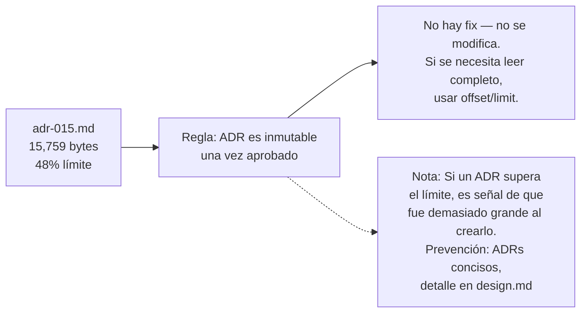

**Diagnóstico:** `adr-015.md` está en 48% — no es urgente. Los ADRs son inmutables, por lo que si alguno superara el límite, la única opción es leerlo en fragmentos (no hay split posible sin violar la inmutabilidad). La prevención es escribir ADRs más concisos desde el inicio.

---

## 5. Patrón de Crecimiento — Visión Global

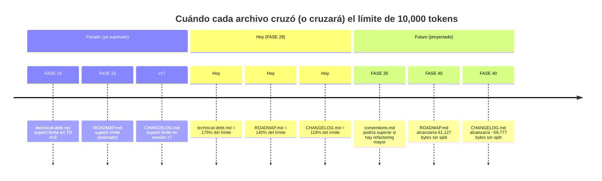

---

## 6. Impacto en el Flujo de Trabajo

Cuando Claude no puede leer un archivo en una sola llamada, el impacto se propaga:

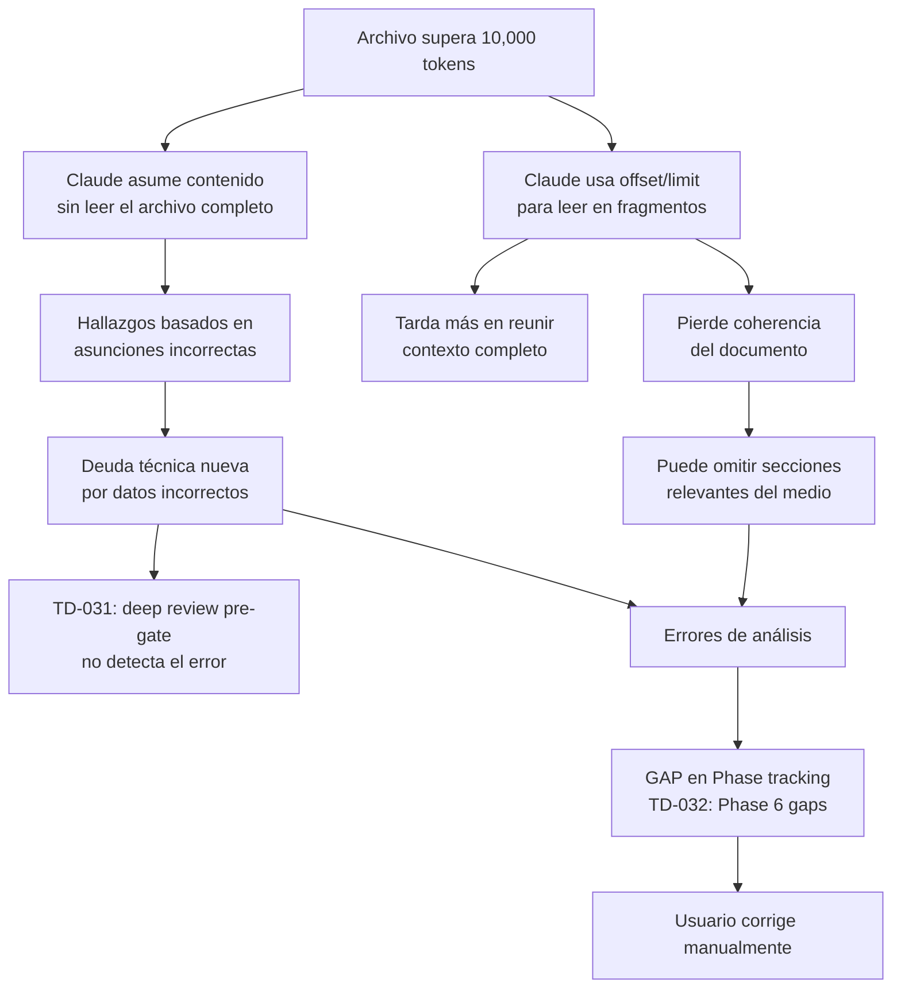

**Este diagrama muestra por qué TD-026 (ROADMAP.md) y el problema de technical-debt.md
son causas raíz de otros TDs.** No son problemas de almacenamiento — son problemas de
confiabilidad del análisis.

---

## 7. Regla de Longevidad de Archivos

### El problema de fondo

El framework no tiene una regla que prevenga la acumulación indefinida en archivos vivos.
Esto es una laguna de convención, no un error puntual.

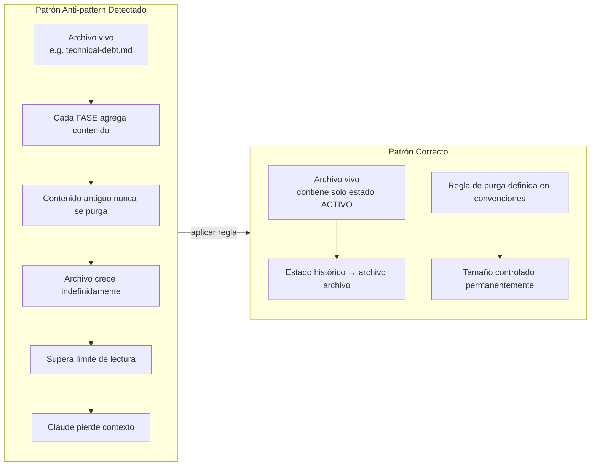

### Regla Propuesta: Umbral de Tamaño para Archivos Vivos

```
REGLA-LONGEV-001: Archivos vivos con tamaño máximo
- Si un archivo vivo (que se edita cada FASE) supera 25,000 bytes:
  → Crear archivo de archivo (nombre-archive.md o nombre-history.md)
  → Mover contenido histórico/cerrado al archivo
  → El archivo original mantiene solo estado activo/reciente
- Trigger de revisión: cada 5 FASEs, ejecutar wc -c en archivos vivos clave
```

Esta regla previene el anti-pattern antes de que ocurra, no después.

---

## 8. Nuevas Deudas Técnicas Identificadas

### TD-034: CHANGELOG.md supera límite de lectura

| Campo | Valor |
|-------|-------|
| **Severidad** | alta |
| **Estado** | `[ ]` Pendiente |
| **Tamaño actual** | 38,566 bytes (119% del límite) |
| **Root cause** | Keep a Changelog no tiene convención de split — archivo crece indefinidamente |
| **Fix** | Split: mover versiones v0.x + v1.x a `CHANGELOG-archive.md` |
| **Bloqueado por** | nada |

### TD-035: Sin regla de longevidad para archivos vivos

| Campo | Valor |
|-------|-------|
| **Severidad** | media |
| **Estado** | `[ ]` Pendiente |
| **Síntoma** | technical-debt.md, ROADMAP.md, CHANGELOG.md crecieron hasta superar el límite sin que nadie lo detectara ni previniera |
| **Root cause** | conventions.md no tiene regla de umbral de tamaño para archivos vivos |
| **Fix** | Agregar `REGLA-LONGEV-001` a conventions.md + revisar cada 5 FASEs |
| **Bloqueado por** | nada |

---

## 9. Plan de Acción Priorizado

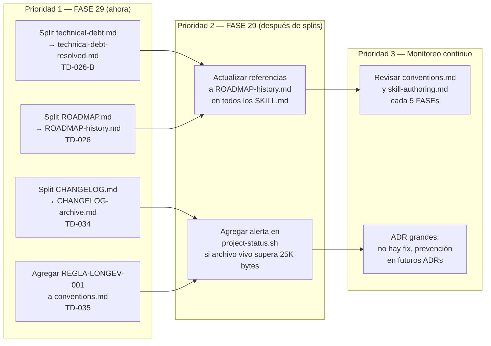

---

## 10. Resumen Ejecutivo

| Archivo | Estado | Fix | Prioridad |
|---------|--------|-----|-----------|
| `technical-debt.md` | ❌ CRITICAL (176%) | Split → `technical-debt-resolved.md` | P1 inmediato |
| `ROADMAP.md` | ❌ CRITICAL (140%) | Split → `ROADMAP-history.md` | P1 inmediato |
| `CHANGELOG.md` | ❌ CRITICAL (119%) | Split → `CHANGELOG-archive.md` | P1 inmediato |
| `conventions.md` | ⚠️ WARNING (69%) | Auditar + REGLA-LONGEV-001 | P2 esta FASE |
| `skill-authoring.md` | ⚠️ WARNING (68%) | Monitorear | P2 esta FASE |
| Resto de referencias | 🟡 MONITOR (46-54%) | Revisar cada 5 FASEs | P3 |
| `adr-015.md` | 🟡 MONITOR (48%) | Sin fix (inmutable) — prevención futura | P3 |

**TDs nuevos detectados:** TD-034 (CHANGELOG.md), TD-035 (regla de longevidad)

**Causa raíz unificada:** El framework no tiene convención de purga para archivos vivos.
Los tres archivos críticos son consecuencia del mismo anti-pattern: acumulación sin umbral.
La solución correcta no es solo hacer split hoy — es agregar la regla que previene el siguiente split.
