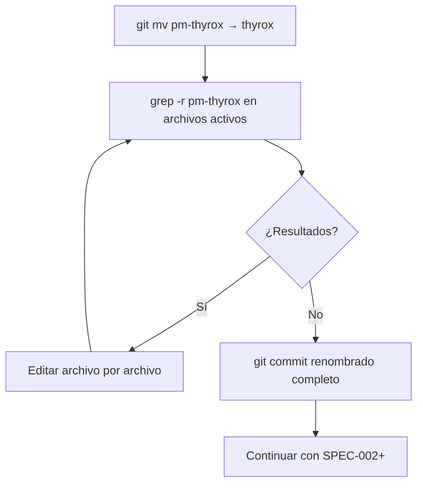
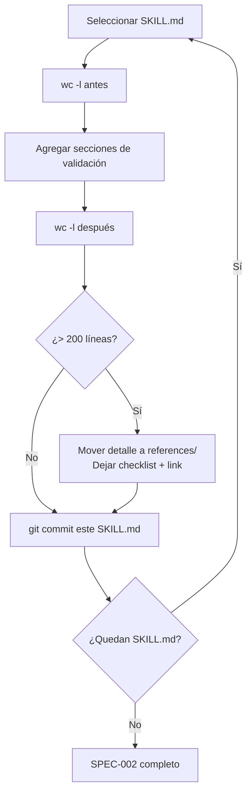
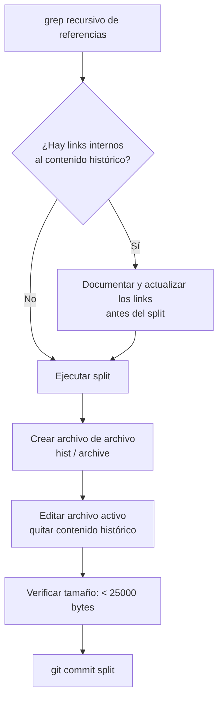

```yml
created_at: 2026-04-10 01:00:00
project: thyrox-framework
feature: technical-debt-resolution
design_version: 1.0
components: 7
status: En progreso
```

# Design — FASE 29: technical-debt-resolution

## Propósito

Documentar CÓMO implementar los 7 grupos del Plan: secuencia de operaciones, estructura de archivos resultante, contratos de cada artefacto nuevo, y decisiones de diseño que afectan la ejecución.

Basado en: `technical-debt-resolution-requirements-spec.md`

---

## 1. Visión General

FASE 29 es un trabajo de mantenimiento del framework THYROX. No agrega funcionalidad al producto — reorganiza, renombra y documenta. El resultado es un framework con:

- Un skill correctamente nombrado (`thyrox`)
- Archivos vivos dentro del límite de 25,000 bytes
- Workflows con instrucciones de validación
- Ciclo de vida cerrado para la deuda técnica

No hay código de aplicación involucrado — todos los cambios son en archivos `.md`, `.sh`, y configuración `.json`.

---

## 2. Decisiones de Diseño

### DA-000: Gate SP-02 antes de cualquier ejecución

**Contexto (GAP-02):** El Plan define SP-02 (GATE OPERACION) como obligatorio antes de editar SKILL.md y scripts. Sin él, se ejecutaría Phase 6 sin aprobación explícita.

**Decisión:** La primera tarea del task plan de Phase 5 DECOMPOSE es el item "⏸ SP-02 GATE OPERACION — presentar resumen de cambios y esperar aprobación explícita del usuario". NINGÚN lote de ejecución comienza hasta que ese gate sea aprobado.

**Consecuencias:**
- Positivas: el usuario tiene visibilidad completa antes de que se modifiquen archivos de configuración del framework
- Negativas: ninguna

---

### DA-001: Secuencia de ejecución — SPEC-001 primero, SPEC-003 parcial integrado

**Contexto:** SPEC-002 y SPEC-004 necesitan editar `thyrox/SKILL.md`, que no existe hasta que SPEC-001 complete el renombrado. Adicionalmente, SPEC-001 y SPEC-003 comparten archivos objetivo (`session-start.sh`, `project-status.sh`) — editarlos en dos lotes distintos viola el principio de un solo Edit por archivo.

**Decisión (GAP-03):** SPEC-001 se completa primero. Las ediciones a `session-start.sh` y `project-status.sh` combinan el renombrado (SPEC-001) Y las alertas (SPEC-003) en **una sola operación**. Los otros archivos de SPEC-003 (`update-state.sh`, `commit-msg-hook.sh`) van en Lote 3.

**Consecuencias:**
- Positivas: cada archivo se edita exactamente una vez; no hay dos commits para el mismo archivo
- Negativas: SPEC-001 y parte de SPEC-003 deben coordinarse en el mismo lote

---

### DA-002: git mv para el renombrado de directorio

**Contexto:** `mv` simple pierde el historial de git para los archivos movidos.

**Decisión:** Usar `git mv .claude/skills/pm-thyrox .claude/skills/thyrox` para preservar historial en cada archivo.

**Consecuencias:**
- Positivas: `git log --follow` funciona en los archivos del skill
- Negativas: ninguna significativa

---

### DA-003: Edición secuencial de SKILL.md (R-01)

**Contexto:** R-01 — editar en paralelo workflow-*/SKILL.md puede causar colisiones de section owners.

**Decisión:** Editar 1 SKILL.md a la vez. Secuencia: analyze → strategy → plan → structure → decompose → execute → track. Commit después de cada uno.

**Consecuencias:**
- Positivas: sin colisiones, rollback granular por archivo
- Negativas: más commits (7 commits solo para SPEC-002)

---

### DA-004: wc -l como gate de calidad para SKILL.md

**Contexto:** R-02 — agregar instrucciones puede inflar los SKILL.md más allá de 200 líneas.

**Decisión:** Ejecutar `wc -l` antes de editar y después. Si el resultado supera 200 líneas, mover el contenido detallado a un nuevo archivo en `references/` del skill correspondiente y dejar solo el checklist con un link.

**Consecuencias:**
- Positivas: SKILL.md mantiene legibilidad, detalle accesible por link
- Negativas: puede requerir crear nuevos archivos de referencia no planificados

---

### DA-005: grep recursivo antes de cada split

**Contexto:** R-03 — el split de ROADMAP.md puede romper links en otros archivos.

**Decisión:** Antes de ejecutar cada split, correr `grep -rn "ROADMAP\|CHANGELOG\|technical-debt" .claude/ --include="*.md"` para identificar todos los archivos que referencian el archivo a splitear. Evaluar si los links apuntan a secciones que se moverán.

**Consecuencias:**
- Positivas: cero referencias rotas
- Negativas: paso adicional de verificación

---

### DA-006: technical-debt-resolved.md en el WP, no global

**Contexto:** Los TDs resueltos necesitan un destino. Una archivo global `technical-debt-resolved.md` tendría el mismo problema de crecimiento.

**Decisión:** Cada WP que cierra TDs crea su propio `{wp}-technical-debt-resolved.md`. FASE 29 es el primer WP en usar este patrón.

**Consecuencias:**
- Positivas: trazabilidad exacta (TD X resuelto en WP Y), sin inflación de archivos globales
- Negativas: para encontrar un TD resuelto hay que buscar en los WPs

---

## 3. Componentes Afectados

### 3.1 Nuevos Componentes

| Componente | Ubicación | Propósito |
|------------|-----------|-----------|
| thyrox/SKILL.md | `.claude/skills/thyrox/SKILL.md` | Skill orquestador renombrado (era pm-thyrox) |
| wp-changelog.md.template | `.claude/skills/workflow-track/assets/wp-changelog.md.template` | Template para changelog por WP |
| technical-debt-resolved.md.template | `.claude/skills/workflow-track/assets/technical-debt-resolved.md.template` | Template para TDs resueltos por WP |
| {wp}-technical-debt-resolved.md | `context/work/2026-04-09-22-47-58-technical-debt-resolution/` | Primer uso del template — TDs resueltos en FASE 29 |
| ROADMAP-history.md | `ROADMAP-history.md` | FASEs 1–26 archivadas |
| CHANGELOG-archive.md | `CHANGELOG-archive.md` | Versiones v0.x y v1.x archivadas |

### 3.2 Componentes Modificados

| Componente | Ubicación | Cambios |
|------------|-----------|---------|
| CLAUDE.md | `.claude/CLAUDE.md` | 6 refs pm-thyrox → thyrox; addendum Locked Decision #5 |
| session-start.sh | `.claude/scripts/session-start.sh` | pm-thyrox → thyrox; alerta B-09 |
| project-status.sh | `.claude/scripts/project-status.sh` | pm-thyrox → thyrox; alerta B-08 |
| update-state.sh | `.claude/scripts/update-state.sh` | pm-thyrox → thyrox (si referencia) |
| commit-msg-hook.sh | `.claude/scripts/commit-msg-hook.sh` | pm-thyrox → thyrox (si referencia) |
| workflow-*/SKILL.md (7) | `.claude/skills/workflow-*/SKILL.md` | Validaciones pre-gate, deep review, git add now.md |
| workflow-track/SKILL.md | `.claude/skills/workflow-track/SKILL.md` | +D2: {wp}-changelog.md target; +D3: mover TDs |
| conventions.md | `.claude/references/conventions.md` | REGLA-LONGEV-001, timestamps, CHANGELOG rule |
| validate-session-close.sh | `.claude/scripts/validate-session-close.sh` | Verificación timestamps TD-018 |
| technical-debt.md | `.claude/context/technical-debt.md` | Cerrar TDs, mover [-], procedimiento de cierre |
| ROADMAP.md | `ROADMAP.md` | Queda con FASEs 27+ |
| CHANGELOG.md | `CHANGELOG.md` | Queda con [Unreleased] + v2.x+ |
| references/*.md (~10) | `.claude/references/*.md` | owner: pm-thyrox → thyrox |

### 3.3 Componentes Deprecados

| Componente | Ubicación | Razón | Plan |
|------------|-----------|-------|------|
| pm-thyrox/ (directorio) | `.claude/skills/pm-thyrox/` | Renombrado a thyrox | git mv → thyrox |

---

## 4. Estructura de Archivos Resultante

```
.claude/
├── skills/
│   ├── thyrox/                    ← ERA: pm-thyrox/ (git mv)
│   │   ├── SKILL.md               ← actualizado (refs + tabla Phase 7)
│   │   ├── references/
│   │   └── assets/
│   └── workflow-*/
│       ├── SKILL.md               ← actualizado (validaciones pre-gate)
│       └── assets/
│           └── workflow-track/
│               ├── wp-changelog.md.template           ← NUEVO
│               └── technical-debt-resolved.md.template ← NUEVO
├── scripts/
│   ├── session-start.sh           ← actualizado (refs + alerta B-09)
│   ├── project-status.sh          ← actualizado (refs + alerta B-08)
│   └── validate-session-close.sh  ← actualizado (timestamps TD-018)
├── references/
│   └── conventions.md             ← actualizado (LONGEV-001 + timestamps + CHANGELOG rule)
└── context/
    ├── technical-debt.md          ← actualizado (solo [ ] pendientes)
    └── work/2026-04-09-22-47-58-technical-debt-resolution/
        └── technical-debt-resolution-technical-debt-resolved.md ← NUEVO

ROADMAP.md               ← split: solo FASEs 27+
ROADMAP-history.md       ← NUEVO: FASEs 1–26
CHANGELOG.md             ← split: [Unreleased] + v2.x+
CHANGELOG-archive.md     ← NUEVO: v0.x + v1.x
```

---

## 5. Contratos de Nuevos Artefactos

### 5.1 `wp-changelog.md.template`

```
Input: commits del WP (git log desde inicio hasta cierre del WP)
Output: changelog estructurado por tipo (Added, Changed, Fixed, Removed)
Propósito: documentar QUÉ cambió en el código durante este WP

Estructura obligatoria:
- frontmatter: wp, fase, created_at
- ## [Unreleased] o ## [v.x.x] — fecha
- ### Added / Changed / Fixed / Removed
- cada entrada referencia su commit hash o TD

Creado en: Phase 7 TRACK
Ubicación: context/work/{wp}/{wp}-changelog.md
```

### 5.2 `technical-debt-resolved.md.template`

```
Input: lista de TDs cerrados en el WP (ID, descripción, commit que lo resolvió)
Output: registro de TDs con trazabilidad al WP
Propósito: documentar QUÉ deuda técnica saldó este WP

Estructura obligatoria:
- frontmatter: wp, fase, created_at
- tabla: | TD-ID | Descripción | Resolución | Commit | Fecha |
- sección de notas (TDs PARCIAL, excepciones, etc.)

Creado en: Phase 7 TRACK (o en Phase 6 si se cierran TDs durante ejecución)
Ubicación: context/work/{wp}/{wp}-technical-debt-resolved.md
```

### 5.3 Alerta B-08 en `project-status.sh`

```
Input: valor de current_work de now.md
Output: warning si el WP no aparece en ROADMAP.md
Comportamiento: grep del nombre del WP en ROADMAP.md. Si 0 resultados → ⚠ alerta. No falla.
```

### 5.4 Alerta B-09 en `session-start.sh`

```
Input: phase de now.md + ruta del WP activo
Output: warning si execution-log no existe en Phase 6
Comportamiento: si phase == "Phase 6", check si existe {wp}-execution-log.md. Si no → ⚠ alerta. No falla.
```

---

## 6. Flujos de Datos

### 6.1 Flujo del renombrado (SPEC-001)



### 6.2 Flujo de edición de SKILL.md (SPEC-002)



### 6.3 Flujo de split de archivos (SPEC-006)



---

## 7. Dependencias

### 7.1 Dependencias Internas (entre SPECs)

```
SPEC-001 → SPEC-002 (thyrox/SKILL.md debe existir antes de editarlo)
SPEC-001 → SPEC-004 (thyrox/SKILL.md tabla Phase 7)
SPEC-004 → SPEC-007 (template {wp}-technical-debt-resolved.md debe existir)
SPEC-004 → SPEC-006 (los TDs [-] van al archivo del template)
```

### 7.2 Dependencias de Datos

- `now.md` debe estar actualizado con `current_work` correcto para B-09
- `ROADMAP.md` debe tener entry de FASE 29 (ya existe — agregado en Phase 3)

---

## 8. Impacto

### 8.1 Cambios Breaking

| Cambio | Afecta a | Acción requerida |
|--------|----------|-----------------|
| pm-thyrox → thyrox | Cualquier script externo que invoque el skill por nombre | Verificar .claude/commands/ y settings.json |
| workflow-track ya no escribe root CHANGELOG.md | Phase 7 de futuros WPs | Ninguna — el template nuevo reemplaza la conducta |
| technical-debt.md sin entradas [-] | Consultas históricas a TDs | Usar {wp}-technical-debt-resolved.md del WP correspondiente |

### 8.2 Backward Compatibility

- Los WPs anteriores (FASEs 1–28) en `context/work/` no se tocan — historial intacto en git
- ROADMAP-history.md y CHANGELOG-archive.md contienen el histórico accesible

---

## 9. Plan de Rollback

Git as persistence — todo cambio va en commit. Para revertir cualquier SPEC:

```bash
# Revertir un SPEC específico
git revert <commit-hash>

# Revertir el renombrado completo (si git mv se hizo)
git mv .claude/skills/thyrox .claude/skills/pm-thyrox
git commit -m "revert(fase-29): revertir renombrado thyrox → pm-thyrox"
```

**Criterios de rollback:** Solo si un cambio produce un error que bloquea el framework (ej. session-start.sh falla al ejecutarse).

---

## 10. Validación

### 10.1 Criterios de validación por SPEC

| SPEC | Validación |
|------|------------|
| SPEC-001 | `grep -r "pm-thyrox" .claude/ --include="*.md" --include="*.sh"` retorna 0 en archivos activos |
| SPEC-002 | `wc -l .claude/skills/workflow-*/SKILL.md` — todos ≤ 200 líneas |
| SPEC-003 | Ejecutar `bash .claude/scripts/project-status.sh` con WP sin ROADMAP entry → ⚠ visible |
| SPEC-004 | Templates existen; workflow-track/SKILL.md tiene D2+D3; thyrox/SKILL.md tiene tabla actualizada |
| SPEC-005 | conventions.md tiene REGLA-LONGEV-001, timestamps, CHANGELOG rule |
| SPEC-006 | `wc -c ROADMAP.md CHANGELOG.md .claude/context/technical-debt.md` — todos < 25,000 bytes |
| SPEC-007 | `grep "\[ \]" .claude/context/technical-debt.md` — solo pendientes reales; TDs cerrados en {wp}-resolved |

### 10.2 Validación final de fase

```bash
# Verificar que no quedan referencias a pm-thyrox en archivos activos
grep -r "pm-thyrox" .claude/skills/thyrox/ .claude/CLAUDE.md .claude/scripts/ --include="*.md" --include="*.sh"

# Verificar tamaños
wc -c ROADMAP.md CHANGELOG.md .claude/context/technical-debt.md

# Verificar líneas en SKILL.md
wc -l .claude/skills/workflow-*/SKILL.md .claude/skills/thyrox/SKILL.md
```

---

## 11. Aprobación

- [ ] Design revisado por usuario — PENDIENTE
