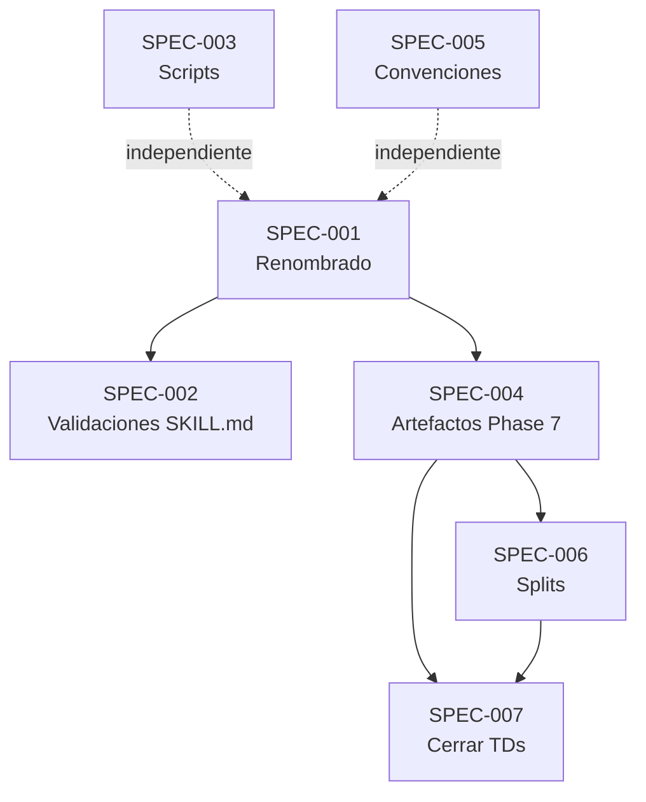

```yml
type: Especificación Técnica
category: Requisitos de Sistema
version: 1.0
purpose: Especificar qué debe quedar implementado al cerrar FASE 29
goal: Traducir los 7 grupos del Plan en criterios de aceptación verificables
created_at: 2026-04-10 01:00:00
```

# Especificación de Requisitos — FASE 29: technical-debt-resolution

## Resumen Ejecutivo

FASE 29 resuelve la deuda técnica acumulada del framework THYROX en 7 grupos: renombrado del skill orquestador de `pm-thyrox` a `thyrox`, adición de validaciones pre-gate en los 7 `workflow-*/SKILL.md`, mejoras a scripts existentes, nuevos artefactos de Phase 7, reglas de longevidad, splits de archivos sobredimensionados, y cierre formal de TDs ya implementados.

**Objetivo:** El framework debe quedar en estado coherente: nombres correctos, archivos dentro del límite de tamaño, workflows con guías de validación, y registro de TDs sin entradas obsoletas.

---

## Mapeo Plan → Especificación

| Grupo (Plan) | ID Spec | Descripción |
|-------------|---------|-------------|
| Grupo 1: Renombrado | SPEC-001 | pm-thyrox → thyrox en todos los archivos activos |
| Grupo 2: Validaciones pre-gate | SPEC-002 | Instrucciones de validación en 7 SKILL.md |
| Grupo 3: Scripts existentes | SPEC-003 | Mejoras a project-status.sh y session-start.sh |
| Grupo 4: Nuevos artefactos Phase 7 | SPEC-004 | Templates + actualización workflow-track/SKILL.md |
| Grupo 5: Longevidad y timestamps | SPEC-005 | REGLA-LONGEV-001 + timestamps en conventions.md |
| Grupo 6: Splits | SPEC-006 | ROADMAP, CHANGELOG, technical-debt splits |
| Grupo 7: Cerrar TDs | SPEC-007 | Marcar e mover TDs ya implementados |

---

## SPEC-001: Renombrado `pm-thyrox` → `thyrox`

**ID:** SPEC-001
**Grupo Plan:** Grupo 1
**TD:** TD-030 (renombrado)
**Prioridad:** Critical
**Estado:** Pendiente

### Descripción

El directorio `.claude/skills/pm-thyrox/` debe renombrarse a `.claude/skills/thyrox/`. Todos los archivos activos que referencian `pm-thyrox` deben actualizarse. Los archivos históricos (WPs anteriores, ADRs previos) no se tocan.

### Criterios de Aceptación

```
Given el directorio .claude/skills/pm-thyrox/ existe
When se ejecuta el renombrado
Then .claude/skills/thyrox/ existe y .claude/skills/pm-thyrox/ no existe
And grep -r "pm-thyrox" .claude/skills/ .claude/CLAUDE.md .claude/scripts/ retorna 0 resultados en archivos activos

Given CLAUDE.md referencia "pm-thyrox" en 6 lugares
When se actualizan las referencias
Then CLAUDE.md dice "thyrox" en todos esos lugares (incluyendo Locked Decision #5 addendum)

Given los 5 scripts referencian pm-thyrox
When se actualizan
Then session-start.sh, session-resume.sh, update-state.sh, project-status.sh, commit-msg-hook.sh usan "thyrox"

Given workflow-*/SKILL.md tiene grep filters con "pm-thyrox"
When se actualizan
Then workflow-analyze, workflow-strategy, workflow-track SKILL.md usan "thyrox" en sus grep filters

Given references/*.md tiene owner: pm-thyrox en frontmatter
When se actualiza el frontmatter
Then owner: thyrox en todos los archivos de references/

Given .claude/commands/ puede tener referencias a pm-thyrox
When se verifica con grep
Then se actualizan si existen, o se documenta que no hay referencias

Given WPs anteriores y ADRs existen en git
When se ejecuta el renombrado
Then los archivos en context/work/ (excepto el WP activo) y context/decisions/ NO se modifican
```

### Consideraciones Técnicas

- Usar `git mv` para el directorio (preserva historial)
- Verificar con `grep -r "pm-thyrox"` antes y después de cada bloque de cambios
- La ruta del Skill tool en settings.json puede referenciar pm-thyrox — verificar

### Implementación

**Archivos a Modificar/Crear:**
- `.claude/skills/pm-thyrox/` → renombrar a `.claude/skills/thyrox/`
- `.claude/CLAUDE.md` — 6 referencias + addendum Locked Decision #5
- `.claude/scripts/session-start.sh`
- `.claude/scripts/session-resume.sh` (verificar si existe)
- `.claude/scripts/update-state.sh`
- `.claude/scripts/project-status.sh`
- `.claude/scripts/commit-msg-hook.sh`
- `.claude/skills/workflow-analyze/SKILL.md` (grep filter)
- `.claude/skills/workflow-strategy/SKILL.md` (grep filter)
- `.claude/skills/workflow-track/SKILL.md` (grep filter)
- `.claude/references/*.md` (~10 archivos, frontmatter owner)
- `.claude/commands/` (verificar y actualizar si aplica)
- `.claude/settings.json` (verificar si referencia pm-thyrox)

**Complejidad:** Alta (muchos archivos, riesgo de referencia rota)

---

## SPEC-002: Validaciones pre-gate en los 7 `workflow-*/SKILL.md`

**ID:** SPEC-002
**Grupo Plan:** Grupo 2
**TDs:** TD-007, TD-028, TD-029, TD-031, TD-032, TD-033, TD-027 Plano A
**Prioridad:** High
**Estado:** Pendiente

### Descripción

Los 7 `workflow-*/SKILL.md` deben incluir instrucciones explícitas de validación antes de cada gate de phase. Adicionalmente, skills específicos reciben instrucciones adicionales (Step 0 en analyze, re-evaluación de tamaño en strategy, criterio auto-write + checklist mejorado en execute).

Cada edición debe verificar que el SKILL.md resultante tenga ≤ 200 líneas. Si supera el límite, mover el detalle a `references/` y dejar solo el checklist en el SKILL.

### Criterios de Aceptación

```
Given workflow-analyze/SKILL.md no tiene Step 0 END USER CONTEXT
When se agrega TD-007
Then la primera sección del SKILL describe cómo obtener contexto del usuario final antes de analizar

Given cualquiera de los 7 SKILL.md no tiene instrucción de validación pre-gate
When se agrega TD-029
Then cada SKILL tiene una sección o ítem que indica "antes de presentar el gate, verificar [criterios de la phase]"

Given cualquiera de los 7 SKILL.md no tiene instrucción de deep review
When se agrega TD-031
Then cada SKILL tiene instrucción de "revisar artefactos de la phase anterior antes de continuar"

Given cualquiera de los 7 SKILL.md no tiene instrucción de git add now.md
When se agrega TD-033
Then cada SKILL dice explícitamente "git add now.md antes de commits y gates"

Given workflow-strategy/SKILL.md no evalúa tamaño de WP
When se agrega TD-028
Then SKILL.md de strategy tiene criterio de re-evaluación (micro/pequeño/mediano/grande) antes del gate

Given workflow-execute/SKILL.md no tiene criterio auto-write
When se agrega TD-027 Plano A
Then SKILL.md tiene criterio explícito: cuándo Claude escribe sin preguntar vs cuándo requiere validación humana

Given workflow-execute/SKILL.md tiene pre-flight checklist básico
When se mejora TD-032
Then el checklist es más granular: verifica task-plan, execution-log, now.md state, branch activo

Given un SKILL.md resulta con > 200 líneas tras las ediciones
When se detecta con wc -l
Then el contenido detallado se mueve a un archivo en references/ y el SKILL queda con el checklist referenciando ese archivo
```

### Consideraciones Técnicas

- Editar 1 SKILL.md a la vez (R-01: sin ediciones paralelas)
- `wc -l` antes y después de cada edición (R-02: constraint)
- Orden sugerido: analyze → strategy → plan → structure → decompose → execute → track

### Implementación

**Archivos a Modificar:**
- `.claude/skills/workflow-analyze/SKILL.md`
- `.claude/skills/workflow-strategy/SKILL.md`
- `.claude/skills/workflow-plan/SKILL.md`
- `.claude/skills/workflow-structure/SKILL.md`
- `.claude/skills/workflow-decompose/SKILL.md`
- `.claude/skills/workflow-execute/SKILL.md`
- `.claude/skills/workflow-track/SKILL.md`

**Complejidad:** Alta (7 archivos, constraint de tamaño activo)

---

## SPEC-003: Mejoras a scripts existentes (B-08, B-09)

**ID:** SPEC-003
**Grupo Plan:** Grupo 3
**Items:** B-08, B-09
**Prioridad:** Medium
**Estado:** Pendiente

### Descripción

Dos scripts existentes reciben alertas preventivas: `project-status.sh` alerta si el WP activo no tiene entry en ROADMAP.md; `session-start.sh` alerta si execution-log no existe cuando la Phase activa es Phase 6.

### Criterios de Aceptación

```
Given project-status.sh se ejecuta y hay un WP activo
When ese WP no tiene entry en ROADMAP.md
Then el script muestra una alerta visible: "⚠ WP activo no encontrado en ROADMAP.md"
And no detiene la ejecución (warning, no error fatal)

Given session-start.sh se ejecuta
When now.md indica phase: Phase 6 y no existe {wp}-execution-log.md
Then el script muestra una alerta: "⚠ Phase 6 activa pero execution-log no existe"
And no detiene la ejecución (warning, no error fatal)
```

### Implementación

**Archivos a Modificar:**
- `.claude/scripts/project-status.sh`
- `.claude/scripts/session-start.sh`

**Complejidad:** Baja

---

## SPEC-004: Nuevos artefactos de Phase 7

**ID:** SPEC-004
**Grupo Plan:** Grupo 4
**TDs:** TD-034 (parcial)
**Prioridad:** High
**Estado:** Pendiente

### Descripción

Phase 7 TRACK debe generar dos nuevos artefactos por WP: `{wp}-changelog.md` (cambios semánticos del WP: feat/fix/refactor desde git commits) y `{wp}-technical-debt-resolved.md` (TDs cerrados en ese WP). Ambos necesitan templates y referencias en el SKILL de track y en el SKILL orquestador.

### Criterios de Aceptación

```
Given workflow-track/assets/ no tiene wp-changelog.md.template
When se crea el template
Then el archivo existe y sigue el patrón "Keep a Changelog" adaptado a WPs (secciones: Added, Changed, Fixed, deuda técnica resuelta)

Given workflow-track/assets/ no tiene technical-debt-resolved.md.template
When se crea el template
Then el archivo existe con estructura: frontmatter (wp, fecha, fase), tabla de TDs resueltos (ID, descripción, commit)

Given workflow-track/SKILL.md escribe en root CHANGELOG.md
When se actualiza [D2]
Then SKILL.md dice: crear {wp}-changelog.md en el directorio del WP (no en root)

Given workflow-track/SKILL.md no tiene paso de mover TDs
When se agrega [D3]
Then SKILL.md tiene paso explícito: "mover TDs cerrados en este WP a {wp}-technical-debt-resolved.md"

Given thyrox/SKILL.md tabla Phase 7 no lista los nuevos artefactos
When se actualiza
Then la tabla de artefactos de Phase 7 incluye {wp}-changelog.md y {wp}-technical-debt-resolved.md con sus templates

Given technical-debt.md no documenta el procedimiento de cierre
When se agrega el procedimiento
Then technical-debt.md tiene sección de convenciones que explica: cuando un TD se implementa, se mueve al {wp}-technical-debt-resolved.md del WP que lo resolvió
```

### Implementación

**Archivos a Crear:**
- `.claude/skills/workflow-track/assets/wp-changelog.md.template`
- `.claude/skills/workflow-track/assets/technical-debt-resolved.md.template`

**Archivos a Modificar:**
- `.claude/skills/workflow-track/SKILL.md` (dos cambios: D2 target + D3 paso TD)
- `.claude/skills/thyrox/SKILL.md` (tabla Phase 7 — nombre nuevo tras SPEC-001)
- `.claude/context/technical-debt.md` (procedimiento de cierre)

**Complejidad:** Media

---

## SPEC-005: Reglas de longevidad y timestamps

**ID:** SPEC-005
**Grupo Plan:** Grupo 5
**TDs:** TD-001, TD-018, TD-035
**Prioridad:** High
**Estado:** Pendiente

### Descripción

`conventions.md` recibe la REGLA-LONGEV-001 (umbral de 25,000 bytes para archivos vivos) y la regla de timestamps en artefactos (TD-001). `validate-session-close.sh` recibe verificación de timestamps (TD-018).

### Criterios de Aceptación

```
Given conventions.md no tiene regla de tamaño para archivos vivos
When se agrega REGLA-LONGEV-001
Then conventions.md tiene sección que dice: cuando un archivo vivo supera 25,000 bytes, mover contenido histórico/cerrado a un archivo de archivo ({nombre}-history.md o {nombre}-archive.md)

Given conventions.md no tiene regla de timestamps en artefactos
When se agrega TD-001
Then conventions.md especifica: todo artefacto WP con created_at o updated_at debe tener timestamp en formato YYYY-MM-DD HH:MM:SS

Given validate-session-close.sh no verifica timestamps
When se actualiza TD-018
Then el script verifica que los artefactos del WP activo tienen timestamps válidos y alerta si falta

Given un archivo vivo como technical-debt.md o ROADMAP.md supera 25,000 bytes en el futuro
When el framework opera normalmente
Then la REGLA-LONGEV-001 sirve de guía para que el agente detecte y actúe (no requiere hook automático en esta FASE)
```

### Implementación

**Archivos a Modificar:**
- `.claude/references/conventions.md` (REGLA-LONGEV-001 + timestamps TD-001)
- `.claude/scripts/validate-session-close.sh` (TD-018)

**Complejidad:** Baja

---

## SPEC-006: Splits de archivos sobredimensionados

**ID:** SPEC-006
**Grupo Plan:** Grupo 6
**TDs:** TD-026, TD-034
**Prioridad:** Critical
**Estado:** Pendiente

### Descripción

Tres archivos superan el límite Read tool (32,500 bytes / 10,000 tokens): `technical-debt.md` (176%), `ROADMAP.md` (140%), `CHANGELOG.md` (119%). Cada uno se divide en un archivo activo (solo contenido vigente) y un archivo de archivo (contenido histórico/cerrado). Root `CHANGELOG.md` queda con solo sección `[Unreleased]`, y la regla de actualización solo en releases se documenta en `conventions.md`.

**Pre-requisito:** Ejecutar grep recursivo antes de cada split para identificar referencias rotas (R-03).

### Criterios de Aceptación

```
Given ROADMAP.md tiene FASEs 1–26 completadas (histórico)
When se verifica con grep recursivo que no hay referencias que rompan
And se mueven FASEs 1–26 a ROADMAP-history.md
Then ROADMAP.md tiene solo FASEs 27+ (actuales/futuras)
And ROADMAP-history.md contiene FASEs 1–26
And ROADMAP.md tiene < 25,000 bytes

Given CHANGELOG.md tiene versiones v0.x y v1.x históricas
When se archivan en CHANGELOG-archive.md
Then CHANGELOG.md tiene solo sección [Unreleased] y versiones v2.x+
And CHANGELOG-archive.md contiene v0.x y v1.x
And CHANGELOG.md tiene < 25,000 bytes

Given technical-debt.md tiene TDs con marcador [-] ya resueltos en FASE 23 (TD-019, TD-020, TD-023, TD-024)
When se mueven al {wp}-technical-debt-resolved.md de FASE 29
Then technical-debt.md ya no contiene esas entradas [-]
And el archivo tiene < 25,000 bytes

Note (GAP-01 corregido): TD-021 NO está en este grupo. Phase 1 lo encontró marcado [ ] (implementado sin marcar formalmente), por lo que va a SPEC-007 para cierre formal. Solo van aquí los marcados [-] sin verificación adicional: TD-019, TD-020, TD-023, TD-024.

Given conventions.md no documenta que root CHANGELOG.md solo se actualiza en releases
When se agrega la regla
Then conventions.md tiene sección que establece: root CHANGELOG.md = producción (merges a main); {wp}-changelog.md = desarrollo (cambios por WP)
```

### Consideraciones Técnicas

- ROADMAP split: grep recursivo antes → `grep -r "ROADMAP" .claude/ --include="*.md"` para identificar links
- CHANGELOG split: verificar si algún script referencia el archivo por ruta específica
- technical-debt split: los TDs `[-]` a mover son TD-019, TD-020, TD-023, TD-024 (NO TD-021 — este va a SPEC-007)

### Implementación

**Archivos a Crear:**
- `ROADMAP-history.md` (FASEs 1–26)
- `CHANGELOG-archive.md` (v0.x, v1.x)
- `{wp}-technical-debt-resolved.md` (en el WP activo — también creado por SPEC-004 template)

**Archivos a Modificar:**
- `ROADMAP.md` (queda con FASEs 27+)
- `CHANGELOG.md` (queda con [Unreleased] + v2.x+)
- `technical-debt.md` (queda con [ ] pendientes)
- `.claude/references/conventions.md` (regla CHANGELOG raíz)

**Complejidad:** Alta (riesgo de referencias rotas, operaciones de archivo)

---

## SPEC-007: Cerrar TDs ya implementados

**ID:** SPEC-007
**Grupo Plan:** Grupo 7
**TDs a cerrar:** TD-002, TD-004, TD-011, TD-016, TD-017, TD-021
**Prioridad:** Medium
**Estado:** Pendiente

### Descripción

Seis TDs verificados en Phase 1 como ya implementados (pero sin marcar) se cierran formalmente: se marcan `[x]` en `technical-debt.md` y se mueven a `{wp}-technical-debt-resolved.md` de FASE 29. TD-011 tiene tratamiento especial: se marca como "implementado suficiente" sin acción adicional.

### Criterios de Aceptación

```
Given TD-002, TD-004, TD-016, TD-017, TD-021 están marcados [ ] en technical-debt.md
When se verifica que están implementados (grep confirm)
And se marcan [x] con fecha 2026-04-10
Then aparecen en {wp}-technical-debt-resolved.md de FASE 29 con referencia al WP que los implementó

Given TD-011 está marcado PARCIAL en technical-debt.md
When se evalúa que "implementado suficiente"
Then se marca [x] con nota "PARCIAL — implementado suficiente, sin acción adicional en FASE 29"
And se mueve a {wp}-technical-debt-resolved.md con la nota de tratamiento especial

Given technical-debt.md antes del cierre
When todos los TDs cerrados se mueven
Then el archivo no tiene entradas [x] ni [-] de FASEs previas (solo [ ] pendientes de FASEs futuras)
```

### Implementación

**Archivos a Modificar:**
- `.claude/context/technical-debt.md` (marcar [x] + actualizar entradas)

**Archivos a Crear:**
- `{wp}-technical-debt-resolved.md` (primer uso del template creado en SPEC-004)

**Complejidad:** Baja

---

## Dependencias Entre Especificaciones

```
SPEC-001 debe completarse PRIMERO — cambia la ruta del SKILL orquestador
  SPEC-001 → SPEC-002 (editar thyrox/SKILL.md, no pm-thyrox/SKILL.md)
  SPEC-001 → SPEC-004 (actualizar thyrox/SKILL.md tabla Phase 7)

SPEC-004 template debe existir antes de SPEC-007
  SPEC-004 → SPEC-007 (el template {wp}-technical-debt-resolved.md se usa en SPEC-007)

SPEC-006 split de technical-debt depende de SPEC-004
  SPEC-004 → SPEC-006 (los TDs [-] van al archivo creado por el template)

SPEC-002, SPEC-003, SPEC-005 son independientes entre sí
  Pueden ejecutarse en paralelo SOLO si editan archivos distintos — ver R-01
```



---

## Gate obligatorio antes de ejecutar

**⏸ SP-02 GATE OPERACION (GAP-02 corregido):** Antes de iniciar Phase 6 EXECUTE, el usuario debe aprobar explícitamente. Ningún SPEC comienza sin este gate. Este gate debe aparecer como primera tarea en Phase 5 DECOMPOSE (task plan).

## Orden de implementación recomendado

```
⏸ GATE OPERACION SP-02 — aprobación explícita requerida antes de iniciar

Lote 1 (sin dependencias):   SPEC-001 (renombrado)
                             + SPEC-003 para session-start.sh y project-status.sh
                             ← GAP-03 corregido: scripts compartidos se editan UNA SOLA VEZ
                             (rename + alert en la misma edición, no en lotes separados)

Lote 2 (post-SPEC-001):      SPEC-004 (templates + SKILL.md)

Lote 3 (post-SPEC-004):      SPEC-002 en secuencia R-01 (7 SKILL.md, uno por commit)
                             + SPEC-003 solo para update-state.sh y commit-msg-hook.sh
                             (los que no fueron editados en Lote 1)
                             + SPEC-005 (conventions.md + validate-session-close.sh)

Lote 4 (post-SPEC-004):      SPEC-006 (splits: ROADMAP, CHANGELOG, technical-debt)

Lote 5 (post-SPEC-004+006):  SPEC-007 (cerrar TDs)
```

---

## Riesgos por SPEC

| SPEC | Riesgo | Severidad | Mitigación |
|------|--------|-----------|-----------|
| SPEC-001 | Referencia rota a pm-thyrox en archivo no listado | Alta | grep recursivo post-rename |
| SPEC-002 | SKILL.md supera 200 líneas | Media | wc -l antes y después, extraer a references/ |
| SPEC-006 | Link roto en ROADMAP split | Alta | grep recursivo previo (R-03) |
| SPEC-006 | technical-debt.md split incompleto | Media | Verificar grep TD-019..TD-024 (R-04) |

---

## Estado de aprobación

- [ ] Spec aprobada por usuario — PENDIENTE
