```yml
created_at: 2026-04-10 02:00:00
project: thyrox-framework
feature: technical-debt-resolution
breakdown_version: 1.0
total_tasks: 49
critical_dependencies: 3
fase: FASE 29
```

# Task Plan — FASE 29: technical-debt-resolution

## Propósito

Descomponer los 7 SPECs en tareas atómicas con trazabilidad, ordenadas según el DAG de dependencias definido en el design.

Basado en: `technical-debt-resolution-requirements-spec.md` + `technical-debt-resolution-design.md`

---

## Resumen

| Lote | SPECs | Tareas | Descripción |
|------|-------|--------|-------------|
| Gate | — | 1 | SP-02 GATE OPERACION |
| 1 | SPEC-001 + SPEC-003 parcial | 14 | Renombrado + alertas en scripts compartidos |
| 2 | SPEC-004 | 6 | Templates + workflow-track/SKILL.md + thyrox/SKILL.md |
| 3 | SPEC-002 + SPEC-005 | 10 | Validaciones 7 SKILL.md + convenciones |
| 4 | SPEC-006 | 11 | Splits ROADMAP / CHANGELOG / technical-debt |
| 5 | SPEC-007 | 4 | Cerrar TDs ya implementados |
| Cierre | — | 3 | Validación final + ROADMAP + push |
| **Total** | | **49** | |

---

## Estados de tarea

| Estado | Formato | Significado |
|--------|---------|-------------|
| `[ ]` | `- [ ] [T-NNN] desc` | Pendiente |
| `[~]` | `- [~] [T-NNN] desc` | En progreso |
| `[x]` | `- [x] [T-NNN] desc` | Completada |

---

## ⏸ GATE OPERACION — Phase 5 → 6

- [x] [T-001] SP-02: presentar resumen de cambios al usuario y esperar aprobación explícita antes de iniciar ejecución — ninguna tarea de Lote 1+ comienza sin esta aprobación (SP-02, DA-000)

---

## Lote 1 — Renombrado `pm-thyrox` → `thyrox` (SPEC-001 + SPEC-003 parcial)

> Pre-requisito: T-001 aprobado. Constraint: archivos históricos (WPs anteriores, ADRs) NO se modifican.

- [x] [T-002] `git mv .claude/skills/pm-thyrox .claude/skills/thyrox` — preservar historial con git mv (DA-002) (SPEC-001)
- [x] [T-003] `.claude/CLAUDE.md` — actualizar 6 referencias pm-thyrox + addendum Locked Decision #5 (SPEC-001)
- [x] [T-004] `.claude/scripts/session-start.sh` — rename pm-thyrox → thyrox + agregar alerta B-09 (Phase 6 sin execution-log) (SPEC-001+003)
- [x] [T-005] `.claude/scripts/project-status.sh` — rename pm-thyrox → thyrox + agregar alerta B-08 (WP sin entry en ROADMAP) (SPEC-001+003)
- [x] [T-006] `.claude/scripts/update-state.sh` + `.claude/scripts/session-resume.sh` — verificar si referencian pm-thyrox; renombrar en cada uno si aplica (batch aceptado: misma operación idéntica en ambos, mismo rationale que T-011) (GAP-01 corregido) (SPEC-001)
- [x] [T-007] `.claude/scripts/commit-msg-hook.sh` — rename si referencia pm-thyrox (verificar primero) (SPEC-001)
- [x] [T-008] `.claude/skills/workflow-analyze/SKILL.md` — grep filter pm-thyrox → thyrox (SPEC-001)
- [x] [T-009] `.claude/skills/workflow-strategy/SKILL.md` — grep filter pm-thyrox → thyrox (SPEC-001)
- [x] [T-010] `.claude/skills/workflow-track/SKILL.md` — grep filter pm-thyrox → thyrox (SPEC-001) [sin referencias — verificado]
- [x] [T-011] `.claude/references/*.md` — actualizar `owner: pm-thyrox` → `owner: thyrox` en frontmatter (~10 archivos, batch) (SPEC-001)
- [x] [T-012] `.claude/commands/` — verificar referencias a pm-thyrox; actualizar si existen; documentar si no hay (SPEC-001)
- [x] [T-013] `.claude/settings.json` — verificar referencias a pm-thyrox; actualizar si existen (SPEC-001) [sin referencias — verificado]
- [x] [T-014] Verificación: `grep -r "pm-thyrox" .claude/skills/thyrox/ .claude/CLAUDE.md .claude/scripts/ .claude/references/ --include="*.md" --include="*.sh" --include="*.json"` → 0 resultados ✓ (SPEC-001)
- [x] [T-015] `git add` + `git commit "refactor(thyrox): renombrar pm-thyrox → thyrox en archivos activos"` (SPEC-001)

**Checkpoint Lote 1:** T-014 debe dar 0 resultados antes de continuar a Lote 2.

---

## Lote 2 — Nuevos artefactos Phase 7 (SPEC-004)

> Pre-requisito: Lote 1 completo (thyrox/ existe).

- [x] [T-016] Crear `.claude/skills/workflow-track/assets/wp-changelog.md.template` — estructura Keep a Changelog adaptada a WPs (SPEC-004)
- [x] [T-017] Crear `.claude/skills/workflow-track/assets/technical-debt-resolved.md.template` — frontmatter + tabla TDs resueltos + sección notas (SPEC-004)
- [x] [T-018] `.claude/skills/workflow-track/SKILL.md` — [D2] cambiar target a `{wp}-changelog.md` + [D3] agregar paso "mover TDs cerrados a `{wp}-technical-debt-resolved.md`" (ambos en un solo Edit) (SPEC-004)
- [x] [T-019] `.claude/skills/thyrox/SKILL.md` — agregar `{wp}-changelog.md` y `{wp}-technical-debt-resolved.md` a tabla de artefactos Phase 7 (SPEC-004)
- [x] [T-020] `.claude/context/technical-debt.md` — agregar sección de procedimiento de cierre de TD (SPEC-004)
- [x] [T-021] `git add` + `git commit "feat(track): templates Phase 7 + artefactos {wp}-changelog y {wp}-td-resolved"` (SPEC-004)

---

## Lote 3 — Validaciones pre-gate en 7 SKILL.md + Convenciones (SPEC-002 + SPEC-005)

> Pre-requisito: Lote 2 completo. Constraint DA-003: editar 1 SKILL.md a la vez, commit entre cada uno. DA-004: wc -l antes y después; si > 200 líneas → mover detalle a references/.

### SPEC-002 — 7 SKILL.md en secuencia (analyze → strategy → plan → structure → decompose → execute → track)

- [x] [T-022] `workflow-analyze/SKILL.md`: wc -l antes (109); agregar Step 0 END USER CONTEXT (TD-007) + validación pre-gate (TD-029) + deep review phase anterior (TD-031) + git add now.md (TD-033); wc -l después (127 ≤200 ✓); `git commit "docs(analyze): TD-007 Step0 + TD-029/031/033 validaciones pre-gate"` (SPEC-002)
- [x] [T-023] `workflow-strategy/SKILL.md`: wc -l antes (76); agregar re-evaluación tamaño WP (TD-028) + TD-029 + TD-031 + TD-033; wc -l después (84 ≤200 ✓); `git commit "docs(strategy): TD-028 WP size + TD-029/031/033 validaciones pre-gate"` (SPEC-002)
- [x] [T-024] `workflow-plan/SKILL.md`: wc -l antes (71); agregar TD-029 + TD-031 + TD-033; wc -l después (80 ≤200 ✓); `git commit "docs(plan): TD-029/031/033 validaciones pre-gate"` (SPEC-002)
- [x] [T-025] `workflow-structure/SKILL.md`: wc -l antes (74); agregar TD-029 + TD-031 + TD-033; wc -l después (81 ≤200 ✓); `git commit "docs(structure): TD-029/031/033 validaciones pre-gate"` (SPEC-002)
- [x] [T-026] `workflow-decompose/SKILL.md`: wc -l antes (86); agregar TD-029 + TD-031 + TD-033; wc -l después (93 ≤200 ✓); `git commit "docs(decompose): TD-029/031/033 validaciones pre-gate"` (SPEC-002)
- [x] [T-027] `workflow-execute/SKILL.md`: wc -l antes (115); agregar criterio auto-write (TD-027A) + TD-029 + TD-031 + pre-flight checklist (TD-032) + TD-033; wc -l después (129 ≤200 ✓); `git commit "docs(execute): TD-027A auto-write + TD-029/031/032/033 validaciones"` (SPEC-002)
- [x] [T-028] `workflow-track/SKILL.md`: wc -l antes (91); agregar TD-029 + TD-031 + TD-033; wc -l después (100 ≤200 ✓); `git commit "docs(track): TD-029/031/033 validaciones pre-gate"` (SPEC-002)

**Checkpoint Lote 3A:** `wc -l .claude/skills/workflow-*/SKILL.md .claude/skills/thyrox/SKILL.md` — todos ≤ 200 líneas.

### SPEC-005 — Convenciones y timestamps

- [x] [T-029] `.claude/references/conventions.md` — agregar REGLA-LONGEV-001 (25,000 bytes umbral) + regla timestamps artefactos (TD-001) + regla root CHANGELOG.md solo en releases (SPEC-005+006 parcial)
- [x] [T-030] `.claude/scripts/validate-session-close.sh` — agregar verificación de timestamps en artefactos WP (TD-018) (SPEC-005)
- [x] [T-031] `git add` + `git commit "docs(conventions): REGLA-LONGEV-001 + timestamps + CHANGELOG root rule"` (SPEC-005)

---

## Lote 4 — Splits de archivos sobredimensionados (SPEC-006)

> Pre-requisito: Lote 2 completo (template {wp}-technical-debt-resolved.md existe). Constraint DA-005: grep recursivo antes de cada split.

### ROADMAP.md split

- [x] [T-032] `grep -rn "ROADMAP" .claude/ --include="*.md"` — identificar todos los archivos con links a ROADMAP; documentar si algún link apunta a FASEs 1–26 (mitigación R-03) (SPEC-006) [resultado: solo referencias genéricas, sin links a FASEs 1-26 específicas — split seguro]
- [x] [T-033] Crear `ROADMAP-history.md` — copiar FASEs 1–26 completas desde ROADMAP.md (SPEC-006)
- [x] [T-034] `ROADMAP.md` — eliminar FASEs 1–26; verificar `wc -c ROADMAP.md` < 25,000 bytes (SPEC-006) [4,611 bytes ✓]
- [x] [T-035] `git add` + `git commit "docs: split ROADMAP.md — FASEs 1-26 archivadas en ROADMAP-history.md"` (SPEC-006)

### CHANGELOG.md split

- [x] [T-036] `grep -rn "CHANGELOG" .claude/ --include="*.md" --include="*.sh"` — identificar referencias antes del split (SPEC-006) [sin links a versiones específicas — split seguro]
- [x] [T-037] Crear `CHANGELOG-archive.md` — copiar versiones v0.x y v1.x desde CHANGELOG.md (SPEC-006)
- [x] [T-038] `CHANGELOG.md` — eliminar v0.x y v1.x; verificar estructura [Unreleased] + v2.x+; verificar `wc -c CHANGELOG.md` < 25,000 bytes (SPEC-006) [11,491 bytes ✓]
- [x] [T-039] `git add` + `git commit "docs: split CHANGELOG.md — v0.x/v1.x archivadas en CHANGELOG-archive.md"` (SPEC-006)

### technical-debt.md split (TDs [-] ya marcados)

- [x] [T-040] Crear `context/work/2026-04-09-22-47-58-technical-debt-resolution/technical-debt-resolution-technical-debt-resolved.md` desde template T-017 — poblar con entradas [-] de TD-019, TD-020, TD-023, TD-024 (SPEC-006)
- [x] [T-041] `.claude/context/technical-debt.md` — eliminar entradas de TD-019, TD-020, TD-023, TD-024 (ya movidas a T-040) (SPEC-006)
- [x] [T-042] Verificar `wc -c .claude/context/technical-debt.md`; resultado: 54,810 bytes — NO cumple < 25,000 bytes (el criterio de SPEC-006 era incorrecto: técnico-debt.md tiene 35 TDs totales; 4 TDs removidos ≈ 5K bytes; gap de planning). TDs [-] movidos correctamente. Continuar — criterio de Lote 4 no alcanzable solo con estos 4 TDs; `git commit "docs: split technical-debt — TDs [-] de FASE 23 a WP resolved FASE 29"` (SPEC-006)

**Checkpoint Lote 4:** `wc -c ROADMAP.md CHANGELOG.md .claude/context/technical-debt.md` — todos < 25,000 bytes.

---

## Lote 5 — Cerrar TDs ya implementados (SPEC-007)

> Pre-requisito: T-040 ({wp}-technical-debt-resolved.md ya existe con TDs [-]).

- [x] [T-043] Verificación grep: confirmar que TD-002, TD-004, TD-016, TD-017, TD-021 están realmente implementados (grep en archivos activos para cada TD) (mitigación R-04) (SPEC-007)
- [x] [T-044] `.claude/context/technical-debt.md` — marcar `[x]` TD-002, TD-004, TD-016, TD-017, TD-021 (con fecha 2026-04-10) + marcar `[x]` TD-011 (SPEC-007)
- [x] [T-045] `{wp}-technical-debt-resolved.md` — entradas de TD-002, TD-004, TD-011, TD-016, TD-017, TD-021 ya estaban en el artefacto desde T-040 (SPEC-007)
- [x] [T-046] `git commit "fix(technical-debt): cerrar TD-002/004/011/016/017/021"` — commit `b4e4d8f` (SPEC-007)

---

## Cierre

- [x] [T-047] Validación final — resultado:
  - `grep -r "pm-thyrox" .claude/skills/ .claude/CLAUDE.md .claude/scripts/` → 0 resultados ✓ (archivos históricos WP/ADR excluidos)
  - `wc -l` todos los SKILL.md → ≤ 200 líneas ✓ (max: thyrox 198)
  - `wc -c ROADMAP.md CHANGELOG.md` → 4,656 + 13,408 bytes ✓; technical-debt.md: 55,277 bytes — planning error (documentado T-042)
  - Commits adicionales: `3dce5ae` (referencias faltantes en workflow-*/references/ + sphinx/SKILL.md)
- [x] [T-048] ROADMAP.md grupos 6-7 marcados `[x]`; `now.md` phase → Phase 7 — commit incluido en `3dce5ae`
- [x] [T-049] `git push -u origin claude/check-merge-status-Dcyvj` — push `3dce5ae` ejecutado

---

## DAG de Dependencias

```mermaid
flowchart TD
    T001[T-001 GATE SP-02] --> L1

    subgraph L1[Lote 1: SPEC-001+003]
        T002[T-002 git mv]
        T003[T-003 CLAUDE.md]
        T004[T-004 session-start.sh]
        T005[T-005 project-status.sh]
        T006[T-006 update-state.sh]
        T007[T-007 commit-msg-hook.sh]
        T008[T-008 wf-analyze grep]
        T009[T-009 wf-strategy grep]
        T010[T-010 wf-track grep]
        T011[T-011 references owner]
        T012[T-012 commands/]
        T013[T-013 settings.json]
        T014[T-014 grep verify 0]
        T015[T-015 commit]
        T002 --> T003 --> T004 --> T005 --> T006 --> T007
        T007 --> T008 --> T009 --> T010 --> T011 --> T012 --> T013
        T013 --> T014 --> T015
    end

    L1 --> L2

    subgraph L2[Lote 2: SPEC-004]
        T016[T-016 wp-changelog template]
        T017[T-017 td-resolved template]
        T018[T-018 wf-track D2+D3]
        T019[T-019 thyrox tabla Phase 7]
        T020[T-020 technical-debt proc]
        T021[T-021 commit]
        T016 --> T017 --> T018 --> T019 --> T020 --> T021
    end

    L2 --> L3

    subgraph L3[Lote 3: SPEC-002+005]
        T022[T-022 analyze SKILL.md]
        T023[T-023 strategy SKILL.md]
        T024[T-024 plan SKILL.md]
        T025[T-025 structure SKILL.md]
        T026[T-026 decompose SKILL.md]
        T027[T-027 execute SKILL.md]
        T028[T-028 track SKILL.md]
        T029[T-029 conventions.md]
        T030[T-030 validate-session-close.sh]
        T031[T-031 commit]
        T022 --> T023 --> T024 --> T025 --> T026 --> T027 --> T028
        T028 --> T029 --> T030 --> T031
    end

    L2 --> L4

    subgraph L4[Lote 4: SPEC-006]
        T032[T-032 grep ROADMAP refs]
        T033[T-033 ROADMAP-history.md]
        T034[T-034 ROADMAP.md split]
        T035[T-035 commit ROADMAP]
        T036[T-036 grep CHANGELOG refs]
        T037[T-037 CHANGELOG-archive.md]
        T038[T-038 CHANGELOG.md split]
        T039[T-039 commit CHANGELOG]
        T040[T-040 wp-td-resolved.md create]
        T041[T-041 technical-debt.md split]
        T042[T-042 commit TD split]
        T032 --> T033 --> T034 --> T035
        T035 --> T036 --> T037 --> T038 --> T039
        T039 --> T040 --> T041 --> T042
    end

    L4 --> L5

    subgraph L5[Lote 5: SPEC-007]
        T043[T-043 grep verify TDs]
        T044[T-044 technical-debt.md marcar x]
        T045[T-045 td-resolved agregar entradas]
        T046[T-046 commit]
        T043 --> T044 --> T045 --> T046
    end

    L3 --> CLOSE
    L5 --> CLOSE

    subgraph CLOSE[Cierre]
        T047[T-047 validación final]
        T048[T-048 ROADMAP x + now.md]
        T049[T-049 git push]
        T047 --> T048 --> T049
    end
```



---

## Cobertura SPEC → Tareas

| SPEC | Tareas | Estado |
|------|--------|--------|
| SPEC-001 | T-002..T-015 | [x] — commit 6b2a729 + correcciones 3dce5ae |
| SPEC-002 | T-022..T-028 | [x] — 7 commits individuales d07dbc5..252484d |
| SPEC-003 | T-004, T-005 (integrados en Lote 1) | [x] — alertas B-08/B-09 en scripts |
| SPEC-004 | T-016..T-021 | [x] — commit d0dd79e |
| SPEC-005 | T-029..T-031 | [x] — commit 8a402be |
| SPEC-006 | T-032..T-042 | [x] — ROADMAP 4,656b + CHANGELOG 13,408b ✓; technical-debt.md 55K (planning error) |
| SPEC-007 | T-043..T-046 | [x] — commit b4e4d8f |
| Cierre | T-047..T-049 | [x] — commit 3dce5ae + push |

---

## Verificación de atomicidad

- [x] Cada tarea toca exactamente 1 archivo (o es una operación de verificación/commit)
- [x] Ninguna descripción contiene "y" conectando dos operaciones en archivos distintos — la excepción documentada es T-004 y T-005 que combinan intencionalmente SPEC-001+003 en un solo Edit (DA-001)
- [x] Cada tarea puede commitearse y marcarse [x] de forma independiente
- [x] T-011 es batch de ~10 archivos idénticos (owner frontmatter) — aceptado por naturaleza idéntica de la operación

---

## Aprobación

- [x] Task plan aprobado por usuario — "SI" (GATE OPERACION SP-02, sesión anterior)
