```yml
created_at: 2026-04-11-21-38-17
project: thyrox-framework
feature: thyrox-commands-namespace
breakdown_version: 1.0
tasks_creator: claude
total_tasks: 20
critical_dependencies: 2
planned_start: 2026-04-11-21-38-17
implementation_owner: claude
```

# Task Plan — thyrox-commands-namespace (FASE 31)

## Propósito

Descomponer las 11 SPECs de Phase 4 en tareas atómicas ejecutables para Phase 6.
Cada tarea toca exactamente 1 archivo. Ninguna descripción combina dos operaciones distintas.

**Basado en:** `thyrox-commands-namespace-requirements-spec.md` (v1.2, 11 SPECs)

---

## Resumen

| Métrica | Valor |
|---------|-------|
| Total de tareas | 20 |
| Tareas pendientes | 19 |
| Tareas completadas | 1 (SPEC-011: deep-review, ya hecho) |
| Tareas paralelas | 16 (marcadas [P]) |
| Dependencias críticas | T-001 bloquea T-002..T-009 |

---

## Estados de tarea

| Estado | Formato | Significado |
|--------|---------|-------------|
| `[ ]` | `- [ ] [T-NNN] desc` | Pendiente |
| `[~]` | `- [~] [T-NNN] desc @agent-id` | En progreso — reclamada |
| `[x]` | `- [x] [T-NNN] desc` | Completada |

---

## Grupo 1 — Plugin Core (BLOQUEANTE para Grupo 2+3)

> SPEC-001 + SPEC-002. T-001 debe completarse antes de T-002..T-010.
> T-002..T-009 son paralelas entre sí (archivos distintos).

- [x] [T-001] Crear `.claude-plugin/plugin.json` con name "thyrox", version "2.5.0", author (SPEC-001)
- [x] [T-002] [P] Crear `commands/analyze.md` — thin wrapper que invoca `workflow-analyze` (SPEC-002)
- [x] [T-003] [P] Crear `commands/strategy.md` — thin wrapper que invoca `workflow-strategy` (SPEC-002)
- [x] [T-004] [P] Crear `commands/plan.md` — thin wrapper que invoca `workflow-plan` (SPEC-002)
- [x] [T-005] [P] Crear `commands/structure.md` — thin wrapper que invoca `workflow-structure` (SPEC-002)
- [x] [T-006] [P] Crear `commands/decompose.md` — thin wrapper que invoca `workflow-decompose` (SPEC-002)
- [x] [T-007] [P] Crear `commands/execute.md` — thin wrapper que invoca `workflow-execute` (SPEC-002)
- [x] [T-008] [P] Crear `commands/track.md` — thin wrapper que invoca `workflow-track` (SPEC-002)
- [x] [T-009] [P] Crear `commands/init.md` — thin wrapper que invoca `workflow_init` (SPEC-002)
- [x] [T-010] Actualizar `.claude/commands/workflow_init.md` línea 108 — cambiar `/workflow-analyze` → `/thyrox:analyze` (SPEC-002)

---

## Grupo 2 — Scripts y Metodología (paralelo entre sí; requiere T-001 done)

> SPEC-003, SPEC-004, SPEC-010. Los tres son independientes entre sí.

- [x] [T-011] [P] Actualizar `.claude/scripts/session-start.sh` — 5 cambios: `_phase_to_command()` (Cambio 1), línea 91 (Cambio 2), línea 93 eliminar (Cambio 4), línea 113 (Cambio 3), comentarios encabezado líneas 10-15 (Cambio 5) (SPEC-003)
- [x] [T-012] [P] Agregar paso 1.5 ⏸ STOP pre-creación en `.claude/skills/workflow-analyze/SKILL.md` entre paso 1 y paso 2 (SPEC-004)
- [x] [T-013] [P] Actualizar columna "Skill" en tabla de fases de `.claude/skills/thyrox/SKILL.md` líneas 40-46 — 7 filas `/workflow-*` → `/thyrox:*` (SPEC-010)

---

## Grupo 3 — Documentación (paralelo entre sí; requiere Grupo 1 done)

> SPEC-005..SPEC-009. Todos independientes entre sí.

- [x] [T-014] [P] Cambiar `status: Draft` → `status: Accepted` en `.claude/context/decisions/adr-019.md` + fecha de aceptación (SPEC-005)
- [x] [T-015] [P] Agregar Addendum FASE 31 en `.claude/context/decisions/adr-016.md` — plugin como interfaz pública sobre `workflow-*` (SPEC-006)
- [x] [T-016] [P] Agregar Addendum FASE 31 en `.claude/CLAUDE.md` Locked Decision #5 — plugin namespace como interfaz pública, referencia ADR-019 (SPEC-007)
- [x] [T-017] [P] Actualizar `.claude/context/technical-debt.md` — cerrar TD-036, actualizar TD-008, TD-021, TD-030 con interfaz `/thyrox:*` (SPEC-008)
- [x] [T-018] [P] Actualizar tabla en `.claude/references/skill-vs-agent.md` — `/workflow-*` → `/thyrox:*` como interfaz pública (SPEC-009)

---

## Grupo 4 — Validación (requiere Grupos 1+2 done; Grupo 3 docs no afecta criterios)

> Criterios de éxito globales del plan Phase 3.

- [x] [T-019] Ejecutar `bash .claude/scripts/session-start.sh` y verificar que opción B muestra `/thyrox:analyze` (criterio global 2)
- [x] [T-020] Ejecutar grep de criterio global 3 y confirmar 0 resultados en interfaces públicas (SPEC-003, SPEC-010):
  `grep -ri "/workflow-analyze\|/workflow-strategy\|/workflow-plan\|/workflow-structure\|/workflow-decompose\|/workflow-execute\|/workflow-track" .claude/scripts/ .claude/commands/ .claude/skills/thyrox/SKILL.md`
  > **Nota:** `.claude/references/` excluido intencionalmente — esos archivos contienen `/workflow-*` como referencias históricas/documentación de arquitectura (D-4 out-of-scope: actualizar en FASE 32+). El exit-criterion de Phase 6 en `exit-conditions.md` fue corregido para usar este mismo scope. Si se incluye `.claude/references/` el grep encontrará resultados en `references/hooks.md`, `references/command-execution-model.md` y `references/plugins.md` — eso es comportamiento esperado y no es un fallo de FASE 31.

---

## Completadas

- [x] [T-011b] Crear `.claude/agents/deep-review.md` + `commands/deep-review.md` → `/thyrox:deep-review` (SPEC-011) — completado en sesión anterior (2026-04-11)

---

## DAG de Dependencias

```mermaid
flowchart TD
    T001["T-001\n.claude-plugin/plugin.json\nSPEC-001"]

    subgraph G2["Grupo 2 — Commands (paralelo)"]
        T002["T-002 analyze.md"]
        T003["T-003 strategy.md"]
        T004["T-004 plan.md"]
        T005["T-005 structure.md"]
        T006["T-006 decompose.md"]
        T007["T-007 execute.md"]
        T008["T-008 track.md"]
        T009["T-009 init.md"]
    end

    T010["T-010\nworkflow_init.md\nlínea 108"]

    subgraph G3["Grupo 3 — Scripts y Metodología (paralelo)"]
        T011["T-011\nsession-start.sh\nSPEC-003"]
        T012["T-012\nworkflow-analyze/SKILL.md\nSPEC-004"]
        T013["T-013\nthyrox/SKILL.md\nSPEC-010"]
    end

    subgraph G4["Grupo 4 — Documentación (paralelo)"]
        T014["T-014 adr-019.md"]
        T015["T-015 adr-016.md"]
        T016["T-016 CLAUDE.md"]
        T017["T-017 technical-debt.md"]
        T018["T-018 skill-vs-agent.md"]
    end

    subgraph G5["Grupo 5 — Validación"]
        T019["T-019\nsession-start.sh output"]
        T020["T-020\ngrep criterio 3"]
    end

    T001 --> T002 & T003 & T004 & T005 & T006 & T007 & T008 & T009
    T001 --> T010
    T001 --> T011 & T012 & T013
    T001 --> T014 & T015 & T016 & T017 & T018

    T002 & T003 & T004 & T005 & T006 & T007 & T008 & T009 --> T019
    T010 & T011 & T012 & T013 --> T019
    T010 & T011 & T013 --> T020
    T014 & T015 & T016 & T017 & T018 --> T019
```



---

## Verificación de Atomicidad

- [x] Cada tarea toca exactamente 1 archivo (o 1 sección de 1 archivo)
- [x] Ninguna descripción contiene "y" conectando dos operaciones distintas
  - Excepción intencional: T-011 lista explícitamente 5 cambios en el mismo archivo — es 1 archivo, 1 operación
  - Excepción intencional: T-017 lista 4 TDs en el mismo archivo — es 1 archivo, 1 operación
- [x] Cada tarea puede commitearse y marcarse [x] de forma independiente

---

## Cobertura SPEC → Tarea

| SPEC | Tareas | Estado |
|------|--------|--------|
| SPEC-001 | T-001 | Completado |
| SPEC-002 | T-002, T-003, T-004, T-005, T-006, T-007, T-008, T-009, T-010 | Completado |
| SPEC-003 | T-011 | Completado |
| SPEC-004 | T-012 | Completado |
| SPEC-005 | T-014 | Completado |
| SPEC-006 | T-015 | Completado |
| SPEC-007 | T-016 | Completado |
| SPEC-008 | T-017 | Completado |
| SPEC-009 | T-018 | Completado |
| SPEC-010 | T-013 | Completado |
| SPEC-011 | T-011b | **Completado** |

**Cobertura: 11/11 SPECs cubiertos. 100%.**

---

## Orden de Ejecución Recomendado

```
1. T-001 (bloqueante — crear plugin.json)
2. T-002..T-010, T-011, T-012, T-013 (en paralelo — archivos distintos)
3. T-014..T-018 (en paralelo — documentación independiente)
4. T-019, T-020 (validación final)
```

---

## Checkpoints

| Checkpoint | Cuándo | Validación |
|-----------|--------|-----------|
| CP-1 | Tras T-001 | `.claude-plugin/plugin.json` existe y es JSON válido |
| CP-2 | Tras T-002..T-009 | `ls commands/` muestra 11 archivos (8 nuevos + 3 existentes) |
| CP-3 | Tras T-011 | `bash .claude/scripts/session-start.sh` → sin errores |
| CP-4 | Tras todos los grupos | T-019 + T-020 pasan ambos |
