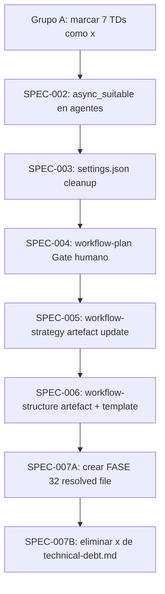

```yml
created_at: 2026-04-11 23:27:08
wp: 2026-04-11-23-27-08-technical-debt-audit
fase: FASE 32
```

# Design — technical-debt-audit (FASE 32)

## Notas de diseño

Este WP es un WP de mantenimiento de documentación (`reversibility: documentation`). El diseño arquitectónico está completamente definido en `technical-debt-audit-solution-strategy.md`. Este documento registra solo las decisiones de diseño específicas de implementación que no están en la spec.

---

## D-01: Orden de operaciones en Phase 6

Las tareas deben ejecutarse en este orden para evitar conflictos:



**Justificación del orden:**
- Grupo A primero: sin riesgo, confirma el estado antes de implementar
- SPEC-003 (settings.json) antes que los SKILLs: settings.json es el archivo más sensible; completarlo antes reduce interrupciones durante las ediciones de SKILLs
- SPEC-004/005/006 en orden: workflow-plan → strategy → structure (orden de aparición en el flujo SDLC)
- SPEC-007 al final: el resolved file debe tener todos los TDs que se resolvieron en este WP

---

## D-02: Contenido exacto del Gate humano para workflow-plan/SKILL.md

Posición: después de `## Validaciones pre-gate` (línea ~66), antes de `## Exit criteria` (línea ~72).

```markdown
## Gate humano

⏸ STOP — Presentar scope statement (problema, in-scope, out-of-scope, criterios de éxito) al usuario.
Esperar confirmación explícita. NO continuar sin respuesta.
Al aprobar:
1. Actualizar `context/now.md::phase` a `Phase 4`
2. Actualizar `{nombre-wp}-plan.md::status` a `Aprobado — {fecha}`
3. Marcar `[x] Scope aprobado por usuario — {fecha}` en `{nombre-wp}-plan.md`
```

---

## D-03: Cambio en settings.json — resultado final

```json
{
  "defaultMode": "acceptEdits",
  "permissions": {
    "allow": [
      "Write(/.claude/context/now.md)",
      "Write(/.claude/context/focus.md)",
      "Write(/.claude/context/work/**)",
      "Bash(bash .claude/scripts/*)",
      ...
    ]
  }
}
```

Las 3 líneas `Edit(...)` que desaparecen:
- `"Edit(/.claude/context/now.md)"` (línea 5)
- `"Edit(/.claude/context/focus.md)"` (línea 7)
- `"Edit(/.claude/context/work/**)"` (línea 9)

---

## D-04: Resultado final de technical-debt.md

TDs que permanecen (solo `[ ] Pendiente`):
TD-001, TD-003, TD-005, TD-009, TD-010, TD-018, TD-022, TD-025, TD-026, TD-027, TD-028, TD-030, TD-034, TD-035

El archivo se reduce de ~70,360 bytes a estimado ~20,000 bytes al remover los ~20 TDs marcados [x].
