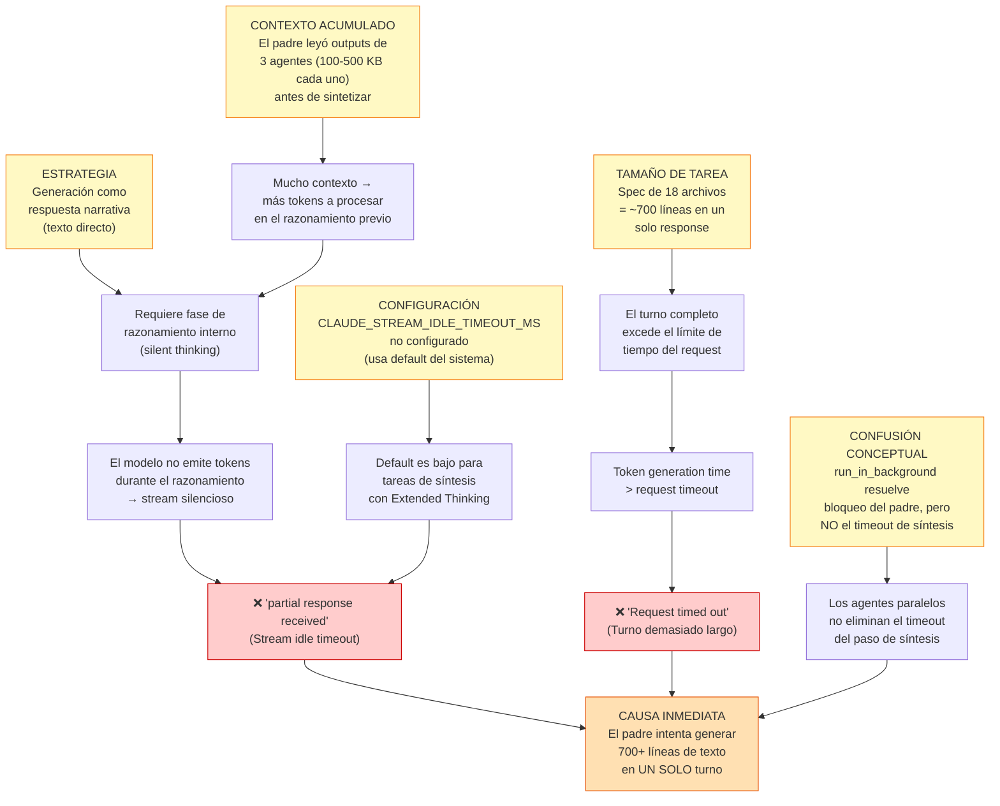

```yml
type: Análisis de Causa Raíz
created_at: 2026-04-13 23:00:00  # hora estimada — corregido FASE 35 (2026-04-14), WP histórico sin hora original
wp: skill-authoring-modernization
trigger: API Error: Stream idle timeout + Request timed out al generar requirements spec
```

# Root Cause Analysis — Stream Timeouts en Generación de Requirements Spec

## Diagrama de Causa Raíz



---

## Los Dos Errores — Distinción Crítica

| Error | Mecanismo | Cuándo ocurre en nuestro contexto |
|-------|-----------|-----------------------------------|
| `"partial response received"` | Stream idle timeout: el stream lleva más de `CLAUDE_STREAM_IDLE_TIMEOUT_MS` sin emitir tokens | Cuando el padre empieza a **razonar internamente** sobre cómo estructurar 700 líneas — el modelo piensa en silencio y el cliente cierra la conexión por inactividad |
| `"Request timed out"` | El turno completo supera el límite de tiempo del request, aunque el modelo SÍ emite tokens | Cuando el padre genera respuestas muy largas sin silencio — simplemente dura demasiado |

**Los dos tienen la misma causa raíz en este contexto**: generar un documento muy grande en un solo turno.

---

## Árbol de Causas (5 Whys)

```
¿Por qué aparece el timeout?
└─► El padre genera 700+ líneas en un solo turno

¿Por qué genera 700+ líneas en un turno?
└─► Estrategia incorrecta: generar el spec como texto de respuesta narrativa

¿Por qué esa estrategia?
└─► Confusión: creer que run_in_background resuelve el problema de tamaño de respuesta

¿Por qué esa confusión?
└─► Los agentes paralelos sí resuelven el contexto de los SUBagentes
    pero NO el turno de síntesis del PADRE

¿Por qué el turno de síntesis del padre sigue siendo largo?
└─► El padre debe leer outputs grandes (3 agentes × 100-500KB) y generar
    700 líneas de spec en una sola respuesta — sin fragmentar la tarea
```

---

## Soluciones por Causa

| Causa | Solución |
|-------|---------|
| Generación como respuesta narrativa | Usar `Write` tool directamente — el contenido va al tool input, no como reasoning |
| 700+ líneas en un turno | Fragmentar: Write por secciones o delegar a agente que escribe |
| Contexto acumulado grande | Leer solo lo necesario del output; usar `offset`+`limit` en lecturas |
| `CLAUDE_STREAM_IDLE_TIMEOUT_MS` bajo | `export CLAUDE_STREAM_IDLE_TIMEOUT_MS=120000` antes de síntesis |
| Confusión de mecanismos | Documentar la distinción en `long-running-calls.md` y `streaming-errors.md` |

---

## Insight Central — Qué Resuelve Cada Patrón

```
run_in_background (Parallel Agents)
    ✅ Resuelve: contexto de SUBagentes (cada uno tiene su propio context window)
    ✅ Resuelve: bloqueo del padre (no espera sincrónicamente)
    ✅ Resuelve: distribución de carga de trabajo
    ❌ NO resuelve: timeout del turno de SÍNTESIS del padre
    ❌ NO resuelve: stream idle timeout del padre al razonar sobre grandes outputs

Write tool (síntesis directa)
    ✅ Resuelve: evita la fase de "razonamiento narrativo" previa
    ✅ Resuelve: el contenido va al tool input, no como texto de respuesta
    ✅ Resuelve: permite fragmentar en múltiples Write calls si es necesario
    ❌ Requiere: que el contenido ya esté claro (los agentes ya lo produjeron)

CLAUDE_STREAM_IDLE_TIMEOUT_MS
    ✅ Resuelve: stream idle timeout por Extended Thinking silencioso
    ❌ NO resuelve: Request timed out (turno objetivamente muy largo)
    ❌ NO resuelve: context exhaustion
```

---

## Aplicación Inmediata: Cómo crear el requirements spec sin timeout

**Patrón correcto:**
```
1. Los agentes produjeron el contenido (ya completado)
2. El padre llama Write(requirements-spec.md) con el contenido compilado
   → No hay fase de "razonamiento narrativo"
   → El stream emite tokens continuamente (el tool input se genera sin silencio)
3. Si la spec es demasiado grande para un Write: fragmentar en 2-3 Write calls por sección
```

**Patrón incorrecto (el que causó los errores):**
```
1. Padre dice "Creo el requirements spec ahora" (texto de respuesta)
2. Padre empieza a razonar internamente sobre cómo organizar 700 líneas
3. Silencio de tokens durante el razonamiento → CLAUDE_STREAM_IDLE_TIMEOUT_MS se agota
4. "partial response received"
```

---

> **Este análisis alimenta directamente:**
> - `streaming-errors.md` — entrada "partial response received" (Extended Thinking silencioso)
> - `streaming-errors.md` — entrada "Request timed out" (turno demasiado largo)
> - `long-running-calls.md` — §Parallel Agents: matiz sobre síntesis del padre
> - `stream-resilience.md` — anti-patrón: síntesis narrativa de documentos largos
