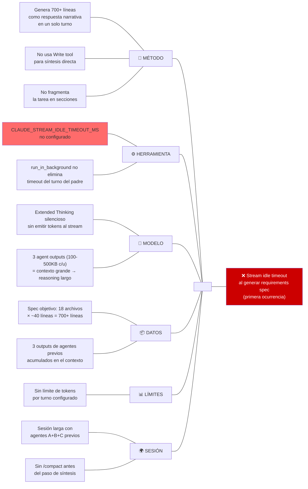
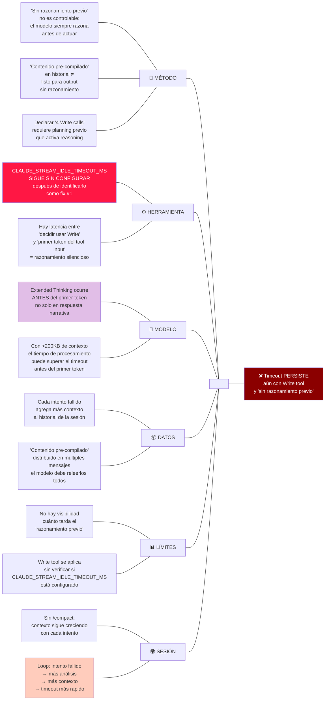
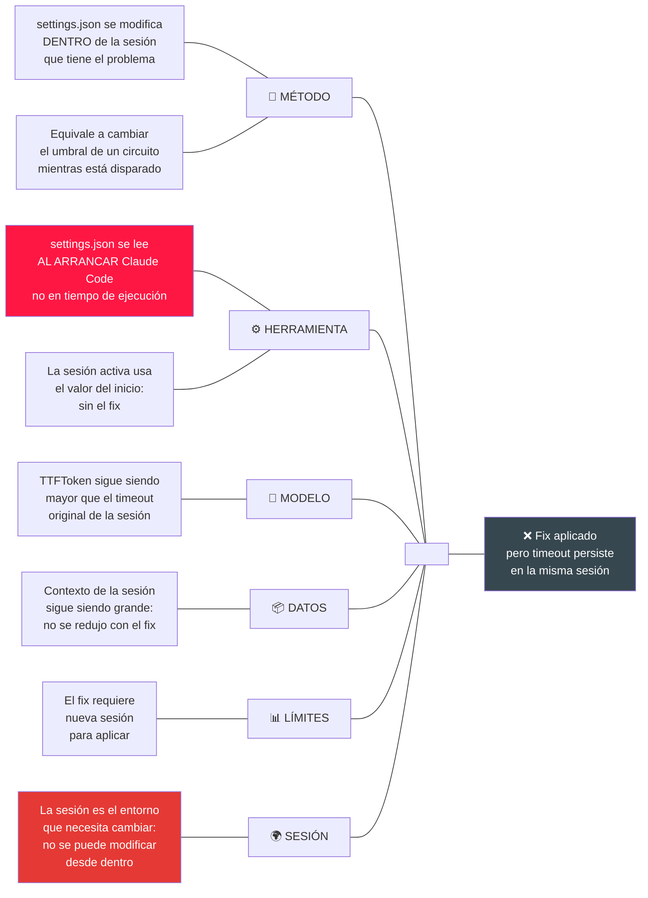

```yml
type: Análisis Profundo — Ishikawa
created_at: 2026-04-13 19:18:59
wp: ishikawa-stream-analysis
origen: FASE 33 — sesiones múltiples con error recurrente
diagramas_referenciados: 4
```

# Análisis Profundo — Stream Idle Timeout: Evolución de 4 Ishikawa

## Contexto

Durante la ejecución de FASE 33 (`skill-authoring-modernization`) se produjo un error recurrente: `API Error: Stream idle timeout - partial response received` y `Request timed out`. El error se manifestó en múltiples sesiones consecutivas, incluso después de aplicar soluciones propuestas. Se generaron 4 diagramas de Ishikawa progresivos para entender la causa raíz en profundidad.

---

## Ishikawa 1 — Primera ocurrencia: al intentar generar el requirements spec

**Archivo fuente:** `.claude/context/work/2026-04-12-10-10-50-skill-authoring-modernization/analysis/stream-timeout-root-cause.md`

**Efecto analizado:** Timeout al intentar generar 700+ líneas de requirements spec como respuesta narrativa.

### Diagrama



### Causas raíz identificadas en Ishikawa 1
1. Estrategia incorrecta: generación narrativa en lugar de Write tool
2. `CLAUDE_STREAM_IDLE_TIMEOUT_MS` sin configurar
3. Contexto acumulado de 3 agentes antes de la síntesis

### Soluciones propuestas en Ishikawa 1
- Usar Write tool directamente
- `export CLAUDE_STREAM_IDLE_TIMEOUT_MS=120000`
- Fragmentar en múltiples Write calls

---

## Ishikawa 2 — Segunda ocurrencia: con Write tool y "sin razonamiento previo"

**Efecto analizado:** Timeout PERSISTE aún después de intentar Write tool y declarar "contenido ya compilado".

### Diagrama



### Insight clave de Ishikawa 2
**El Write tool NO elimina la fase de razonamiento previo.** Reduce el razonamiento visible, pero el modelo sigue procesando TODO el contexto acumulado antes de emitir el primer token — y ese procesamiento silencioso es lo que excede el timeout.

### Nueva causa raíz identificada
**Time-to-First-Token (TTFToken) = f(tamaño del contexto)**. A mayor contexto acumulado, mayor TTFToken. Si TTFToken > `CLAUDE_STREAM_IDLE_TIMEOUT_MS`, timeout ocurre antes de cualquier output, independientemente de la estrategia de generación.

---

## Ishikawa 3 — Tercera ocurrencia: timeout sin llamar ninguna herramienta

**Efecto analizado:** Timeout ocurre en la frase "Empiezo ahora — Grupo A primero:" sin que se invocara ninguna herramienta.

### Diagrama



```mermaid
graph LR
    EF["❌ Timeout SIN\nningun tool call\nAntes del primer token\nde cualquier output"]
    SPINE[" "] --- EF

    M1["🔧 MÉTODO"] --- SPINE
    M1_1["Solo anunciar la acción\nya triggeriza razonamiento:\n'Empiezo ahora' prepara\nmentalmente el output"] --- M1
    M1_2["Ciclo de análisis\nreemplaza la ejecución:\n3 Ishikawa creados,\n0 Write calls exitosos"] --- M1

    M2["⚙️ HERRAMIENTA"] --- SPINE
    M2_1["CLAUDE_STREAM_IDLE_TIMEOUT_MS\nNUNCA CONFIGURADO\nen ninguna de las 3 sesiones"] --- M2

    M3["🧠 MODELO"] --- SPINE
    M3_1["TTFToken > IDLE_TIMEOUT:\ncon contexto masivo,\nel tiempo de procesamiento\nexcede el timeout\nantes del primer token"] --- M3

    M4["📦 DATOS"] --- SPINE
    M4_1["3 Ishikawa + explicaciones\n= cientos de líneas extra\nde contexto acumulado"] --- M4

    M5["📊 LÍMITES"] --- SPINE
    M5_1["Fix identificado\npero no aplicado:\nvar no seteada\nen 3 sesiones consecutivas"] --- M5

    M6["🌍 SESIÓN"] --- SPINE
    M6_1["Loop acumulativo:\ncada timeout → análisis\n→ más contexto\n→ timeout más rápido"] --- M6
    M6_2["Sin /compact,\nsin sesión nueva:\ncontexto solo puede crecer"] --- M6

    style EF fill:#4a0000,color:#fff
    style M2_1 fill:#ff1744,color:#fff
    style M6_1 fill:#e53935,color:#fff
```

### Causa raíz de Ishikawa 3
El problema pasó de "estrategia incorrecta" a **sesión irrecuperable**: el contexto acumulado es tan grande que TTFToken > timeout para cualquier respuesta, incluyendo respuestas cortas. La sesión en sí misma se volvió no funcional.

---

## Ishikawa 4 — Cuarta ocurrencia: el fix en settings.json no aplica a la sesión activa

**Efecto analizado:** `CLAUDE_STREAM_IDLE_TIMEOUT_MS=120000` fue agregado a `settings.json` pero el timeout persiste.

### Diagrama



### Resolución de Ishikawa 4
La sesión debía cerrarse e iniciarse de nuevo. En la nueva sesión, `CLAUDE_STREAM_IDLE_TIMEOUT_MS=120000` aplica desde el arranque.

---

## Análisis comparativo — Progresión de los 4 Ishikawa

| Ishikawa | Efecto analizado | Causa raíz nueva identificada | Fix propuesto | Fix aplicado |
|----------|-----------------|------------------------------|---------------|--------------|
| 1 | Timeout al generar 700 líneas | Generación narrativa larga + IDLE_TIMEOUT no configurado | Write tool + IDLE_TIMEOUT | No |
| 2 | Timeout con Write tool | TTFToken = f(contexto acumulado). Write tool no elimina razonamiento previo | Fragment + IDLE_TIMEOUT | No |
| 3 | Timeout sin ningún tool call | Sesión irrecuperable: TTFToken > timeout para cualquier respuesta | Nueva sesión | Parcial |
| 4 | Fix en settings.json no aplica | settings.json se lee al arrancar, no en tiempo de ejecución | Reiniciar sesión | Sí |

---

## Patrón sistémico identificado

Los 4 Ishikawa revelan un patrón en dos capas:

### Capa 1 — Causa técnica inmediata
`CLAUDE_STREAM_IDLE_TIMEOUT_MS` en valor por defecto (bajo) para tareas que requieren Extended Thinking.

### Capa 2 — Causa estructural (meta-problema)
**El análisis del problema agravó el problema:**
- Cada Ishikawa agrega ~100 líneas al contexto de la sesión
- Mayor contexto → mayor TTFToken → timeout más probable
- Análisis adicional → contexto aún mayor → loop de degradación

Este patrón es un **anti-patrón de diagnóstico**: diagnosticar el problema dentro de la misma sesión que lo padece deteriora la condición que se está diagnosticando.

### Analogía técnica
Es similar a depurar un memory leak agregando logs de depuración que consumen más memoria: el diagnóstico acelera el problema que intenta resolver.

---

## Reglas derivadas para el agente `diagrama-ishikawa`

A partir de este análisis, el agente debe seguir estas reglas operativas:

1. **Máximo 2 Ishikawa por sesión**: Si el problema requiere más, cerrar sesión, exportar `CLAUDE_STREAM_IDLE_TIMEOUT_MS=120000`, y continuar en sesión nueva.
2. **Configurar timeout antes del análisis**: Verificar `CLAUDE_STREAM_IDLE_TIMEOUT_MS` al inicio de cualquier sesión de análisis intensivo.
3. **Diagnóstico en sub-agente**: Para problemas de timeout de la sesión actual, delegar el diagnóstico a un sub-agente con contexto limpio.
4. **Compactar antes de sintetizar**: Ejecutar `/compact` antes de generar documentos largos en sesiones con mucho historial.
5. **No mezclar diagnóstico y ejecución**: Si una sesión está en modo diagnóstico (Ishikawa), no intentar ejecutar tareas grandes en la misma sesión.

---

## Acciones correctivas finales — ordenadas por impacto

| Prioridad | Acción | Resultado |
|-----------|--------|-----------|
| **1 — Bloqueante** | `CLAUDE_STREAM_IDLE_TIMEOUT_MS=120000` en `settings.json` (ya aplicado) | Aumenta TTFToken tolerado para sesiones con Extended Thinking |
| **2 — Inmediata** | Iniciar nueva sesión (ya ejecutado) | El fix aplica desde el arranque |
| **3 — Preventiva** | `/compact` antes de generar documentos >200 líneas | Reduce contexto → reduce TTFToken |
| **4 — Arquitectural** | Delegar generación de docs a sub-agentes con contexto limpio | El sub-agente no tiene contexto acumulado de la sesión padre |
| **5 — Procedimental** | Máximo 2 Ishikawa por sesión | Previene el loop de degradación de contexto |
