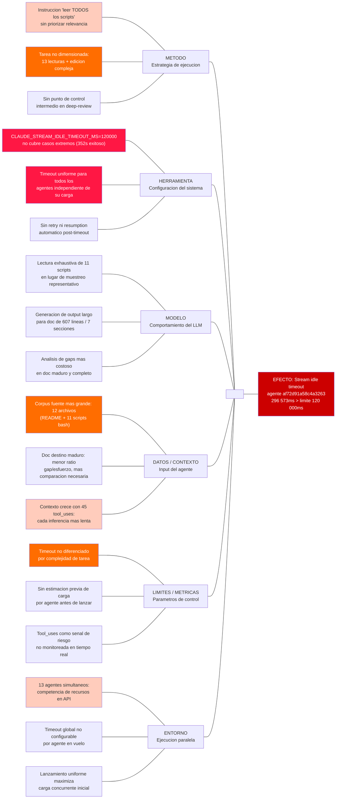

# Ishikawa: Stream idle timeout en agente deep-review hook-authoring

## Efecto analizado

Agente `af72d91a58c4a3263` (deep-review `hook-authoring.md`) falló con
"Stream idle timeout — partial response received" a los 296 573 ms, superando
el límite de `CLAUDE_STREAM_IDLE_TIMEOUT_MS: 120 000 ms`.

Fue el único fallo de los 13 agentes deep-review lanzados en paralelo.
Métricas del agente fallido: `tool_uses: 45`, `total_tokens: 7 060`.

## Diagrama

## Análisis por categoría (6M)

### M1 — Método (estrategia de ejecución del agente)

- **M1.1 — Tarea subdimensionada en planificación:** La tarea asignada al agente
  requería leer 1 doc destino (hook-authoring.md, 607 líneas) + 1 README fuente +
  11 scripts bash de ejemplo + razonar sobre gaps + editar el doc. Eso es 13+
  lecturas de archivo más una edición compleja. Los otros 12 agentes tenían tareas
  más acotadas.

- **M1.2 — Sin límite de scope en la instrucción:** La instrucción decía "leer TODOS
  los scripts de ejemplo" sin priorizar cuáles son relevantes para detectar gaps.
  El agente aplicó la instrucción literalmente: 45 tool_uses vs el promedio de los demás.

- **M1.3 — Ausencia de punto de control intermedio:** Los agentes deep-review no tienen
  un mecanismo de checkpoint — trabajan todo o nada. Si la tarea excede el budget de
  tiempo, no hay forma de retomar desde un punto parcial.

### M2 — Herramienta / Sesión (configuración del sistema)

- **M2.1 — CLAUDE_STREAM_IDLE_TIMEOUT_MS insuficiente para la carga real:** El timeout
  estaba fijado en 120 000 ms (2 minutos). El agente que más tardó de los exitosos usó
  352 segundos. El agente fallido usó 296 573 ms (~5 minutos). El parámetro no estaba
  calibrado para la varianza de carga entre agentes paralelos.

- **M2.2 — Paralelismo sin presupuesto de timeout por agente:** Se lanzaron 13 agentes
  en paralelo con el mismo timeout uniforme, sin ajustar según la complejidad estimada
  de cada tarea.

- **M2.3 — Ausencia de mecanismo de retry / resumption:** Claude Code no tiene retry
  automático en caso de stream idle timeout. La falla es terminal: el trabajo parcial
  (45 tool_uses completadas) se pierde.

### M3 — Modelo (comportamiento del LLM)

- **M3.1 — Exploración expansiva del corpus fuente:** Con la instrucción "leer TODOS
  los scripts", el modelo leyó los 11 scripts de forma exhaustiva en lugar de hacer
  un muestreo representativo.

- **M3.2 — Generación de respuesta larga para doc complejo:** `hook-authoring.md` es
  el documento más largo y estructurado del conjunto (607 líneas, 7 secciones, múltiples
  tablas y bloques de código).

- **M3.3 — Profundidad de análisis de gaps:** Un documento maduro y completo requiere
  análisis más fino para identificar gaps reales vs ya cubiertos. Este razonamiento
  comparativo es más costoso que completar un doc que tenía secciones ausentes.

### M4 — Datos / Contexto (input del agente)

- **M4.1 — Volumen de material fuente desproporcionado:** El agente de hooks tenía el
  corpus fuente más grande de los 13: README + 11 scripts bash (12 archivos en total).

- **M4.2 — hook-authoring.md ya maduro: menor ratio gap/esfuerzo:** Un documento
  incompleto produce más cambios por unidad de lectura. Uno maduro requiere más lectura
  comparativa para encontrar gaps pequeños.

- **M4.3 — Contexto acumulado durante ejecución:** Con 45 tool_uses, el contexto del
  agente crecía constantemente. La ventana de contexto más grande hacía cada inferencia
  subsiguiente más lenta.

### M5 — Límites / Métricas (parámetros de control)

- **M5.1 — CLAUDE_STREAM_IDLE_TIMEOUT_MS no diferenciado por tipo de tarea:** Un único
  valor de 120 000 ms aplica a todos los agentes independientemente de su complejidad.

- **M5.2 — Sin métrica previa de complejidad estimada:** El orquestador que lanzó los
  13 agentes no hizo una estimación de carga por agente antes de asignar la tarea.

- **M5.3 — Tool_uses como proxy no monitoreado:** El número de tool_uses (45) es una
  señal clara de mayor carga. Esta métrica no se usa en tiempo real para detectar
  riesgo de timeout.

### M6 — Entorno / Sesión (condiciones de ejecución paralela)

- **M6.1 — Competencia de recursos en ejecución paralela:** 13 agentes corriendo
  simultáneamente compiten por recursos del sistema y latencia de la API.

- **M6.2 — Sin aislamiento de timeout entre agentes paralelos:** El timeout es global
  a la sesión (`settings.json`), no configurable por agente en vuelo.

- **M6.3 — Momento de lanzamiento uniforme:** Todos los agentes arrancaron al mismo
  tiempo, maximizando la carga concurrente en la API en el momento inicial.

## Causas raíz — 5 Porqués

### Cadena principal

| ¿Por qué? | Respuesta |
|-----------|-----------|
| ¿Por qué falló el agente? | Porque el stream estuvo inactivo más de 120 000 ms entre tokens |
| ¿Por qué el stream estuvo inactivo tanto tiempo? | Porque el modelo generaba una respuesta larga después de procesar 12 archivos fuente y 45 tool_uses acumuladas en contexto |
| ¿Por qué el modelo procesó 12 archivos y acumuló 45 tool_uses? | Porque la instrucción pedía leer TODOS los scripts (11) + README, sin límite de scope, para el documento con mayor corpus fuente de los 13 agentes |
| ¿Por qué no había límite de scope? | Porque el orquestador asignó la misma estructura de instrucción a todos los agentes sin estimar la carga proporcional de cada uno |
| ¿Por qué el timeout no lo cubrió? | Porque `CLAUDE_STREAM_IDLE_TIMEOUT_MS=120 000` fue calibrado para el caso medio sin margen para el agente con la carga máxima |

**Causas raíz accionables:**
1. El timeout es uniforme y no refleja la varianza de carga entre agentes paralelos
2. La instrucción de tarea no tiene un mecanismo de bound (límite superior) para el volumen de material fuente a procesar

## Acciones correctivas

| Prioridad | Causa raíz | Acción correctiva | Responsable | Plazo |
|-----------|-----------|-------------------|-------------|-------|
| 1 — crítica | `CLAUDE_STREAM_IDLE_TIMEOUT_MS=120 000` no cubre el agente más lento | Aumentar a 420 000 ms (7 min). Aplicado en esta FASE. | `settings.json` | **Aplicado** |
| 1 — crítica | Instrucción sin bound de archivos fuente | "Leer máximo 5 scripts representativos" en lugar de "TODOS". Aplicado vía `bound-detector.py`. | Orquestador / `bound-detector.py` | **Aplicado** |
| 2 — alta | Sin estimación de carga por agente antes de lanzar | Antes de lanzar N agentes, calcular archivos fuente por agente. Si alguno supera 8, dividirlo en 2 agentes o darle timeout mayor. | Flujo de orquestación | Corto plazo |
| 2 — alta | Contexto crece con 45 tool_uses degradando inferencia | Dividir la tarea en 2 agentes secuenciales: uno lee y resume el corpus, el segundo edita el doc con el resumen como input. | Diseño de tareas deep-review | Corto plazo |
| 3 — media | Lanzamiento uniforme maximiza carga concurrente | Lanzamiento escalonado: grupos de 4-5 agentes con 10-15s de separación. | Orquestador | Mediano plazo |
| 3 — media | Sin retry automático post-timeout | Retry del orquestador con scope reducido si un agente termina con error de stream timeout. | Orquestador | Mediano plazo |

## Síntesis

La causa raíz crítica es la combinación de dos factores que se amplifican mutuamente: (1) una instrucción sin bound de archivos fuente ("leer TODOS") que llevó al agente a procesar 12 archivos vs el promedio de 2-3 de los otros agentes, y (2) un timeout uniforme de 120 000 ms que no contemplaba la varianza de carga entre agentes paralelos — el agente exitoso más lento tardó 352 segundos.

Las dos acciones de prioridad crítica ya fueron aplicadas en FASE 35: `CLAUDE_STREAM_IDLE_TIMEOUT_MS` aumentado a 420 000 ms y `bound-detector.py` implementado como `PreToolUse` hook que bloquea instrucciones sin bound antes de lanzar subagentes.

La evidencia más fuerte de que el problema no era el directorio fuente ni la disponibilidad de la API: el agente `hooks.md` (mismo directorio fuente) completó exitosamente. La diferencia fue el volumen de material a leer y la madurez del documento destino, que requería más razonamiento comparativo.

## Nota sobre estado de resolución

- `CLAUDE_STREAM_IDLE_TIMEOUT_MS` → `420 000` ms — **aplicado en FASE 35**
- `bound-detector.py` (PreToolUse hook) — **implementado en FASE 35**
- `hook-authoring.md` deep-review — **pendiente** (ambos intentos del agente fallaron por el timeout de sesión activa que no se había propagado)
