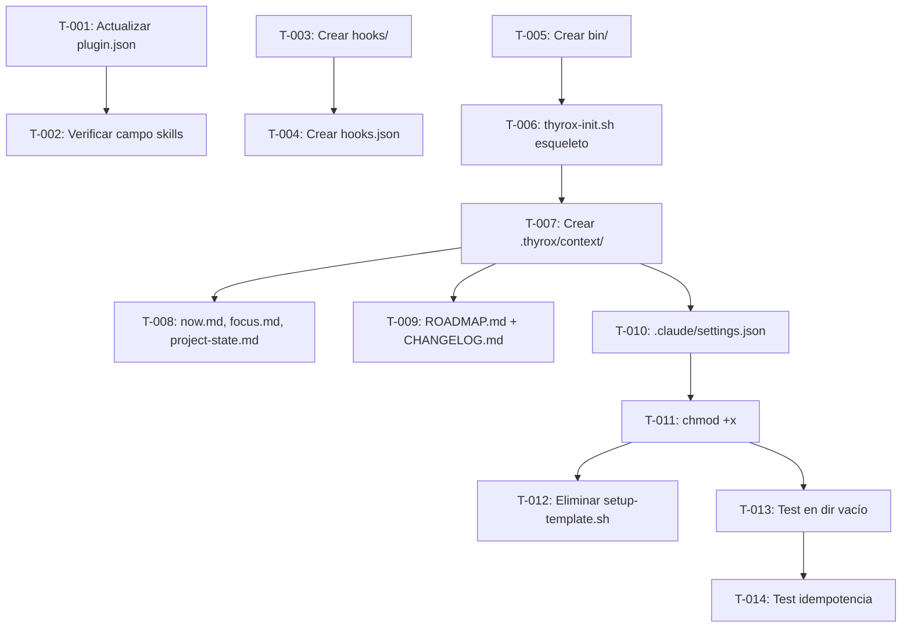

```yml
project: THYROX
work_package: 2026-04-15-08-29-58-plugin-distribution
created_at: 2026-04-16 00:00:00
current_phase: Phase 8 — PLAN EXECUTION
author: NestorMonroy
```

# Task Plan: plugin-distribution

## Objetivo

Convertir THYROX de "git clone + setup-template.sh" a plugin puro de Claude Code.
Eliminar `setup-template.sh`. Implementar `hooks/hooks.json` + `bin/thyrox-init.sh` como reemplazo idempotente.

## Referencia de análisis

GAPs identificados en `discover/plugin-distribution-analysis.md`:
- **GAP-001** — No existe `hooks/hooks.json` en el plugin
- **GAP-002** — No existe `bin/` directory con `thyrox-init.sh`
- **GAP-003** — `settings.json` del plugin no puede distribuir permisos (workaround: thyrox-init.sh los escribe)
- **GAP-005** — `setup-template.sh` tiene 4 bugs acumulados (paths pre-FASE-35, naming pre-FASE-29)
- **GAP-006** — Separación plugin vs proyecto destino no implementada

---

## Tasks

### Grupo 1 — Plugin manifest (GAP-001, GAP-006)

- [x] [T-001] Actualizar `.claude-plugin/plugin.json` — agregar campos `hooks`, `bin` con rutas relativas al plugin (GAP-001)
- [x] [T-002] Verificar que el campo `skills` en plugin.json apunta correctamente a `.claude/skills/` para carga in-situ (GAP-006)

### Grupo 2 — Hooks de sesión (GAP-001)

- [x] [T-003] Crear directorio `hooks/` en la raíz del proyecto (GAP-001)
- [x] [T-004] Crear `hooks/hooks.json` con evento `SessionStart` que llama a `bin/thyrox-init.sh` condicionalmente (GAP-001)
  - Condición: `[ -d .thyrox/context ] || bash "$PLUGIN_DIR/bin/thyrox-init.sh"`
  - Depende de: T-003

### Grupo 3 — Script de inicialización (GAP-002, GAP-003)

- [x] [T-005] Crear directorio `bin/` en la raíz del proyecto (GAP-002)
- [x] [T-006] Crear `bin/thyrox-init.sh` — esqueleto con guard de idempotencia y logging (GAP-002)
  - Depende de: T-005
- [x] [T-007] Implementar en `bin/thyrox-init.sh` — creación de `.thyrox/context/` con subdirectorios (`work/`, `decisions/`, `errors/`, `research/`) (GAP-002)
  - Depende de: T-006
- [x] [T-008] Implementar en `bin/thyrox-init.sh` — creación de `now.md`, `focus.md`, `project-state.md` con valores iniciales (GAP-002)
  - Depende de: T-007
- [x] [T-009] Implementar en `bin/thyrox-init.sh` — creación de `ROADMAP.md` y `CHANGELOG.md` iniciales si no existen (GAP-002)
  - Depende de: T-007
- [x] [T-010] Implementar en `bin/thyrox-init.sh` — creación de `.claude/settings.json` con permisos mínimos THYROX si no existe (GAP-003)
  - Permisos: `defaultMode: acceptEdits`, allow git/bash, deny push --force/reset --hard/rm -rf
  - Depende de: T-007
- [x] [T-011] Agregar `chmod +x bin/thyrox-init.sh` y verificar que el script es ejecutable (GAP-002)
  - Depende de: T-010

### Grupo 4 — Eliminar setup-template.sh (GAP-005)

- [x] [T-012] Eliminar `setup-template.sh` del repositorio (GAP-005)
  - ⚠ GATE OPERACIÓN — operación irreversible con git. Confirmar antes de ejecutar.
  - Depende de: T-011 (thyrox-init.sh debe estar listo antes de eliminar el reemplazo)

### Grupo 5 — Validación

- [x] [T-013] Probar `bin/thyrox-init.sh` en directorio temporal vacío — verificar que crea la estructura completa
  - Depende de: T-011
- [x] [T-014] Probar idempotencia — ejecutar `thyrox-init.sh` dos veces en el mismo directorio, verificar que no duplica ni corrompe estado
  - Depende de: T-013

---

## DAG de dependencias



**Camino crítico:** T-005 → T-006 → T-007 → T-010 → T-011 → T-012 → T-013 → T-014

---

## Stopping Point Manifest

| SP | Tarea | Tipo | Descripción | Estado |
|----|-------|------|-------------|--------|
| SP-01 | Pre T-012 | GATE OPERACIÓN | Confirmar eliminación de `setup-template.sh` (irreversible) | pendiente |
| SP-02 | Post T-014 | gate-fase 10→11 | Validar que init flow funciona completo antes de TRACK | si |
