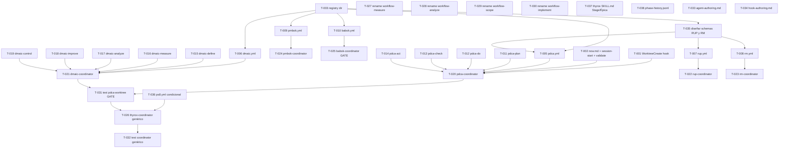

```yml
created_at: 2026-04-16 19:37:46
project: THYROX
work_package: 2026-04-16-18-54-38-multi-methodology
phase: Stage 8 — PLAN EXECUTION
author: NestorMonroy
status: Aprobado — v2 (post deep-review)
```

# Task Plan — multi-methodology (ÉPICA 40)

> **v2** — Actualizado tras deep-review de cobertura. Cambios vs v1:
> - T-002 absorbe T-004 (overlap en session-start.sh eliminado)
> - T-035 añadido: diseño de schemas RUP y RM ANTES de T-007/T-008 (bloqueante)
> - T-036 añadido: phase-history.jsonl en sync-wp-state.sh
> - T-037 añadido: migración terminológica en thyrox/SKILL.md
> - T-033 ampliado: agregar `context:fork` + `color` además de `isolation`/`background`
> - T-026 clarificado: SIN `monitors:` (hallazgo M — formato desconocido, no implementar)
> - Inconsistencia GAP-010 corregida en exit-conditions
> - GAP-006 y GAP-008 declarados explícitamente out-of-scope en plan
> - DAG actualizado con nuevas dependencias

---

## DAG de dependencias (v2)



**Ruta crítica:** T-003 → T-035 → T-005 → T-011..T-014 → T-020 → T-031 → T-026 → T-032

---

## Grupo 0 — Diseño previo (prerequisitos bloqueantes)

> Debe completarse ANTES de los grupos 2 y 4 correspondientes.

- [x] [T-035] Diseñar schemas YAML completos para `rup.yml` (tipo iterativo: 4 fases × N iteraciones, cómo modelar la repetición) y `rm.yml` (tipo secuencial con retorno: identificar los 5 pasos reales de Requirements Management). Producir el schema en el task-plan o en un documento de diseño antes de crear los archivos. (requiere T-003)

## Grupo 1 — Infraestructura base

- [x] [T-001] Agregar `WorktreeCreate` y `WorktreeRemove` a `hooks/hooks.json` con handlers vacíos listos para extender (GAP-007)
- [x] [T-002] Extender template de `now.md` con campos `stage`, `flow`, `methodology_step` + actualizar `session-start.sh` (banner: mostrar stage y methodology_step) + actualizar `validate-session-close.sh` (reconocer campo `stage` además de `phase` por retrocompatibilidad). **Absorbe T-004 de v1** — un solo commit para evitar conflicto en session-start.sh. [SP-01]
- [x] [T-003] Crear directorio `.thyrox/registry/methodologies/` con `README.md` que documente el schema completo (5 tipos de flujo: cyclic, sequential, iterative, non-sequential, conditional)
- [x] [T-038] Agregar observabilidad: ~5 líneas en `sync-wp-state.sh` para append a `.thyrox/context/phase-history.jsonl` en cada transición de `methodology_step`. Formato: `{"timestamp":"...","from":"...","to":"...","flow":"...","epic":N,"wp":"..."}`

## Grupo 2 — Registry YAML (7 metodologías + 1 tipo condicional)

> Requiere T-003 (todos) y T-035 (T-007, T-008).

- [x] [T-005] Crear `.thyrox/registry/methodologies/pdca.yml` — tipo `cyclic`, 4 pasos (schema ya definido en strategy)
- [x] [T-006] Crear `.thyrox/registry/methodologies/dmaic.yml` — tipo `sequential`, 5 pasos (schema ya definido en strategy)
- [x] [T-007] Crear `.thyrox/registry/methodologies/rup.yml` — tipo `iterative`, 4 fases × N iteraciones (requiere T-035 para schema)
- [x] [T-008] Crear `.thyrox/registry/methodologies/rm.yml` — tipo `sequential` con retorno, 5 pasos reales de RM (requiere T-035 para schema)
- [x] [T-009] Crear `.thyrox/registry/methodologies/pmbok.yml` — tipo `sequential`, 5 grupos de proceso: Initiating, Planning, Executing, Monitoring&Controlling, Closing
- [x] [T-010] Crear `.thyrox/registry/methodologies/babok.yml` — tipo `non-sequential`, 6 knowledge areas (schema ya definido en strategy)
- [x] [T-036] Crear `.thyrox/registry/methodologies/ps8.yml` — tipo `conditional`, 8 pasos con `on_success`/`on_failure` (schema ya definido en strategy). Ejemplo canónico del tipo condicional para el coordinator genérico. (requiere T-003)

## Grupo 3 — Skills de metodología base

> Requiere T-003. Paralelo con Grupo 2. Descriptions ≤1,536 chars (v2.1.105).

### PDCA (4 skills)
- [x] [T-011] Crear `.claude/skills/pdca-plan/SKILL.md` — Plan: identificar problema y diseñar mejora
- [x] [T-012] Crear `.claude/skills/pdca-do/SKILL.md` — Do: ejecutar el plan a escala pequeña
- [x] [T-013] Crear `.claude/skills/pdca-check/SKILL.md` — Check: verificar resultados vs objetivos
- [x] [T-014] Crear `.claude/skills/pdca-act/SKILL.md` — Act: estandarizar si exitoso, ajustar si no

### DMAIC (5 skills)
- [x] [T-015] Crear `.claude/skills/dmaic-define/SKILL.md` — Define: alcance del problema
- [x] [T-016] Crear `.claude/skills/dmaic-measure/SKILL.md` — Measure: baseline cuantitativo del proceso
- [x] [T-017] Crear `.claude/skills/dmaic-analyze/SKILL.md` — Analyze: causas raíz estadísticas
- [x] [T-018] Crear `.claude/skills/dmaic-improve/SKILL.md` — Improve: implementar soluciones validadas
- [x] [T-019] Crear `.claude/skills/dmaic-control/SKILL.md` — Control: sostener las mejoras

## Grupo 4 — Coordinators Patrón 3

> Requiere YAML + skills correspondientes. PDCA y DMAIC primero.
> Todos con `isolation: worktree` y `background: true`.

- [x] [T-020] Crear `.claude/agents/pdca-coordinator.md` con `isolation: worktree`, `background: true`, `color: blue` (requiere T-005, T-011..T-014)
- [x] [T-021] Crear `.claude/agents/dmaic-coordinator.md` con `isolation: worktree`, `background: true`, `color: green` (requiere T-006, T-015..T-019)
- [x] [T-022] Crear `.claude/agents/rup-coordinator.md` con `isolation: worktree`, `background: true` (requiere T-007)
- [x] [T-023] Crear `.claude/agents/rm-coordinator.md` con `isolation: worktree`, `background: true` (requiere T-008)
- [x] [T-024] Crear `.claude/agents/pmbok-coordinator.md` con `isolation: worktree`, `background: true` (requiere T-009)
- [x] [T-025] Crear `.claude/agents/babok-coordinator.md` con lógica de routing no-secuencial (requiere T-010) **[GATE SP-02: revisar lógica antes de continuar]**

## Grupo 5 — Coordinator genérico Patrón 5

> Requiere T-031 (contrato validado). NO usa `monitors:` — formato no documentado (hallazgo M).

- [x] [T-026] Crear `.claude/agents/thyrox-coordinator.md` — coordinator genérico que lee `.thyrox/registry/methodologies/{flow}.yml` desde `now.md::flow`, resuelve transiciones por tipo de flujo, actualiza `now.md::methodology_step`. Sin `monitors:` hasta documentación oficial. (requiere T-031, T-036)

## Grupo 6 — Renaming de stages conflictivos

> Independiente. Paralelo con Grupo 4. Incluye actualización de SKILL.md y referencias.

- [x] [T-027] Renombrar `workflow-measure` → `workflow-baseline`: directorio, SKILL.md, referencias internas, skills list en settings
- [x] [T-028] Renombrar `workflow-analyze` → `workflow-diagnose`: mismo proceso
- [x] [T-029] Renombrar `workflow-plan` → `workflow-scope`: mismo proceso
- [x] [T-030] Renombrar `workflow-execute` → `workflow-implement`: mismo proceso
- [x] [T-037] Actualizar `thyrox/SKILL.md` — reemplazar "Phase N" → "Stage N" y "FASE N" → "ÉPICA N" en el cuerpo del skill (no solo el glosario). Alcance limitado: etiquetas en flujos y ejemplos.

## Grupo 7 — Validación y documentación

- [x] [T-031] Test `pdca-coordinator` con `isolation: worktree` — verificar creación de worktree, ejecución de pdca:plan, actualización de `now.md::methodology_step`, cleanup **[PASS — worktree branch aislado, pdca.yml válido, methodology_step actualizado, sin contaminación]**
- [x] [T-032] Test `thyrox-coordinator` — verificar lectura dinámica de `pdca.yml` y `dmaic.yml`, presentación correcta de transiciones por tipo de flujo **[PASS — 7/7 YAMLs válidos, 5/5 tipos de flujo resueltos, contrato methodology_step consistente]**
- [x] [T-033] Actualizar `.claude/references/agent-authoring.md` — agregar: `isolation: worktree`, `background: true`, `color` (hallazgo L), `context: fork` en skills, ejemplos de coordinator con todos los campos
- [x] [T-034] Actualizar `.claude/references/hook-authoring.md` — agregar `WorktreeCreate`/`WorktreeRemove` con ejemplo de implementación

---

## Stopping Point Manifest

| SP | Tarea | Condición de parada |
|----|-------|---------------------|
| SP-01 | T-002 | Extensión de `now.md` y scripts puede romper hook de sesión → validar banner antes de continuar |
| SP-02 | T-025 | BABOK coordinator — lógica no-secuencial requiere aprobación de diseño |
| SP-03 | T-031 | Test worktree isolation — validar contrato `methodology_step` antes de T-026 **[GATE]** |

---

## Out-of-scope explícito (actualizado)

| Item | Razón |
|------|-------|
| GAP-006: SDLC skills sin prefijo (`analyze` vs `sdlc-analyze`) | Cambio de naming masivo de skills existentes — ÉPICA futura |
| GAP-008: `transcript_path` en hooks no usado por THYROX | Fuera del scope multi-metodología — cubre `/permisos-sugeridos` que ya existe |
| `monitors:` en plugin.json para Patrón 5 | Hallazgo M: formato desconocido, sin ejemplos canónicos — no implementar hasta documentación oficial |
| Skills Cat 2-6 completos (~67 skills) | ÉPICAs futuras por metodología |
| `.gitignore` para `.claude/worktrees/` | Decisión explícita del usuario: trackear todo |
| Migración big-bang FASE→ÉPICA en documentos históricos | Retrocompatibilidad — migración incremental al tocar cada archivo |
| Tipo `adaptive` de flujo (Consulting, Strategic Mgmt) | Sin metodología del scope que lo requiera — ÉPICA futura Cat 4-5 |
| `memory: project` en coordinators | Sin caso de uso validado aún — evaluar post T-031 |
| Limpieza de `settings.json` (entradas redundantes ls, echo) | Usar `/permisos-sugeridos` — fuera del scope multi-metodología |
| SKILL.md > 3,000 palabras (workflow-execute, track, decompose) | Refactoring independiente — ÉPICA futura |

---

## Estimación (v2)

| Grupo | Tareas | Complejidad | Orden |
|-------|--------|-------------|-------|
| 0 — Diseño previo | T-035 | Media | 0º — antes de todo |
| 1 — Infraestructura | T-001..T-003, T-038 | Media | 1º |
| 2 — Registry YAMLs | T-005..T-010, T-036 | Baja-Media | 2º (paralelo c/ G3) |
| 3 — Skills base | T-011..T-019 | Media | 2º (paralelo c/ G2) |
| 4 — Coordinators | T-020..T-025 | Media-Alta | 3º |
| 5 — Coordinator genérico | T-026 | Alta | 4º |
| 6 — Renaming | T-027..T-030, T-037 | Media | 3º (paralelo c/ G4) |
| 7 — Validación | T-031..T-034 | Media | 5º |

**Total: 38 tareas** (34 v1 + T-035, T-036, T-037, T-038 nuevas; T-004 absorbida por T-002)
