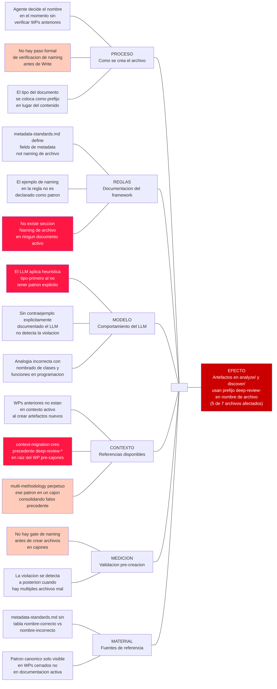

```yml
created_at: 2026-04-17 21:07:17
project: THYROX
work_package: 2026-04-17-17-58-13-goto-problem-fix
phase: Phase 3 — DIAGNOSE
author: NestorMonroy
status: Borrador
type: Ishikawa Analysis
efecto: Artefactos en analyze/ y discover/ del WP activo usan prefijo deep-review- en nombre de archivo, violando el patron {contenido}.md del framework
dominio: Organizacional
variante_6m: Estandar
causas_raiz: 3
```

# Ishikawa: artefactos en cajones del WP usan prefijo de tipo en lugar de nombre de contenido

## Efecto analizado

5 de los 7 archivos en `analyze/` y `discover/` del WP `2026-04-17-17-58-13-goto-problem-fix`
tienen nombres con prefijo `deep-review-`. En los dos WPs precedentes con estructura de cajones
(`plugin-distribution`, `multi-methodology`), ningun artefacto en cajones usa prefijo de tipo como
primer segmento del nombre. El patron de WPs correctos es `{contenido-descriptivo}.md` o
`{contenido}-{tipo}.md` — jamas `{tipo}-{contenido}.md`.

Efecto observable: 5 archivos mal nombrados en el WP activo antes de Stage 10 IMPLEMENT.

## Diagrama



## Analisis por categoria (6M)

### Proceso — Como se crea el archivo

- **Agente decide el nombre sin referencia a WPs anteriores**: al crear un artefacto de analisis,
  el agente construye el nombre aplicando su heuristica interna sin verificar patrones en
  `plugin-distribution/analyze/` o `multi-methodology/analyze/`.
  - Sub-causa: no hay paso en el flujo que diga "antes de nombrar un artefacto, listar WP anterior
    del mismo tipo para ver como se llaman ahi".
- **El tipo va primero en lugar del contenido**: ante un "deep-review de casos de uso" el agente
  construye `deep-review-use-cases-analysis.md` en lugar de `use-cases-analysis.md`. El tipo del
  documento ocupa la posicion de primer segmento, que deberia ser el contenido.

### Reglas — Documentacion del framework

- **metadata-standards.md no tiene seccion de naming de archivo**: el documento es exhaustivo en
  el formato de bloques yml (que campos incluir, como formarlos) pero no contiene ninguna regla
  sobre como construir el nombre del archivo. El ejemplo `analyze/architecture-patterns/multi-flow-detection.md`
  aparece incidentalmente, sin declararse como patron.
  - Sub-causa: la regla fue escrita cuando el patron era implicito — ningun WP anterior habia usado
    prefijos de tipo. No se previo documentarlo.
- **Ausencia de contraejemplo**: sin un ejemplo explicito de lo que esta prohibido
  (`deep-review-*.md` en cajones), el LLM no puede detectar la violacion desde el contexto activo.

### Modelo — Comportamiento del LLM

- **Heuristica tipo-primero en ausencia de patron**: el LLM aplica un patron comun en programacion
  (tipo primero: `UserRepository`, `PaymentService`) que es incorrecto en el framework THYROX donde
  el cajon ya provee el contexto de tipo.
  - Sub-causa: `analyze/` ya dice que el contenido es un analisis. `deep-review-` antes del
    contenido es redundante, pero el LLM no lo reconoce como redundante sin instruccion explicita.
- **Sin contraejemplo en contexto activo**: el LLM necesita un ejemplo negativo explicito
  (`deep-review-*.md — PROHIBIDO`) para no aplicar la heuristica por defecto.

### Contexto — Referencias disponibles

- **context-migration creo precedente deep-review-* pre-cajones**: ese WP (FASE 35) tenia
  `background-agents-deep-review-claude-howto.md`, `claude-dir-deep-review-ultimate-guide.md`
  en la raiz del WP, donde no existe un cajon que provea el contexto de tipo. El patron era
  valido ahi. El agente actual heredo el patron sin reconocer que el contexto cambio.
  - Sub-causa: cuando se crearon los cajones como estructura obligatoria, no se documento que el
    patron de naming debia cambiar con ellos.
- **multi-methodology perpetuo el patron en un cajon**: `analyze/tmp-references-deep-review.md`
  en `multi-methodology` fue creado dentro de un cajon con prefijo de tipo. Esto consolido el
  patron como aparentemente correcto para cajones cuando en realidad es incorrecto.

### Medicion — Validacion pre-creacion

- **No hay gate de naming antes de crear artefactos**: el framework tiene gates de fase
  (exit-criteria de cada Stage) pero no micro-gates de validacion de nombre antes de crear
  cada archivo individual en un cajon.
- **Deteccion a posteriori**: la violacion se detecta cuando ya hay 5 archivos mal nombrados,
  aumentando el costo de correccion (renombrar + actualizar referencias internas + git mv).

### Material — Fuentes de referencia

- **metadata-standards.md sin tabla de ejemplos de naming**: el documento tiene la tabla de campos
  de metadata pero no tiene una seccion equivalente para nombres de archivo con correcto/incorrecto.
- **Patron canonico solo en WPs cerrados**: para saber el naming correcto hay que listar
  `plugin-distribution/analyze/` (WP cerrado), no hay documento activo que lo muestre.

## Causas raiz — 5 Porques

### Causa raiz 1: ausencia de regla explicita de naming en documentacion activa

| Por que | Respuesta |
|---------|-----------|
| Por que los archivos tienen prefijo de tipo como primer segmento? | El agente no tenia regla que lo prohibiera |
| Por que no habia esa regla? | metadata-standards.md documenta metadata fields, no naming de archivo |
| Por que metadata-standards.md no incluye naming? | La regla fue escrita cuando el patron era implicito — no se previo la excepcion |
| Por que no se previo? | El patron nunca fue declarado como invariante, solo era practica tacita en WPs anteriores |
| Causa raiz accionable | Agregar seccion "Naming de archivos en cajones" a metadata-standards.md con patron explicito y contraejemplo |

### Causa raiz 2: falso precedente heredado de context-migration via multi-methodology

| Por que | Respuesta |
|---------|-----------|
| Por que el agente uso deep-review-* como prefijo? | Habia ejemplos en WPs anteriores que usaban ese patron |
| Que WPs? | context-migration (raiz del WP, pre-cajones) y multi-methodology (en analyze/) |
| Eran correctos esos ejemplos? | context-migration: correcto en su contexto (raiz del WP, sin cajones). multi-methodology: incorrecto (perpetuo el patron en un cajon) |
| Por que multi-methodology lo perpetuo? | No habia regla que lo prohibiera en cajones |
| Por que no se corrigio entonces? | No hubo gate de revision de naming en ese WP |
| Causa raiz accionable | Documentar explicitamente que el patron pre-cajones (deep-review-* en raiz) no aplica a archivos dentro de cajones |

### Causa raiz 3: el cajon provee el tipo — el nombre no debe repetirlo

| Por que | Respuesta |
|---------|-----------|
| Por que analyze/deep-review-audit-coverage.md es redundante? | analyze/ ya dice que es un analisis — deep-review- repite informacion ya codificada en el cajon |
| Por que el agente no reconocio la redundancia? | No habia regla que conectara "el cajon es el tipo" con "el nombre es solo el contenido" |
| Por que no existia esa conexion? | La arquitectura de cajones se documento como convencion de ubicacion, no como convencion de naming |
| Causa raiz accionable | Documentar el principio: "el cajon contextualiza el tipo del artefacto — el nombre del archivo describe el contenido" |

## Tabla de renombrado

Patron correcto: `{contenido-descriptivo}.md` — el cajon provee el contexto de tipo.
Si el tipo aporta informacion adicional, va al final: `{contenido}-{tipo}.md`.

| Archivo actual | Problema de naming | Nombre correcto | Razon |
|----------------|-------------------|-----------------|-------|
| `discover/deep-review-references-relevance.md` | tipo como primer segmento | `discover/references-relevance-review.md` | contenido primero; tipo al final si se retiene |
| `discover/deep-review-use-cases-analysis.md` | tipo redundante antes de contenido | `discover/use-cases-analysis.md` | `-analysis` ya dice el tipo; deep-review- redundante |
| `analyze/deep-review-audit-coverage.md` | tipo como primer segmento | `analyze/audit-coverage-review.md` | contenido: audit-coverage; tipo al final |
| `analyze/deep-review-discover-to-diagnose.md` | tipo como primer segmento | `analyze/discover-to-diagnose-coverage.md` | contenido: cobertura Stage 1 a Stage 3 |
| `analyze/deep-review-final-validation.md` | tipo como primer segmento | `analyze/final-validation-review.md` | contenido: final-validation; tipo al final |
| `analyze/deep-review-task-plan-coverage.md` | tipo como primer segmento | `analyze/task-plan-coverage-review.md` | contenido: task-plan-coverage; tipo al final |

Artefactos correctamente nombrados en el mismo WP (referencia positiva):

| Archivo | Por que es correcto |
|---------|---------------------|
| `discover/goto-problem-fix-analysis.md` | patron {wp-name}-{tipo}.md — contenido primero, tipo al final |
| `analyze/goto-problem-fix-diagnose.md` | idem |
| `plan/goto-problem-fix-plan.md` | idem |
| `strategy/goto-problem-fix-strategy.md` | idem |
| `plan-execution/goto-problem-fix-task-plan.md` | idem |

## Acciones correctivas

| Prioridad | Causa raiz | Accion | Responsable | Plazo |
|-----------|-----------|--------|-------------|-------|
| 1 (critica) | Ausencia de regla explicita | Agregar seccion "Naming de archivos en cajones" a `metadata-standards.md` con patron, principio y contraejemplo | NestorMonroy | Inmediato — antes de cerrar EPICA 41 |
| 2 (alta) | Artefactos mal nombrados en WP activo | Renombrar los 6 archivos de la tabla usando `git mv` para preservar historial | NestorMonroy | Inmediato — antes de Stage 10 IMPLEMENT |
| 3 (alta) | Principio cajon-como-tipo no documentado | Agregar a la misma seccion el principio: "el cajon contextualiza el tipo — el nombre describe el contenido" | NestorMonroy | En la misma edicion de accion 1 |
| 4 (media) | Falso precedente en multi-methodology | Renombrar `analyze/tmp-references-deep-review.md` en WP `multi-methodology` a `analyze/tmp-references-analysis.md` | NestorMonroy | Mediano plazo — TD entry |
| 5 (baja) | Sin gate de naming | Agregar item de validacion de naming al checklist de gate Stage 1 en workflow-discover/SKILL.md | NestorMonroy | Largo plazo — proxima EPICA |

## Sintesis

La causa raiz mas critica es la ausencia de una regla codificada que establezca que el nombre del
archivo describe el contenido del documento, no su tipo. Esta regla existe de facto en los WPs
correctamente nombrados (`plugin-distribution`, los artefactos `{wp-name}-*.md` del WP activo)
pero nunca fue promovida a invariante ni a ejemplo explicito en `metadata-standards.md`. El agente
no tenia instruccion que contradijera el patron `deep-review-*` que vio en context-migration y
multi-methodology.

La segunda causa en importancia es el falso precedente creado por la transicion pre-cajones a
post-cajones. El patron `deep-review-*` era valido cuando los archivos vivian en la raiz del WP
(donde no hay cajon que provea el tipo). Cuando multi-methodology creo
`analyze/tmp-references-deep-review.md` dentro de un cajon, consolido un patron incorrecto que
el WP activo heredo. Esta transicion nunca fue documentada.

La accion de mayor impacto es agregar la seccion de naming a `metadata-standards.md` con el
principio "el cajon contextualiza el tipo — el nombre describe el contenido" y un contraejemplo
explicito (`deep-review-audit-coverage.md — PROHIBIDO` / `audit-coverage-review.md — CORRECTO`).
Una vez documentado, el LLM tendra la referencia en su contexto activo y aplicara el patron
correcto desde la primera vez en WPs futuros. Los renombrados del WP activo son remediacion
puntual y deben ejecutarse antes de Stage 10 IMPLEMENT.
