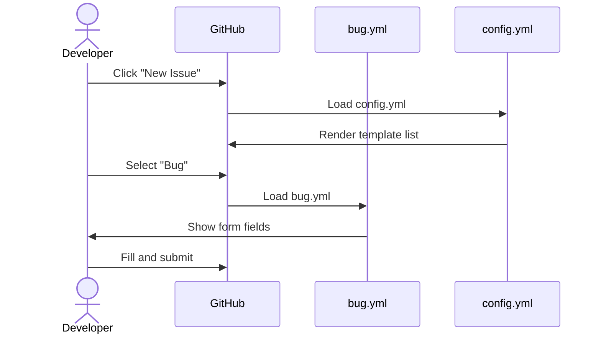
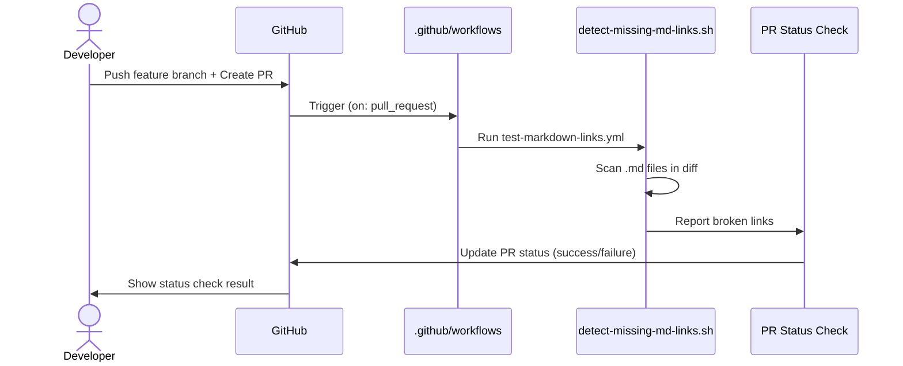

```yml
created_at: 2026-04-20 23:05:00
project: THYROX
feature: GitHub Workflows Infrastructure
design_version: 1.0
designer: Claude
components: 20
external_dependencies: 2
status: En progreso
```

# Design: GitHub Workflows Infrastructure

## Propósito

Documentar la arquitectura técnica de cómo implementar los 20 componentes de `.github/` especificados en `github-workflows-requirements-spec.md` (3 issue templates + 3 actions + 8 scripts + 3 configs + 3 workflows). Cómo se estructura, dónde va cada archivo, decisiones de diseño, dependencias, y plan de rollout.

---

## 1. Visión General

El sistema `.github/` es una capa de validación **repository-level** que complementa el Sistema Agentic AI (framework-level). Valida integridad del repositorio en PRs (`feature → develop`) sin tocar lógica del framework THYROX.

**3 capas de validación:**

```
Capa 1: Local (Session)      ← Sistema Agentic AI — framework integrity
        - PreToolUse hooks
        - Validación YAML, metadatos, estructura
        - Commits convencionales
        
Capa 2: Local (Pre-push)     ← git hooks (no scope actual)
        - Detectar archivos .bak
        - Pre-commit checks
        
Capa 3: Remote (PR)         ← .github/workflows (scope actual)
        - test-markdown-links
        - validate-references
        - detect-secrets
```

---

## 2. Decisiones Arquitectónicas

### DA-001: Responsabilidad entre .github/workflows vs Sistema Agentic AI

**Contexto:**
Ambos sistemas validan pero en diferentes contextos. Necesidad de separar concern para evitar duplicación y confusión.

**Decision:**
- `.github/workflows`: Valida REPOSITORIO (links, referencias, secretos)
- Sistema Agentic AI: Valida FRAMEWORK (metadata WP, YAML skills, estructura)

**Alternativas consideradas:**
- A: Todo en .github/workflows → Problema: No ejecuta en sesiones locales (90% del trabajo ocurre local)
- B: Todo en Sistema Agentic AI → Problema: No bloquea PRs en GitHub (secretos pueden escapar)

**Consecuencias:**
- (+) Defensa en profundidad: ambas capas funcionan independientemente
- (+) Responsabilidades claras: cada sistema sabe su dominio
- (-) Requiere coordinación mental (¿dónde va la validación X?)

**Referencias:** `github-vs-agentic-responsibilities.md` (scope phase)

---

### DA-002: Workflows como Bloqueadores vs Advertencias

**Contexto:**
El plan especifica 3 workflows. Necesidad de definir si son bloqueadores (PR no se puede mergear) o advertencias (notificación, merge permitido).

**Decision:**
Todos 3 workflows son BLOQUEADORES (exit status 1 = falla):
1. test-markdown-links.yml → bloqueador (evitar docs rotas)
2. validate-references.yml → bloqueador (evitar broken imports)
3. detect-secrets.yml → bloqueador (seguridad crítica)

**Alternativas consideradas:**
- A: Todos advertencias → Riesgo: secretos pueden pasar desapercibidos
- C: Solo detect-secrets bloqueador → Inconsistencia: ¿por qué links son advertencia?

**Consecuencias:**
- (+) Calidad consistente: toda validación repo es obligatoria
- (+) Seguridad: secretos no pueden escapar
- (-) Ocasionalmente bloquea PRs válidos (false positives)

**Referencias:** `scope-decisions-final.md`

---

### DA-003: Script Reutilización vs Nuevos Scripts

**Contexto:**
El plan menciona reutilizar `.claude/scripts/detect-missing-md-links.sh` en test-markdown-links.yml. Decisión: reutilizar vs reimplementar.

**Decision:**
- REUTILIZAR `.claude/scripts/detect-missing-md-links.sh` para test-markdown-links.yml
- CREAR NUEVO script para validate-references.yml (diferente lógica)
- USAR herramientas estándar (git-secrets, truffleHog) para detect-secrets.yml

**Alternativas consideradas:**
- Reimplementar todo → Maintenance burden, duplicación de lógica
- Reutilizar todo → Algunos scripts no aplican a workflows

**Consecuencias:**
- (+) Aprovecha trabajo existente
- (+) Mantenimiento centralizado para scripts comunes
- (-) Dependencia de `.claude/scripts/` (debe existir en workflow context)

**Referencias:** `github-workflows-plan.md` (dependencias secc.)

---

### DA-004: Script Stubs vs Implementación Completa

**Contexto:**
GitHub Actions (3) y Script Directories (3 dirs) son "stubs" en este WP. Implementación completa = futuro WP.

**Decision:**
Crear estructura + comentarios/documentación de stubs. NO implementar lógica funcional.

**Alternativas consideradas:**
- Implementar completo en este WP → Scope creep (plan dice "stubs")
- Solo crear directorios vacíos → Falta documentación de intención

**Consecuencias:**
- (+) Scope acotado, predictable
- (+) Futuros implementadores saben qué hacer
- (-) Workflows incompletos hasta siguiente WP

**Referencias:** `github-workflows-plan.md` (out-of-scope sección)

---

### DA-005: Trigger Conditions para Workflows

**Contexto:**
Workflows deben ejecutarse SOLO en PRs `feature → develop`. No deben ejecutarse en `develop → main` (futuro WP).

**Decision:**
Usar trigger condicional: `on: pull_request` + `if: github.base_ref == 'develop'`

**YAML:**
```yaml
on:
  pull_request:
    types: [opened, synchronize, reopened]

jobs:
  test:
    if: github.base_ref == 'develop'
    runs-on: ubuntu-latest
    steps: ...
```

**Consecuencias:**
- (+) Solo valida PRs al branch correcto
- (-) develop → main workflows requieren diferente trigger (futuro)

---

## 3. Componentes Afectados

### 3.1 Nuevos Componentes (20 totales)

| Componente | Ubicación | Propósito |
|-----------|-----------|----------|
| **Issue Templates (3)** | `.github/ISSUE_TEMPLATE/` | Guiar creación de issues |
| bug.yml | `ISSUE_TEMPLATE/bug.yml` | Template para bug reports |
| enhancement.yml | `ISSUE_TEMPLATE/enhancement.yml` | Template para features |
| config.yml | `ISSUE_TEMPLATE/config.yml` | Configuración de templates |
| **GitHub Actions (3)** | `.github/actions/` | Acciones reutilizables |
| run-claude | `actions/run-claude/action.yml` | Ejecutar análisis Claude |
| run-pytest | `actions/run-pytest/action.yml` | Ejecutar Python tests |
| setup-uv | `actions/setup-uv/action.yml` | Setup Python + UV |
| **Script Directories (8 scripts)** | `.github/scripts/` | Utilidades CI/CD |
| gh-get-review-threads.sh | `scripts/mention/` | Fetch PR threads (GraphQL) |
| gh-resolve-review-thread.sh | `scripts/mention/` | Resolve thread (GraphQL mutation) |
| pr-comment.sh | `scripts/pr-review/` | Queue inline review comment |
| pr-diff.sh | `scripts/pr-review/` | Show PR diff with lines |
| pr-existing-comments.sh | `scripts/pr-review/` | List existing review threads |
| pr-remove-comment.sh | `scripts/pr-review/` | Delete queued comment |
| pr-review.sh | `scripts/pr-review/` | Submit PR review (APPROVE/COMMENT/CHANGES) |
| helpers.sh | `scripts/workflows/` | Helper functions |
| **Config Files (3)** | `.github/` | Configuración repo |
| pull_request_template.md | `.github/pull_request_template.md` | PR creation template |
| dependabot.yml | `.github/dependabot.yml` | Automated dependency updates |
| release.yml | `.github/release.yml` | Automated changelog config |
| **Workflows (3)** | `.github/workflows/` | Validación CI/CD |
| test-markdown-links.yml | `workflows/test-markdown-links.yml` | Detectar links rotos |
| validate-references.yml | `workflows/validate-references.yml` | Validar referencias a archivos |
| detect-secrets.yml | `workflows/detect-secrets.yml` | Detectar credenciales |

### 3.2 Componentes Modificados

Ninguno. Todas creaciones nuevas.

### 3.3 Dependencias Externas

| Componente | Versión | Usado por | Alternativa |
|-----------|---------|----------|------------|
| `git-secrets` | latest | detect-secrets.yml | truffleHog, custom regex |
| `gh` CLI | ≥2.0 | scripts/pr-review/*.sh | curl + GitHub GraphQL |

---

## 4. Estructura de Archivos

```
.github/
├── ISSUE_TEMPLATE/
│   ├── bug.yml               (NUEVO)
│   ├── enhancement.yml       (NUEVO)
│   └── config.yml            (NUEVO)
├── actions/
│   ├── run-claude/
│   │   └── action.yml        (NUEVO)
│   ├── run-pytest/
│   │   └── action.yml        (NUEVO)
│   └── setup-uv/
│       └── action.yml        (NUEVO)
├── scripts/
│   ├── mention/
│   │   ├── gh-get-review-threads.sh      (NUEVO)
│   │   └── gh-resolve-review-thread.sh   (NUEVO)
│   ├── pr-review/
│   │   ├── pr-comment.sh                 (NUEVO)
│   │   ├── pr-diff.sh                    (NUEVO)
│   │   ├── pr-existing-comments.sh       (NUEVO)
│   │   ├── pr-remove-comment.sh          (NUEVO)
│   │   └── pr-review.sh                  (NUEVO)
│   └── workflows/
│       └── helpers.sh                    (NUEVO)
├── workflows/
│   ├── test-markdown-links.yml           (NUEVO)
│   ├── validate-references.yml           (NUEVO)
│   └── detect-secrets.yml                (NUEVO)
├── pull_request_template.md              (NUEVO)
├── dependabot.yml                        (NUEVO)
└── release.yml                           (NUEVO)
```

---

## 5. Flujos de Configuración

### 5.1 Issue Template Creation Flow



### 5.2 Workflow Validation Flow (PR Creation)



---

## 6. Integración con Sistema Agentic AI

Los workflows .github/ **NO** validan:
- ✗ YAML sintaxis de skills
- ✗ Metadatos de WP artifacts
- ✗ Estructura .claude/ vs .thyrox/
- ✗ Commits convencionales
- ✗ Archivos backup (.bak)

Eso es responsabilidad del Sistema Agentic AI (hooks locales).

---

## 7. Plan de Implementación

### Phase 8 Task Breakdown (12 estimadas)

#### Bloque 1: Issue Templates (T-001)
- [ ] Crear `.github/ISSUE_TEMPLATE/` directory
- [ ] Crear bug.yml (copiar FastMCP example)
- [ ] Crear enhancement.yml (copiar FastMCP example)
- [ ] Crear config.yml (copiar FastMCP example)

#### Bloque 2: Config Files (T-002)
- [ ] Crear `.github/pull_request_template.md` (copiar FastMCP example)
- [ ] Crear `.github/dependabot.yml` (copiar FastMCP example)
- [ ] Crear `.github/release.yml` (copiar FastMCP example)

#### Bloque 3: GitHub Actions (T-003, T-004, T-005)
- [ ] Crear `.github/actions/run-claude/action.yml` (copiar example)
- [ ] Crear `.github/actions/run-pytest/action.yml` (copiar example)
- [ ] Crear `.github/actions/setup-uv/action.yml` (copiar example)

#### Bloque 4: Script Directories (T-006, T-007, T-008)
- [ ] Crear `.github/scripts/mention/` + stub scripts
- [ ] Crear `.github/scripts/pr-review/` + stub scripts
- [ ] Crear `.github/scripts/workflows/helpers.sh`

#### Bloque 5: Workflows (T-009, T-010, T-011)
- [ ] Crear `.github/workflows/test-markdown-links.yml` (reutilizar detect-missing-md-links.sh)
- [ ] Crear `.github/workflows/validate-references.yml` (lógica nueva)
- [ ] Crear `.github/workflows/detect-secrets.yml` (git-secrets)

#### Bloque 6: Validación + Cierre (T-012)
- [ ] Verificar todos 20 componentes creados
- [ ] Validar YAML syntax en workflows y actions
- [ ] Commit + push a rama
- [ ] Crear PR: feature → develop (verifica que workflows se disparan)
- [ ] Documentar cualquier bug/fix encontrado

---

## 8. Riesgos y Mitigaciones

| Riesgo | Impacto | Mitigation |
|--------|---------|-----------|
| GitHub Actions YAML tiene typo | Workflow no ejecuta | Validar con `gh workflow view` antes de push |
| Script `.claude/scripts/detect-missing-md-links.sh` no existe | test-markdown-links falla | Verificar path en workflow, usar absolute path |
| `git-secrets` no instalado en runner | detect-secrets.yml falla | Usar `apt-get install -y git-secrets` step |
| Stubs script no tienen shebang | Scripts no ejecutables | Incluir `#!/usr/bin/env bash` en cada stub |
| false positives en detect-secrets | PRs bloqueadas | Crear .gitallowlist para patterns conocidos |

---

## 9. Testing Strategy

### Manual Testing en PR (antes de merge)

1. **Issue Templates:**
   - [ ] Click "New Issue" → ver lista de templates
   - [ ] Seleccionar "Bug" → form cargado correctamente

2. **PR Template:**
   - [ ] Crear PR manual → template pre-populated

3. **Workflows:**
   - [ ] Crear test PR: feature → develop con link roto
   - [ ] Verificar test-markdown-links.yml falla + comenta link
   - [ ] Fix link, push → workflow pasa
   - [ ] Crear PR con referencia inexistente
   - [ ] Verificar validate-references.yml falla
   - [ ] Crear PR con API key (dummy)
   - [ ] Verificar detect-secrets.yml falla

### Automated Testing (futuro WP)
- Unit tests para scripts (cuando implementados)
- Integration tests para workflows (act CLI)

---

## 10. Rollback Plan

Si necesario revertir cambios:

```bash
git revert <commit-sha>
git push origin <branch>
```

No hay data loss porque:
- Todos los componentes son nuevos (no modifican existentes)
- Git history captura cambios
- Workflows no tienen state

---

## 11. Performance Considerations

- Workflows deben completar en <5 minutos
- Scripts deben ser eficientes (scanning todo repo es lento)
- Suggestion: test-markdown-links solo en archivos modificados (PR diff, no full repo)

---

## 12. Security Considerations

### detect-secrets.yml
- Usa git-secrets o pattern matching
- NO almacena output en logs (secretos podrían escapar)
- Reporta SOLO que hay secreto, no el secreto mismo

### GitHub Actions Permissions
- Actions debe tener token GITHUB_TOKEN con permisos mínimos
- read: contents, metadata
- write: pull-requests (para comentarios)

---

## 13. Documentation

Archivos a documentar:
- [ ] README.md en `.github/` (overview + qué hace cada dir)
- [ ] Comentarios en stubs (descripción de qué irá implementado)
- [ ] Links en ROADMAP.md

---

## 14. Referencias

- **Especificación:** `github-workflows-requirements-spec.md`
- **Scope:** `github-workflows-plan.md`
- **Decisiones:** `scope-decisions-final.md`, `design-decisions-needed.md`
- **Ejemplos:** FastMCP reference architecture (15 files)
- **Responsabilidades:** `github-vs-agentic-responsibilities.md`

---

## 15. Aprobación y Siguiente Paso

- [ ] Design documento revisado y aprobado
- [ ] Listo para Phase 8 PLAN EXECUTION (task-plan.md generation)

**Versión:** 1.0<br>
**Última Actualización:** 2026-04-20 23:05:00<br>
**Estado:** Pendiente de revisión del usuario
