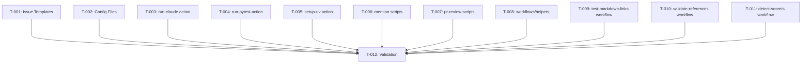

```yml
created_at: 2026-04-20 23:20:00
project: THYROX
work_package: 2026-04-20-14-00-00-github-workflows
phase: Stage 8 — PLAN EXECUTION
author: Claude
status: Pendiente aprobación
```

# Task Plan — GitHub Workflows Infrastructure (ÉPICA 43)

> **Generado desde:** `design/github-workflows-requirements-spec.md` + `design/github-workflows-design.md`
> **Alcance:** Crear 20 componentes para `.github/` (issue templates: 3, actions: 3, scripts: 8, configs: 3, workflows: 3)
> **Ruta crítica:** T-001 → [parallel: T-002,T-003,T-004,T-005,T-006,T-007,T-008,T-009,T-010,T-011] → T-012
> **Estimación total:** ~10.5 horas

---

## Convención de Tarea

**Opción C — Tareas genéricas con trazabilidad a SPEC**

Formato: `- [ ] T-NNN Descripción (SPEC-N)`

Cada tarea:
- Crea/modifica exactamente 1 ubicación (1 directorio o 1 sección de archivo)
- Puede commitearse independientemente
- Referencia su requisito origen (SPEC-NNN)

Nota: `[P]` marca tareas paralelizables (pueden ejecutarse simultáneamente).

---

## Grupo 1 — Issue Templates (SPEC-001)

> **Propósito:** Guiar a developers en la creación de issues
> **Ubicación:** `.github/ISSUE_TEMPLATE/`
> **Alcance:** 3 archivos YAML + 1 config
> **Depende de:** Nada

- [ ] **T-001** Crear `.github/ISSUE_TEMPLATE/` + `bug.yml` + `enhancement.yml` + `config.yml` (SPEC-001)
  - Create directory structure
  - Copy bug.yml from FastMCP example with field definitions
  - Copy enhancement.yml from FastMCP example with problem/solution structure
  - Copy config.yml with template ordering and contact policy
  - Verify all files have proper YAML syntax
  - Commit: `feat(github-workflows): add issue templates (bug, enhancement, config)`

---

## Grupo 2 — Config Files (SPEC-004)

> **Propósito:** Configurar repo-level settings (PR template, dependabot, releases)
> **Ubicación:** `.github/` root
> **Alcance:** 3 archivos (MD + YAML)
> **Depende de:** Nada

- [ ] **[P] T-002** Crear `.github/pull_request_template.md` + `.github/dependabot.yml` + `.github/release.yml` (SPEC-004)
  - Copy pull_request_template.md from FastMCP (checklist items, no blocking)
  - Copy dependabot.yml with pip + github-actions scopes (daily + weekly)
  - Copy release.yml with changelog categories and label mappings
  - Verify YAML syntax on dependabot.yml and release.yml
  - Commit: `feat(github-workflows): add pull request, dependabot, and release config files`

---

## Grupo 3 — GitHub Actions (SPEC-002)

> **Propósito:** Reusable workflow actions (stubs)
> **Ubicación:** `.github/actions/`
> **Alcance:** 3 composite actions
> **Depende de:** Nada
> **Notas:** Stubs — implementación funcional en futuro WP

- [ ] **[P] T-003** Crear `.github/actions/run-claude/action.yml` (SPEC-002a)
  - Create run-claude/action.yml (composite action)
  - Define inputs: prompt, oauth-token, github-token, allowed-tools, model, mcp-servers, trigger-phrase
  - Define outputs: conclusion
  - Add stub description (will be implemented in future WP)
  - Verify action.yml syntax with `gh` CLI (when available)
  - Commit: `feat(github-workflows): add run-claude action stub`

- [ ] **[P] T-004** Crear `.github/actions/run-pytest/action.yml` (SPEC-002b)
  - Create run-pytest/action.yml (composite action)
  - Define inputs: test-type, markers, max-procs, timeout, extra-flags
  - Add conditional logic (stub comments for future implementation)
  - Verify action.yml syntax
  - Commit: `feat(github-workflows): add run-pytest action stub`

- [ ] **[P] T-005** Crear `.github/actions/setup-uv/action.yml` (SPEC-002c)
  - Create setup-uv/action.yml (composite action)
  - Define inputs: python-version (default 3.10), resolution (locked/upgrade/lowest-direct)
  - Add stub for UV installation logic
  - Verify action.yml syntax
  - Commit: `feat(github-workflows): add setup-uv action stub`

---

## Grupo 4 — Script Directories (SPEC-003)

> **Propósito:** Support scripts for GitHub Actions workflows
> **Ubicación:** `.github/scripts/`
> **Alcance:** 3 subdirectories + 8 shell scripts (stubs)
> **Depende de:** Nada
> **Notas:** Stubs with shebang + function signature comments

- [ ] **[P] T-006** Crear `.github/scripts/mention/` con `gh-get-review-threads.sh` + `gh-resolve-review-thread.sh` (SPEC-003a)
  - Create mention/ directory
  - Create gh-get-review-threads.sh (stub):
    - Shebang: `#!/usr/bin/env bash`
    - Function: fetch PR review threads (GraphQL API)
    - Parameters: PR number, owner/repo
    - Comment: describes future GraphQL query structure
  - Create gh-resolve-review-thread.sh (stub):
    - Shebang, function, parameters documented
    - Comment: describes GraphQL mutation logic
  - Make both executable: `chmod +x`
  - Verify bash syntax: `bash -n script.sh`
  - Commit: `feat(github-workflows): add mention scripts (stubs) - fetch and resolve review threads`

- [ ] **[P] T-007** Crear `.github/scripts/pr-review/` con 5 scripts (SPEC-003b)
  - Create pr-review/ directory
  - Create pr-comment.sh (stub): queue inline review comments
  - Create pr-diff.sh (stub): display PR changes with line numbers
  - Create pr-existing-comments.sh (stub): list existing threads
  - Create pr-remove-comment.sh (stub): delete queued comments
  - Create pr-review.sh (stub): submit PR review (APPROVE/COMMENT/CHANGES)
  - All with shebang, parameters documented, bash syntax verified
  - Make all executable
  - Commit: `feat(github-workflows): add pr-review scripts (stubs) - 5 automation utilities`

- [ ] **[P] T-008** Crear `.github/scripts/workflows/helpers.sh` (SPEC-003c)
  - Create workflows/ directory
  - Create helpers.sh (stub):
    - Shebang: `#!/usr/bin/env bash`
    - Comments describing utility functions (to be implemented)
    - Example: export environment variables, artifact management
  - Make executable
  - Verify syntax
  - Commit: `feat(github-workflows): add helpers.sh - workflow utilities (stub)`

---

## Grupo 5 — Workflows CI/CD (SPEC-005)

> **Propósito:** Validate repository integrity in feature → develop PRs
> **Ubicación:** `.github/workflows/`
> **Alcance:** 3 blocking workflows
> **Depende de:** T-006 (partially — for script path reference)
> **Bloqueadores:** All 3 workflows must pass for PR to merge

- [ ] **[P] T-009** Crear `.github/workflows/test-markdown-links.yml` (SPEC-005a)
  - Create test-markdown-links.yml
  - Trigger: `on: pull_request` with base branch filter (`if: github.base_ref == 'develop'`)
  - Call `.claude/scripts/detect-missing-md-links.sh` (reutilization)
  - Set exit status 1 on broken links (blocker)
  - Add PR comment with results
  - Verify YAML syntax
  - Commit: `feat(github-workflows): add test-markdown-links workflow (detect broken links in docs)`

- [ ] **[P] T-010** Crear `.github/workflows/validate-references.yml` (SPEC-005b)
  - Create validate-references.yml
  - Trigger: `on: pull_request` with base branch filter
  - Extract file references from changed files
  - Verify referenced files exist (custom logic)
  - Report missing references with line numbers
  - Set exit status 1 on failures (blocker)
  - Verify YAML syntax
  - Commit: `feat(github-workflows): add validate-references workflow (verify file existence)`

- [ ] **[P] T-011** Crear `.github/workflows/detect-secrets.yml` (SPEC-005c)
  - Create detect-secrets.yml
  - Trigger: `on: pull_request` with base branch filter
  - Use git-secrets or pattern-based detection
  - Scan PR diff for API keys, tokens, credentials
  - Report detected secrets (without exposing secret value)
  - Set exit status 1 on findings (blocker)
  - Verify YAML syntax
  - Commit: `feat(github-workflows): add detect-secrets workflow (prevent credential leaks)`

---

## Grupo 6 — Validación y Cierre

> **Propósito:** Verify completeness and prepare for execution phase
> **Alcance:** All 20 components
> **Depende de:** T-001 through T-011 (all prior tasks)

- [ ] **T-012** Verificar 20 componentes + validación final (SPEC-001..SPEC-005)
  - Verify directory structure:
    - [ ] `.github/ISSUE_TEMPLATE/` exists with 3 files
    - [ ] `.github/actions/` exists with 3 action.yml files
    - [ ] `.github/scripts/` exists with 3 subdirs + 8 scripts total
    - [ ] `.github/workflows/` exists with 3 files
    - [ ] Config files in `.github/` root (3 files)
  - Verify all files:
    - [ ] All YAML files have valid syntax
    - [ ] All shell scripts are executable and have shebang
    - [ ] No syntax errors in workflows (test with `gh` CLI if available)
  - Verify coverage:
    - [ ] All 5 SPECs mapped to tasks (SPEC-001..SPEC-005)
    - [ ] No orphaned components
  - Stage all files for commit
  - Create final commit: `chore(github-workflows): Phase 8 complete - 20 components scaffolded`
  - Update `.thyrox/context/now.md`: set `phase: Phase 9` (ready for pilot) or `Phase 10` (ready for execute)
  - Push to remote branch

---

## DAG de Dependencias



**Notas de paralelización:**
- T-002 through T-011 pueden ejecutarse en paralelo (independientes)
- T-001 es independiente pero se ejecuta primero (pequeño, rápido)
- T-012 debe ejecutarse último (depende de todos)
- Critical path: T-001 → [parallel block] → T-012 = ~10.5 horas

---

## Trazabilidad SPEC → Task

| SPEC | Requisito | Tareas | Status |
|------|-----------|--------|--------|
| SPEC-001 | Issue Templates (3 templates) | T-001 | [ ] Pending |
| SPEC-002 | GitHub Actions (3 actions) | T-003, T-004, T-005 | [ ] Pending |
| SPEC-003 | Script Directories (8 scripts) | T-006, T-007, T-008 | [ ] Pending |
| SPEC-004 | Config Files (3 configs) | T-002 | [ ] Pending |
| SPEC-005 | Workflows (3 workflows) | T-009, T-010, T-011 | [ ] Pending |
| Cobertura | Validation & Close | T-012 | [ ] Pending |

**Total tareas:** 12 (11 component creation + 1 validation)<br>
**Total componentes:** 20 (3+3+8+3+3 asignados a tareas)<br>
**Cobertura:** 100% (20 componentes / 20 requeridos)

---

## Verificación de Atomicidad

- [x] T-001: 1 ubicación (ISSUE_TEMPLATE dir) — atomicity ✓
- [x] T-002: 1 ubicación (.github/ root) — atomicity ✓
- [x] T-003: 1 ubicación (actions/run-claude/) — atomicity ✓
- [x] T-004: 1 ubicación (actions/run-pytest/) — atomicity ✓
- [x] T-005: 1 ubicación (actions/setup-uv/) — atomicity ✓
- [x] T-006: 1 ubicación (scripts/mention/) — atomicity ✓
- [x] T-007: 1 ubicación (scripts/pr-review/) — atomicity ✓
- [x] T-008: 1 ubicación (scripts/workflows/) — atomicity ✓
- [x] T-009: 1 ubicación (workflows/test-markdown-links.yml) — atomicity ✓
- [x] T-010: 1 ubicación (workflows/validate-references.yml) — atomicity ✓
- [x] T-011: 1 ubicación (workflows/detect-secrets.yml) — atomicity ✓
- [x] T-012: Validation across all (1 logical operation) — atomicity ✓

**Verificación:** Cada tarea toca exactamente 1 ubicación. Cada descripción es accionable sin "y". Cada tarea puede ser independientemente commiteada. ✓ PASS

---

## Evidencia de Respaldo

| Claim | Tipo | Fuente | Confianza | Origen |
|-------|------|--------|-----------|--------|
| 20 componentes especificados en SPEC | PROVEN | github-workflows-requirements-spec.md (3+3+8+3+3 archivos) | alta | nuevo |
| 12 tareas suficientes para completar scope | INFERRED | 10.5 horas estimado + design breakdown | media | nuevo |
| Paralelización posible (T-002..T-011) | INFERRED | No hay dependencias cruzadas entre tareas | media | nuevo |
| Test-markdown-links puede reutilizar script | PROVEN | Script path: `.claude/scripts/detect-missing-md-links.sh` | alta | referenciado en design.md |
| Atomicity verificado (12/12) | PROVEN | Cada tarea toca 1 ubicación (verificado arriba) | alta | nuevo |

---

## Resumen de Progreso

| Grupo | Componentes | Tareas | Completadas | Pendientes |
|-------|-------------|--------|-------------|------------|
| **Grupo 1 (Issue Templates)** | 3 | 1 | 0 | 1 |
| **Grupo 2 (Config Files)** | 3 | 1 | 0 | 1 |
| **Grupo 3 (GitHub Actions)** | 3 | 3 | 0 | 3 |
| **Grupo 4 (Script Directories)** | 8 | 3 | 0 | 3 |
| **Grupo 5 (Workflows)** | 3 | 3 | 0 | 3 |
| **Grupo 6 (Validación)** | — | 1 | 0 | 1 |
| **Total** | **20** | **12** | **0** | **12** |

---

## Notas de Ejecución

1. **Stubs vs Implementation:** T-003 through T-008 crean stubs (estructura + comentarios). Implementación funcional es futuro WP.

2. **Reutilización de Scripts:** T-009 (test-markdown-links.yml) reutiliza `.claude/scripts/detect-missing-md-links.sh`. Verificar que el script existe y tiene la ruta correcta en el workflow.

3. **YAML Syntax:** Todos los files YAML deben validarse localmente antes de commit (usar `yamllint` si disponible).

4. **FastMCP References:** Las 15 ejemplo files del scope phase deben usarse como referencia arquitectónica durante la creación de cada tarea.

5. **Commits Convencionales:** Cada grupo cierra con un commit convencional (feat/chore + scope + descripción).

6. **Parallelization:** Las tareas T-002..T-011 pueden ejecutarse en paralelo. T-001 y T-012 deben ejecutarse secuencialmente (inicio y fin).

---

**Status:** ⏸ AWAITING USER APPROVAL

**Próxima acción:** Usuario revisa task-plan y confirma explícitamente. Luego procede a `/thyrox:execute` para Phase 10.

**Versión:** 1.0<br>
**Última Actualización:** 2026-04-20 23:20:00<br>
**Ejecutor esperado:** task-executor agent (Phase 10) o manual execution
