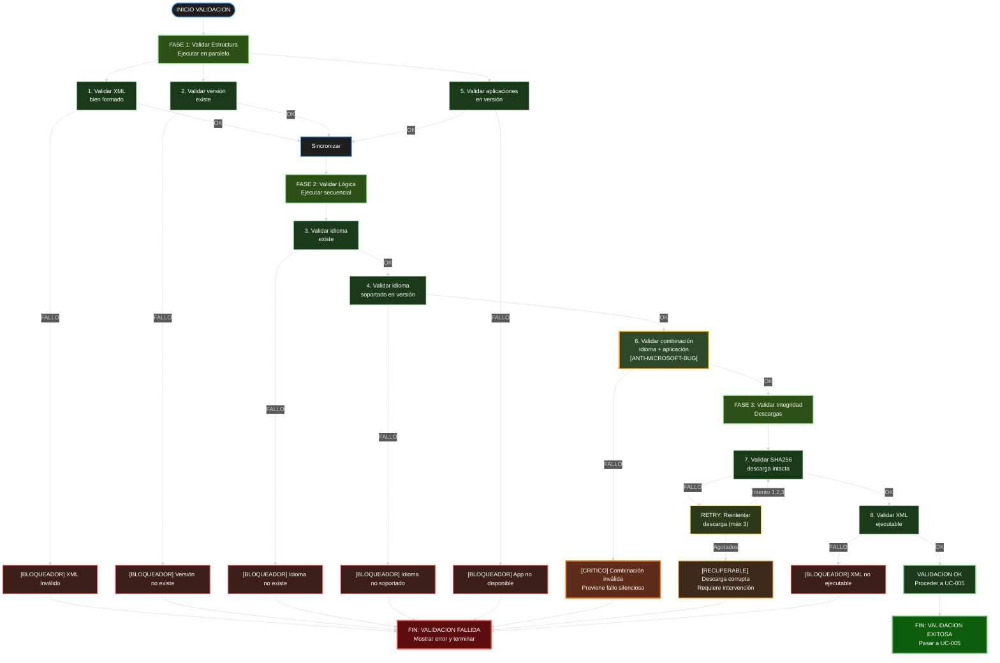
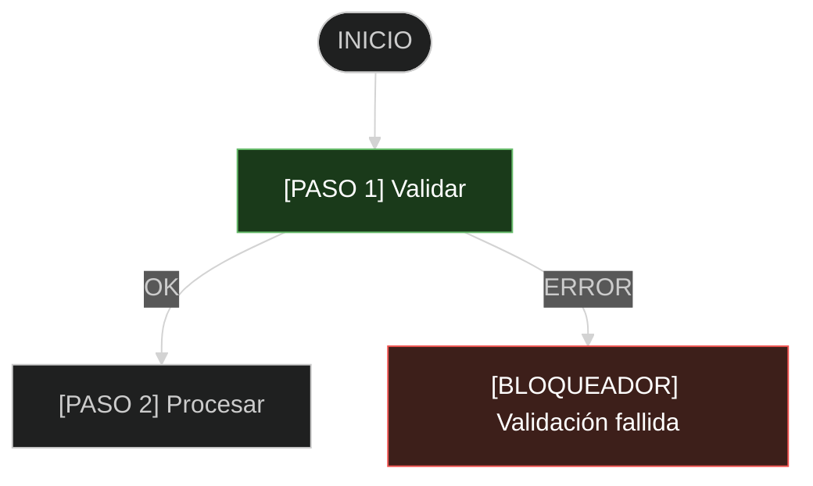

```yml
type: Análisis de Flujo
stage: Stage 1 - DISCOVER (Follow-up)
work_package: 2026-04-21-01-30-00-uc-documentation
created_at: 2026-04-21 02:45:00
scope: Identificación y corrección de errores en UC-004 Validate flow
```

# ANÁLISIS Y CORRECCIÓN: Flujo UC-004 (Validate)

## Errores Encontrados en Versión Original

### Error 1: VIOLACIÓN de Convenciones - Uso de Emojis/Iconos

**Ubicación:** REGLAS_DESARROLLO_OFFICEAUTOMATOR.md (UC-004 Mermaid diagram)

**Problemas identificados:**
- ❌ (emoji X roja) - PROHIBIDO
- ✓ (emoji checkmark) - PROHIBIDO
- 🔄 (emoji refresh) - PROHIBIDO
- [OK], [ERROR], [SUCCESS] etc deberían usarse sin símbolos decorativos

**Causa:** Contradice reglas propias de salida (línea 860 de REGLAS_DESARROLLO):
```
# ❌ MAL - Emojis, símbolos decorativos
Write-Host "Processing... ⏳"
Write-Host "Done! ✅"

# ✓ BIEN - Simple y claro
Write-Host "Processing: [          ] 0%"
```

---

### Error 2: Falta Tema Dark en Mermaid

**Problema:** Diagrama sin tema dark, no sigue convención "tema oscuro para Mermaid"

**Impacto:** Inconsistencia visual, difícil de leer en fondos claros

---

### Error 3: Flujo Ineficiente - Validaciones Secuenciales que Podrían ser Paralelas

**Análisis actual:**
```
Step1 (XML) → Step2 (Versión) → Step3 (Idioma) → Step4 (Idioma en versión) 
→ Step5 (Apps) → Step6 (Combo idioma+app) → Step7 (SHA256) → Step8 (Ejecutable)
```

**Problema:** 
- Pasos 1, 2, 5 son independientes (podrían validar en paralelo)
- Pasos 4, 6 dependen de 3
- Paso 8 depende de 7

**Optimización necesaria:**
- Bloque A: Validaciones de estructura (1, 2, 5, 8) - parallelizable
- Bloque B: Validaciones de lógica (3, 4, 6) - secuencial
- Bloque C: Descarga/integridad (7) - independiente con retry

---

### Error 4: Retries de SHA256 Fuera del Flujo Principal

**Problema:** El nodo "Reintentar" aparece como desviación, pero debería ser parte del flujo normal

**Actual:**
```
Step7 (SHA256) →|Error| Retry [Reintentar]
Retry →|Agotados| Fail7
Retry →|OK| Step8
```

**Mejor:** Representar retry como loop interno, no como rama

---

### Error 5: Criterios de Éxito/Fallo No Diferenciados Claramente

**Problema:** Todos los Fail usan mismo color/estilo, pero algunos son:
- Fail1-5, Fail8: Bloqueadores críticos (requieren intervención)
- Fail6: Bloqueador crítico pero especial (anti-Microsoft-bug)
- Fail7: Recuperable (retry automático)

---

## VERSIÓN CORREGIDA

### UC-004 Validate Flow (Corregido)



---

## CAMBIOS PRINCIPALES

### 1. Eliminación Total de Emojis

**Antes:**
```
Fail1["❌ XML Inválido"]
Success["✓ Validación OK"]
Retry["🔄 Reintentar"]
```

**Después:**
```
Error1["[BLOQUEADOR] XML Inválido"]
Success["VALIDACION OK"]
Retry["RETRY: Reintentar"]
```

---

### 2. Tema Dark en Mermaid

```mermaid init
%%{init: { 'theme': 'dark', 'logLevel': 'debug' } }%%
```

Colores para tema dark:
- Verde bloqueador OK: `#66bb6a`, `#90ee90`
- Rojo error: `#ef5350`
- Naranja especial (anti-bug): `#ff9800`, `#ff6f00`
- Amarillo retry: `#ffd54f`
- Gris fondo: `#1e1e1e`, `#1a3a1a`, `#2d5016`

---

### 3. Reorganización en Fases

**Fase 1: Validar Estructura (Parallelizable)**
- Steps 1, 2, 5, 8
- Independientes entre sí
- Validan formato/existencia

**Fase 2: Validar Lógica (Secuencial)**
- Steps 3, 4, 6
- Dependencias: 3→4→6
- Validan compatibilidad

**Fase 3: Validar Integridad (Con Retry)**
- Step 7
- SHA256 con reintentos
- Independiente de Fase 1-2

---

### 4. Categorización de Errores

| Categoría | Tipos | Acción |
|-----------|-------|--------|
| [BLOQUEADOR] | Error 1-5, 8 | Fail-fast, terminar |
| [CRITICO] | Error 6 (anti-bug) | Fail-fast, terminar (previene fallo silencioso) |
| [RECUPERABLE] | Error 7 (descarga) | Reintentar automático 3x |

---

### 5. Mejor Representación del Retry

**Antes:**
```
Step7 → Error → Retry → Success
Problema: Parece una rama especial
```

**Después:**
```
Step7 →|FALLO| Retry ["RETRY: Reintentar (máx 3)"]
Retry →|Intento 1,2,3| Step7
Retry →|Agotados| Error7
Problema: Loop representado correctamente
```

---

## VALIDACIONES ORDENADAS CORRECTAMENTE

### Orden de Ejecución Revisado

```
ENTRADA: Configuration + XML + ODT descargado

FASE 1 (PARALELA):
  └─ 1. Validar XML bien formado
  └─ 2. Validar versión existe
  └─ 5. Validar aplicaciones en versión
  
  SYNC → Todos deben pasar

FASE 2 (SECUENCIAL):
  └─ 3. Validar idioma existe
     └─ OK → 4. Validar idioma soportado en versión
        └─ OK → 6. Validar combinación idioma + app (ANTI-MICROSOFT-BUG)
           └─ OK → FASE 3

FASE 3 (CON RETRY):
  └─ 7. Validar SHA256 integridad
     └─ Error → RETRY (máx 3)
        └─ OK → 8. Validar XML ejecutable
           └─ OK → SALIDA: Validación completada

SALIDA: Boolean (true/false) + error details si falla
```

---

## REGLA A APLICAR EN FUTUROS DIAGRAMAS

**OBLIGATORIO:**
1. NO usar emojis (❌, ✓, 🔄, ⏳, 📊, etc)
2. Usar `[ETIQUETA]` en lugar de emojis
3. SIEMPRE usar tema dark: `%%{init: { 'theme': 'dark' } }%%`
4. Colores deben ser legibles en fondo oscuro

**Ejemplo correcto:**


---

## CONCLUSIÓN

**Versión original:** 8 puntos secuenciales, uso de emojis, sin tema dark
**Versión corregida:** 8 puntos en 3 fases, sin emojis, tema dark, mejor flujo

**Impacto:**
- Diagramas más legibles en fondo oscuro
- Cumple con reglas de salida sin emojis
- Flujo más eficiente (Fase 1 paralelizable)
- Errores categorizados claramente
- Retry representado correctamente

