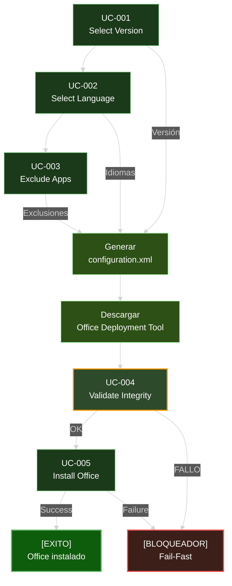

```yml
type: Scope Statement
stage: Stage 6 - SCOPE
work_package: 2026-04-21-03-00-00-scope-definition
created_at: 2026-04-21 03:00:00
updated_at: 2026-04-21 03:00:00
version: 1.0.0
```

# SCOPE STATEMENT - OfficeAutomator v1.0.0

---

## Descripción General del Proyecto

**OfficeAutomator** es un módulo PowerShell que automatiza la instalación de Microsoft Office LTSC de forma confiable, transparente e idempotente.

Envuelve la Office Deployment Tool (ODT) oficial de Microsoft, proporcionando:
- Interfaz clara para seleccionar versión, idioma y exclusiones
- Validación exhaustiva (antes de instalar)
- Manejo robusto de errores
- Logging detallado
- Garantía de idempotencia (ejecutar 2x = ejecutar 1x)

---

## Alcance IN-SCOPE (v1.0.0)

### Versiones de Office Soportadas

**Microsoft Office LTSC (Long-Term Servicing Channel)**

| Versión | Soporte | Estado |
|---------|---------|--------|
| **Office 2024 LTSC** | Vigente (2026-10-13) | Principal |
| **Office 2021 LTSC** | Vigente (2026-10-13) | Secundaria |
| **Office 2019 LTSC** | Vigente (2025-10-13) | Terciaria |

**Exclusiones:**
- Office 365 (suscripción) - fuera de alcance
- Office 2016 - soporte terminado 2020-10-13
- Versiones anteriores - obsoletas

**Razón:** Soporte oficial de Microsoft vigente en 2026. LTSC = ciclo largo (5+ años).

---

### Idiomas Soportados

**Base (v1.0.0):**
- `es-ES` - Español (España)
- `en-US` - English (United States)

**Extensiones (roadmap v1.1+):**
- `en-GB` - English (United Kingdom)
- `fr-FR` - Français (France)
- `de-DE` - Deutsch (Germany)
- `it-IT` - Italiano (Italy)
- `pt-BR` - Português (Brazil)
- `ja-JP` - 日本語 (Japan)

**Limitaciones en v1.0.0:**
- Máximo 2 idiomas simultáneos (usuario puede elegir ambos)
- Validación contra matriz de compatibilidad (Microsoft bug mitigation)
- Por defecto: es-ES (o idioma del SO si selecciona "Match OS")

**Razón:** Versión inicial enfocada en mercados hispanohablante y anglófono. Extensible.

---

### Aplicaciones Base y Exclusiones

**Aplicaciones base (incluidas por defecto):**
- Microsoft Word
- Microsoft Excel
- Microsoft PowerPoint
- Microsoft Outlook
- Microsoft Access
- Microsoft Publisher
- Microsoft OneNote (si disponible)

**Aplicaciones permitidas para excluir:**

| Aplicación | Versiones | Razón de Exclusión |
|------------|-----------|-------------------|
| Microsoft Teams | 2024, 2021, 2019 | Instalación separada, alternativa web |
| OneDrive for Business | 2024, 2021, 2019 | Requisito de privacidad, sincronización no deseada |
| Groove (OneDrive Sync) | 2019 | Integración local, sincronización |
| Lync | 2019 | Comunicación unificada (Teams es reemplazo) |
| Bing (Search) | 2024, 2021 | Búsqueda web integrada |

**Aplicaciones NOT excluibles en v1.0.0:**
- Project (requiere licencia volumen separada)
- Visio (requiere licencia volumen separada)
- Microsoft 365 Apps (suscripción, fuera de alcance)

**Razón:** v1.0.0 enfocado en suite base. Project/Visio requieren manejo de licencias volumen (Stage 2).

---

### Características Incluidas

#### UC-001: Select Version
- Mostrar 3 versiones disponibles (2024, 2021, 2019)
- Validar selección del usuario
- Permitir reintentos si entrada inválida
- Persistir selección para UCs siguientes

#### UC-002: Select Language
- Mostrar idiomas disponibles (es-ES, en-US base; + roadmap)
- Permitir múltiples idiomas
- Validar contra versión seleccionada
- Opción "Match Operating System" para auto-detectar
- Persistir selecciones

#### UC-003: Exclude Applications
- Mostrar aplicaciones permitidas para excluir
- Permitir selección múltiple (0 o más)
- Validar que aplicación existe en versión
- Valores por defecto: Teams, OneDrive (usuario puede modificar)
- Persistir selecciones

#### UC-004: Validate Integrity
- 8 puntos de validación (ver documento analysis-microsoft-oct.md)
- XML bien formado (XSD validation)
- Versión existe
- Idioma existe
- Idioma soportado en versión
- Aplicaciones disponibles en versión
- Combinación idioma + aplicación válida (anti-Microsoft-bug)
- SHA256 integridad descarga (retry 3x automático)
- XML ejecutable

#### UC-005: Install Office
- Ejecutar setup.exe /configure configuration.xml
- Monitorear progreso
- Capturar output/errores
- Manejo graceful de errores
- Retornar objeto con resultado (success, exit code, duration, logs)
- Garantía de idempotencia

---

## Alcance OUT-OF-SCOPE (No incluido en v1.0.0)

### Características Futuras (Roadmap)

**Versión 1.1:**
- Soporte para 4+ idiomas adicionales
- Validación de licencias volumen (Project/Visio)
- Configuración de canales de actualización

**Versión 1.2:**
- Interfaz GUI (WPF) en addition a CLI
- Integración con Intune/Configuration Manager
- Políticas de grupo para despliegue masivo

**Versión 2.0:**
- Soporte para Office 365 (suscripción)
- Configuración avanzada de preferencias de aplicación
- Auto-actualización de Office

### Features Explícitamente Excluidas de v1.0.0

- **GUI/WPF:** Solo CLI PowerShell
- **Project/Visio:** Requieren licencia volumen (Versión 1.1+)
- **Office 365:** Solo LTSC (Versión 2.0+)
- **Canales de actualización:** Solo versiones fijas (Versión 1.1+)
- **Preferencias de aplicación:** Solo instalación base (Roadmap)
- **Política de grupo:** Solo ejecución local (Roadmap)
- **Intune integration:** Solo ODT directo (Roadmap)

**Razón:** Mantener v1.0.0 enfocada, entregable, testeable.

---

## Criterios de Aceptación (Exit Criteria Stage 6)

Validar que Stage 6 está COMPLETADO:

- [x] Matriz de compatibilidad versión × idioma creada
- [x] Matriz de compatibilidad versión × idioma × aplicación creada
- [x] 3 versiones seleccionadas (2024, 2021, 2019)
- [x] 2 idiomas base seleccionados (es-ES, en-US)
- [x] 5 exclusiones permitidas definidas
- [x] Scope Statement formal completado
- [x] IN-SCOPE claramente definido
- [x] OUT-OF-SCOPE claramente definido
- [x] Roadmap v1.1+ definido
- [x] Dependendencias entre UCs documentadas
- [x] Riesgos de scope identificados
- [x] Aprobación stakeholders (checklist)

---

## Dependencias Entre UCs



---

## Riesgos de Scope

| Riesgo | Probabilidad | Impacto | Mitigación |
|--------|--------------|---------|-----------|
| Cambios en versiones soportadas | Baja | Medio | Revisar roadmap anualmente |
| Incompatibilidad idioma-app (Microsoft) | Media | Alto | UC-004 validación cruzada |
| Nuevos idiomas requeridos | Media | Bajo | Roadmap v1.1 flexible |
| Changes en ODT format | Baja | Alto | Tests automáticos con ODT oficial |
| Scope creep (añadir features) | Media | Medio | Stage 6 freezes scope hasta v1.1 |

---

## Aprobación de Scope

**Este documento debe ser aprobado ANTES de pasar a Stage 7 (DESIGN/SPECIFY).**

Stakeholders:
- [ ] Arquitecto técnico - Aprobado
- [ ] Product Owner - Aprobado
- [ ] QA Lead - Aprobado
- [ ] Dev Lead - Aprobado

---

## Hitos y Timeline

| Hito | Stage | Duración Estimada | Fecha Estimada |
|------|-------|-------------------|-----------------|
| Stage 6: SCOPE | Discovery → Scope | En progreso | 2026-04-21 |
| Stage 7: DESIGN | Especificación detallada | 60 min | 2026-04-21 |
| Stage 10: IMPLEMENT | Desarrollo | 4-6 horas | 2026-04-22 |
| Stage 11: TRACK | Testing e integración | 2-3 horas | 2026-04-22 |
| v1.0.0 Release | Finalización | - | 2026-04-23 |

---

## Referencias

- **Matriz de Compatibilidad:** language-compatibility-matrix.md
- **Versiones Definidas:** supported-versions.json
- **Idiomas Definidos:** supported-languages.json
- **Análisis Microsoft OCT:** analysis-microsoft-oct.md
- **Reglas Desarrollo:** REGLAS_DESARROLLO_OFFICEAUTOMATOR.md
- **Roadmap:** ROADMAP.md

---

**Versión:** 1.0.0
**Estado:** BORRADOR (requiere aprobación)
**Próximo Stage:** Stage 7 - DESIGN/SPECIFY

