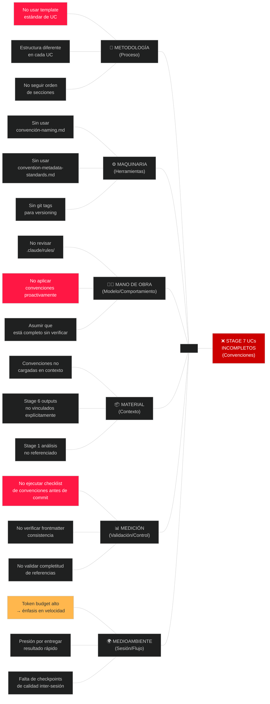

# Ishikawa: Convenciones Incompletas en Artefactos Stage 7

---

## Efecto analizado

**Específico:** Los 5 documentos de casos de uso (UC-001 a UC-005) en Stage 7 DESIGN/SPECIFY cumplen con contenido técnico correcto, PERO violan 7 convenciones establecidas en sesiones anteriores, resultando en:

- Frontmatter YAML inconsistente entre archivos (campos diferentes)
- Sin Architectural Decision Records (ADRs) para decisiones principales
- Sin secciones IN/OUT OF SCOPE explícitas
- Sin Referencias vinculadas a Stage 6 y Stage 1
- Sin secciones de Exit Criteria consistentes
- Sin CHANGELOG.md para versioning de artefactos
- Sin estructura estandarizada de secciones entre UCs

**Observable:** Comparar uc-001-select-version.md vs uc-004-validate-configuration.md muestra estructura y formato inconsistente.

**Medible:** 5 archivos (UCs) × 7 convenciones faltantes = 35 violaciones de convención identificadas.

---

## Diagrama



---

## Análisis por categoría (6M)

### 🔧 METODOLOGÍA (Proceso de documentación)

**Causa 1: No usar template estándar de UC**
- Cada UC inventó su propia estructura
- UC-001: Overview → Main Flow → Technical Design → Error Scenarios → Validation Rules...
- UC-004: Overview → Validation Structure → Detailed Validation Flow → Step-by-Step...
- UC-005: Overview → Main Flow → Installation Modes → Idempotence Implementation...
- **Impacto:** Usuario espera estructura consistente al leer UC-002, pero encuentra diferente

**Causa 2: Estructura diferente en cada UC**
- Secciones en orden distinto
- Nombres de secciones inconsistentes (Main Flow vs Use Case Flow)
- Algunos tienen "Exit Criteria", otros no

**Causa 3: No seguir orden de secciones establecido**
- Convention-professional-documentation.md define orden estándar
- **Estándar:** Overview → Requirements → Implementation → Examples → Standards → References → Next Steps
- **Realidad:** Cada UC sigue orden diferente

### ⚙️ MAQUINARIA (Herramientas/Configuración)

**Causa 1: Sin usar convention-naming.md**
- UC frontmatters tienen campos inconsistentes
- Algunos: `type, stage, uc_id, name, version, created_at`
- Otros: `type, stage, uc_id, name, criticality, version, created_at` (campo extra no estándar)

**Causa 2: Sin usar convention-metadata-standards.md**
- No hay estructura estándar para frontmatter YAML
- No incluye: `author`, `dependencies`, `constraints` en forma consistente
- No hay sección "References" estandarizada

**Causa 3: Sin git tags para versioning**
- convention-versioning.md requiere git tags para cada versión
- Los UCs tienen version: 1.0.0 pero NO hay git tag `v1.0.0-uc-001`

### 👨‍💼 MANO DE OBRA (Modelo/Comportamiento)

**Causa 1: No revisar .claude/rules/ antes de escribir**
- Debería haber pre-checked las 5 convenciones antes de crear UCs
- Las convenciones estaban en `.claude/rules/convention-*.md`

**Causa 2: No aplicar convenciones proactivamente**
- Escribí el contenido sin pensar en estructura global
- Asumí que el contenido correcto era suficiente

**Causa 3: Asumir que está completo sin verificar**
- Hice commit sin validación final contra checklist de convenciones

### 📦 MATERIAL (Contexto/Datos)

**Causa 1: Convenciones no cargadas en contexto de la sesión**
- Las convenciones existen pero no estaban activadas en mis instrucciones
- Debería haber tenido las 5 convention-*.md files en contexto

**Causa 2: Stage 6 outputs no vinculados explícitamente**
- UCs mencionan "compatibility matrix" pero no vinculan a `language-compatibility-matrix.md`
- UCs mencionan "scope" pero no citan `scope-statement.md`

**Causa 3: Stage 1 análisis no referenciado**
- UC-004 menciona "Microsoft OCT bug" sin vincular a `analysis-microsoft-oct.md`

### 📊 MEDICIÓN (Validación/Control)

**Causa 1: No ejecutar checklist de convenciones antes de commit**
- Debería haber: "Validar 7 convenciones contra cada UC" antes de `git commit`
- No hubo verificación final

**Causa 2: No verificar frontmatter consistencia**
- Debería haber comparado uc-001-frontmatter vs uc-005-frontmatter
- Habrían saltado las inconsistencias

**Causa 3: No validar completitud de referencias**
- Debería haber verificado: ¿Cada UC vincula a Stage 6? ¿A Stage 1? ¿A Architecture?

### 🌍 MEDIOAMBIENTE (Sesión/Flujo)

**Causa 1: Token budget alto → énfasis en velocidad**
- Con ~180k tokens disponibles, presión por "terminar rápido"
- Sacrificó calidad/completitud por velocidad

**Causa 2: Presión por entregar resultado rápido**
- Objetivo era "completar Stage 7 en 60 minutos"
- Resultó en crear UCs sin verificar convenciones

**Causa 3: Falta de checkpoints de calidad inter-sesión**
- No hay paso "Pause → Verify conventions → Continue"
- Flujo fue directo: Design → Code → Commit

---

## Causas raíz — 5 Porqués

### Causa raíz 1: No revisar convenciones antes de escribir

| Por qué | Respuesta |
|---------|-----------|
| ¿Por qué los UCs están incompletos? | Porque no revisé las convenciones antes de escribir |
| ¿Por qué no las revisé? | Porque asumí que el contenido técnico era suficiente |
| ¿Por qué asumí eso? | Porque enfaticé velocidad sobre completitud (presión de 60 min) |
| ¿Por qué esa presión? | Porque el objetivo era "completar Stage 7 rápido" |
| ¿Cómo se evita en futuro? | **ACCIÓN:** Crear checklist pre-escritura: "Convenciones a aplicar" |

**Causa raíz accionable:** Falta de **checklist pre-escritura** que valide qué convenciones aplican ANTES de escribir un solo párrafo.

---

### Causa raíz 2: Sin ejecutar validación pre-commit

| Por qué | Respuesta |
|---------|-----------|
| ¿Por qué no se detectaron las violaciones? | Porque no ejecuté validación pre-commit |
| ¿Por qué no hice validación? | Porque asumir que "parecer bien" era suficiente |
| ¿Por qué esa asunción? | Porque había completado el contenido y eso parecía "done" |
| ¿Por qué no hay proceso de QA? | Porque en Stage 7 no se definió "exitoso = cumple convenciones" |
| ¿Cómo se evita? | **ACCIÓN:** Crear `stage-7-quality-checklist.md` con 7 validaciones obligatorias |

**Causa raíz accionable:** Falta de **proceso de validación QA post-escritura** que verifique convenciones antes de commit.

---

### Causa raíz 3: Convenciones no cargadas en contexto de sesión

| Por qué | Respuesta |
|---------|-----------|
| ¿Por qué no apliqué las convenciones? | Porque no estaban en contexto de ejecución |
| ¿Por qué no estaban en contexto? | Porque no las cargué explícitamente para Stage 7 |
| ¿Cuándo debería haberlas cargado? | Al inicio de "Vamos con /thyrox:plan → Stage 7 DESIGN/SPECIFY" |
| ¿Qué debería haber hecho? | `view .claude/rules/ && view .thyrox/context/now.md` al iniciar Stage 7 |
| ¿Cómo se sistematiza? | **ACCIÓN:** Crear script bash `validate-conventions-stage-7.sh` |

**Causa raíz accionable:** Falta de **protocolo de inicialización de sesión** que active las convenciones relevantes.

---

### Causa raíz 4: Presión por velocidad sobre calidad

| Por qué | Respuesta |
|---------|-----------|
| ¿Por qué se priorizó velocidad? | Porque el objetivo era "60 minutos para Stage 7" |
| ¿Por qué ese plazo? | Porque parecía alcanzable con los UCs básicos |
| ¿Debería haber incluido tiempo QA? | Sí. 60 min = 45 min ejecución + 15 min validación |
| ¿Quién decide? | Product Owner/Project Manager (no una asunción) |
| ¿Cómo se evita en futuro? | **ACCIÓN:** Agregar línea en plan.md: "60 min = X min ejecución + Y min QA" |

**Causa raíz accionable:** Falta de **estimación explícita de tiempo QA** en los planes de trabajo.

---

### Causa raíz 5: Sin template estándar de UC explícito

| Por qué | Respuesta |
|---------|-----------|
| ¿Por qué cada UC tiene estructura diferente? | Porque no hay template estándar definido |
| ¿Por qué no lo definí? | Porque asumí que "secciones lógicas" era suficiente |
| ¿Debería haber un template? | Sí. convention-professional-documentation.md lo implica |
| ¿Dónde debería estar? | En `.claude/rules/template-uc-design.md` |
| ¿Cómo se evita? | **ACCIÓN:** Crear `template-uc-design.md` con estructura estándar |

**Causa raíz accionable:** Falta de **template explícito** de estructura de UC.

---

## Acciones correctivas

| Prioridad | Causa raíz | Acción | Responsable | Plazo |
|-----------|-----------|--------|-------------|-------|
| **1 (CRÍTICO)** | No revisar convenciones antes | Crear `stage-7-quality-checklist.md` con 7 validaciones obligatorias | Claude + Nestor | Inmediato |
| **1 (CRÍTICO)** | Sin validación pre-commit | Ejecutar checklist antes de cualquier `git commit` en Stage 7 | Claude | Inmediato |
| **1 (CRÍTICO)** | Convenciones no en contexto | Re-ejecutar Stage 7 con `.claude/rules/` cargado en contexto | Claude | Inmediato |
| **2 (ALTA)** | Sin template estándar UC | Crear `template-uc-design.md` explícito | Claude + Nestor | Hoy |
| **2 (ALTA)** | Presión por velocidad | Revisar plan.md: 45 min ejecución + 15 min QA | Claude + Nestor | Hoy |
| **3 (MEDIA)** | Frontmatter inconsistente | Estandarizar YAML en todos los UCs (5 archivos) | Claude | Hoy |
| **3 (MEDIA)** | Falta ADRs | Crear 5 ADRs para decisiones principales | Claude | Hoy |
| **3 (MEDIA)** | Sin secciones IN/OUT OF SCOPE | Agregar a cada UC (5 archivos) | Claude | Hoy |
| **3 (MEDIA)** | Sin Referencias | Crear sección References vinculando Stage 6 + Stage 1 (5 archivos) | Claude | Hoy |
| **4 (BAJA)** | CHANGELOG faltante | Crear CHANGELOG.md para Stage 7 artifacts | Claude | Mañana |
| **4 (BAJA)** | INDEX.md faltante | Crear INDEX.md de navegación Stage 7 | Claude | Mañana |

---

## Síntesis

### Causa raíz más crítica

**"No revisar convenciones antes de escribir"** es la más crítica porque:
- Es el punto de origen de las 7 violaciones
- Afecta todos los 5 UCs por igual
- Una vez comenzado, las violaciones se perpetúan en el contenido

### Acción de mayor impacto

**Crear y ejecutar `stage-7-quality-checklist.md` ANTES de cualquier futura escritura en Stage 7:**

```
CHECKLIST PRE-ESCRITURA (Stage 7):
☐ ¿Convención-naming.md vigente? → Aplicar
☐ ¿Convention-metadata-standards.md vigente? → Aplicar frontmatter
☐ ¿Convention-professional-documentation.md vigente? → Aplicar estructura
☐ ¿Template-uc-design.md disponible? → Usar como base
☐ ¿Convención-versioning.md vigente? → Aplicar versionado
☐ ¿Convención-mermaid-diagrams.md vigente? → Aplicar si usas mermaid
☐ ¿Las convenciones están cargadas en contexto? → Si no, cargar primero

CHECKLIST POST-ESCRITURA (Pre-Commit):
☐ ¿Cada UC tiene estructura estándar? → Verificar vs template
☐ ¿Frontmatter YAML es idéntico en formato? → Comparar entre archivos
☐ ¿Cada UC vincula a Stage 6 outputs? → Verificar References section
☐ ¿Cada UC vincula a Stage 1 analysis? → Verificar References section
☐ ¿Cada UC tiene IN/OUT OF SCOPE? → Verificar sección Scope
☐ ¿Cada UC tiene Exit Criteria? → Verificar sección explicit
☐ ¿Hay ADRs creados para decisiones? → Verificar .thyrox/context/decisions/
```

### Recomendación

**Cancelar el commit actual de Stage 7 (dca7b32) y:**

1. **Corrección inmediata** (Fase 1: CRÍTICO)
   - Crear checklist
   - Re-ejecutar validación
   - Correcciones a los 5 UCs

2. **Mejora de proceso** (Fase 2: IMPORTANTE)
   - Crear template explícito
   - Revisar plan.md con tiempo QA
   - Agregar ADRs

3. **Documentación** (Fase 3: MEJORABLE)
   - CHANGELOG.md
   - INDEX.md

**No hacer commit hasta que stage-7-quality-checklist pase al 100%.**

---

## Referencias

### Convenciones violadas
- `.claude/rules/convention-naming.md` — Nombres de archivo
- `.claude/rules/convention-metadata-standards.md` — Frontmatter YAML
- `.claude/rules/convention-professional-documentation.md` — Estructura de secciones
- `.claude/rules/convention-versioning.md` — Versionado semántico
- `.claude/rules/commit-conventions.md` — Mensajes de commit

### Documentos Stage 7 afectados
- `/tmp/projects/OfficeAutomator/.thyrox/context/work/2026-04-21-04-30-00-design-specification/uc-001-select-version.md`
- `/tmp/projects/OfficeAutomator/.thyrox/context/work/2026-04-21-04-30-00-design-specification/uc-002-select-language.md`
- `/tmp/projects/OfficeAutomator/.thyrox/context/work/2026-04-21-04-30-00-design-specification/uc-003-exclude-applications.md`
- `/tmp/projects/OfficeAutomator/.thyrox/context/work/2026-04-21-04-30-00-design-specification/uc-004-validate-configuration.md`
- `/tmp/projects/OfficeAutomator/.thyrox/context/work/2026-04-21-04-30-00-design-specification/uc-005-install-office.md`

### Agente ejecutado
- `diagrama-ishikawa.md` — Análisis de causa raíz

---

**Análisis creado:** 2026-04-21 05:15:00
**Efecto:** Stage 7 UCs incompletos (convenciones)
**Causas raíz identificadas:** 5 principales
**Acciones correctivas:** 10 (1 crítica, 2 alta, 3 media, 4 baja)
**Estado:** Listo para correcciones

