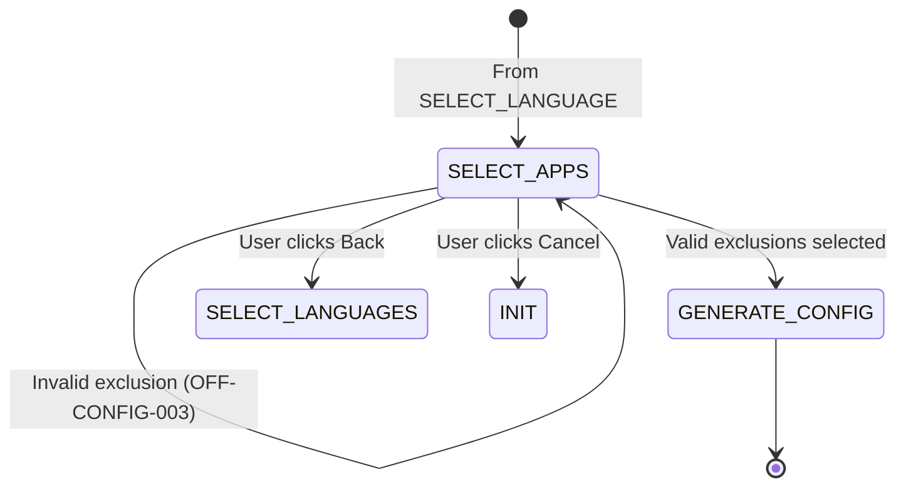

```yml
created_at: 2026-05-16 13:15
updated_at: 2026-05-16 13:15
document_type: Design Document - UC-003 State & XML Schema
document_version: 1.0.0
version_notes: Initial design following VersionSelector/LanguageSelector pattern
stage: Stage 7 - DESIGN/SPECIFY
work_package: 2026-04-21-06-15-00-design-specification-correct
phase: 2-Agile-Sprints
sprint_number: 1
task_id: T-023
task_name: UC-003 State & XML Design
execution_date: 2026-05-16 13:15 onwards
duration_hours: TBD
story_points: 3
roles_involved: ARCHITECT (Claude)
dependencies: T-019 (Configuration), T-022 (VersionSelector/LanguageSelector pattern)
design_artifacts:
  - UC-003 state description
  - AppExclusionSelector class design
  - XML schema updates for exclusions
  - Mermaid diagram (UC-003 workflow)
  - Configuration updates after UC-003
  - Exclusion whitelist & validation rules
acceptance_criteria:
  - UC-003 state defined with pre/post conditions
  - AppExclusionSelector class complete with all methods
  - XML schema documented for exclusions element
  - Validation logic for exclusion selections
  - State transitions mapped (valid paths)
  - Error scenarios documented (OFF-CONFIG-003)
  - Configuration.excludedApps structure defined
status: IN PROGRESS
```

# DESIGN: UC-003 STATE & XML SCHEMA (Exclude Applications)

## Overview

UC-003 allows users to exclude specific Microsoft Office applications from installation. This document designs the state, workflow, and XML schema for exclusion handling, following the proven pattern from UC-001 (VersionSelector) and UC-002 (LanguageSelector).

**Version:** 1.0.0  
**Scope:** UC-003 state description, AppExclusionSelector class, XML exclusions schema  
**Source:** T-006 (data structures), T-022 (selector pattern), REQ-F-003 (requirements)  
**Usage:** Architecture blueprint for Stage 10 implementation  
**Key Concept:** AppExclusionSelector follows VersionSelector/LanguageSelector pattern, returns $Config.excludedApps array to Configuration object

---

## 1. UC-003 State Definition

### State Name: SELECT_APPS

```
State Name: SELECT_APPS
Description: User selecting which Office applications to exclude from installation
Entry Condition: $Config.languages validated (state = SELECT_LANGUAGE)
Exit Condition: Exclusion selections validated and saved to $Config.excludedApps
$Config State: excludedApps = [] (empty after SELECT_APPS, populated by AppExclusionSelector)
UC Active: UC-003 (Exclude Applications)
System Action: 
  1. Display exclusion whitelist to user (5 apps: Teams, OneDrive, Groove, Lync, Bing)
  2. Pre-check Teams and OneDrive (defaults)
  3. Allow user to override defaults
  4. Validate each selected exclusion
  5. Update $Config.excludedApps with selection

Exclusion Whitelist (REQ-F-003):
  ✓ Teams
  ✓ OneDrive
  ✓ Groove
  ✓ Lync
  ✓ Bing
  (5 total, user cannot exclude others)

Default Exclusions:
  • Teams (checked by default)
  • OneDrive (checked by default)
  • User can uncheck to include in installation

UI Type: Checkboxes (multi-select, unlike VersionSelector radio buttons)

Validation Rules:
  • At least 0 exclusions allowed (user can select "install everything")
  • All selected items must be in whitelist
  • No duplicates
  • No invalid applications

Error Path: Invalid exclusion → reset and retry (OFF-CONFIG-003)
Next States: 
  • GENERATE_CONFIG (valid selections) 
  • SELECT_APPS (retry on error)
  • SELECT_LANGUAGES (user goes back to change language)
  • INIT (user cancels entire workflow)

Preconditions:
  • $Config.version must be set (from UC-001)
  • $Config.languages must be set (from UC-002)
  • Exclusion whitelist must be available

Postconditions:
  • $Config.excludedApps populated with selected apps
  • State transition to GENERATE_CONFIG
  • XML exclusions will be generated in UC-004
```

---

## 2. Exclusion Whitelist & Validation

### Valid Exclusions (REQ-F-003)

```csharp
// Valid applications that can be excluded from Office installation
private const string[] EXCLUSION_WHITELIST = {
    "Teams",      // Microsoft Teams (standalone app)
    "OneDrive",   // OneDrive for Business (cloud sync)
    "Groove",     // Microsoft Groove (music)
    "Lync",       // Skype for Business legacy
    "Bing"        // Bing services in Office
};

// Default exclusions (pre-checked in UI)
private const string[] DEFAULT_EXCLUSIONS = {
    "Teams",
    "OneDrive"
};
```

### Validation Logic

```csharp
// VALIDATION RULE: Each exclusion must be in whitelist
public bool IsValidExclusion(string appName) {
    return appName != null && EXCLUSION_WHITELIST.Contains(appName);
}

// VALIDATION RULE: All selected apps must be valid
public bool IsValidExclusionSet(string[] selectedApps) {
    if (selectedApps == null || selectedApps.Length == 0) {
        return true;  // Empty set is valid (install all apps)
    }
    
    // All selected must be in whitelist
    return selectedApps.All(app => IsValidExclusion(app)) &&
           selectedApps.Distinct().Count() == selectedApps.Length;  // No duplicates
}
```

---

## 3. AppExclusionSelector Class Design

### Overview

Following the VersionSelector/LanguageSelector pattern from T-022, but with multi-select (checkboxes) instead of single-select (radio buttons).

### Formal Class Definition

```csharp
/// <summary>
/// UC-003: Application Exclusion Selector
/// Allows users to exclude specific Microsoft Office applications from installation
/// Pattern: Same as VersionSelector/LanguageSelector from T-022
/// </summary>
public class AppExclusionSelector {
    
    // Whitelist of applications that can be excluded
    private const string[] EXCLUSION_WHITELIST = {
        "Teams", "OneDrive", "Groove", "Lync", "Bing"
    };
    
    // Default exclusions (pre-checked in UI)
    private const string[] DEFAULT_EXCLUSIONS = {
        "Teams", "OneDrive"
    };
    
    /// <summary>
    /// Execute UC-003: Select Applications to Exclude
    /// Displays UI with checklist, gets user selections, validates, updates $Config
    /// </summary>
    /// <param name="$Config">Configuration object to update with excludedApps</param>
    /// <preconditions>
    ///   • $Config.version != null (set by UC-001)
    ///   • $Config.languages != null and not empty (set by UC-002)
    ///   • $Config.excludedApps == [] (empty, ready for population)
    ///   • $Config.state == "SELECT_APPS"
    ///   • Exclusion whitelist available
    /// </preconditions>
    /// <postconditions>
    ///   SUCCESS: $Config.excludedApps populated with selected items, state = "GENERATE_CONFIG"
    ///   FAILURE: $Config.excludedApps == [], stays in SELECT_APPS (retry)
    ///   CANCEL: $Config.excludedApps == [], state = SELECT_LANGUAGES (go back)
    /// </postconditions>
    public void Execute(Configuration $Config) {
        
        // 1. Display Application Exclusion UI with checkboxes
        this.DisplayExclusionUI();
        
        // 2. Get user selections (can be empty or multiple selections)
        string[] selectedApps = this.GetUserSelections();
        
        // 3. Validate selections
        if (!this.IsValidExclusionSet(selectedApps)) {
            this.DisplayError("OFF-CONFIG-003",
                "Invalid application selection. Please select only supported applications");
            this.LogSelection("SelectExclusions", 
                selectedApps != null ? string.Join(",", selectedApps) : "none", 
                "error");
            
            // Retry: recursively call Execute to re-display UI
            this.Execute($Config);
            return;
        }
        
        // 4. Update Configuration object
        $Config.excludedApps = selectedApps ?? new string[0];  // Empty array if none selected
        $Config.state = "GENERATE_CONFIG";
        $Config.timestamp = DateTime.Now;
        
        // 5. Log successful selection
        this.LogSelection("SelectExclusions",
            selectedApps != null && selectedApps.Length > 0 ? string.Join(",", selectedApps) : "none",
            "success");
    }
    
    /// <summary>
    /// Display application exclusion UI with checkboxes
    /// Shows all 5 supported applications with Teams/OneDrive pre-checked
    /// </summary>
    private void DisplayExclusionUI() {
        // Render UI screen with:
        // - Header: "Select Applications to Exclude"
        // - Instructions: "Choose which applications to exclude from Office installation"
        // - Checkboxes (multiple selection):
        //   ☑ Microsoft Teams (collaboration, meetings)
        //   ☑ Microsoft OneDrive (cloud storage)
        //   ☐ Microsoft Groove (music services)
        //   ☐ Skype for Business (Lync, legacy)
        //   ☐ Bing (search services)
        // - Note: "You can install all applications by unchecking all items"
        // - Buttons: [Cancel] [Back] [Next]
        // - Help link: "Learn about each application"
        // - Accessibility: WCAG AA compliant, keyboard navigable
    }
    
    /// <summary>
    /// Get user's application selections from UI (multi-select)
    /// </summary>
    /// <returns>Array of selected application names, or empty array if none selected</returns>
    private string[] GetUserSelections() {
        // Wait for user to check/uncheck checkboxes and click [Next]
        // Returns: array of checked application names
        // Example: ["Teams"] or ["Teams", "OneDrive"] or [] (empty if none checked)
        // Behavior: [Next] enabled regardless of selections (0+ is valid)
    }
    
    /// <summary>
    /// Validate application selection set
    /// </summary>
    /// <param name="selectedApps">Applications user wants to exclude</param>
    /// <returns>true if valid, false otherwise</returns>
    private bool IsValidExclusionSet(string[] selectedApps) {
        // Validation rules:
        // 1. Empty array is valid (user can select "install everything")
        // 2. All selected items must be in EXCLUSION_WHITELIST
        // 3. No duplicates
        // 4. No null values
        
        if (selectedApps == null || selectedApps.Length == 0) {
            return true;  // Empty set is valid
        }
        
        return selectedApps.All(app => app != null && EXCLUSION_WHITELIST.Contains(app)) &&
               selectedApps.Distinct().Count() == selectedApps.Length;
    }
    
    /// <summary>
    /// Display error message to user
    /// </summary>
    /// <param name="errorCode">OFF-CONFIG-003</param>
    /// <param name="message">User-friendly error message</param>
    private void DisplayError(string errorCode, string message) {
        // Show error modal:
        // - Title: "ERROR: {errorCode}"
        // - Message: {message}
        // - Available exclusions: Show list of valid applications
        // - Button: [Retry]
        // Allows user to click Retry to return to exclusion selection
    }
    
    /// <summary>
    /// Log selection to audit trail
    /// </summary>
    /// <param name="uc">Use case label (e.g., "SelectExclusions")</param>
    /// <param name="value">Selected apps as comma-separated (e.g., "Teams,OneDrive")</param>
    /// <param name="result">"success" or "error"</param>
    private void LogSelection(string uc, string value, string result) {
        // Write to audit log:
        // {
        //   "timestamp": "2026-05-16T15:35:00Z",
        //   "uc": "SelectExclusions",
        //   "action": "exclusions_selected",
        //   "value": "Teams,OneDrive",
        //   "result": "success"
        // }
    }
}
```

---

## 4. XML Schema for Exclusions

### Configuration.xml Structure

The exclusions selected in UC-003 are translated into the configuration.xml (Microsoft Office Deployment Tool format).

### Exclusions Element

```xml
<!-- Standard ODT configuration.xml structure -->
<Configuration ID="00000000-0000-0000-0000-000000000000">
    
    <!-- Add Section -->
    <Add OfficeClientEdition="64" Channel="Current">
        <!-- Product: Office 2024 -->
        <Product ID="O365ProPlusRetail">
            <!-- Language selection (from UC-002) -->
            <Language ID="en-US"/>
            <Language ID="es-MX"/>
            
            <!-- EXCLUSIONS (UC-003): Apps to NOT install -->
            <ExcludedApps>
                <!-- Each excluded app gets an entry -->
                <!-- Example: If user selected ["Teams", "OneDrive"] to exclude -->
                <ExcludedApp ID="Teams"/>
                <ExcludedApp ID="OneDrive"/>
            </ExcludedApps>
        </Product>
    </Add>
    
    <!-- Display and Logging sections follow... -->
</Configuration>
```

### Exclusions Mapping

```
OfficeAutomator UI Selection → ODT XML ExcludedApp ID
──────────────────────────────────────────────────────
Teams       → <ExcludedApp ID="Teams"/>
OneDrive    → <ExcludedApp ID="OneDrive"/>
Groove      → <ExcludedApp ID="Groove"/>
Lync        → <ExcludedApp ID="Lync"/>
Bing        → <ExcludedApp ID="Bing"/>
```

### Validation

```csharp
// XML Schema validation for ExcludedApps element
public bool IsValidExclusionsXML(XElement exclusionsElement) {
    // All ExcludedApp ID values must be in whitelist
    var xmlApps = exclusionsElement.Descendants("ExcludedApp")
        .Select(e => e.Attribute("ID")?.Value)
        .ToArray();
    
    return xmlApps.All(id => id != null && EXCLUSION_WHITELIST.Contains(id));
}
```

---

## 5. Configuration Object Updates After UC-003

### Property Updates

After UC-003 completes successfully, the Configuration object has:

```
BEFORE UC-003:
  configuration {
    version = "2024"
    languages = ["en-US"]
    excludedApps = []        ← Empty
    state = "SELECT_APPS"
  }

AFTER UC-003:
  configuration {
    version = "2024"
    languages = ["en-US"]
    excludedApps = ["Teams", "OneDrive"]  ← Populated
    state = "GENERATE_CONFIG"
    timestamp = 2026-05-16T15:35:22Z
  }
```

### State Transition Diagram (UC-003)



---

## 6. Error Handling for UC-003

### Error Code: OFF-CONFIG-003

```
Error Code: OFF-CONFIG-003
Condition: User selects invalid application or duplicate
Category: PERMANENT (no retry)
User Message: "Invalid application selection. Please select only supported applications"
Technical: "App={0} not in exclusion whitelist"
Recovery: Return to SELECT_APPS, allow user to reselect
```

### Error Flow

```
AppExclusionSelector.Execute()
  ↓
GetUserSelections() → ["Teams", "InvalidApp"]
  ↓
IsValidExclusionSet() → false (InvalidApp not in whitelist)
  ↓
DisplayError(OFF-CONFIG-003, "Invalid application...")
  ↓
LogSelection("SelectExclusions", "Teams,InvalidApp", "error")
  ↓
Execute($Config) ← Recursive retry
  ↓
DisplayExclusionUI() ← Show UI again
```

---

## 7. State Machine Integration

### From T-019 State Machine

UC-003 fits into the overall state machine as:

```
INIT → SELECT_VERSION → SELECT_LANGUAGE → SELECT_APPS → GENERATE_CONFIG → ...
                                           ↑              ↓
                                         UC-003      (automatic)
                                       (this task)
```

State transition in context:

```csharp
// In StateMachine.TransitionTo()
case "SELECT_APPS":
    // Execute UC-003 (AppExclusionSelector)
    var selector = new AppExclusionSelector();
    selector.Execute($Config);
    
    // If successful, state becomes GENERATE_CONFIG
    // If error, state remains SELECT_APPS (for retry)
    break;
```

---

## 8. Acceptance Criteria Verification

```
ACCEPTANCE CRITERIA:

✓ UC-003 state defined with pre/post conditions
    • State: SELECT_APPS with entry/exit conditions documented
    • Pre: version + languages set
    • Post: excludedApps populated, state = GENERATE_CONFIG

✓ AppExclusionSelector class complete with all methods
    • 7 methods: Execute, DisplayExclusionUI, GetUserSelections,
                 IsValidExclusionSet, DisplayError, LogSelection
    • Pattern matches VersionSelector/LanguageSelector from T-022
    • Pre/post conditions documented

✓ XML schema documented for exclusions element
    • ExcludedApps element structure defined
    • ExcludedApp ID mapping documented
    • Validation logic specified

✓ Validation logic for exclusion selections
    • Whitelist: 5 apps (Teams, OneDrive, Groove, Lync, Bing)
    • Default: Teams + OneDrive pre-checked
    • Rules: Empty set valid, no duplicates, all in whitelist

✓ State transitions mapped (valid paths)
    • SELECT_APPS → GENERATE_CONFIG (success)
    • SELECT_APPS → SELECT_APPS (retry on error)
    • SELECT_APPS → SELECT_LANGUAGES (back)
    • SELECT_APPS → INIT (cancel)

✓ Error scenarios documented (OFF-CONFIG-003)
    • Error code: OFF-CONFIG-003
    • Trigger: Invalid app selection
    • Recovery: Retry with corrected selection

✓ Configuration.excludedApps structure defined
    • Type: string[] (array)
    • Content: App names from whitelist (0-5 items)
    • After UC-003: Populated from user selection
```

---

## Comparison: UC-001 vs UC-002 vs UC-003

| Aspect | UC-001 (Version) | UC-002 (Language) | UC-003 (Exclusions) |
|--------|------------------|-------------------|-------------------|
| UI Type | Radio buttons | Checkboxes | Checkboxes |
| Selection | Single | Multiple | Multiple |
| Default | None (forced) | en-US | Teams, OneDrive |
| Validation | Whitelist 3 items | Version-language matrix | Whitelist 5 items |
| Error Code | OFF-CONFIG-001 | OFF-CONFIG-002 | OFF-CONFIG-003 |
| Optional | No | No | Yes (0-5 items) |
| Next State | SELECT_LANGUAGE | SELECT_APPS | GENERATE_CONFIG |
| Pattern | VersionSelector | LanguageSelector | AppExclusionSelector |
| Class Methods | 8 | 8 | 8 |

---

## Document Metadata

```
Created: 2026-05-16 13:15
Task: T-023 UC-003 State & XML Design
Version: 1.0.0
Story Points: 3
Duration: Initial design
Status: IN PROGRESS
Dependencies: T-019 (Configuration), T-022 (Selector pattern)
Next: T-024 (UC-004 Validation State & Design)
Use: Reference for UC-003 implementation in Stage 10
Quality Gate: Awaiting acceptance criteria verification
```

---

**T-023 IN PROGRESS**

**UC-003 State & XML Schema designed following proven VersionSelector/LanguageSelector pattern ✓**

