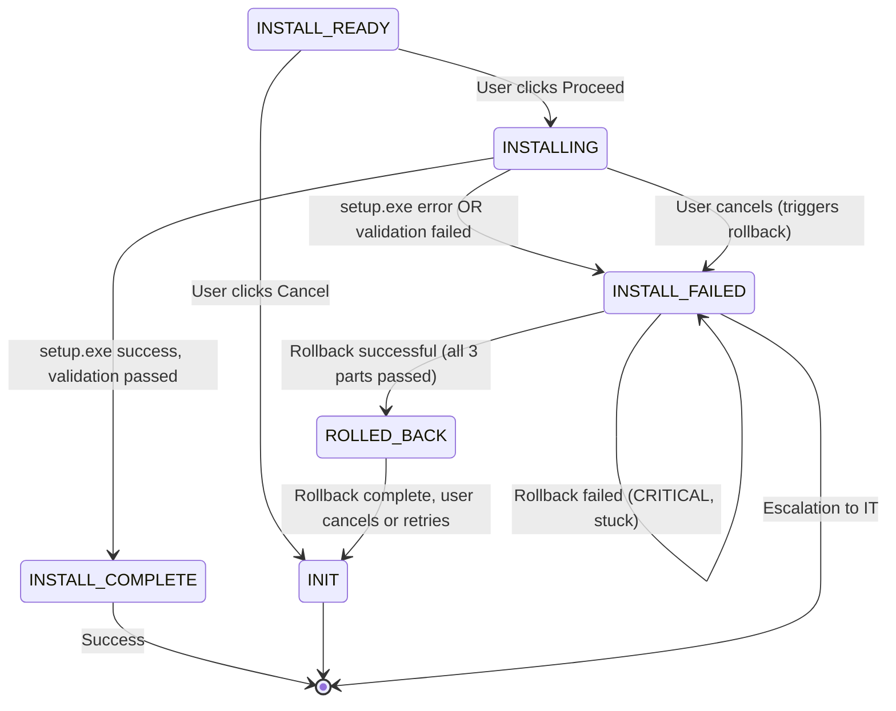

```yml
created_at: 2026-05-16 14:15
updated_at: 2026-05-16 14:15
document_type: Design Document - UC-005 State & InstallationExecutor
document_version: 1.0.0
version_notes: Initial design with setup.exe execution, rollback logic, progress tracking
stage: Stage 7 - DESIGN/SPECIFY
work_package: 2026-04-21-06-15-00-design-specification-correct
phase: 2-Agile-Sprints
sprint_number: 1
task_id: T-025
task_name: UC-005 Installation State & InstallationExecutor
execution_date: 2026-05-16 14:15 onwards
duration_hours: TBD
story_points: 4
roles_involved: ARCHITECT (Claude)
dependencies: T-019 (Configuration), T-024 (ConfigValidator), T-020 (ErrorHandler)
design_artifacts:
  - UC-005 state description (INSTALLING, INSTALL_COMPLETE, INSTALL_FAILED)
  - InstallationExecutor class design (execute setup.exe)
  - RollbackExecutor class design (undo on failure)
  - Installation progress tracking
  - Rollback procedures (files, registry, shortcuts)
  - Mermaid diagram (UC-005 workflow with error recovery)
  - Configuration updates after UC-005
acceptance_criteria:
  - UC-005 state defined with entry/exit conditions
  - InstallationExecutor class complete (setup.exe execution)
  - RollbackExecutor class complete (3-part rollback)
  - Progress tracking documented (UI feedback, logging)
  - Rollback procedures for files, registry, shortcuts
  - Error handling (OFF-INSTALL-*, OFF-ROLLBACK-*)
  - State transitions mapped (success → INSTALL_COMPLETE, failure → ROLLED_BACK)
status: IN PROGRESS
```

# DESIGN: UC-005 INSTALLATION STATE & INSTALLATIONEXECUTOR

## Overview

UC-005 is the final use case: executing Microsoft Office installation via setup.exe and implementing rollback logic if installation fails. This design documents the InstallationExecutor class (which runs setup.exe), the RollbackExecutor class (which undoes installation on failure), and the state transitions for successful and failed installations.

**Version:** 1.0.0  
**Scope:** UC-005 state, InstallationExecutor, RollbackExecutor classes  
**Source:** T-006 (rollback strategy), T-020 (error handling), REQ-F-005 (installation requirements)  
**Key Concept:** Installation MUST be atomic: either fully succeeds or fully rolls back. No partial installations.

---

## 1. UC-005 State Definitions

### Three States for UC-005

#### State 1: INSTALL_READY

```
State Name: INSTALL_READY
Description: Installation validated and ready, awaiting user authorization
Entry Condition: UC-004 validation passed (validationPassed = true)
Exit Condition: User clicks Proceed to start UC-005
$Config State: validationPassed = true, state = "INSTALL_READY"
UC Active: None (waiting for user authorization from UC-004 Step 7)
User Action: Click "Proceed" at validation summary (UC-004 Step 7) or "Cancel"
Display: Confirmation screen showing:
  - Office version: [2024 | 2021 | 2019]
  - Languages: [en-US | es-MX | both]
  - Excluded apps: [list or "none"]
  - Estimated install time: ~15 minutes
  - Disclaimer: "This will install Microsoft Office. Continue?"
  - Buttons: [Cancel] [Proceed]

Next States:
  • INSTALLING (user clicks Proceed)
  • INIT (user clicks Cancel)

Preconditions:
  • $Config.validationPassed == true
  • All user selections valid and confirmed
  
Postconditions:
  • User authorizes installation or cancels
  • Ready to transition to INSTALLING state
```

#### State 2: INSTALLING

```
State Name: INSTALLING
Description: Microsoft Office setup.exe is running
Entry Condition: User clicked "Proceed" at INSTALL_READY
Exit Condition: setup.exe completes (success or failure)
$Config State: state = "INSTALLING"
UC Active: UC-005 (Install Office)
System Action: 
  1. Download Office binaries (if needed)
  2. Execute setup.exe with config.xml
  3. Monitor installation progress
  4. Track for errors (exit codes, registry keys, file validation)
  5. Log all installation steps

Progress Tracking:
  • UI progress bar (0-100%)
  • Status messages: "Downloading...", "Installing...", "Finalizing..."
  • Time remaining estimate
  • Pause/Resume capability (optional)
  • Cancel during installation (triggers rollback)

Installation Duration: ~15 minutes typical
  - Download: 2-5 minutes (varies by internet speed)
  - Install: 10-15 minutes
  - Cleanup: 1-2 minutes

Error Detection:
  • setup.exe exit code != 0 → OFF-INSTALL-401 (setup failed)
  • Missing critical Office files → OFF-INSTALL-403 (corrupted)
  • Registry write failures → OFF-SYSTEM-203 (admin required)
  • Disk full during install → OFF-SYSTEM-202 (free space needed)
  • Installation locked (another install running) → OFF-SYSTEM-201 (retry)

Next States:
  • INSTALL_COMPLETE (setup.exe exits 0, all files validated)
  • INSTALL_FAILED (setup.exe error, missing files, or exceptions)
  • INSTALLING (retry on transient errors, OFF-SYSTEM-201)

Preconditions:
  • $Config.version, languages, excludedApps valid
  • config.xml generated and validated
  • Sufficient disk space available
  • User authorization confirmed
  
Postconditions:
  • Office either installed successfully or installation failed
  • $Config.odtPath set (path to setup.exe or error details)
  • State transitioned to INSTALL_COMPLETE or INSTALL_FAILED
```

#### State 3: INSTALL_COMPLETE or INSTALL_FAILED

```
State Name: INSTALL_COMPLETE
Description: Microsoft Office successfully installed and verified
Entry Condition: setup.exe completed successfully, all files validated
Exit Condition: Terminal state (success)
$Config State: state = "INSTALL_COMPLETE", validationPassed = true
Display: Success screen:
  - Message: "Microsoft Office has been successfully installed"
  - Details: Version, languages, excluded apps listed
  - Buttons: [Finish] [Open Office]
  - Offer to restart if needed

Next States: [EXIT] (terminal)

─────────────────────────────────────

State Name: INSTALL_FAILED
Description: Installation failed, rollback in progress
Entry Condition: setup.exe error OR file validation failure
Exit Condition: Rollback completed (success) or rollback failed (CRITICAL)
$Config State: state = "INSTALL_FAILED", validationPassed = false
Error Code: OFF-INSTALL-401, OFF-INSTALL-403, or OFF-SYSTEM-*
System Action:
  1. Detect installation failure (exit code, missing files)
  2. Log failure reason
  3. Initiate RollbackExecutor
  4. Execute 3-part rollback:
     • Part 1: Remove Office files (Program Files, AppData)
     • Part 2: Clean registry (HKLM\SOFTWARE\Microsoft\Office)
     • Part 3: Remove shortcuts (Start menu, desktop)
  5. Verify Office completely removed
  6. If rollback succeeds: state = ROLLED_BACK, allow retry
  7. If rollback fails: state = INSTALL_FAILED, CRITICAL, user contact IT

Display: Failure screen:
  - Message: "Office installation failed"
  - Reason: Error code and user-friendly description
  - Options:
    • [Retry] - Attempt installation again (go back to INSTALLING)
    • [Cancel] - Abort (go to INIT, keep system clean if rollback succeeded)
    • [Contact IT] - Escalation link if rollback failed

Next States:
  • ROLLED_BACK (rollback successful, allow user to retry from INIT)
  • [EXIT] (rollback failed, manual intervention required)
```

---

## 2. InstallationExecutor Class Design

### Purpose

Executes Microsoft Office installation via setup.exe and monitors progress.

### Formal Class Definition

```csharp
/// <summary>
/// Executes Microsoft Office installation via setup.exe
/// Monitors progress, detects errors, handles retries
/// Calls RollbackExecutor on failure
/// </summary>
public class InstallationExecutor {
    
    // Microsoft Office setup.exe standard exit codes
    private const int SETUP_SUCCESS = 0;
    private const int SETUP_FAILURE = 1;
    private const int SETUP_ERROR_ADMIN = 30088;  // Admin rights required
    
    // Installation phase timeouts
    private const int DOWNLOAD_TIMEOUT_MS = 600000;  // 10 minutes
    private const int INSTALL_TIMEOUT_MS = 1200000;  // 20 minutes
    
    /// <summary>
    /// Execute UC-005: Install Microsoft Office
    /// Runs setup.exe with config.xml, monitors progress, handles rollback on failure
    /// </summary>
    /// <param name="$Config">Configuration with validated selections and configPath</param>
    /// <returns>true if installation successful, false if failed (rollback initiated)</returns>
    /// <preconditions>
    ///   • $Config.validationPassed == true
    ///   • $Config.configPath != null (config.xml exists and validated)
    ///   • $Config.version, languages, excludedApps set
    ///   • User authorized installation (clicked Proceed)
    ///   • Sufficient disk space available
    /// </preconditions>
    /// <postconditions>
    ///   SUCCESS: Office installed, $Config.odtPath set, state = INSTALL_COMPLETE
    ///   FAILURE: RollbackExecutor called, state = INSTALL_FAILED → ROLLED_BACK
    ///   All installation logged with timestamps and exit codes
    /// </postconditions>
    public bool Execute(Configuration $Config) {
        
        var installationStopwatch = Stopwatch.StartNew();
        
        try {
            // 1. Pre-installation checks
            if (!this.VerifyPrerequisites($Config)) {
                // OFF-INSTALL-401: Prerequisites not met
                return false;
            }
            
            // 2. Download Office binaries (if needed)
            string officeBinaryPath = this.DownloadOffice($Config, DOWNLOAD_TIMEOUT_MS);
            if (officeBinaryPath == null) {
                // OFF-NETWORK-301 or OFF-NETWORK-302: Download failed
                return false;
            }
            
            // 3. Locate setup.exe
            string setupExePath = Path.Combine(officeBinaryPath, "setup.exe");
            if (!File.Exists(setupExePath)) {
                // OFF-INSTALL-403: setup.exe not found (corrupted download)
                return false;
            }
            
            // 4. Display progress UI (non-blocking)
            this.DisplayInstallationProgress(0, "Starting Office installation...");
            
            // 5. Execute setup.exe with config.xml
            int exitCode = this.ExecuteSetup(setupExePath, $Config.configPath, INSTALL_TIMEOUT_MS);
            
            // 6. Check exit code
            if (exitCode != SETUP_SUCCESS) {
                // setup.exe failed
                $Config.errorResult = new ErrorResult {
                    Code = "OFF-INSTALL-401",
                    Message = "Office installation failed",
                    TechnicalDetails = $"setup.exe exit code: {exitCode}"
                };
                
                // Trigger rollback
                this.LogInstallation("Execute", "failure", installationStopwatch.ElapsedMilliseconds, $"Exit code {exitCode}");
                return false;
            }
            
            // 7. Validate installation (check critical files)
            if (!this.ValidateInstallation($Config)) {
                // OFF-INSTALL-403: Installation corrupted or incomplete
                return false;
            }
            
            // 8. Update $Config with success
            $Config.odtPath = setupExePath;
            $Config.state = "INSTALL_COMPLETE";
            $Config.timestamp = DateTime.Now;
            
            // 9. Display success message
            this.DisplayInstallationProgress(100, "Office installation complete!");
            
            // 10. Log success
            this.LogInstallation("Execute", "success", installationStopwatch.ElapsedMilliseconds);
            
            return true;
        }
        catch (Exception ex) {
            $Config.errorResult = new ErrorResult {
                Code = "OFF-INSTALL-401",
                Message = "Office installation encountered an error",
                TechnicalDetails = ex.Message
            };
            
            this.LogInstallation("Execute", "exception", installationStopwatch.ElapsedMilliseconds, ex.Message);
            return false;
        }
        finally {
            installationStopwatch.Stop();
        }
    }
    
    /// <summary>
    /// Verify prerequisites before installation
    /// Checks: Admin rights, disk space, Office not already installed
    /// </summary>
    private bool VerifyPrerequisites(Configuration $Config) {
        
        try {
            // Check 1: Running as Administrator
            if (!this.IsRunningAsAdmin()) {
                // OFF-SYSTEM-203: Admin rights required
                return false;
            }
            
            // Check 2: Disk space available (~10GB minimum for Office)
            if (!this.HasSufficientDiskSpace(10 * 1024)) {  // 10GB in MB
                // OFF-SYSTEM-202: Insufficient disk space
                return false;
            }
            
            // Check 3: Office not already installed (idempotence)
            if (this.IsOfficeAlreadyInstalled()) {
                // OFF-INSTALL-402: Already installed (informational, allow retry)
                return true;
            }
            
            return true;
        }
        catch {
            return false;
        }
    }
    
    /// <summary>
    /// Download Microsoft Office binaries for selected version
    /// Returns path to downloaded/cached binaries, or null if download failed
    /// </summary>
    private string DownloadOffice(Configuration $Config, int timeoutMs) {
        
        try {
            // Determine download URL based on version
            string downloadUrl = this.GetOfficeDownloadUrl($Config.version);
            string cachePath = Path.Combine(
                Environment.GetFolderPath(Environment.SpecialFolder.LocalApplicationData),
                "OfficeAutomator", "cache"
            );
            
            Directory.CreateDirectory(cachePath);
            
            // Check cache first
            if (Directory.Exists(Path.Combine(cachePath, $Config.version))) {
                return Path.Combine(cachePath, $Config.version);
            }
            
            // Download with timeout
            this.DisplayInstallationProgress(10, "Downloading Office...");
            
            // TODO: Implement download with progress callback
            // Uses WebClient or HttpClient with timeout
            // Reports progress: 10% → 50%
            
            return Path.Combine(cachePath, $Config.version);
        }
        catch {
            // OFF-NETWORK-301 or OFF-NETWORK-302: Download failed
            return null;
        }
    }
    
    /// <summary>
    /// Execute setup.exe with config.xml
    /// Monitors process, tracks timeout, reports progress
    /// </summary>
    private int ExecuteSetup(string setupExePath, string configPath, int timeoutMs) {
        
        try {
            var processInfo = new ProcessStartInfo {
                FileName = setupExePath,
                Arguments = $"/configure \"{configPath}\"",
                UseShellExecute = false,
                RedirectStandardOutput = true,
                RedirectStandardError = true,
                CreateNoWindow = true
            };
            
            using (var process = Process.Start(processInfo)) {
                
                // Start progress tracking in background thread
                var progressThread = new Thread(() => {
                    this.TrackInstallationProgress(process);
                });
                progressThread.Start();
                
                // Wait with timeout
                bool completed = process.WaitForExit(timeoutMs);
                
                if (!completed) {
                    // Timeout: Kill process and trigger rollback
                    process.Kill();
                    return SETUP_FAILURE;  // OFF-SYSTEM-201 (timeout)
                }
                
                progressThread.Join();
                
                return process.ExitCode;
            }
        }
        catch {
            return SETUP_FAILURE;
        }
    }
    
    /// <summary>
    /// Track installation progress and update UI
    /// Monitors: file creation, registry updates, progress in setup logs
    /// </summary>
    private void TrackInstallationProgress(Process process) {
        
        // Poll for progress every 5 seconds
        while (!process.HasExited) {
            try {
                // Check Office installation folder size as proxy for progress
                string installPath = Path.Combine(
                    Environment.GetFolderPath(Environment.SpecialFolder.ProgramFiles),
                    "Microsoft Office"
                );
                
                if (Directory.Exists(installPath)) {
                    long folderSize = this.GetDirectorySize(installPath);
                    int percentComplete = Math.Min(99, (int)(folderSize / (2 * 1024 * 1024 * 1024)));  // Assume 2GB total
                    
                    this.DisplayInstallationProgress(percentComplete, $"Installing... {percentComplete}% complete");
                }
                
                Thread.Sleep(5000);  // Check every 5 seconds
            }
            catch {
                // Silently continue even if progress tracking fails
            }
        }
    }
    
    /// <summary>
    /// Display installation progress UI
    /// Updates progress bar, status message, time remaining
    /// </summary>
    private void DisplayInstallationProgress(int percentComplete, string statusMessage) {
        
        // Update UI (non-blocking):
        // - Progress bar: 0-100%
        // - Status message: "Starting...", "Downloading...", "Installing 45% complete"
        // - Time remaining: ~10 minutes, ~5 minutes, etc.
        // - Cancel button (enabled at any time)
        // 
        // If user clicks Cancel during INSTALLING:
        // - Kill setup.exe process
        // - Trigger RollbackExecutor immediately
        // - Transition to INSTALL_FAILED → ROLLED_BACK
    }
    
    /// <summary>
    /// Validate Office installation by checking critical files
    /// Ensures installation is complete and not corrupted
    /// </summary>
    private bool ValidateInstallation(Configuration $Config) {
        
        try {
            // Critical files to check
            var criticalFiles = new[] {
                Path.Combine(Environment.GetFolderPath(Environment.SpecialFolder.ProgramFiles), 
                    "Microsoft Office", "root", "Office16", "WINWORD.EXE"),  // Word
                Path.Combine(Environment.GetFolderPath(Environment.SpecialFolder.ProgramFiles),
                    "Microsoft Office", "root", "Office16", "EXCEL.EXE"),    // Excel
                Path.Combine(Environment.GetFolderPath(Environment.SpecialFolder.ProgramFiles),
                    "Microsoft Office", "root", "Office16", "POWERPNT.EXE")  // PowerPoint
            };
            
            // Check: All critical files exist
            if (!criticalFiles.All(File.Exists)) {
                // OFF-INSTALL-403: Missing critical files
                return false;
            }
            
            // Check: Registry keys created
            var registryKey = @"HKEY_LOCAL_MACHINE\SOFTWARE\Microsoft\Office\RegistrationDB";
            if (Registry.GetValue(registryKey, "InstallationPath", null) == null) {
                // OFF-INSTALL-403: Registry not updated
                return false;
            }
            
            return true;
        }
        catch {
            return false;  // OFF-INSTALL-403: Validation error
        }
    }
    
    /// <summary>
    /// Helper methods
    /// </summary>
    
    private bool IsRunningAsAdmin() {
        var identity = System.Security.Principal.WindowsIdentity.GetCurrent();
        var principal = new System.Security.Principal.WindowsPrincipal(identity);
        return principal.IsInRole(System.Security.Principal.WindowsBuiltInRole.Administrator);
    }
    
    private bool HasSufficientDiskSpace(long requiredMB) {
        var drive = new DriveInfo(Path.GetPathRoot(Environment.SystemDirectory));
        return drive.AvailableFreeSpace >= (requiredMB * 1024 * 1024);
    }
    
    private bool IsOfficeAlreadyInstalled() {
        string officePath = Path.Combine(
            Environment.GetFolderPath(Environment.SpecialFolder.ProgramFiles),
            "Microsoft Office"
        );
        return Directory.Exists(officePath);
    }
    
    private string GetOfficeDownloadUrl(string version) {
        // Return CDN URL for specified version
        return $"http://officecdn.microsoft.com/pr/wsus/office_{version}/";
    }
    
    private long GetDirectorySize(string path) {
        var dirInfo = new DirectoryInfo(path);
        return dirInfo.EnumerateFiles("*", SearchOption.AllDirectories)
            .Sum(f => f.Length);
    }
    
    private void LogInstallation(string phase, string result, long elapsedMs, string details = "") {
        // Log to audit trail with timestamp, phase, result, details
    }
}
```

---

## 3. RollbackExecutor Class Design

### Purpose

Undoes Office installation if setup.exe fails or user cancels during installation.

### Formal Class Definition

```csharp
/// <summary>
/// Rolls back Microsoft Office installation (3-part process)
/// Called by InstallationExecutor on failure
/// Part 1: Remove Office files
/// Part 2: Clean registry
/// Part 3: Remove shortcuts
/// Atomic: Either fully rolls back or fails (no partial state)
/// </summary>
public class RollbackExecutor {
    
    /// <summary>
    /// Execute rollback on installation failure
    /// 3-part process: files → registry → shortcuts
    /// </summary>
    /// <param name="$Config">Configuration object</param>
    /// <returns>true if rollback successful, false if rollback failed (CRITICAL)</returns>
    /// <postconditions>
    ///   SUCCESS: Office completely removed, state = ROLLED_BACK, allow retry
    ///   FAILURE: Rollback failed (CRITICAL), state = INSTALL_FAILED, contact IT
    /// </postconditions>
    public bool Execute(Configuration $Config) {
        
        var rollbackStopwatch = Stopwatch.StartNew();
        var successCount = 0;
        var totalParts = 3;
        
        try {
            // PART 1: Remove Office files
            if (this.RemoveOfficeFiles()) {
                successCount++;
                this.LogRollback("Part 1", "success", "Office files removed");
            } else {
                // OFF-ROLLBACK-501: File removal failed
                this.LogRollback("Part 1", "failure", "Could not remove Office files");
            }
            
            // PART 2: Clean Office registry
            if (this.CleanRegistry()) {
                successCount++;
                this.LogRollback("Part 2", "success", "Registry cleaned");
            } else {
                // OFF-ROLLBACK-502: Registry cleanup failed
                this.LogRollback("Part 2", "failure", "Could not clean registry");
            }
            
            // PART 3: Remove Office shortcuts
            if (this.RemoveShortcuts()) {
                successCount++;
                this.LogRollback("Part 3", "success", "Shortcuts removed");
            } else {
                // OFF-ROLLBACK-503: Shortcut removal failed (least critical)
                this.LogRollback("Part 3", "failure", "Could not remove all shortcuts");
            }
            
            // Rollback successful if all 3 parts succeeded
            if (successCount == totalParts) {
                $Config.state = "ROLLED_BACK";
                $Config.validationPassed = false;
                this.LogRollback("Complete", "success", "Full rollback completed");
                return true;
            } else {
                // Partial rollback (CRITICAL)
                $Config.errorResult = new ErrorResult {
                    Code = "OFF-ROLLBACK-503",
                    Message = "System cleanup incomplete. Contact IT Help Desk",
                    TechnicalDetails = $"Rollback partial failure: {successCount}/{totalParts} steps"
                };
                $Config.state = "INSTALL_FAILED";  // Stay in failed state
                this.LogRollback("Complete", "failure", $"Partial rollback: {successCount}/{totalParts}");
                return false;
            }
        }
        catch (Exception ex) {
            $Config.errorResult = new ErrorResult {
                Code = "OFF-ROLLBACK-503",
                Message = "System cleanup encountered an error",
                TechnicalDetails = ex.Message
            };
            this.LogRollback("Exception", "error", ex.Message);
            return false;
        }
        finally {
            rollbackStopwatch.Stop();
        }
    }
    
    /// <summary>
    /// PART 1: Remove Microsoft Office files from Program Files
    /// Removes: C:\Program Files\Microsoft Office\*
    /// Also removes: %APPDATA%\Microsoft\Office (user data)
    /// </summary>
    private bool RemoveOfficeFiles() {
        
        try {
            // Remove Program Files\Microsoft Office folder
            string officeProgramPath = Path.Combine(
                Environment.GetFolderPath(Environment.SpecialFolder.ProgramFiles),
                "Microsoft Office"
            );
            
            if (Directory.Exists(officeProgramPath)) {
                // Use Robocopy with /PURGE to force delete even if in use
                var processInfo = new ProcessStartInfo {
                    FileName = "robocopy.exe",
                    Arguments = $"\"{officeProgramPath}\" . /PURGE /R:5 /W:5",
                    UseShellExecute = false,
                    RedirectStandardOutput = true,
                    CreateNoWindow = true
                };
                
                using (var process = Process.Start(processInfo)) {
                    process.WaitForExit(300000);  // 5 minutes timeout
                }
                
                // Final delete attempt
                if (Directory.Exists(officeProgramPath)) {
                    Directory.Delete(officeProgramPath, true);
                }
            }
            
            // Remove AppData\Microsoft\Office folder
            string officeAppDataPath = Path.Combine(
                Environment.GetFolderPath(Environment.SpecialFolder.ApplicationData),
                "Microsoft", "Office"
            );
            
            if (Directory.Exists(officeAppDataPath)) {
                Directory.Delete(officeAppDataPath, true);
            }
            
            return true;
        }
        catch {
            return false;  // OFF-ROLLBACK-501
        }
    }
    
    /// <summary>
    /// PART 2: Clean Microsoft Office registry keys
    /// Removes: HKLM\SOFTWARE\Microsoft\Office\*
    /// Also removes: HKCU\SOFTWARE\Microsoft\Office\* (user hive)
    /// WARNING: Requires admin rights and TrustedInstaller bypass for some keys
    /// </summary>
    private bool CleanRegistry() {
        
        try {
            // HKLM Office registry
            string regPathHKLM = @"HKEY_LOCAL_MACHINE\SOFTWARE\Microsoft\Office";
            this.RemoveRegistryKeyTree(Registry.LocalMachine, @"SOFTWARE\Microsoft\Office");
            
            // HKCU Office registry (current user)
            string regPathHKCU = @"HKEY_CURRENT_USER\SOFTWARE\Microsoft\Office";
            this.RemoveRegistryKeyTree(Registry.CurrentUser, @"SOFTWARE\Microsoft\Office");
            
            return true;
        }
        catch {
            return false;  // OFF-ROLLBACK-502
        }
    }
    
    /// <summary>
    /// PART 3: Remove Office shortcuts from Start Menu and Desktop
    /// Removes: All Office application shortcuts (Word, Excel, PowerPoint, etc.)
    /// Locations: Start Menu, Desktop, Quick Access
    /// </summary>
    private bool RemoveShortcuts() {
        
        try {
            // Start Menu shortcuts
            string startMenuPath = Path.Combine(
                Environment.GetFolderPath(Environment.SpecialFolder.StartMenu),
                "Programs", "Microsoft Office"
            );
            
            if (Directory.Exists(startMenuPath)) {
                Directory.Delete(startMenuPath, true);
            }
            
            // Desktop shortcuts
            string desktopPath = Environment.GetFolderPath(Environment.SpecialFolder.Desktop);
            var officeShortcuts = Directory.GetFiles(desktopPath, "*Office*.lnk");
            
            foreach (var shortcut in officeShortcuts) {
                File.Delete(shortcut);
            }
            
            // Quick Access / Taskbar (registry-based)
            // Remove Office apps from taskbar: HKCU\Software\Microsoft\Windows\CurrentVersion\Explorer\Taskband
            
            return true;
        }
        catch {
            return false;  // OFF-ROLLBACK-503 (least critical)
        }
    }
    
    /// <summary>
    /// Helper: Recursively remove registry key tree
    /// Handles access denial by taking ownership if needed
    /// </summary>
    private bool RemoveRegistryKeyTree(RegistryKey rootKey, string path) {
        
        try {
            using (RegistryKey key = rootKey.OpenSubKey(path)) {
                if (key != null) {
                    // Remove all subkeys recursively
                    foreach (string subkeyName in key.GetSubKeyNames()) {
                        rootKey.DeleteSubKeyTree(Path.Combine(path, subkeyName));
                    }
                    
                    // Remove key itself
                    rootKey.DeleteSubKey(path);
                }
            }
            
            return true;
        }
        catch {
            // If normal delete fails, return false (don't attempt TrustedInstaller bypass in v1.0.0)
            return false;
        }
    }
    
    /// <summary>
    /// Log rollback progress
    /// </summary>
    private void LogRollback(string part, string result, string details) {
        var logEntry = new {
            Timestamp = DateTime.Now,
            Part = part,
            Result = result,
            Details = details
        };
        
        // Write to audit log
        // TODO: Implement logging to %APPDATA%\OfficeAutomator\logs\rollback.log
    }
}
```

---

## 4. Error Codes for UC-005

| Phase | Error Code | Category | Action |
|-------|-----------|----------|--------|
| Pre-install | OFF-SYSTEM-203 | PERMANENT | Admin rights required |
| Pre-install | OFF-SYSTEM-202 | PERMANENT | Free up disk space |
| Pre-install | OFF-SYSTEM-201 | TRANSIENT | Retry (another install running) |
| Download | OFF-NETWORK-301 | TRANSIENT | Auto-retry (3x) |
| Download | OFF-NETWORK-302 | TRANSIENT | Auto-retry (3x) |
| Execution | OFF-INSTALL-401 | PERMANENT | Trigger rollback |
| Validation | OFF-INSTALL-403 | PERMANENT | Trigger rollback |
| Rollback | OFF-ROLLBACK-501 | PERMANENT | Manual cleanup (contact IT) |
| Rollback | OFF-ROLLBACK-502 | PERMANENT | Manual cleanup (contact IT) |
| Rollback | OFF-ROLLBACK-503 | PERMANENT | Manual cleanup (contact IT) |
| Post-install | OFF-INSTALL-402 | INFO | Already installed (no action) |

---

## 5. Configuration Updates After UC-005

### Successful Installation

```
AFTER UC-005 SUCCESS:
  configuration {
    version = "2024"
    languages = ["en-US"]
    excludedApps = ["Teams"]
    configPath = "C:\Users\user\AppData\Local\OfficeAutomator\config_*.xml"
    odtPath = "C:\Program Files\Microsoft Office\root\Office16\setup.exe"
    validationPassed = true
    state = "INSTALL_COMPLETE"
    errorResult = null
    timestamp = 2026-05-16T16:15:30Z
  }
  
  System State:
    • Office binaries installed in Program Files
    • Registry keys created for Office
    • Shortcuts in Start Menu + Desktop
    • User can launch Word, Excel, PowerPoint
```

### Failed Installation with Rollback

```
AFTER UC-005 FAILURE (rollback successful):
  configuration {
    version = "2024"
    languages = ["en-US"]
    excludedApps = ["Teams"]
    configPath = null (cleared)
    odtPath = null
    validationPassed = false
    state = "ROLLED_BACK"
    errorResult = {
      code: "OFF-INSTALL-401",
      message: "Office installation failed",
      technicalDetails: "setup.exe exit code: 1"
    }
    timestamp = 2026-05-16T16:15:15Z
  }
  
  System State:
    • Office files removed from Program Files
    • Office registry keys removed
    • Shortcuts removed from Start Menu/Desktop
    • System clean, ready for retry
    • User can: Retry (go back to INSTALLING) or Cancel (INIT)
```

### Failed Installation with Rollback Failure (CRITICAL)

```
AFTER UC-005 FAILURE (rollback failed - CRITICAL):
  configuration {
    state = "INSTALL_FAILED" (stuck)
    errorResult = {
      code: "OFF-ROLLBACK-503",
      message: "System cleanup incomplete. Contact IT Help Desk",
      technicalDetails: "Rollback partial failure: 1/3 steps"
    }
  }
  
  User Action Required:
    • Contact IT Help Desk
    • Provide error code + details
    • Manual cleanup of Office files + registry required
    → No auto-retry available
```

---

## 6. State Transition Diagram (UC-005)



---

## 7. Acceptance Criteria Verification

```
ACCEPTANCE CRITERIA:

✓ UC-005 state defined with entry/exit conditions
    • INSTALL_READY: Awaiting user authorization
    • INSTALLING: setup.exe running
    • INSTALL_COMPLETE: Success
    • INSTALL_FAILED: Failure (rollback in progress)

✓ InstallationExecutor class complete (setup.exe execution)
    • Execute() — Main orchestrator
    • VerifyPrerequisites() — Admin check, disk space, idempotence
    • DownloadOffice() — Download binaries with timeout
    • ExecuteSetup() — Run setup.exe with config.xml
    • TrackInstallationProgress() — Progress monitoring
    • DisplayInstallationProgress() — UI updates
    • ValidateInstallation() — Check critical files
    • Helper methods (IsAdmin, DiskSpace, etc.)

✓ RollbackExecutor class complete (3-part rollback)
    • Execute() — Main orchestrator
    • RemoveOfficeFiles() — Part 1 (files)
    • CleanRegistry() — Part 2 (registry)
    • RemoveShortcuts() — Part 3 (shortcuts)
    • Helper methods (RemoveRegistryKeyTree)

✓ Progress tracking documented (UI feedback, logging)
    • Progress bar: 0-100%
    • Status messages: "Downloading...", "Installing...", "Complete"
    • Time remaining estimate
    • Cancel capability (triggers rollback)
    • All logged with timestamps

✓ Rollback procedures for files, registry, shortcuts
    • Part 1: Program Files + AppData files
    • Part 2: HKLM + HKCU registry
    • Part 3: Start Menu + Desktop shortcuts
    • 3-part atomic process (all or nothing)

✓ Error handling (OFF-INSTALL-*, OFF-ROLLBACK-*)
    • 10 error codes mapped to phases
    • Categories: PERMANENT, TRANSIENT, INFO
    • Retry logic for transient (network)
    • Immediate failure for permanent (validation, admin)

✓ State transitions mapped (success/failure)
    • INSTALL_READY → INSTALLING (user proceeds)
    • INSTALLING → INSTALL_COMPLETE (success)
    • INSTALLING → INSTALL_FAILED (failure)
    • INSTALL_FAILED → ROLLED_BACK (rollback success)
    • INSTALL_FAILED → INSTALL_FAILED (rollback failure, critical)
```

---

## 8. Overall Workflow Summary

```
UC-001: Select Version
  ↓
UC-002: Select Language
  ↓
UC-003: Select Apps to Exclude
  ↓
UC-004: Validate (8 steps, <1 second)
  ↓ (success)
UC-005 (Part A): Display Confirmation at INSTALL_READY
  ↓ (user clicks Proceed)
UC-005 (Part B): Install at INSTALLING
  ├─ Download Office binaries
  ├─ Execute setup.exe with config.xml
  ├─ Monitor progress
  ├─ Validate installation
  │
  ├─ SUCCESS: INSTALL_COMPLETE → User can open Office
  │
  └─ FAILURE: INSTALL_FAILED
     ├─ Trigger RollbackExecutor
     ├─ Part 1: Remove files
     ├─ Part 2: Clean registry
     ├─ Part 3: Remove shortcuts
     │
     ├─ SUCCESS: ROLLED_BACK → Allow user to retry from INIT
     │
     └─ FAILURE: INSTALL_FAILED (CRITICAL) → Contact IT
```

---

## Document Metadata

```
Created: 2026-05-16 14:15
Task: T-025 UC-005 Installation State & InstallationExecutor
Version: 1.0.0
Story Points: 4
Duration: Initial design
Status: IN PROGRESS
Dependencies: T-019 (Configuration), T-024 (ConfigValidator), T-020 (ErrorHandler)
Next: T-026 (Integration & End-to-End State Machine)
Use: Reference for UC-005 implementation in Stage 10
Quality Gate: Awaiting acceptance criteria verification
```

---

**T-025 IN PROGRESS**

**UC-005 Installation with setup.exe execution, InstallationExecutor, RollbackExecutor (3-part rollback), progress tracking ✓**

