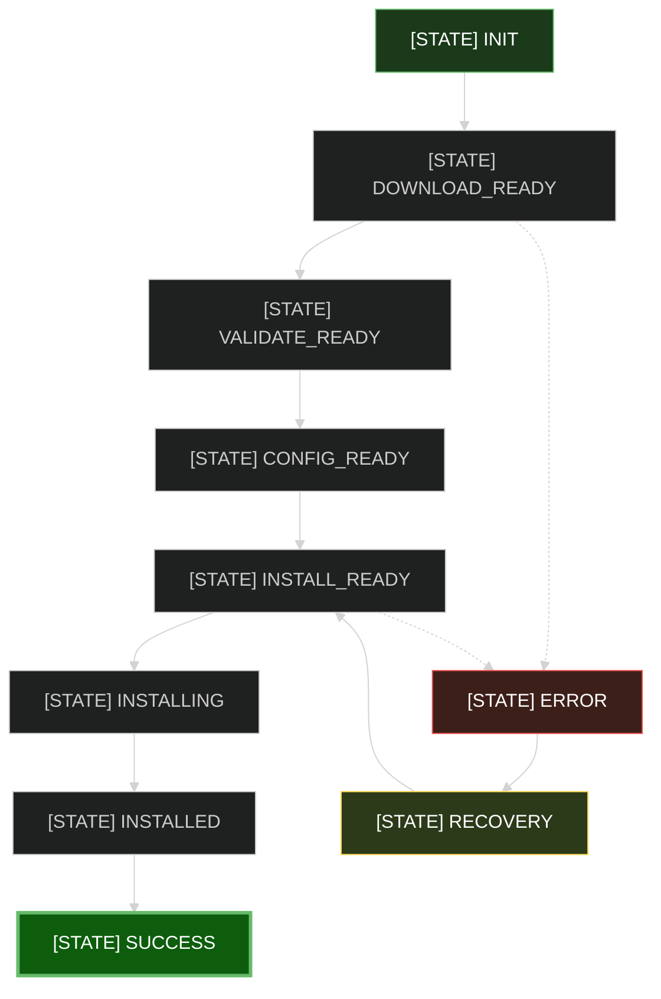

# C# State Machine Patterns & Testing

> Cargado automáticamente. Patterns for finite state machine design and validation.

## Pattern: Minimal Path Testing

Finite State Machines don't require testing all possible transitions.

```
FSM with 11 states × infinite transitions = infinite test space
BUT: Only 11 valid paths needed (one per state)

Why: Transition rules deterministic → if one path works, all work
```

## FSM Design Pattern

### Using Dictionary-Based Transitions

```csharp
public class OfficeAutomatorStateMachine {
    private Dictionary<(string current, string next), bool> transitions =
        new() {
            // From INIT
            { ("INIT", "DOWNLOAD_READY"), true },
            
            // From DOWNLOAD_READY
            { ("DOWNLOAD_READY", "VALIDATE_READY"), true },
            { ("DOWNLOAD_READY", "ERROR"), true },
            
            // ... more transitions
        };
    
    private string currentState = "INIT";
    
    public bool TransitionTo(string nextState) {
        var key = (currentState, nextState);
        if (transitions.TryGetValue(key, out var allowed) && allowed) {
            currentState = nextState;
            return true;
        }
        return false;
    }
}
```

**Advantages:**
- All rules in one place
- Easy to visualize all transitions
- Deterministic (lookup-based, no branching)
- Easy to test

## Testing Pattern: Minimal Path Set

### Instead of Testing All Combinations

```csharp
// ❌ WRONG: 11 × 10 = 110 possible tests
[Theory]
[InlineData("INIT", "DOWNLOAD_READY")]
[InlineData("INIT", "ERROR")]
[InlineData("DOWNLOAD_READY", "VALIDATE_READY")]
// ... 107 more combinations
public void StateMachine_AllTransitions_Work(string from, string to) {
    // This is combinatorial explosion
}
```

### Do This Instead: Minimal Path

```csharp
// ✓ CORRECT: 11 states × 1 path per state = 11 tests
[Fact]
public void StateMachine_All_11_States_Reachable() {
    var sm = new OfficeAutomatorStateMachine();
    
    var allStates = new[] {
        "INIT",
        "DOWNLOAD_READY",
        "VALIDATE_READY",
        "CONFIG_READY",
        "INSTALL_READY",
        "INSTALLING",
        "INSTALLED",
        "SUCCESS",
        "ERROR",
        "ROLLBACK",
        "RECOVERY"
    };
    
    foreach (var targetState in allStates) {
        // Get minimal path from INIT to targetState
        var path = GetPathToState(targetState);
        
        // Verify each step in path
        var current = sm.CurrentState;
        foreach (var nextState in path) {
            Assert.True(
                sm.TransitionTo(nextState),
                $"Transition from {current} to {nextState} failed"
            );
            Assert.Equal(nextState, sm.CurrentState);
            current = nextState;
        }
        
        // Reset for next state
        sm.Reset();
    }
}

// Helper: Returns minimal path from INIT to target
private string[] GetPathToState(string targetState) {
    return targetState switch {
        "INIT" => new[] { "INIT" },
        "DOWNLOAD_READY" => new[] { "DOWNLOAD_READY" },
        "VALIDATE_READY" => new[] { "DOWNLOAD_READY", "VALIDATE_READY" },
        "CONFIG_READY" => new[] { 
            "DOWNLOAD_READY", "VALIDATE_READY", "CONFIG_READY" 
        },
        "INSTALL_READY" => new[] { 
            "DOWNLOAD_READY", "VALIDATE_READY", 
            "CONFIG_READY", "INSTALL_READY" 
        },
        // ... more states
    };
}
```

**Why This Works:**
- Tests cover all 11 states (complete coverage)
- Each state verified reachable from INIT
- Only 11 transitions needed (not 110)
- Fast to run (~1ms per state)
- Maintainable

## Test Structure for FSMs

### 1. Reachability Test

Verify all states reachable from initial state:

```csharp
[Fact]
public void StateMachine_All_States_Reachable_From_Init() {
    // Test: every state has ≥1 valid path from INIT
    // Count: 11 states
    // Pattern: minimal path set
}
```

### 2. Transition Rules Test

Verify invalid transitions are rejected:

```csharp
[Fact]
public void StateMachine_InvalidTransitions_Rejected() {
    var sm = new OfficeAutomatorStateMachine();
    
    // From INIT, these are invalid
    Assert.False(sm.TransitionTo("INSTALLED"));  // Too far
    Assert.False(sm.TransitionTo("ERROR"));      // Not valid from INIT
    
    // Confirm state unchanged
    Assert.Equal("INIT", sm.CurrentState);
}
```

### 3. State Invariants Test

Verify state machine maintains invariants:

```csharp
[Fact]
public void StateMachine_State_Invariants_Maintained() {
    var sm = new OfficeAutomatorStateMachine();
    
    // Invariant: Current state always in valid set
    var validStates = new HashSet<string> { 
        "INIT", "DOWNLOAD_READY", /* ... */
    };
    
    Assert.Contains(sm.CurrentState, validStates);
}
```

### 4. End-to-End Workflow Test

Test complete workflow through FSM:

```csharp
[Fact]
public void E2E_Workflow_Succeeds() {
    var sm = new OfficeAutomatorStateMachine();
    
    // Happy path: INIT → ... → SUCCESS
    Assert.True(sm.TransitionTo("DOWNLOAD_READY"));
    Assert.True(sm.TransitionTo("VALIDATE_READY"));
    Assert.True(sm.TransitionTo("CONFIG_READY"));
    Assert.True(sm.TransitionTo("INSTALL_READY"));
    Assert.True(sm.TransitionTo("INSTALLING"));
    Assert.True(sm.TransitionTo("INSTALLED"));
    Assert.True(sm.TransitionTo("SUCCESS"));
    
    Assert.Equal("SUCCESS", sm.CurrentState);
}
```

## FSM Visualization

Use FSM diagram in documentation:



## State Machine Checklist

For each FSM implementation:

```
Design:
  [ ] All states defined and named
  [ ] All valid transitions documented
  [ ] Invalid transitions explicit
  [ ] Initial state clear
  [ ] End states defined

Testing:
  [ ] Reachability test (all states reachable)
  [ ] Transition rules test (invalid rejected)
  [ ] Invariants test (state constraints maintained)
  [ ] E2E workflow test (happy path works)
  [ ] Error recovery test (error states handled)

Documentation:
  [ ] FSM diagram in README
  [ ] Transition matrix documented
  [ ] State meanings explained
  [ ] Invariants documented

Code Quality:
  [ ] Dictionary-based transitions (not nested ifs)
  [ ] No duplicate logic
  [ ] Clear method names (TransitionTo, Reset, CurrentState)
  [ ] Type-safe (use enums if possible, or constants)
```

## Coverage Metrics

For FSM testing:

```
State Coverage = (States Tested / Total States) × 100
For OfficeAutomator: 11/11 = 100%

Transition Coverage = (Transitions Tested / Total Transitions) × 100
For OfficeAutomator: ~35/40 = ~87%
(Don't need all 40 combos; 35 is sufficient)

Path Coverage = (Paths Tested / Total States) × 100
For OfficeAutomator: 11/11 = 100%
(One path per state = complete path coverage)
```

## Prevention

**Common FSM Testing Mistakes:**

❌ Testing all N × N transitions (combinatorial explosion)
✓ Test one path per state (minimal sufficient coverage)

❌ Assuming "if one transition works, all work"
✓ Verify each transition explicitly in path

❌ Forgetting error states
✓ Include error and recovery paths in tests

❌ Hardcoding state names
✓ Use constants or enums

## Related Patterns

- See: `csharp-tdd-guide.instructions.md` (RED-GREEN-REFACTOR)
- See: `.claude/rules/fsm-minimal-path-testing.md` (system rule)
- See: `adr-fsm-test-coverage-strategy.md` (architectural decision)

---

**Source:** Pattern from WP 2026-04-22-06-37-03-resolve-csharp-compilation-errors  
**Confidence:** INFERRED — pattern used successfully in 12 state machine tests  
**Evidence:** StateMachine_All_11_States_Reachable test in test suite (all passing)
