```yml
type: Guía de Desarrollo
subject: UML Diagrams with Mermaid
version: 1.0.0
purpose: Define standards for UML and flowchart diagrams in OfficeAutomator
applies_to: All documentation requiring visual architecture
updated_at: 2026-04-22 16:45:00
```

# GUÍA DE DESARROLLO — UML & MERMAID DIAGRAMS

**Visual Architecture Documentation for OfficeAutomator**

---

## TABLE OF CONTENTS

1. [Philosophy](#philosophy)
2. [Core Requirements](#core-requirements)
3. [Mermaid Configuration](#mermaid-configuration)
4. [Three-Layer Architecture Diagrams](#three-layer-architecture-diagrams)
5. [Class Diagrams (C#)](#class-diagrams-c)
6. [Flowchart Diagrams](#flowchart-diagrams)
7. [Sequence Diagrams](#sequence-diagrams)
8. [State Machine Diagrams](#state-machine-diagrams)
9. [Color Standards](#color-standards)
10. [Anti-Patterns in Diagrams](#anti-patterns-in-diagrams)
11. [Quality Checklist](#quality-checklist)

---

## PHILOSOPHY

### Core Principle

**Diagrams document architecture clearly. No decoration, no emojis, no symbols. Substance only.**

Mermaid diagrams serve as executable documentation. They must be:

```
THREE PILLARS:

1. CLARITY
   - Labels are precise and specific
   - Structure reflects actual architecture
   - No ambiguous connections

2. READABILITY
   - Dark theme for accessibility
   - Readable color contrast
   - Logical node ordering

3. MAINTAINABILITY
   - Diagram matches code structure
   - Updates reflect real changes
   - No decorative elements
```

### Absolutely Prohibited

- Emojis of any kind: NO ✓, ❌, ⚠, 🔄, 📊, ⏳, etc.
- Decorative icons or symbols
- ASCII art in labels
- Unnecessary styling
- Color used for decoration (only for semantic meaning)

---

## CORE REQUIREMENTS

### Requirement 1: Dark Theme Mandatory

Every diagram MUST include:

```mermaid
%%{init: { 'theme': 'dark' } }%%
```

This is non-negotiable. Light theme diagrams are not acceptable.

### Requirement 2: No Emojis, Ever

Examples of PROHIBITED syntax:

```
PROHIBITED: "✓ Validated"
PROHIBITED: "❌ Error"
PROHIBITED: "🔄 Retry"
PROHIBITED: "📁 File"
PROHIBITED: "⚠ Warning"
PROHIBITED: "SUCCESS ✅"
```

Examples of CORRECT syntax:

```
CORRECT: "[VALIDATED] Configuration"
CORRECT: "[ERROR] Validation failed"
CORRECT: "[RETRY] Max retries exceeded"
CORRECT: "[FILE] Configuration.xml"
CORRECT: "[WARNING] Deprecated"
CORRECT: "[SUCCESS] Completed"
```

### Requirement 3: Semantic Labels Only

Every node MUST have a clear, descriptive label.

```
INCORRECT: "V1" (what is V1?)
INCORRECT: "P" (what is P?)
INCORRECT: "E" (what is E?)

CORRECT: "[VALIDATE] Configuration"
CORRECT: "[PROCESS] User Input"
CORRECT: "[ERROR] Invalid Format"
```

### Requirement 4: Color Semantics

Colors convey meaning, not decoration:

- **Blue** = Start/End or infrastructure
- **Green** = Success, validation passed, OK
- **Red** = Error, blocked, failure
- **Orange/Yellow** = Warning, retry, special handling
- **Gray** = Neutral, informational

---

## MERMAID CONFIGURATION

### Standard Initialization

```mermaid
%%{init: { 'theme': 'dark', 'logLevel': 'error' } }%%
```

Parameters explained:
- `'theme': 'dark'` = Use dark background (required)
- `'logLevel': 'error'` = Suppress non-critical logs

### Never Use

- Light theme
- `'layoutDirection': 'auto'` (specify explicitly)
- `'primaryColor'` in init (use style blocks)
- `'fontSize'` overrides (maintain standard sizing)

---

## THREE-LAYER ARCHITECTURE DIAGRAMS

### Standard Three-Layer View

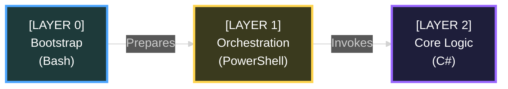

### Layer 0: Bootstrap Scripts

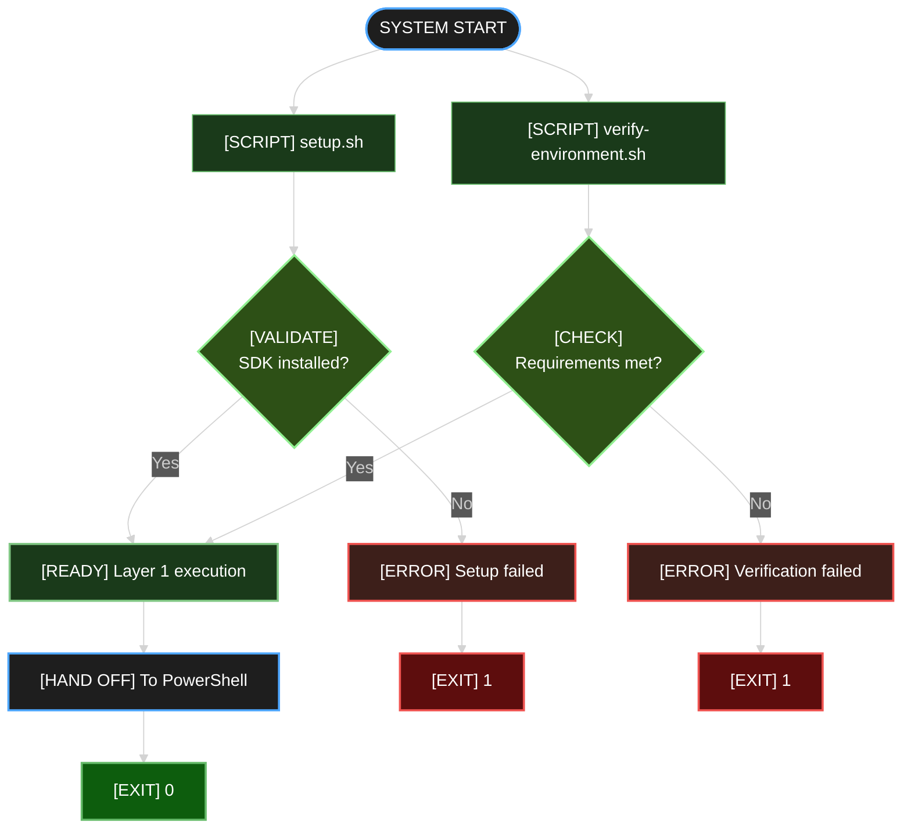

### Layer 1: PowerShell Orchestration (UC Flow)

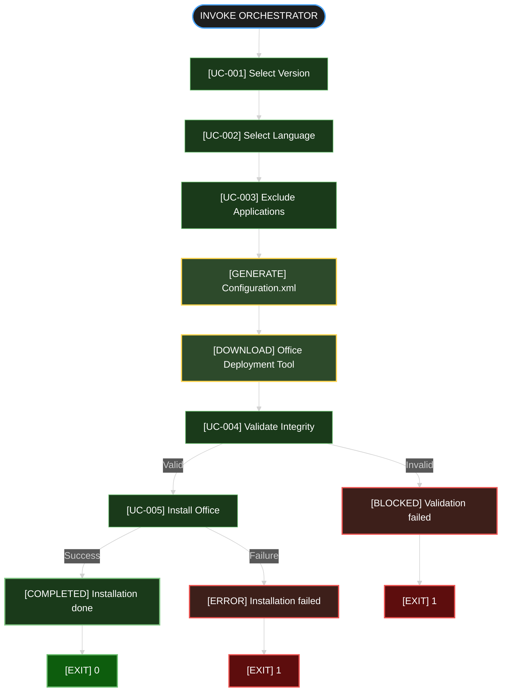

---

## CLASS DIAGRAMS (C#)

### Standard Class Diagram Format

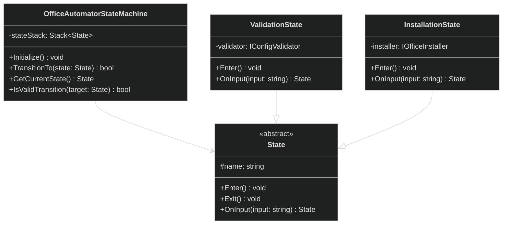

### Layered Architecture Class View

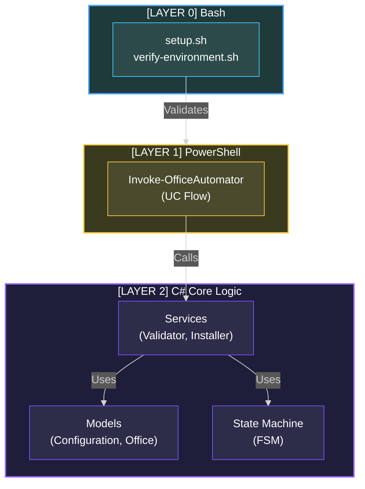

---

## FLOWCHART DIAGRAMS

### UC-004 Validation Flowchart (Complete Example)

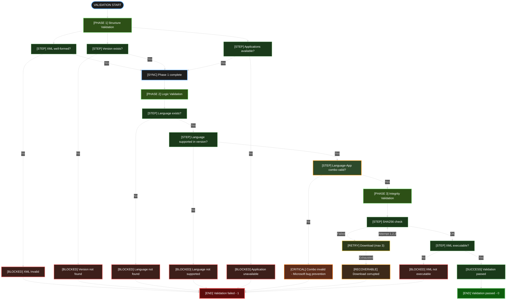

---

## SEQUENCE DIAGRAMS

### UC-005 Installation Sequence

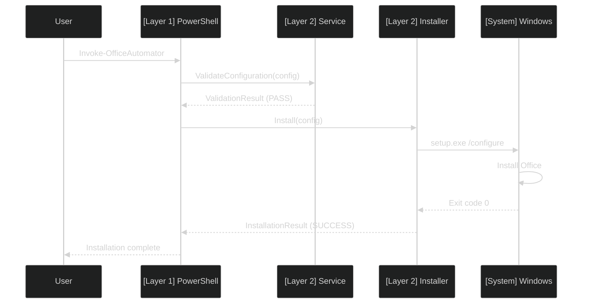

---

## STATE MACHINE DIAGRAMS

### OfficeAutomatorStateMachine (11-State FSM)

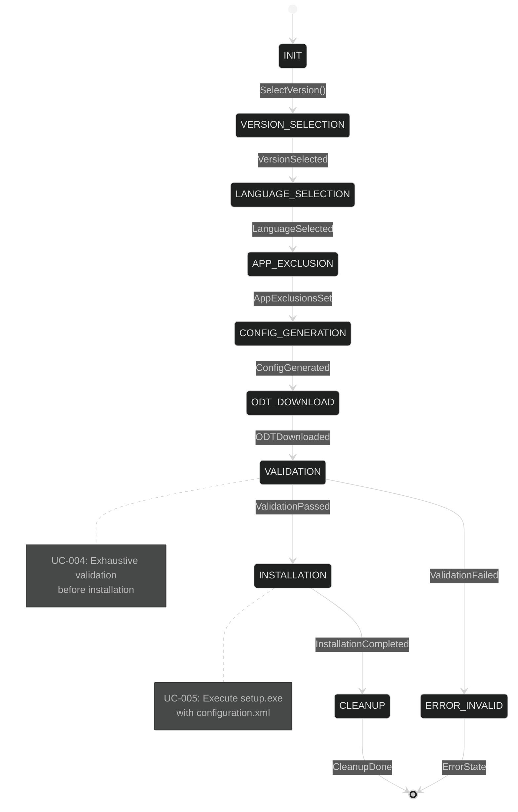

---

## COLOR STANDARDS

### Semantic Color Palette (Dark Theme)

| Usage | Background | Stroke | Text | Hex Values |
|-------|-----------|--------|------|-----------|
| **Start/End** | Gray-800 | Blue | White | `#1e1e1e` / `#4da6ff` |
| **Phase/Section** | Green-900 | Light Green | White | `#2d5016` / `#90ee90` |
| **Step OK** | Green-950 | Green | White | `#1a3a1a` / `#66bb6a` |
| **Special Handling** | Green-Brown | Orange | White | `#2d4a2b` / `#ff9800` |
| **Error Blocked** | Red-950 | Red | White | `#3d1f1a` / `#ef5350` |
| **Error Critical** | Red-Brown | Orange-Dark | White | `#5d2c1a` / `#ff6f00` |
| **Error Recoverable** | Brown-Dark | Orange-Light | White | `#3d2a1a` / `#ffa726` |
| **Retry/Loop** | Green-Gray | Yellow | White | `#2d3a1a` / `#ffd54f` |
| **Success** | Green-950 | Light Green | White | `#1a3a1a` / `#81c784` |
| **Success End** | Green-Intense | Green-Light | White | `#0d5d0d` / `#66bb6a` |
| **Failure End** | Red-Intense | Red-Light | White | `#5d0d0d` / `#ef5350` |

### Do NOT Use

- Light backgrounds
- Low-contrast combinations
- Colors for purely decorative purposes
- More than 6 distinct colors per diagram

---

## ANTI-PATTERNS IN DIAGRAMS

### Pattern 1: Emojis and Symbols (STRICTLY PROHIBITED)

```
PROHIBITED:
    ✓ Configuration validated
    ❌ Configuration invalid
    🔄 Retrying
    📁 File
    ⚠ Warning

CORRECT:
    [VALIDATED] Configuration passed
    [BLOCKED] Configuration invalid
    [RETRY] Attempting again
    [FILE] Configuration.xml
    [WARNING] Deprecated
```

### Pattern 2: Unclear Node Labels

```
INCORRECT: "V", "P", "E", "U1", "U2"
CORRECT: "[VALIDATE]", "[PROCESS]", "[ERROR]", "[UC-001]", "[UC-002]"
```

### Pattern 3: Excessive Styling

```
INCORRECT: 
    Multiple node colors for visual appeal
    Different stroke styles for decoration
    Shadow effects or gradients

CORRECT:
    Colors convey semantic meaning only
    All strokes same width unless emphasizing
    No decorative visual effects
```

### Pattern 4: Ambiguous Connections

```
INCORRECT: Node A connects to Node B, but no label on edge
CORRECT: Node A --[Description]-> Node B
```

### Pattern 5: Missing Semantic Information

```
INCORRECT:
    graph showing dataflow without error paths
    FSM without showing all states
    Sequence diagram without system boundaries

CORRECT:
    All failure paths included
    All states explicitly named
    Participants clearly labeled with layer
```

---

## QUALITY CHECKLIST

### Before Adding to Documentation

Diagram must satisfy ALL:

- [ ] Dark theme present: `%%{init: { 'theme': 'dark' } }%%`
- [ ] NO emojis or decorative symbols anywhere
- [ ] Every node has semantic label (e.g., [VALIDATED], [ERROR])
- [ ] Colors match semantic meanings (blue=start, green=ok, red=error)
- [ ] Color contrast is readable on dark background
- [ ] Text is in English (UPPERCASE or Title Case)
- [ ] All nodes have clear, descriptive labels
- [ ] Connections have labels explaining relationships
- [ ] Error paths are shown (no hidden failures)
- [ ] Diagram reflects actual architecture/flow in code
- [ ] No unnecessary nodes or edges
- [ ] All terminology matches code/documentation

### Rendering Check

Before committing:

1. Render the diagram in markdown preview
2. Verify colors are visible on dark background
3. Confirm all text is readable
4. Check that no emojis appear
5. Verify diagram layout is logical (top-to-bottom or left-to-right)

---

## EXAMPLES: BEFORE AND AFTER

### Example 1: Prohibited Emojis

BEFORE (INCORRECT):
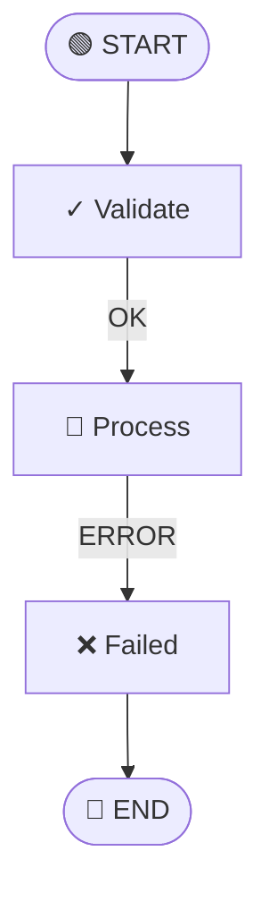

AFTER (CORRECT):
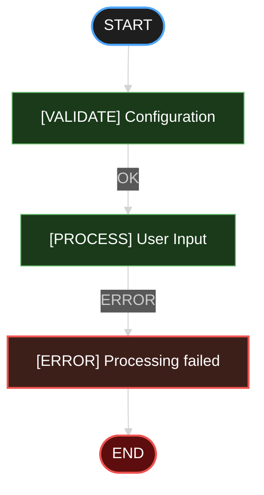

### Example 2: Unclear Labels

BEFORE (INCORRECT):
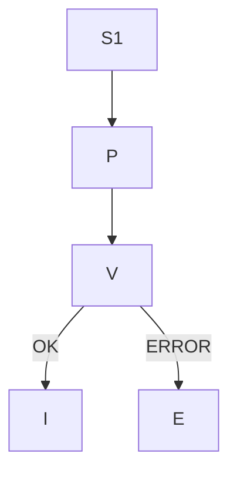

AFTER (CORRECT):
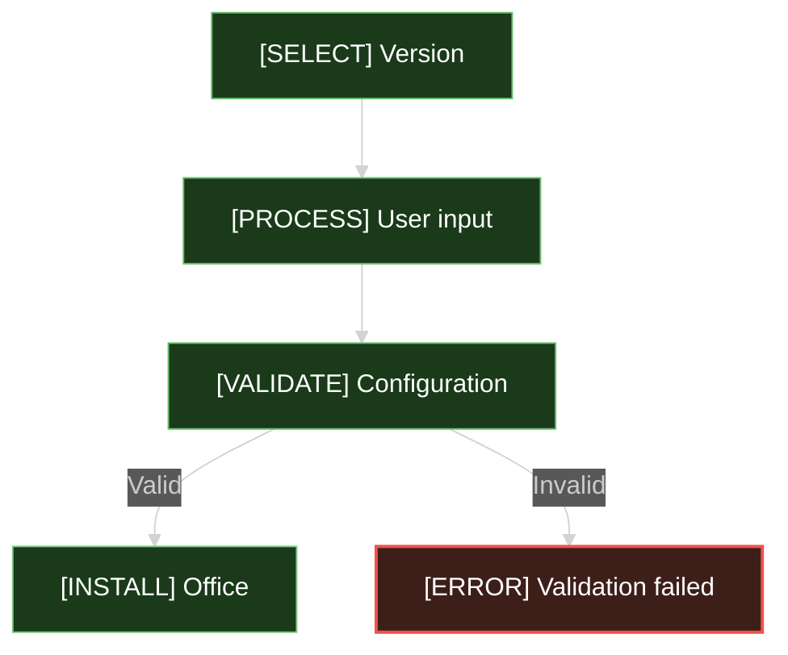

---

## BASH SCRIPT DIAGRAMS

### Standard Bash Script Flowchart

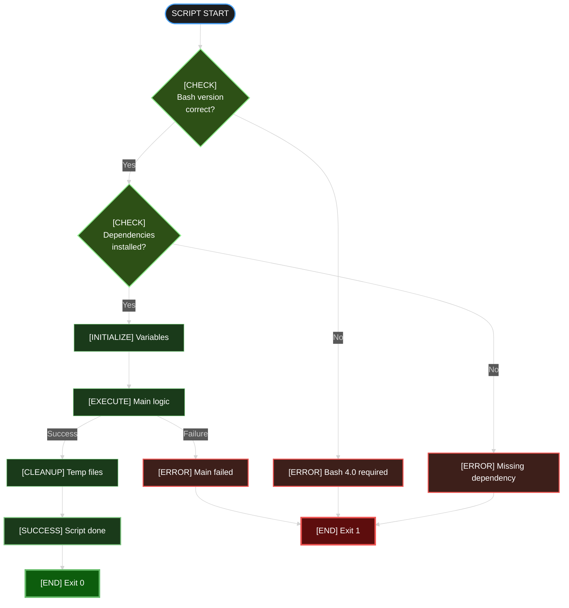

### Bash Function Call Sequence

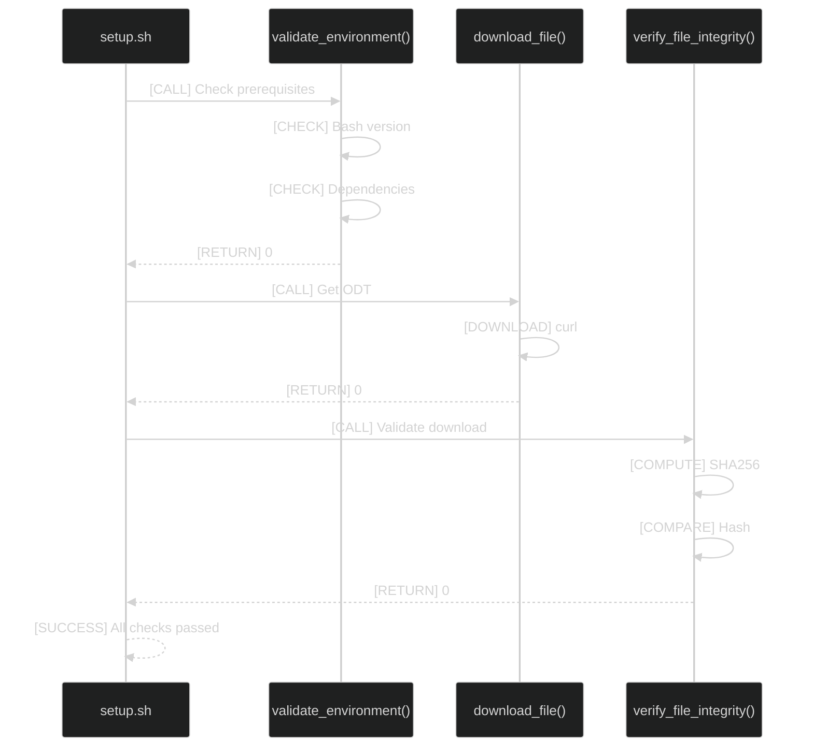

### Bash Error Handling Pattern

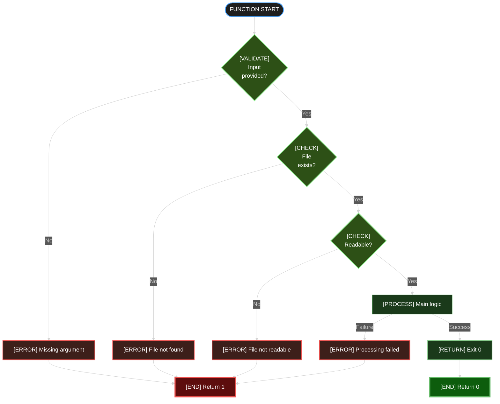

### Bash Retry Loop Pattern

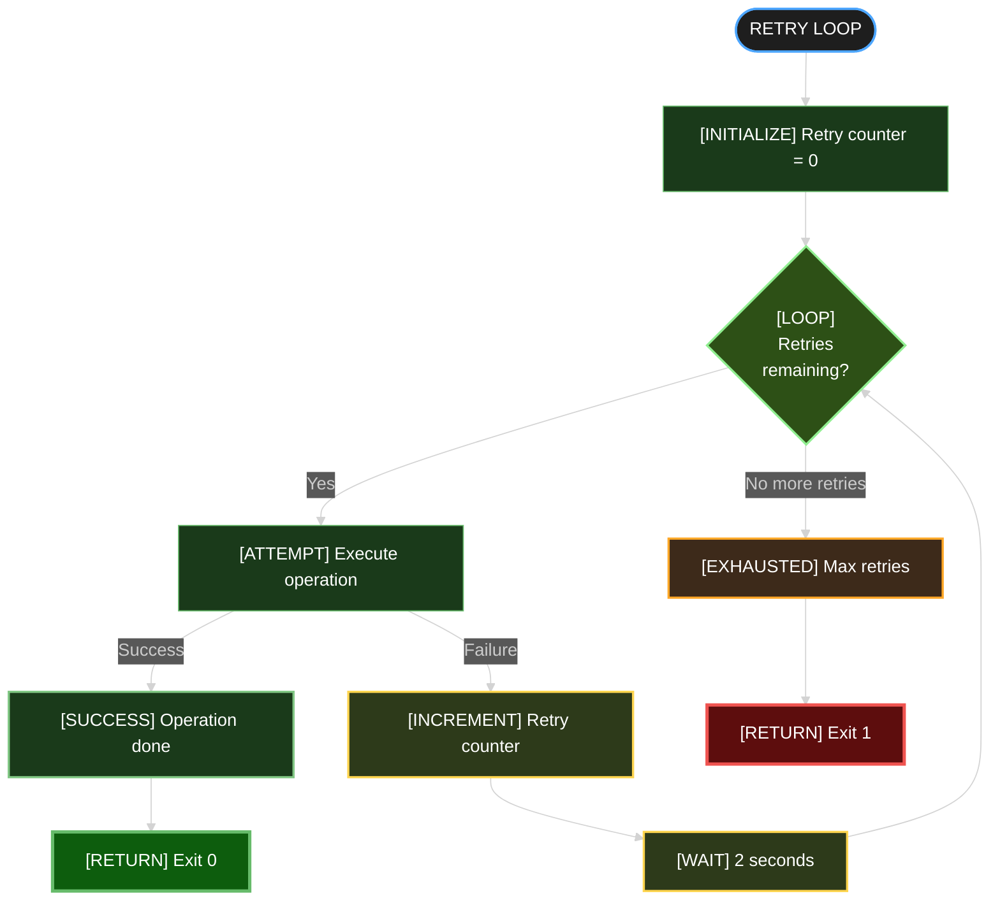

---

## TOOLS AND INTEGRATION

### Markdown Integration

Mermaid diagrams render directly in markdown:

```markdown
\`\`\`mermaid
%%{init: { 'theme': 'dark' } }%%
graph TD
    A --> B
\`\`\`
```

### Online Editor

Test diagrams: https://mermaid.live/

**Important:** Switch theme to "dark" in editor before finalizing.

### IDE Support

- VS Code: Markdown Preview Enhanced extension
- GitHub: Native rendering (select dark theme in settings)

---

## ARCHITECTURE DOCUMENTATION STANDARDS

### Documenting Three-Layer Architecture

Every guide or specification should include:

1. **Layer Diagram** — Shows 3 layers and data flow
2. **Layer 0 Detail** — Bootstrap scripts and validation
3. **Layer 1 Detail** — UC flow and orchestration
4. **Layer 2 Detail** — C# classes and state machine

Example structure in docs:
```
README.md
├── Architecture Overview (three-layer diagram)
├── Layer 0: Bootstrap (Bash scripts, flowchart)
├── Layer 1: Orchestration (UC sequence diagram)
└── Layer 2: Core Logic (class diagram, state machine)
```

---

**Versión:** 1.0.0
**Última actualización:** 2026-04-22
**Aplicable a:** OfficeAutomator v1.0.0+

**Fundamental Principle:**

Diagrams are part of the documentation system. They must be clear, accurate, and maintainable. No decoration, no emojis, no symbols. Substance only. Colors and labels carry semantic meaning.
